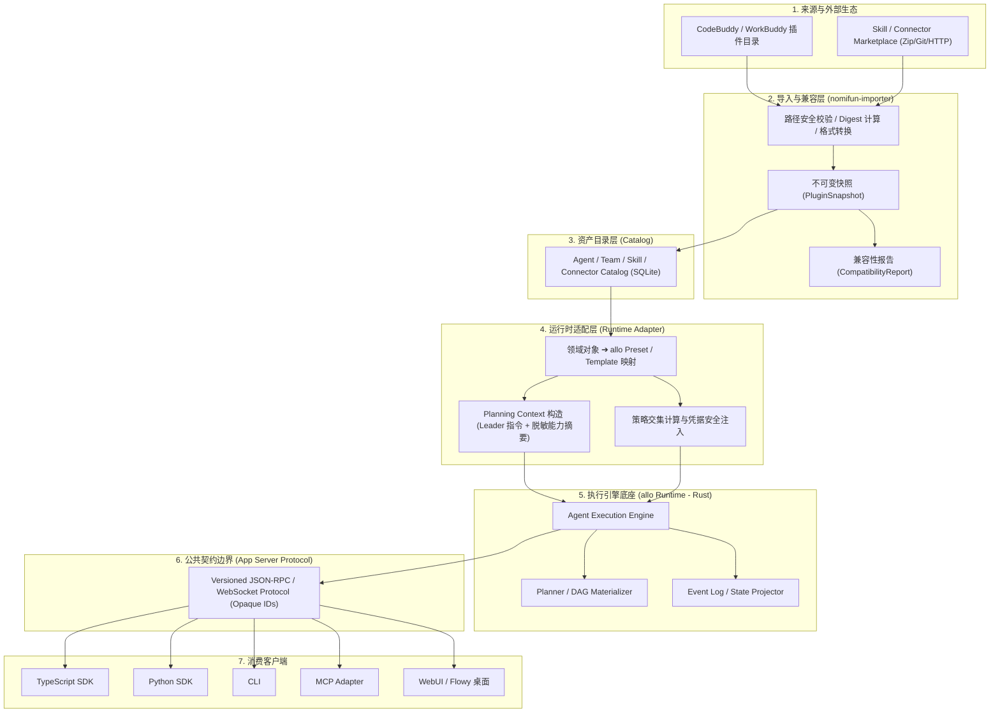
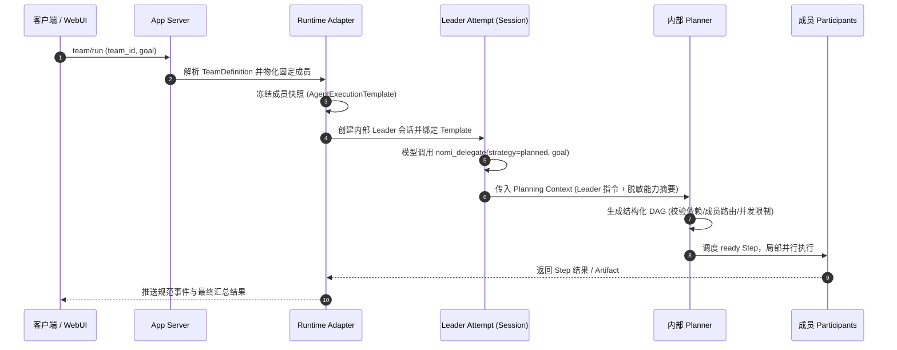

# Agent Store 总体架构决策 (ADR) · 技术方案

> 状态：🧊 架构基线（Phase 0；发版前可改，非冻结，见 `16-sdk-webui-site-priority-plan.zh.md` §7 决策 4；部分结论已实证）；发布阻断
> 日期：2026-08-26（修订：2026-09-10 — Team 触发方式改为 Leader 模型调用 `nomi_delegate(strategy=planned)`）
> 范围：Agent Store / Runtime Platform 的架构边界、组件职责与取舍决策
> 一句话原则：**allo Runtime 为唯一执行引擎，Versioned App Server Protocol 为唯一公开边界，领域对象与执行驱动分层解耦**

---

## 1. 背景与核心痛点

Agent Store 定位于统一管理专家（Agent）、团队（AgentTeam）、技能（Skill）与连接器（Connector），对外通过 SDK、CLI、MCP 及 Flowy 等宿主提供自动化能力。在推进各端实现前，必须先确立架构边界与核心原则，解决以下关键痛点：

### 1.1 核心痛点分析

1. **执行引擎选型与依赖膨胀痛点**：若采用重量级或多套执行引擎，会导致依赖复杂、跨平台分发困难、资源占用过高。必须锁定单一高能效且自依赖的执行底座。
2. **术语概念与生命周期混淆**：产品层定义的“专家/智能体（Agent）”与底层引擎的“驱动器（Driver / Runtime Agent）”易被混为一谈。如果两层共享同一 ID 或生命周期，会导致运行时状态混乱、扩展困难。
3. **公共接口侵入底层实现**：客户端（WebUI、TS/Python SDK、CLI）若直接依赖 allo 内部数据库、GraphQL/私有 WebSocket 或执行级 Session UUID，引擎的任何重构都会导致全线崩溃。
4. **外部格式直接耦合风险**：直接消费外部 CodeBuddy/WorkBuddy 目录会导致运行时受制于外部不可控的文件变动，且缺少权限沙箱，存在脚本越权风险。

### 1.2 核心术语与三层概念映射

系统严格确立三层映射分工，禁止跨层混淆：

```text
Agent Store 领域层 (Product Definition)
  └── AgentDefinition / Preset 配置定义
        ↓ (Runtime Adapter 解析与快照冻结)
allo 编排调度层 (Execution Engine)
  └── ResolvedPresetSnapshot ➔ ExecutionParticipant
        ↓ (运行时会话与工具绑定)
nomifun 驱动执行层 (Runtime Driver)
  └── Claude Code / Codex / LLM Runtime Driver ➔ AgentExecution
```

| 概念层级 | 核心实体 | 职责与生命周期 |
|---|---|---|
| **领域定义层** | `AgentDefinition` | 产品层可复用的专家配置（静态元数据、Persona、Skill 引用、工具策略）。在 allo 中通过 `Preset` 机制承载。 |
| **执行编排层** | `ExecutionParticipant` / `ResolvedPresetSnapshot` | 运行前冻结的不可变快照，携带参与者编号、过滤后的工具策略与技能快照。 |
| **运行时驱动层** | `nomifun Runtime Agent / Driver` | 真实的执行实例（如 Claude Code、Codex 驱动），持有内部会话与 Attempt，负责模型调用与工具派发。 |

---

## 2. 方案全景与架构设计

### 2.1 整体分层架构



### 2.2 目标与非目标 (Goals & Non-Goals)

- **V1 核心目标**：
  - 确立 Rust 版 allo 为唯一执行 Runtime，单二进制交付。
  - Versioned App Server Protocol 作为唯一对外暴露的公共边界，对外使用 Opaque ID。
  - 实现基于不可变 `PluginSnapshot` 的导入隔离，不直接在运行时消费外部原始目录。
  - 实现 V1 AgentTeam 最小闭环：固定成员池 + Leader 规划上下文驱动的 `planned` DAG + 局部并行 + 重试/replan。
  - 建立入站/出站认证严格隔离与凭据安全存储机制。
- **V1 明确非目标**：
  - 多租户、集群 HA 与跨机灾备。
  - 嵌套 AgentTeam、动态增删成员、全局 Mailbox、成员自主认领与直连消息。
  - 允许外部客户端提供私有 cursor 重放或断线追平（V1 状态直接持久化并可查询，事件通知尽力而为）。
  - 未确认版权的资源进入公开市场或默认安装包。

---

## 3. 详细设计 (按领域模块内聚)

### 3.1 核心执行底座与对象分层映射 (allo Runtime)

1. **唯一引擎决策**：采用 allo（Rust）作为唯一执行底座。单二进制交付、零额外运行时依赖、低内存 footprint。
2. **复用已具备的基础设施**：
   - `AgentExecution` 与 `AgentExecutionTemplate`。
   - `Planner`、`Plan Materializer` 与 `Participant Router`。
   - `nomi_delegate(strategy=planned)`：作为可信会话的委派入口及 Team 计划生成入口。
   - 执行事件序列、审批拦截与运行取消机制。
3. **映射转换隔离**：
   - `AgentDefinition` ➔ 映射为不可变的 `Preset/ResolvedPresetSnapshot`。
   - 运行时驱动（Claude Code、Codex）动态消费该 Snapshot，创建独立的会话 Attempt。

### 3.2 公共兼容边界 (App Server Protocol)

1. **协议层级收敛**：所有客户端（TS/Py SDK、CLI、WebUI、MCP）必须且只能通过 App Server 协议进行交互。
2. **标识符隔离**：公共 API 一律返回统一分配的 Opaque ID（如 `run_123`），绝不直接泄露 allo 内部数据库的主键、会话 UUID 或私有路径。
3. **生命周期与交互类型**：
   - `Request / Response`：同步或即时确认调用。
   - `Notification`：事件流通知（尽力而为，允许丢失）。
   - `Server Request`：需要客户端响应的交互（如用户审批 `Approval`）。
4. **状态查询模型**：Run 的最终状态、Step 状态、Attempt 结果及生成的 Artifact 均完成持久化存储。客户端断线后通过查询恢复视图。

### 3.3 导入与外部包隔离 (PluginSnapshot)

1. **不可变快照隔离**：导入外部插件（CodeBuddy/WorkBuddy）时，必须依次执行：路径防逃逸检查 ➔ 计算内容 Digest ➔ 写入版本化缓存 ➔ 生成不可变 `PluginSnapshot`。
2. **禁止直接消费**：运行时任何组件严禁直接读取外部来源目录，必须从快照中读取。
3. **allo Extension 与外部 Plugin 的界限**：
   - `nomi-extension.json` 是 allo 原生的宿主声明式扩展系统。
   - CodeBuddy 插件是外部格式包。两者不进行字段级直接混淆，必须经由 Importer 转换为统一的领域对象。
   - 外部包声明的生命周期钩子（Hook）、LSP、二进制脚本在未通过完整安全沙箱前，默认标记为 `manual-review`，不得自动执行。

### 3.4 Agent Team V1 最小编排闭环 (Leader Planned)

V1 Team Runtime 采用“模式 A”（最小可行实现）：



- **Leader 角色本质**：`lead_agent_id` 指向规划角色，持有专属的工具调用会话，但不暴露为独立用户会话。
- **Planning Context 隔离原则**：仅包含 Leader 规划指令、Team 策略及脱敏后的成员能力摘要（名称、角色、特长）。成员的完整 Prompt、真实凭据及内部工具细节严禁泄露至共享 Planning Context 中。
- **DAG 执行不变量**：依赖满足前不得调度；局部并行受 `max_parallel` 约束；Step 失败支持局部 retry 与 replan，新 Attempt 产生新 ID，历史事件不被覆写。

### 3.5 安全防御与凭据隔离边界

1. **双向认证隔离**：
   - 入站认证（客户端 ➔ Agent Store）：Localhost WebSocket 建立 `LocalPrincipal` 与 `AuthContext`。
   - 出站认证（Agent Store ➔ 上游 Connector）：Connector 凭据绑定（`CredentialBinding`）。入站 Token 严禁转发给上游。
2. **有效权限求交集**：
   $$\text{Effective Permission} = \text{Caller} \cap \text{Agent} \cap \text{Team} \cap \text{Skill} \cap \text{Connector} \cap \text{Credential Scopes}$$
   任何层级拒绝即拒绝，模型 Prompt 绝非权限边界。
3. **凭据安全存储与打码**：凭据仅存放在本地安全存储，对外 API、前端状态、日志及 Prompt 中一律脱敏（`[REDACTED]`）。

---

## 4. 架构决策总表 (AD-01 ~ AD-10)

| 编号 | 决策项 | 最终结论 | 备选方案与取舍依据 |
|---|---|---|---|
| **AD-01** | 执行 Runtime 选型 | **锁定 allo Runtime (Rust) 为唯一执行引擎** | 放弃引入 Node.js 或 Python 作为并行执行底座。Rust 具备单文件体积小、常驻资源少、与桌面平台无缝集成的优势，且已有执行管道。 |
| **AD-02** | 公共兼容边界 | **Versioned App Server Protocol** | 协议作为唯一边界；TS/Py SDK、CLI、WebUI 均为协议客户端。避免客户端直接访问内部 DB 或私有 WebSocket 造成强耦合。 |
| **AD-03** | allo Extension 定位 | **宿主原生机制，不等同于外部 Plugin** | 外部 Plugin 必须经 Importer 转换为不可变快照，不直接进行 manifest 字段合并。 |
| **AD-04** | 外部资产消费方式 | **一律通过 Importer 转换并基于快照运行** | 运行时绝不直接读取来源目录，确保版本确定性与文件防篡改。 |
| **AD-05** | Agent Team V1 范围 | **固定成员 + Leader 规划上下文驱动的 planned DAG** | 暂不实现动态自由成员组、全局 Mailbox 与长期成员会话，聚焦最小可用闭环（顺序/局部并行/重试/replan）。 |
| **AD-06** | 云端与本地边界 | **云端管 Catalog 分发；本地管执行、凭据与状态** | 绝不在云端托管明文凭据与执行会话，保障端侧数据主权。 |
| **AD-07** | V1 交付目标 | **完整功能核心（Agent/Team/Skill/Connector + App Server + SDK + Web 集成）** | 聚焦闭环链路跑通，非关键周边能力延后。 |
| **AD-08** | 企业级特性取舍 | **明确非目标（多租户、HA、企业审批流、全量变体 OAuth）** | 严格控制 Phase 0 与 V1 交付范围，防止发版延期。 |
| **AD-09** | 凭据管理原则 | **本地安全存储，对外只存引用，日志/状态严格打码** | 凭据永远不得进入 Prompt、日志、事件流或对外 API 响应中。 |
| **AD-10** | Team 触发方式 | **Leader 模型在内部会话调用 `nomi_delegate(strategy=planned)` 触发服务端 Planner** | 放弃由客户端直接拼装规划参数。成员池、并发与权限来自绑定的 `AgentExecutionTemplate`，不接受模型输入。 |

---

## 5. 验收标准与验证矩阵

### 5.1 验收条件 (Acceptance Criteria)

- **S1 (单 Agent 执行)**：`AgentDefinition` 能正确解析为 `ResolvedPresetSnapshot` 并注入 `ExecutionParticipant`，完成单 Agent 异步执行、状态落盘与结果输出。
- **S2 (Team 编排闭环)**：`software-company` 团队能物化 5 人固定 Participant 池，Leader 能成功触发 `nomi_delegate(strategy=planned)` 生成 DAG，并完成依赖调度与局部并行。
- **S3 (失败重试与 Replan)**：Step 失败时能正确触发 Attempt 重试或 Replan，新 Attempt 生成独立 ID，不覆盖历史数据。
- **S4 (公共边界隔离)**：SDK 与 WebUI 在全流程中无法获取 allo 内部数据库 ID 或私有路径，所有操作通过 App Server Opaque ID 完成。
- **S5 (凭据安全打码)**：全流程日志、事件流与公共 API 返回值中无明文 Token，敏感字段均为 `[REDACTED]`。
- **S6 (未完成 Run 状态标记)**：服务意外退出重启后，未完成的 Run 必须如实标记为 `recovery_required` 或 `failed`，严禁伪装为 `completed`。

### 5.2 Phase 0 最小验证顺序 (Verification Ladder)

```text
1. AgentDefinition ➔ ResolvedPresetSnapshot ➔ allo ExecutionParticipant ➔ Runtime Driver
2. 单 Agent Run ➔ 规范 Event Log ➔ App Server 协议输出
3. 未完成 Run 重启检测 ➔ recovery_required 状态落盘
4. Connector 凭据安全存储 ➔ 传输注入 ➔ 探活 Probe ➔ 401 刷新
5. Team Leader 绑定 AgentExecutionTemplate ➔ nomi_delegate(planned) ➔ DAG 物化调度
```

---

## 附录：原始技术底稿与历史归档 (Historical & Technical Reference Archive)

> **归档说明**：以下完整保留重构前的原始技术底稿、历次讨论与历史记录全文，供历史追溯、协议字段详细对照与技术审计。

---

# Agent Store 总体架构决策

> 状态：架构基线（Phase 0；发版前可改，非冻结，见 `16-sdk-webui-site-priority-plan.zh.md` §7 决策 4）；部分结论已实证（详见 `README.md` 索引）；发布阻断
> 日期：2026-08-26
> 修订：2026-09-10 — Team 触发方式改为 Leader 模型调用 `nomi_delegate(strategy=planned)`（见 `16-sdk-webui-site-priority-plan.zh.md` §7 决策 3）
> 范围：Agent Store / Runtime Platform 的架构边界、组件职责与取舍决策
> 口径：本文明确区分「源码/文档已证实」「设计决策」「待 Spike 验证」「暂不支持」四类结论

## 1. 背景与要解决的问题

### 核心术语原则（必须遵守）

Agent Store 的 Agent 是产品层定义，在 allo 中通过 Preset 机制承载；nomifun 的 Agent 才是 Claude Code、Codex 这类实际执行 Runtime。两者不能使用同一个 ID、类型或生命周期语义互相替代。

```text
Agent Store Agent/AgentDefinition
    → allo Preset/ResolvedPresetSnapshot
    → ExecutionParticipant.preset_snapshot
    → nomifun Runtime Agent/Driver
```

会议纪要（2026-08-25）确定构建 Agent Store：统一管理专家（Agent）、技能（Skill）、连接器（Connector），对外通过 SDK/CLI/MCP 集成，并优先解决自身产品（如 Flowy 5.2.0）的集成问题。

在推进前需要先定稿四件事，否则后续 SDK、Web、排期都会返工：

1. 执行 Runtime：已确定采用 allo（Rust），本文档固化该决策（AD-01），不再引入并行 Runtime 候选；
2. 当前方案以本目录中的架构基线、实现规格、路线图和测试用例为唯一依据；
3. V1 需要实现 AgentTeam，第一版采用「固定成员 + Leader 规划上下文驱动的结构化规划」的最小 Team Runtime；完整 Mailbox 等能力后续增强；
4. App Server / SDK / Web 谁是公共兼容边界。

## 2. 架构决策总表

| 编号 | 决策项 | 结论 | 依据 |
|---|---|---|---|
| AD-01 | 执行 Runtime | 已确定采用 allo Runtime（Rust）作为唯一执行引擎 | 已决策（2026-08-26）；会议纪要；体积/资源诉求；源码已具备 Agent Execution、Planner、Template、事件基础设施 |
| AD-02 | 公共兼容边界 | Versioned App Server Protocol；TS/Python SDK、CLI、MCP Adapter、Web 都是该协议的客户端 | 设计决策；避免 SDK/UI 反向定义系统语义 |
| AD-03 | allo Extension 定位 | allo 原生宿主扩展机制；不等同于 CodeBuddy Plugin | 源码已证实（manifest/registry/贡献类型）；CodeBuddy Plugin 为外部包格式 |
| AD-04 | CodeBuddy/WorkBuddy 内容 | 一律通过 Importer 转换，运行时不直接消费来源格式 | 设计决策；来源格式非运行时契约 |
| AD-05 | Agent Team | V1 实现固定成员 + Leader 规划上下文驱动的最小 Team Runtime；支持 planned DAG、局部并行、事件、重试和 replan；完整 Mailbox 等能力为后续增强 | 源码已证实 AgentExecutionTemplate、Planner/Materializer、Participant Router 能力边界；当前产品范围决策 |
| AD-06 | 云端 vs 本地 | 云端 Catalog 管定义/版本/分发；本地管执行/凭据/运行状态 | 会议纪要；安全边界 |
| AD-07 | V1 交付目标 | 完整功能核心（Agent/Team/Skill/Connector + App Server + SDK + Web/Flowy 集成），Team V1 限定为固定成员 + Leader Planning Context 驱动 planned DAG 的最小闭环 | 需求口径；当前产品范围决策 |
| AD-08 | 企业级能力 | 多租户、HA、灾备、全量 Marketplace、签名安装、全部 OAuth 变体、运营后台、安全认证为 V1 明确非目标 | 范围控制 |
| AD-09 | 凭据 | 凭据只存本地安全存储，定义/日志/前端状态只存引用；文档中一律 `[REDACTED]` | 安全要求 |
| AD-10 | Agent Team 触发方式 | Leader 模型在自有 Conversation 内调用 `nomi_delegate(strategy=planned)` 触发服务端 Planner；成员池/并发/权限来自绑定的 `AgentExecutionTemplate` 与服务端策略，不接受模型输入 | 设计决策（2026-09-10）；`16-sdk-webui-site-priority-plan.zh.md` §7 决策 3 |

## 3. 总体架构

```text
WorkBuddy / CodeBuddy Plugin（本地目录）
WorkBuddy Skill / Connector Marketplace
                │
                ▼
     Importer / Compatibility Layer
                │
                ▼
   PluginSnapshot（版本化、不可变、含来源与兼容性）
                │
                ▼
 Agent / Team / Skill / Connector Catalog
                │
                ▼
        allo Runtime Adapter
                │
                ▼
          allo Runtime（Rust）
                │
                ▼
    Versioned App Server Protocol
      ┌───────┬───────┬──────┬───────┐
      ▼       ▼       ▼      ▼       ▼
   TS SDK  Python SDK  CLI  MCP     Web/Flowy
```

各层职责：

- **Importer**：读取并转换 WorkBuddy/CodeBuddy 格式，输出标准化快照与兼容性报告。
- **Catalog**：管理 Agent/Team/Skill/Connector 定义、版本、来源、状态。
- **Runtime Adapter**：把 Agent Store 领域对象映射到 allo 执行语义；不让产品模型依赖 allo 内部结构。
- **App Server**：对外提供稳定、版本化、typed 的生命周期与事件协议。
- **SDK/CLI/MCP/Web**：协议客户端；不直接耦合 allo UI REST/WebSocket 或内部数据库。

## 4. 组件决策说明

### 4.1 为什么确定 allo 为 Runtime

已确定采用 allo（Rust）作为唯一执行引擎：打包单文件、依赖小、资源占用少，符合商店对轻量、自依赖的诉求；源码层面已有可复用基础：

- Agent Execution / Agent Execution Template；
- Planner、Plan Materializer、Participant Router/Resolver；
- `nomi_delegate`：普通可信会话的委派入口；`strategy=planned` 的结构化 DAG 规划能力同时是 V1 Team Runtime 的计划触发入口（由 Leader 模型调用）；
- 执行事件、序列、游标、审批、取消/暂停/恢复基础设施；
- Extension Registry、Skill 服务、MCP 配置与 OAuth 服务。

以上为源码已证实的现状，不等于全部运行链路完整；未逐项验证的部分在对应规格中标注。

### 4.2 App Server 为公共边界

- SDK、CLI、Web、MCP Adapter 都只依赖 App Server 协议；
- 协议定义版本化消息：Request / Response / Notification / Server Request；
- 公共 ID 使用 Agent Store 的 opaque ID，不暴露 allo 内部 ID（如内部 execution/session UUID）；
- Run 状态、结果和终态持久化并可查询；运行中的事件通知为尽力而为，允许丢失；
- 事件 cursor 分页、断线追平和时间线重放列为 V2 公共能力；
- 审批建模为 Server Request（要求客户端响应）。

参考 Codex App Server 的方向（initialize → thread/start → turn/start），但不复制其私有实现与私有字段。

### 4.3 allo Extension 与 CodeBuddy Plugin 的关系

- allo Extension（`nomi-extension.json`）是宿主声明式扩展系统：Agent/Preset/Skill/MCP/Theme/WebUI 等十类贡献、生命周期钩子、权限声明、风险分级、启用/禁用、hot reload；
- CodeBuddy Plugin 是可安装、可缓存、可启用的完整插件包（agents/skills/commands/hooks/.mcp.json/.lsp.json/bin 等）；
- 两者的 Manifest、生命周期、安全模型不同，**不直接做字段级兼容**；
- 通过 Importer 把 CodeBuddy Plugin 标准化为 PluginSnapshot，再决定哪些组件进入 allo 既有能力，哪些进入受控适配器，哪些标记 `manual-review`/`unsupported`；
- 关键安全事实：allo 生命周期钩子会执行外部解释器进程；权限声明与风险标签不是沙箱。未经验证不得把来源内容当可执行插件加载。

### 4.4 Agent Team 的 V1 边界

V1 Team 运行形态（模式 A，最小可行实现）：

```text
AgentTeamDefinition（固定成员名册 + 硬策略）
        ↓
为 Leader 和每个成员解析独立 Preset/ResolvedPresetSnapshot
        ↓
AgentExecutionTemplate / 固定 Participant 池
        ↓
构造 Planning Context
（Leader 规划指令 + 脱敏成员能力摘要 + Team 策略）
        ↓
Planner/LlmPlanProducer 生成结构化 DAG
        ↓
校验成员路由、依赖、权限和并发限制
        ↓
Execution 事件、重试、replan
```

这里的 **Leader** 是 `lead_agent_id` 指向的规划角色，必须有一个承载工具调用的 allo Conversation/Attempt（不必是用户可见的独立会话）。TeamRun 创建时把 Team 的 `AgentExecutionTemplate` 绑定为该 Conversation 的 `execution_template_id`；Leader 在该 Conversation 的 turn 内调用 `nomi_delegate(strategy=planned)` 触发计划生成，Leader Preset 的规划指令与 Team 策略进入 Planning Context。每个成员的完整 persona、Skill、Connector 和 Tool Policy 只进入该成员自己的 Participant/Attempt Snapshot。规划器可以看到经过筛选的成员能力摘要，但不得依赖完整成员 Prompt 或自然语言自行授予权限。

V1 必须支持：

- 固定成员 Participant 池；
- 由 Leader 规划指令和 Team 目标驱动的结构化计划生成；
- DAG 依赖和 ready step 调度；
- 独立步骤的局部并行；
- 失败后的重试和 replan；
- Team/Step/Attempt/Event/Artifact 的持久化与观测。

V1 暂不要求：

- 用户可见的独立 Leader Conversation（Leader 仍必须有一个非用户可见的 Conversation/Attempt 承载工具调用，见下）；
- 完整 Mailbox；
- 成员自主认领任务；
- 成员之间任意直连消息；
- 成员长期独立会话生命周期；
- 嵌套 Team。

Team Runtime **依赖** `nomi_delegate(strategy=planned)` 作为计划生成入口（2026-09-10 修订，见 `16-sdk-webui-site-priority-plan.zh.md` §7 决策 3）：`team/run` 由服务端创建 Leader Conversation 并绑定 Team 的 `AgentExecutionTemplate`，Leader 模型在该 Conversation 的 turn 内调用 `nomi_delegate(strategy=planned, goal=…)`，服务端据此构造 Planning Context 并调用内部 Planner 生成/物化 DAG。成员池、`max_parallel`、`routing_constraints` 与权限来自绑定的 Template 和服务端策略，不接受模型输入。

顶层仍不得使用 `strategy=parallel` 代替 Team planned 流程；局部并行由已校验 DAG 中的独立 ready 步骤表达。

注册给 Leader 的必须是绑定真实 `AgentExecutionEngine`（具备持久化 Execution/Event/Attempt）的 planned 实现；仅支持 `strategy=parallel`、以同步无持久化方式投影的 embedded 实现不得用于 Team Runtime。

## 5. 导入边界

```text
来源格式（.codebuddy-plugin/、.codebuddy-skill/、.codebuddy-connector/）
        ↓
路径校验（相对路径、遍历、符号链接）
        ↓
版本化不可变缓存（含 digest）
        ↓
PluginSnapshot
        ↓
标准化定义（Agent/Team/Skill/Connector/Command/Hook/LSP/CredentialSchema）
        ↓
CompatibilityReport（compatible / compatible-with-adapter / manual-review / unsupported / pending-legal-review）
```

禁止：

- 运行时直接读来源目录（应使用导入后的快照）；
- 把来源 slug 直接当作 allo 业务 ID（需 ID 映射，如 `wb-<plugin>-<slug>`）；
- 静默丢弃不支持的组件；
- 未完成版权确认的资源进入公开市场或默认安装包（标记 `pending-legal-review`）。

## 6. 安全边界（原则）

- 入站（外部客户端 → Agent Store）与出站（Agent Store → 上游 Connector）认证/Token 严格分离；
- 凭据只进入安全存储；SDK/Web 只接触状态、账号标识、过期时间与错误，不接触真实 token；
- 有效权限 = caller ∩ agent ∩ team ∩ skill ∩ connector ∩ credential scopes；
- 写操作（发送、发布、删除、部署、支付）要求显式策略与审批；
- Hook/LSP/任意脚本/bin 执行在安全模型落地前默认不启用。

## 7. 待 Spike 验证项（写代码前必须回答）

1. allo 能否以独立进程/服务方式稳定跑完单 Agent 执行（Release 构建、冷启动、资源占用实测）；
2. AgentDefinition → allo Preset/ResolvedPresetSnapshot 的桥接是否完整；实际 Runtime Agent/Driver 的运行注册链路另行核实；
3. MCP OAuth 全链路：登录 → 凭据存储 → 请求时注入 → 401 刷新 → 一次重试，是否真实贯通（现状：登录/存储已有，注入需验证）；
4. 固定 Template 绑定的 Planning Context + planned Planner 是否可按预期产出动态 DAG；
5. 本地 App Server 传输（WebSocket；stdio JSONL 为 V2/deferred、V1 不纳入）的稳定性，以及断线/重连后状态重对齐的行为。

Spike 结论将回写本文档状态。

## 8. V1 范围与验收边界

### 8.1 V1 必须实现

| 能力 | V1 范围 | 最低验收条件 |
|---|---|---|
| allo Runtime | 唯一执行引擎 | 可启动、创建并完成 Agent Run |
| Agent Catalog | 导入、版本、来源、启用状态 | `software-company` 的 5 个 Agent 可查询 |
| Skill Catalog | 导入、引用、加载 | Agent Run 可加载绑定 Skill |
| Connector Catalog | MCP Connector 定义、工具过滤、状态 | 至少一个 Connector 可发现工具并执行受控调用 |
| 单 Agent Run | 异步执行、取消、事件、结果 | 返回公共 `run_id`；状态与结果可查询；事件通知尽力而为 |
| AgentTeam | 固定成员 + Leader Planning Context 驱动 planned DAG | `software-company` 可创建 TeamRun 并执行顺序/局部并行步骤 |
| Team 反馈 | 重试、replan、Attempt 结果 | Step 失败后可重试或生成新的计划修复 |
| App Server | 版本化协议与本地传输 | SDK/CLI/Web 不依赖 allo 内部 UI API |
| TypeScript SDK | 协议 typed client | 可完成 Catalog、Run、Event、Artifact 调用 |
| Web/Flowy | 基于 SDK 的目录和运行观测 | 可启动 Run、显示事件、结果和 Artifact |

### 8.2 V1 后续增强

```text
服务端崩溃后续跑原 Attempt（含 Intent、Projection CAS、lease/fencing 和恢复扫描）
Run 事件 cursor 分页、断线追平和完整时间线重放
完整 Mailbox
成员自主认领任务
成员直连消息
长期成员会话
嵌套 Team
复杂 OAuth
任意 CLI/脚本执行
完整 LSP/Hook Runtime
```

### 8.3 V1 发布阻断条件

以下任一条件未满足，不得宣称对应能力已完成：

- AgentDefinition 无法解析为可执行的 Preset/ResolvedPresetSnapshot，或无法写入 allo ExecutionParticipant；
- Team 无法完成固定成员、Planning Context 驱动的 planned DAG、重试和 replan 的最小闭环；
- 终态事件未持久化，或重启后未完成 Run 没有被如实标记为 `recovery_required`/`failed`；
- Connector 凭据无法在请求时安全注入；
- 真实凭据出现在日志、Prompt、Tool Result、Renderer 状态或公共响应；
- 未确认版权的来源资源被放入公开市场或默认安装包。

## 9. 与其他文档的关系

- 本决策文档是后续所有文档的基线；
- 领域模型见 `01-domain-model.md`；
- 导入规范见 `02-codebuddy-workbuddy-import-spec.md`；
- 兼容性矩阵见 `03-codebuddy-compatibility-matrix.md`；
- 当前目录中的架构基线、实现规格、路线图和测试用例共同构成 Agent Store 当前方案，不再引用旧版主方案。

## 10. Phase 0 基线与验证边界

本文档及当前目录的公共契约构成 Phase 0 的**现行基线**（发版前可改、非冻结，见 `16-sdk-webui-site-priority-plan.zh.md` §7 决策 4）。后续只有以下证据可以触发修改：

```text
源码事实与文档不一致
Spike 验证失败
测试发现公共契约缺口
```

基线不代表能力已经实现：

```text
Architecture = baseline (pre-release, editable)
Implementation = not yet verified
Runtime readiness = not verified
Release readiness = blocked
```

Phase 0 的最小验证顺序：

```text
Agent Store Agent/AgentDefinition → Preset/ResolvedPresetSnapshot
    → allo ExecutionParticipant → Runtime Agent/Driver
    → 单 Agent Run → Event Log → App Server
    → Projection/未完成 Run 状态标记
    → Credential Provider → Transport 注入 → Probe → 401 刷新
```
