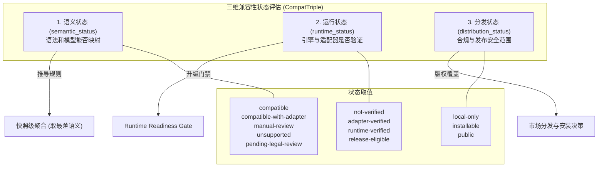
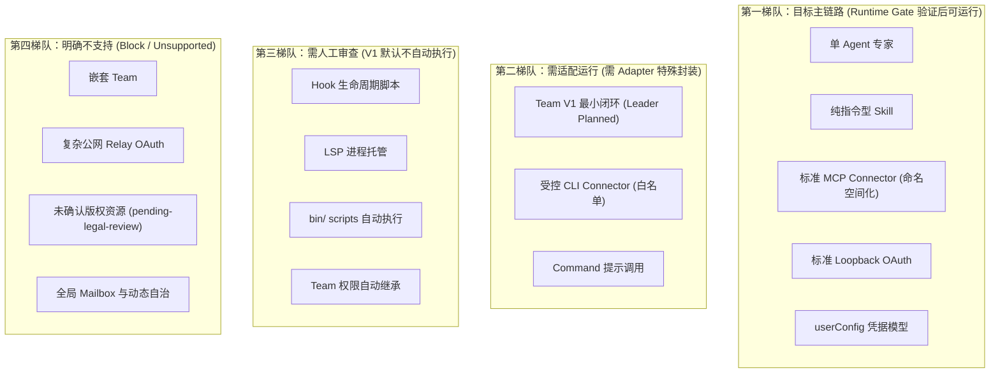
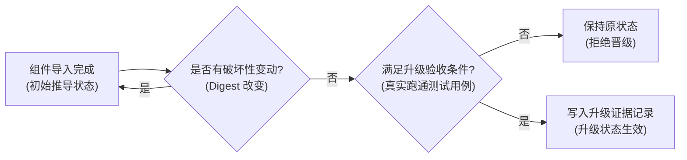

# CodeBuddy / WorkBuddy 兼容性矩阵 · 技术方案

> 状态：✅ 状态推导规则已实现（`nomifun-importer/src/compat.rs`）；运行验收与状态升级仍需 Gate 3/Phase 2 验证
> 日期：2026-08-26
> 前置：[`00-architecture-decision.md`](file:///c:/workspace/allo/docs/agent-store/00-architecture-decision.md)、[`01-domain-model.md`](file:///c:/workspace/allo/docs/agent-store/01-domain-model.md)、[`02-codebuddy-workbuddy-import-spec.md`](file:///c:/workspace/allo/docs/agent-store/02-codebuddy-workbuddy-import-spec.md)
> 一句话原则：**导入规范管“怎么解析”，本矩阵管“解析后能否运行”；严禁将“可解析”误判为“已就绪”，通过三维状态严守运行时安全准入红线**

---

## 1. 背景与核心痛点

导入器完成对外部插件包（CodeBuddy/WorkBuddy）的解析与转换后，并不意味着这些组件可以直接安全地投入生产运行。需要建立兼容性矩阵的核心原因在于：

### 1.1 核心痛点分析

1. **“能解析”被误当作“能运行”**：以往系统容易混淆语法解析和运行时能力支持。例如解析了 Hook 或 LSP 的配置，就误以为运行时已具备沙箱托管能力，导致高危脚本在未受控环境下执行。
2. **缺乏多维度的状态刻画**：一个组件可能在语义上可完全映射，但在当前 Rust 引擎中尚未进行端到端跑通，或者因为版权合规问题不能对外分发。单一的“兼容/不兼容”二元状态无法指导实际交付。
3. **团队与权限语义的虚标风险**：外部插件可能声明复杂的团队自治、Mailbox 或动态权限继承。若未经审查就宣称完全支持，会导致用户对系统可靠性产生误解。

---

## 2. 方案全景与三维状态模型

### 2.1 三维状态评估体系 (`CompatTriple`)

为精确刻画资产状态，系统确立三维独立判定模型，禁止互相替代：



### 2.2 状态定义矩阵

| 状态类别 | 状态取值 | 核心含义与准入条件 |
|---|---|---|
| **semantic_status** | `compatible` | 字段完整，能够无损映射为 Agent Store 原生领域对象并直接承载。 |
| | `compatible-with-adapter` | 语义可完整保留，但需要经过 Runtime Adapter 进行结构转换、命名空间隔离或代理转发。 |
| | `manual-review` | 涉及高风险操作（如外部 Hook 脚本、本地 CLI 执行），必须经过人工审计与安全配置后方可启用。 |
| | `unsupported` | 目标系统无承载机制，或与当前架构原则冲突（如嵌套 Team、复杂公网 OAuth Relay）。 |
| | `pending-legal-review` | 版权归属或商业分发授权尚未明确，严禁进入公开市场或默认安装包。 |
| **runtime_status** | `not-verified` | 初始状态，代码尚未在真实环境中执行验证。 |
| | `adapter-verified` | 适配层数据转换与单元测试通过。 |
| | `runtime-verified` | 在底层 allo 引擎中完成真实 Agent/Team 执行、事件收集与产物生成。 |
| | `release-eligible` | 满足所有发版阻断条件，准许集成发布。 |
| **distribution_status**| `local-only` | 仅限本地测试或当前开发机可见。 |
| | `installable` | 允许用户在受控的私有/桌面环境主动安装。 |
| | `public` | 允许在官方公共商店上架并面向全部用户分发。 |

---

## 3. 详细设计：组件兼容总矩阵

### 3.1 核心组件兼容性与降级策略

| 来源组件 | 来源特征文件/字段 | 映射标准化对象 | allo 底座目标 | 语义状态 | 降级与安全策略 | 潜在风险 |
|---|---|---|---|---|---|---|
| **单 Agent** | `agents/*.md` (frontmatter + 正文) | `AgentDefinition` | `Preset` ➔ `ExecutionParticipant` | `compatible-with-adapter` | 解析为不可变快照，由 Runtime Driver 执行。 | 底座驱动注册与工具链路需单独实证。 |
| **插件内 Agent** | 同上（位于插件内） | `AgentDefinition` | 同上 | `compatible-with-adapter` | 继承插件级 Skill 与 MCP 工具代理。 | 同上。 |
| **Agent 级 MCP / 权限声明** | `agents/*.md` 的 `mcpServers` / `permissionMode` | 不映射为独立权限 | 不注入 | `ignored-by-source-runtime` | 来源平台官方明确忽略此字段，仅记录为忽略原因码。 | 避免误判 Agent 自带未授权连接器。 |
| **Agent Team** | `teamInfo` (leadAgent, memberAgents) | `AgentTeamDefinition` | `AgentExecutionTemplate` + Planning Context | `compatible-with-adapter` (V1 最小) | 固定成员 + Leader 触发 planned DAG 规划；局部并行与重试。 | 暂不支持 Mailbox 与动态自治。 |
| **嵌套 Team** | 来源声明嵌套 Team | 不生成 | 不支持 | `unsupported` | 导入期显式报错拦截，绝不静默接受。 | 来源平台自身亦不支持。 |
| **Team 权限继承** | 声明成员继承 Leader 权限 | 策略记录 | 运行时有效权限交集 | `manual-review` | 不将 Prompt 作为授权，运行时求交集固化。 | 权限穿透与越权访问风险。 |
| **Skill (技能)** | `skills/*/SKILL.md` (`$ARGUMENTS`) | `SkillDefinition` | Skill 服务与指令渲染 | `compatible` (主体) | 指令与模板完整保留；内部脚本默认禁止自动执行。 | 脚本可能包含恶意命令。 |
| **Command** | `commands/*.md` | `CommandDefinition` | `plugin:command` 可调用定义 | `compatible-with-adapter` | 映射为前台可调用 Prompt 或参数化技能。 | 无宿主时退化为纯文本提示。 |
| **Hook (生命周期)** | `hooks/hooks.json` (事件与 action) | `LifecycleHookDefinition` | 独立 Hook 运行时 (未落地) | `manual-review` (V1 默认不执行) | 仅做静态导入与语法校验，运行时严禁执行。 | 外部命令以宿主权限静默执行。 |
| **MCP Connector** | `.mcp.json` / `mcpServers` | `ConnectorDefinition` | MCP Config / Client 运行时 | `compatible-with-adapter` | 强制工具命名空间 `connector__<slug>__<tool>`。 | 凭据泄露与未受控工具调用。 |
| **标准 OAuth** | Discovery / PKCE / Loopback | `CredentialSchema` | OAuth 服务 | `compatible-with-adapter` | 登录 ➔ 存储 ➔ 传输注入 ➔ 401 刷新全链路受控。 | 注入阶段需真实环境探活。 |
| **复杂 OAuth** | Relay / 固定回调 / 非标准端点 | 记录 `unsupported-auth` | 不启用 | `unsupported` | 标记原因码，阻断安装。 | 授权劫持与私钥泄露。 |
| **CLI Connector** | `connectors/<id>/cli.json` | `ConnectorDefinition` (cli) | 受控 CLI 适配器 | `manual-review` | 需命令白名单、工作区沙箱与参数 Schema 校验。 | 任意 Shell 命令注入。 |
| **LSP** | `.lsp.json` | `LspDefinition` | 语言服务器进程托管 | `manual-review` (元数据级) | 仅保留配置描述，不包装为普通 MCP 工具。 | 孤儿进程与内存占用失控。 |
| **userConfig** | 配置表单声明与密钥字段 | `CredentialSchema` | `CredentialBinding` | `compatible-with-adapter` | 敏感项只存本地安全存储，对外一律 `[REDACTED]`。 | 凭据明文泄露。 |
| **路径变量** | `${CODEBUDDY_PLUGIN_ROOT}` 等 | 映射为 `${AGENT_STORE_*}` | 快照相对定位 | `compatible` | 相对快照寻址，绝对路径与 `../` 越界告警阻断。 | 目录遍历逃逸。 |
| **Dependencies** | `{name, version, marketplace}` | `PluginDependency` | 插件依赖解析器 | `compatible-with-adapter` | 跨市场依赖默认禁止，仅放行白名单。 | 恶意供应链依赖投毒。 |
| **静态资源** | `themes/ settings/ monitors/` | 元数据保留 | 无宿主支持 | `unsupported` (V1) | 仅留存原始元数据，不提供运行时能力。 | 无运行时安全风险。 |

---

## 4. 运行等级分类与管理策略



---

## 5. allo 底座复用与能力差距核对

| allo 引擎基础设施 | 源码现状 | 对兼容性矩阵的影响与约束 |
|---|---|---|
| **Extension Registry** | 具备声明式 Manifest 与生命周期扩展 | 作为宿主底层扩展，不直接吞外部 CodeBuddy Manifest。 |
| **Preset 解析链路** | 完整具备 `ResolvedPresetSnapshot` 机制 | 成为 `AgentDefinition` 的物理承载基础。 |
| **Skill 解析服务** | 具备 frontmatter 与正文解析 | 纯指令类 Skill 可直接标记为 `compatible`。 |
| **Hook 机制** | 仅具备内置生命周期钩子，无事件沙箱 | 外部 Hook 脚本无法安全隔离，必须标记 `manual-review` 并默认停用。 |
| **OAuth 凭据存储** | 具备安全存储与刷新机制，注入待实证 | OAuth 状态定为 `compatible-with-adapter`，需验证传输注入。 |
| **AgentExecutionTemplate** | 具备多参与者模板与快照机制 | 完美承载 V1 Team 的固定成员池。 |
| **nomi_delegate (planned)** | 具备 DAG 规划与依赖调度基础设施 | 选定为 Team V1 的唯一计划触发入口，Leader 模型由此调起。 |
| **事件流与审批流** | 具备持久化 Sequence、游标与审批拦截 | 事件模型高度可复用，对外只需进行 Opaque 归一化。 |

---

## 6. 状态升级与门禁校验规则

兼容性状态决不能仅凭静态文件存在或语法解析成功就自动升级。组件从 `compatible-with-adapter` 或 `manual-review` 升级至 `compatible`，必须满足以下严苛的验收条件：



### 6.1 升级验收条件清单

1. **单 Agent 晋级**：`AgentDefinition` 能成功解析为不可变快照，写入 `ExecutionParticipant`，且真实 Runtime Driver 完成一次包含开始、事件与结果的完整异步 Run。
2. **Skill 晋级**：SKILL.md、附随引用与参数能在真实 Prompt 中加载生效，文件路径完全落在快照沙箱内，无未声明的外部网络依赖。
3. **Agent Team 晋级**：固定成员池物化成功，Leader 驱动 Planner 生成合法 DAG，依赖调度与局部并行在真实模型下跑通，Step 失败后重试与 Replan 机制闭环。
4. **MCP Connector 晋级**：工具自动发现、命名空间前缀化、白名单过滤及受控调用全流程通过。
5. **OAuth 晋级**：真实服务下的登录授权、凭据安全入库、请求自动注入、401 令牌刷新及重试全链路探活通过。

### 6.2 升级证据审计记录要求

每次状态升级必须在系统中记录不可篡改的审计条目：
- `component_id`：组件规范标识符。
- `old_status` / `new_status`：状态跃迁前后取值。
- `verified_at`：通过验证的精确时间戳。
- `verification_case_ids`：对应的测试用例编号（如 `TC-RT-001`）。
- `evidence`：包含输入输出 Digest、日志片段及事件序列的证据凭证。

---

## 附录：原始技术底稿与历史归档 (Historical & Technical Reference Archive)

> **归档说明**：以下完整保留重构前的原始技术底稿、历次讨论与历史记录全文，供历史追溯、协议字段详细对照与技术审计。

---

# CodeBuddy / WorkBuddy 兼容性矩阵

> 状态：✅ 状态推导规则已实现（nomifun-importer/src/compat.rs）；运行验收与状态升级仍需 Gate 3/Phase 2 验证
> 日期：2026-08-26
> 前置：`00-architecture-decision.md`、`01-domain-model.md`、`02-codebuddy-workbuddy-import-spec.md`
> 用途：回答「解析之后能不能运行」。导入规范管「怎么解析」，本矩阵管「解析后的运行等级」。

> 实现记录：每个导入组件产生 `CompatTriple{semantic_status, runtime_status,
> distribution_status, reasons[]}`；`semantic_status` 按本矩阵 §2 推导，
> `ignored-by-source-runtime` 仅作为原因码（02 §11.2），快照级聚合取「最差」语义。
> 运行验收（§6）与状态升级记录仍属后续 Gate。

## 1. 状态定义

| 状态 | 含义 | 进入条件 |
|---|---|---|
| compatible | 可直接映射并按当前能力运行 | 字段完整、目标能力已落地 |
| compatible-with-adapter | 需适配层/转换后运行 | 语义可保留但形式不同 |
| manual-review | 需人工审查后才能启用 | 安全/生命周期/SOP 未落地 |
| unsupported | 当前明确不支持 | 无承载宿主或与产品边界冲突 |
| pending-legal-review | 版权/分发授权未确认 | 禁止进入公开市场/默认安装包 |
| ignored-by-source-runtime | 来源运行时本身忽略 | 官方文档明确忽略（如插件 Agent 的 mcpServers/permissionMode） |

「状态」指 Agent Store 当前运行等级，不改变来源内容在来源产品中的能力。为避免把“可转换”误报为“已可运行”，V1 同时记录三个独立维度：`semantic_status`（语义能否保留）、`runtime_status`（适配器和 Runtime 是否已验证）、`distribution_status`（是否允许安装/分发）。

`runtime_status` 使用：

```text
not-verified → adapter-verified → runtime-verified → release-eligible
```

只有 `runtime-verified` 且通过发布门禁，组件才能标记为可运行；`pending-legal-review` 始终覆盖分发状态。

## 2. 总矩阵（CodeBuddy / WorkBuddy → Agent Store → allo）

| 来源组件 | 典型字段/文件 | 标准化对象 | allo 目标 | 状态 | 降级/替代 | 风险 |
|---|---|---|---|---|---|---|
| Agent（单） | `agents/*.md`：name/description/model/effort/maxTurns/tools/disallowedTools/skills/memory/background | AgentDefinition | 先解析为 allo Preset/ResolvedPresetSnapshot，再由 Runtime Agent/Driver 执行 | compatible-with-adapter | Preset 快照承载目录、提示和策略；Runtime Agent 选择与注册单独验证 | Runtime Agent 运行注册链路未证实 |
| Agent（插件内） | 同上，插件作用域 | AgentDefinition | 同上 | compatible-with-adapter | 同上 | 同上 |
| Agent 的 mcpServers/permissionMode（插件内） | frontmatter 字段 | 不映射为授权 | 不注入 | ignored-by-source-runtime | 插件级 MCP 作为插件能力，不自动成为 Agent 权限 | 误以为 Agent 自带连接器权限 |
| Agent Team（WorkBuddy 扩展） | `teamInfo`：leadAgent/memberAgents/expertType=team | AgentTeamDefinition | 固定成员 + AgentExecutionTemplate + Planning Context 驱动的 planned DAG；支持局部并行、事件、重试、replan；V1 不要求完整 Mailbox | compatible-with-adapter（V1 最小 Runtime） | 成员直连消息、自主认领、长期会话和嵌套 Team 后续实现 | 不应误报为完整 CodeBuddy Team |
| Team 嵌套 | CodeBuddy 明确不支持嵌套团队 | 不生成 | 不生成 | unsupported | 导入时拒绝嵌套声明 | 语义与来源不符 |
| Team 权限继承 | 来源声称成员权限生成时继承 Leader | 快照记录策略 | V1 不自动继承；按 caller/agent/team/skill/connector/credential 交集在运行时固化与校验 | manual-review | 记录来源语义但不把 Prompt 当授权；运行时校验 | 权限漂移 |
| Skill | `skills/<name>/SKILL.md`（frontmatter + 正文 + `$ARGUMENTS`） | SkillDefinition（client-instructions / store-agent / store-workflow） | Skill 服务/前端加载；脚本执行默认关闭 | compatible（主体） | references/scripts/templates 保留；脚本执行 manual-review | 脚本风险 |
| Command | `commands/*.md` | CommandDefinition | `plugin:command` 形态入口 | compatible-with-adapter | 先映射为可调用 prompt/skill | 无宿主则退化为提示 |
| Hook | `hooks/hooks.json`：事件（SessionStart/UserPromptSubmit/PreToolUse/PostToolUse/SubagentStart/TaskCreated/TeammateIdle/...）+ type（command/http/prompt/agent） | LifecycleHookDefinition | 独立 Hook 运行时（事件分发+审批） | manual-review（V1 不执行） | 只导入+静态校验+风险报告 | 任意进程执行；以用户权限运行 |
| MCP（插件级） | `.mcp.json` / mcpServers | ConnectorDefinition（remote-mcp / stdio-mcp） | MCP Config/Client + OAuth 服务 | compatible-with-adapter | 工具命名空间化：`connector__<name>__<tool>` | 凭据；工具越权 |
| MCP OAuth（标准） | discovery/PKCE/loopback 元数据 | CredentialSchema + OAuth 流程 | OAuth 服务（登录/存储已有；注入待验证） | compatible-with-adapter | 登录→存储→请求注入→401 刷新→一次重试，全链路验证后转 compatible | 注入未验证时按 partial 披露 |
| MCP OAuth（复杂） | 自定义 URI scheme / 公网 relay / 固定厂商 callback / 非标准 token endpoint | 记录为 unsupported-auth | 不启用 | unsupported | 标记 unsupported-auth，逐厂商后续评估 | 授权失败/泄露 |
| CLI Connector | `cli.json` / 命令 | ConnectorDefinition（cli） | 受控 CLI 适配器（命令白名单+参数 schema+工作目录/环境隔离+审计） | manual-review（适配器未落地）；落地后 compatible-with-adapter | 不暴露任意 shell；不直接包装为低级 MCP Tool | 越权执行/不可审计 |
| LSP | `.lsp.json` | LspDefinition | 独立语言服务器能力 | manual-review（V1 元数据级） | 不伪装成 MCP 工具 | 进程托管 |
| userConfig | 字段 schema；敏感项入密钥链 | CredentialSchema | 配置 schema + CredentialBinding | compatible-with-adapter | 敏感值只引用安全存储；值 `[REDACTED]` | 敏感项泄露 |
| 路径变量 | `${CODEBUDDY_PLUGIN_ROOT}` 等 | 映射为 `${AGENT_STORE_*}` | 快照内定位 | compatible（映射规则） | 绝对路径/越界引用告警 | 路径逃逸 |
| dependencies | 字符串或 {name, version, marketplace} | PluginDependency | 插件依赖解析器 | compatible-with-adapter | 跨市场依赖默认禁止+allowlist | 依赖注入/版本冲突 |
| bin/ scripts | 可执行/脚本（启用后进 PATH） | 受控 CLI/Workflow 能力 | 不自动执行 | manual-review | 包装为受控适配器；未落地不启用 | 任意代码执行 |
| themes / settings / output-styles / monitors | 静态资源 | metadata-only | 无宿主 | unsupported（V1） | 保留元数据与来源 | 无 |
| 市场（Marketplace） | 本地/GitHub/Git/HTTP 清单 | 市场源 + 条目合并 | 市场解析器 | compatible-with-adapter | strict 合并规则；作用域 user/workspace/local/managed；更新策略记录 | 内容不可信 |

## 3. 按运行能力分组（目标主链路 / 需适配 / 需人工 / 不支持）

### V1 目标主链路（须经 Runtime Gate 后才可宣称可运行）

```text
Agent（单）               → 经适配器执行（Spike 后定型）
Skill 主体（纯指令）        → SkillDefinition 加载
MCP Connector（标准）       → 连接器运行时 + 命名空间工具
OAuth（标准 Loopback 子集） → 登录/存储 + 注入验证后
Command                   → 可调用定义
userConfig schema         → CredentialSchema
路径变量 / 依赖解析          → 快照内规则
```

### 需适配后运行

```text
Team（最小 Runtime）      → 固定成员 + Planning Context + planned DAG + 局部并行 + 事件/重试/replan
CLI Connector            → 受控适配器落地后
插件级 MCP 即插件能力       → 命名空间化
```

### 需人工审查后启用（V1 默认不启用）

```text
Hook 执行（command/http/prompt/agent）
LSP 进程托管
bin/ / scripts 自动执行
worktree isolation 运行
Team 权限继承自动生效
```

### V1 不支持 / 待定

```text
嵌套 Team                                  → unsupported（来源也不支持）
复杂 OAuth（relay/固定回调/非标准端点）        → unsupported-auth
themes/monitors/output-styles 运行          → unsupported
未确认版权资源进入市场/安装包                  → pending-legal-review
完整 Team 增强（Mailbox、成员自主认领、长期成员会话、成员直连消息） → 后续优先级；固定成员调度 + Planning Context 驱动的 planned DAG 属于 V1
```

## 4. allo 复用与缺口（源码现状 → 本矩阵依据）

| allo 能力 | 现状 | 对矩阵的影响 |
|---|---|---|
| Extension Registry / Manifest / 贡献解析 | 已具备（源码已证实） | 作为宿主扩展层；不直接吞 CodeBuddy manifest |
| ExtAgent / ExtPreset | Preset 链路完整；Agent 运行桥接待验证 | Agent 状态暂 compatible-with-adapter |
| Skill 解析 | Skill frontmatter/skill 机制存在 | Skill 主体可 compatible |
| Hook | 生命周期钩子（onInstall/onActivate/...）+ 少量命令钩子 | 事件级 Hook 需独立运行时 → manual-review |
| MCP Config / OAuth 服务 | 登录/存储/刷新/登出存在（源码已证实）；transport 注入待验证 | OAuth 按两段披露：login implemented / runtime integration partial |
| AgentExecutionTemplate | 多参与者执行模板存在（源码已证实） | 承载固定成员名册 |
| nomi_delegate planned/parallel | 参数契约与限制已证实（源码） | 普通可信会话的委派能力；**同时是 Team V1 的计划触发入口**（Leader 模型调用 `strategy=planned`，2026-09-10 修订） |
| 执行事件/序列/游标/审批 | 基础设施存在（源码已证实） | 事件模型可复用，对外形态需规范化 |
| Hub 安装器 | 校验已存在目录；远程下载未完整实现（源码注释） | 市场安装标记 compatible-with-adapter |
| Extension 远程插件运行时 | entry_point/channel-plugin 仅为元数据+内置 Rust 运行（源码已证实） | 任意 JS/Python 插件 = unsupported（V1） |

## 5. 每组件一份判定记录（CompatibilityReport 条目格式）

```text
- component: agents/software-qa-engineer.md
  normalized: AgentDefinition#wb-software-company-software-qa-engineer
  status: compatible-with-adapter
  reasons:
    - frontmatter 字段可结构化保留
    - 运行链路待 Runtime Spike 定型
  runtime_notes:
    - 工具策略、maxTurns 等在运行时校验
```

要求：每个导入组件都有一条记录；收集为 `CompatibilityReport` 供 UI/API 展示。

## 6. V1 验收条件与状态升级

兼容性状态不能凭字段存在或导入成功自动升级，必须满足对应的运行验收条件：

| 能力 | 当前基线 | 升级为 `compatible` 或完成 V1 验收的条件 |
|---|---|---|
| 单 Agent | `compatible-with-adapter` | AgentDefinition 能解析为 immutable Preset/ResolvedPresetSnapshot，写入 ExecutionParticipant，并由 Runtime Agent/Driver 完成一次异步 Run、事件读取和结果获取 |
| Skill 主体 | `compatible`（无副作用） | SKILL.md、引用文件和参数可加载；路径在快照内；无未声明的运行依赖 |
| AgentTeam | `compatible-with-adapter`（V1 最小 Runtime） | 固定成员、AgentExecutionTemplate、Planning Context、planned DAG、局部并行、失败 retry/replan、事件和 Artifact 全链路通过 |
| MCP Connector | `compatible-with-adapter` | 工具发现、命名空间过滤、策略校验和受控调用通过 |
| MCP OAuth | `compatible-with-adapter` | 登录、凭据存储、请求时注入、401 刷新、一次重试和连接 probe 全部通过 |
| CLI Connector | `manual-review` | 命令白名单、参数 schema、工作目录/环境隔离、超时、审计和失败恢复测试通过 |
| Hook | `manual-review` | 事件匹配、审批、进程隔离、超时、失败处理和审计测试通过 |
| LSP | `manual-review` | 进程托管、协议版本、崩溃恢复和权限边界测试通过 |

状态升级必须记录：

```text
component_id
old_status
new_status
verified_at
verification_case_ids
evidence
```

来源 digest、定义版本或 Runtime 适配器发生变化时，必须重新评估；不能沿用旧状态。

## 7. 使用规则

1. 状态只能在对应验收条件满足后升级（如 OAuth 注入验证通过 → compatible）；升级必须记录组件、旧状态、新状态、验证时间、测试用例和证据；
2. 来源内容变化（digest 变化）时重新评估状态，不沿用旧结果；
3. 对外只披露状态与原因，不披露内部执行细节与凭据；
4. 本矩阵与盘点报告口径统一：先资源级扫描，再批量迁移；覆盖率以实测为准。
