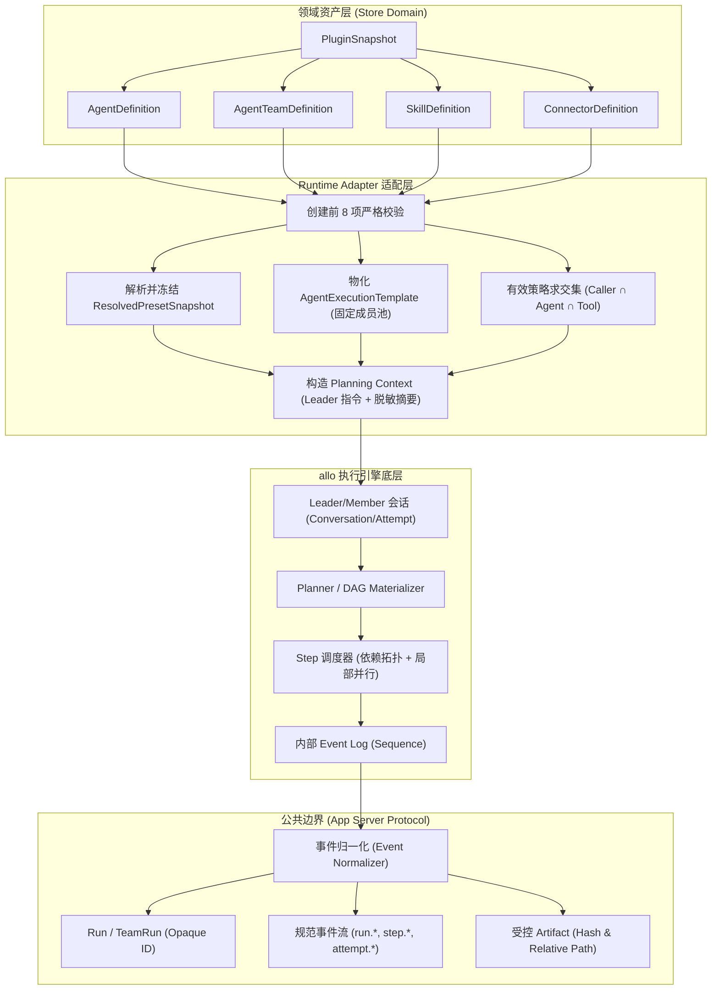
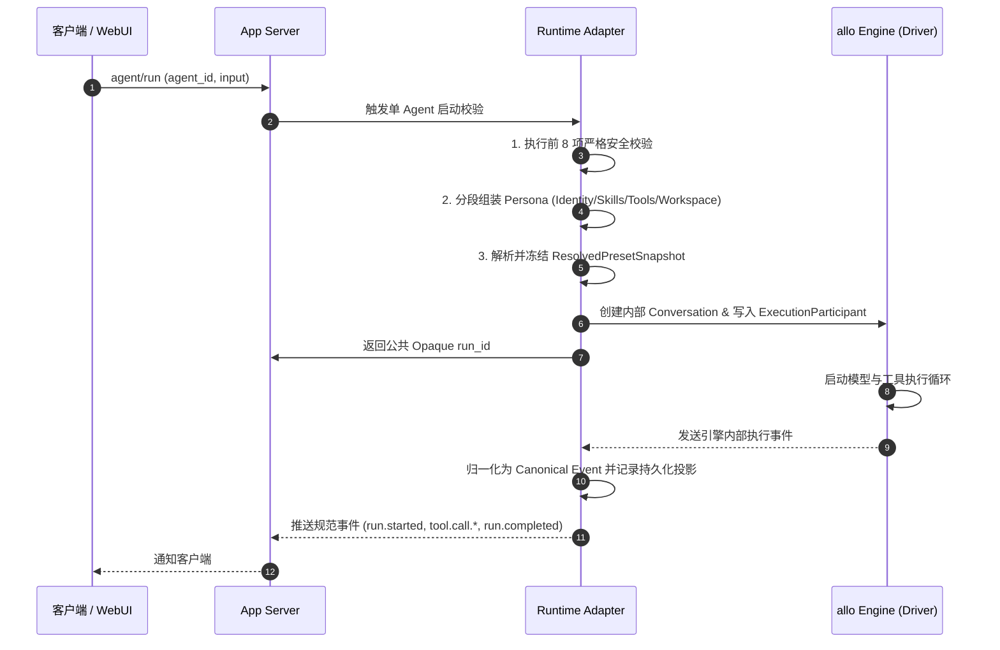
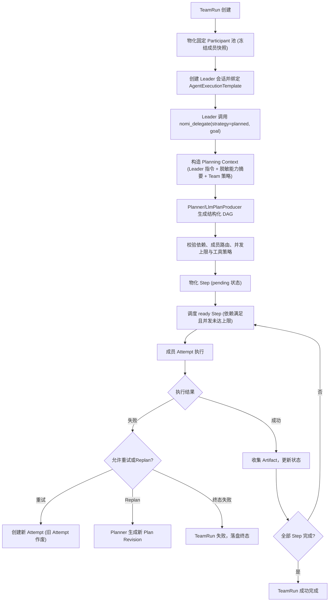

# allo Runtime Adapter 规格 · 技术方案

> 状态：🧊 架构基线（Phase 0；发版前可改，非冻结，见 `16-sdk-webui-site-priority-plan.zh.md` §7 决策 4；Runtime Adapter 单 Agent 已实证）；发布阻断
> 日期：2026-08-26（修订：2026-09-10 — Team 触发方式改为 Leader 模型调用 `nomi_delegate(strategy=planned)`）
> 前置：[`00-architecture-decision.md`](file:///c:/workspace/allo/docs/agent-store/00-architecture-decision.md)、[`01-domain-model.md`](file:///c:/workspace/allo/docs/agent-store/01-domain-model.md)
> 一句话原则：**Runtime Adapter 负责将 Agent Store 领域模型精准映射至 allo 执行引擎内部基础设施，严密隔离内部 Session UUID 与数据库主键，保证对外行为稳定且无凭据泄漏**

---

## 1. 背景与核心痛点

Agent Store 的上层是标准化、平台无关的领域资产（Agent, Team, Skill, Connector），而底层是高性能、单二进制的 allo Rust 运行时引擎。两者不能直接强耦合。引入 Runtime Adapter 的核心痛点在于：

### 1.1 核心痛点分析

1. **直接暴露内部引擎结构的脆弱性**：若让外部协议或领域模型直接感知 allo 的内部 Session、Attempt UUID 或数据库模型，底层引擎每次优化或表重构都会引发外部破坏性变更。
2. **提示词组装失控与权限漂移**：外部导入的 Markdown 经常把角色设定、工具列表与约束指令混杂在一起。若直接拼入全局 Prompt，LLM 极易发生越权，必须由适配器进行严格的“结构化分段装配”。
3. **团队规划入口与调度紊乱**：Team 执行涉及多角色协作，若由外部客户端直接生成计划，客户端权限过大；若完全由模型自由发挥，计划结构不可控。必须通过 Leader 会话与 `nomi_delegate(strategy=planned)` 在受控的 Planning Context 下生成合法 DAG。
4. **异常退出与伪完成状态**：进程崩溃或网络中断时，若简单将未完成任务标记为成功或丢弃状态，会导致用户数据丢失。必须在重启时统一置为 `recovery_required`。

---

## 2. 方案全景与映射架构

### 2.1 运行时映射流转全景



### 2.2 目标与非目标 (Goals & Non-Goals)

- **核心目标**：
  - 将 Agent/Team/Skill/Connector 规范映射到 allo 的 Preset、Skill、MCP 与 Template。
  - V1 完整支持单 Agent Run 及固定成员 TeamRun（planned DAG、局部并行、重试、replan）。
  - 实现严格的分段 Persona 拼装，执行前进行 8 步安全校验。
  - 统一事件规范化，屏蔽内部实现细节。
- **明确非目标**：
  - 不支持第二个运行时引擎。
  - 运行时不直接读取外部未转换的原始文件。
  - 不支持动态增删成员、嵌套 Team 或全局 Mailbox。
  - 状态迁移和权限判定由代码强制保证，不交由 LLM 自行决定。

---

## 3. 详细设计 (按模块内聚)

### 3.1 实体映射核心总表

| Agent Store 领域对象 | allo 内部对应实体 | 映射与转换规则 |
|---|---|---|
| **AgentDefinition** | `Preset` / `ResolvedPresetSnapshot` + `ExecutionParticipant` | 先解析为不可变 Preset 快照；实际 Runtime Driver 单独选择，创建 Attempt 执行。 |
| **SkillDefinition** | `allo Skill` / Skill 引用 | 运行前校验文件路径在不可变快照内，版本精准匹配。 |
| **ConnectorDefinition** | `MCP Config` / Connector Runtime | 工具名统一加上命名空间前缀 `connector__<slug>__<tool>` 并通过策略过滤。 |
| **AgentTeamDefinition** | `AgentExecutionTemplate` | 冻结固定成员角色、模型、技能与工具策略快照；禁止外部运行时动态增删。 |
| **TeamRun** | `AgentExecution` + `Planning Context` | 由 Leader 触发 `nomi_delegate(strategy=planned)` 生成 DAG；Leader 会话非用户可见。 |
| **Step** | `Execution Step` | 依据依赖关系拓扑与 `participant_index` 严格映射并调度。 |
| **Attempt** | `Attempt` / `Conversation Execution` | 对外透出全新且唯一的 Opaque `attempt_id`。 |
| **Event** | `Allo Event/Sequence` ➔ `Canonical Event` | 内部私有事件序列归一化为平台标准事件字典，过滤底层探测细节。 |
| **Artifact** | `Artifact Reference` | 文件物理保存在受控 workspace/artifact store，对外仅暴露摘要与相对定位。 |

### 3.2 单 Agent 运行时执行链路



#### 3.2.1 创建前 8 项严格安全校验流水线

Run 创建必须依次通过以下判定，任一失败立即返回结构化错误，禁止创建未就绪 Run：
1. **定义存在性**：`AgentDefinition` 存在且版本状态处于 `enabled`。
2. **快照一致性**：能成功解析为 `ResolvedPresetSnapshot`，且 Digest 与 Catalog 记录完全一致。
3. **技能有效性**：所有引用的 `skill_refs` 存在、版本吻合且物理文件全部落在受控快照内。
4. **连接器就绪**：所有 `connector_refs` 已安装，工具策略与命名空间可成功解析。
5. **凭据绑定满足**：`CredentialBinding` 存在，且授权范围（Scopes）覆盖所需工具。
6. **工作区隔离**：目标 `workspace_id` 已登记且路径合法，严格禁止 `../` 目录逃逸。
7. **有效权限非空**：调用方策略与 Agent/Skill/Connector 策略交集非空。
8. **驱动能力匹配**：选定的模型和底座能力满足定义声明的最低要求。

#### 3.2.2 结构化分段 Persona 组装

严禁将未经验证的 Markdown 字符串全量直接注入全局 system prompt。适配器必须按如下固定顺序分段组装：

```text
[Section 1: Agent Identity]     -> 专家名称、唯一标识与核心定位
[Section 2: Role / Persona]      -> 角色人设、领域知识与专业口吻
[Section 3: Bound Skills]        -> 已绑定的原子技能清单与触发说明
[Section 4: Allowed Tools]       -> 命名空间化后的受控工具清单 (connector__*)
[Section 5: Workspace Policy]    -> 允许读写的工作区路径与文件操作安全边界
[Section 6: Current Task]        -> 当前用户请求输入与上下文
[Section 7: Output Contract]     -> 结构化输出要求与约束规范
```

---

### 3.3 Agent Team V1 编排流 (Leader Planned)

#### 3.3.1 固定成员物化机制

- 导入期只产出 `AgentTeamDefinition`，绝不在导入期生成 allo 的 `AgentExecutionTemplate`。
- `AgentExecutionTemplate` 必须在 **TeamRun 创建时** 由 Runtime Adapter 动态生成并永久冻结：
  1. 解析 `lead_agent_id` 与全部 `member_agent_ids`。
  2. 分别为 Leader 和每个成员冻结独立的 `ResolvedPresetSnapshot` 与工具策略。
  3. 构建固定参与者池（Participant Pool）。

#### 3.3.2 Leader Planned 编排全流程



- **Planning Context 隔离保证**：仅下发经过脱敏的成员能力摘要（名称、角色、描述、专长领域）。各成员完整的 Prompt 与凭据绝不泄露到共享规划上下文。
- **调度不变量**：
  - Step 依赖必须闭环指向本 TeamRun 内的前序 Step。
  - 只有当前序依赖全部成功（或标记跳过）时，Step 才能跃迁至 `ready`。
  - `max_parallel` 严格取 Team、调用方与系统策略的最小值。
  - 发生 Retry 时必须生成全新 Attempt ID，迟到的旧 Attempt 写入直接拒绝。

---

### 3.4 事件与产物归一化 (Event & Artifact Normalization)

#### 3.4.1 规范化事件字典

适配器将底层的细碎调用事件映射为 18 个规范事件，屏蔽底层实现波动：

```text
run.started          run.paused          run.completed       run.failed          run.cancelled
plan.created         plan.revised
step.ready           step.started        step.completed      step.failed
attempt.started      attempt.completed   attempt.failed
tool.call.started    tool.call.completed
approval.required    artifact.created
```

每个规范事件信封统一包含：`event_id`, `stream_id` (run_id), `resource_type`, `resource_id`, `type`, `timestamp`, `data`。

#### 3.4.2 受控 Artifact 模型

执行产物对外绝不暴露物理文件绝对路径或主机目录：

```json
{
  "artifact_id": "art_1024",
  "run_id": "run_9001",
  "name": "architecture-report.pdf",
  "media_type": "application/pdf",
  "size": 24580,
  "sha256": "e3b0c44298fc1c149afbf4c8996fb92427ae41e4649b934ca495991b7852b855",
  "workspace_relative_path": "dist/architecture-report.pdf",
  "created_at": "2026-08-26T10:30:00Z"
}
```

---

### 3.5 错误模型与异常恢复策略

#### 3.5.1 标准错误分类

适配器统一对外输出 11 类明确错误码：
`invalid_definition`, `policy_denied`, `credential_unavailable`, `workspace_denied`, `runtime_unavailable`, `plan_invalid`, `step_dependency_invalid`, `participant_unavailable`, `attempt_stale`, `cancelled`, `internal_error`。

#### 3.5.2 崩溃恢复与重启保护

- **事实来源**：底层的 Event Log 是事实来源，Run / Step / Attempt 的投影状态用于快速查询。
- **重启状态判定**：
  - 进程意外退出并重启后，系统执行扫描。已持久化终态保持不变。
  - 处于 `queued` 或 `running` 状态且无法证明已被原子完成的 Run，一律标记为 `recovery_required` 或 `failed`。
  - **严禁掩盖**：绝不允许将异常退出的进程伪装为 `completed`。

---

## 4. 运行准入等级 (Readiness Gate)

资产必须依次通过四个阶段才能进入生产运行：

```text
model-defined (模型定义就绪)
      ↓
adapter-defined (适配层映射完成)
      ↓
runtime-verified (底座执行验证通过)
      ↓
release-eligible (准入发布)
```

`runtime-verified` 的最低前置断言：
1. `AgentDefinition` 能无损解析为不可变 `ResolvedPresetSnapshot`。
2. 快照能绑定至 `ExecutionParticipant`，且真实 Runtime Driver 能顺利拉起执行会话。
3. 单 Agent 异步 Run 能完整产生 `started` 与 `completed/failed` 事件与结果。
4. 全链路事件能被适配器完整规范化，无私有字段泄露。

---

## 5. 验收测试用例 (TC-RA-001 ~ TC-RA-010)

| 用例编号 | 测试目标 | 验证与断言方法 |
|---|---|---|
| **TC-RA-001** | 单 Agent 执行映射 | 验证 `AgentDefinition` 解析为 Preset 快照，Runtime Driver 跑通单 Agent 并输出结果。 |
| **TC-RA-002** | 技能与连接器加载 | 验证运行前 8 步校验成功加载绑定的 Skill 与 MCP Connector，非法路径被阻断。 |
| **TC-RA-003** | Team 参与者池物化 | 验证 `software-company` 正确解析并物化 5 人固定 Participant 池。 |
| **TC-RA-004** | Leader 规划 DAG 生成 | 验证 Planning Context 驱动 Planner 生成顺序 DAG，各节点绑定正确 Participant。 |
| **TC-RA-005** | DAG 依赖与局部并行 | 验证两个独立 Step 能并行执行，强依赖 Step 严格等待前序完成。 |
| **TC-RA-006** | 失败重试隔离 | 验证 Step 失败后创建全新的 Attempt 实例进行重试，旧 Attempt 自动作废。 |
| **TC-RA-007** | QA 失败 Replan | 验证 QA 验收失败后触发 Replan，生成修复 Step 与回归 Step 组成的修正 DAG。 |
| **TC-RA-008** | 迟到事件防污染 | 验证已取消或失效旧 Attempt 返回的迟到事件被引擎安全丢弃，不污染最新状态。 |
| **TC-RA-009** | 重启异常标记 | 模拟引擎中途崩溃退出，重启后未完成 Run 被正确置为 `recovery_required`。 |
| **TC-RA-010** | 敏感信息隔离 | 检查公共事件流、返回值与日志，断言无 allo 内部 ID、物理绝对路径与明文凭据。 |

---

## 附录：原始技术底稿与历史归档 (Historical & Technical Reference Archive)

> **归档说明**：以下完整保留重构前的原始技术底稿、历次讨论与历史记录全文，供历史追溯、协议字段详细对照与技术审计。

---

# allo Runtime Adapter 规格

> 状态：架构基线（Phase 0；发版前可改，非冻结，见 `16-sdk-webui-site-priority-plan.zh.md` §7 决策 4）；Runtime Adapter 单 Agent 已实证；发布阻断
> 日期：2026-08-26
> 前置：`00-architecture-decision.md`、`01-domain-model.md`
> 目标：定义 Agent Store 领域模型如何映射到 allo Runtime；allo 是唯一 Runtime，Adapter 只隔离内部实现

## 1. 目标与非目标

### 1.1 目标

- 将 Agent Store 的 Agent/Team/Skill/Connector/Run 模型映射到 allo；
- 使用 allo 现有 Agent Execution、ExecutionTemplate、Planner、Participant Resolver、事件基础设施；
- V1 实现单 Agent 与固定成员 AgentTeam；
- V1 Team 支持由 Leader Planning Context 驱动的 planned DAG、局部并行、retry、replan、事件和 Artifact；
- 不把 allo 内部 ID、数据库模型、UI 事件形态暴露给 App Server。

### 1.2 非目标

- 不支持第二个 Runtime；
- 不把 CodeBuddy/WorkBuddy 来源格式直接交给 allo；
- 不实现完整 CodeBuddy Team 的 Mailbox、成员自主认领、成员直连消息和嵌套 Team；
- 不让模型直接决定权限、成员路由、状态迁移或审批结果。

## 2. 映射总览

```text
PluginSnapshot
    ↓ Importer
AgentDefinition / AgentTeamDefinition / SkillDefinition / ConnectorDefinition
    ↓ Runtime Adapter
Allo Preset / ResolvedPresetSnapshot / Skill / MCP Config / ExecutionTemplate
    ↓
Conversation / Execution / Participant / Plan / Step / Attempt
    ↓ Event Normalizer
Agent Store Run / Task / Event / Artifact
```

| Agent Store | allo 目标 | 说明 |
|---|---|---|
| AgentDefinition | Preset/ResolvedPresetSnapshot + ExecutionParticipant | Agent Store AgentDefinition 先解析为现有 Preset 快照；实际 Runtime Agent/Driver 单独选择和执行 |
| SkillDefinition | allo Skill/Skill reference | 运行前校验路径与版本 |
| ConnectorDefinition | MCP Config/Connector runtime | 工具名必须经命名空间和策略过滤 |
| AgentTeamDefinition | AgentExecutionTemplate | 保存固定成员、角色、模型/技能/工具快照 |
| TeamRun | Execution + Planning Context | V1 由 Leader 调用 `nomi_delegate(strategy=planned)` 触发服务端 Planner 生成 planned DAG；Leader 需要 Conversation/Attempt，但不创建用户可见的独立会话 |
| Task/Step | Execution Step | 用 dependency/participant_index 映射 |
| Attempt | Attempt/Conversation execution | 公开 opaque attempt_id |
| Event | Allo event/sequence → canonical Event | 不直接转发 provider/UI 事件 |
| Artifact | Artifact reference | 文件实际内容保留在受控 workspace/artifact store |

## 3. Agent Run

### 3.1 创建前校验

运行时必须依次校验：

1. AgentDefinition 存在且版本可用；
2. AgentDefinition 能解析为合法的 Preset/ResolvedPresetSnapshot，且内容 digest 与 Catalog 记录一致；
3. 所有 Skill refs 存在、版本匹配且路径在快照内；
4. Connector refs 已安装，工具策略可解析；
5. CredentialBinding 存在且权限范围满足；
6. workspace 已登记、路径允许、不可越界；
7. 调用方策略与 Agent/Skill/Connector 策略交集非空；
8. 模型和 Runtime 能力满足 Definition 要求。

校验失败必须返回结构化错误，不创建可运行 Run。

### 3.2 Persona 组装

不要将导入 Markdown 直接拼进未定义的全局 system prompt。运行时按显式区段组装：

```text
[Agent Identity]
[Role / Persona]
[Bound Skills]
[Allowed Connector Tools]
[Workspace Policy]
[Current Task]
[Output Contract]
```

工具、文件、网络和凭据权限由 Runtime Policy 计算，不由 Persona 文本决定。

### 3.3 生命周期

```text
创建公共 run_id
    → 记录 execution snapshot
    → 创建 allo Conversation/Execution
    → 持久化 run.started
    → 订阅并规范化事件
    → 保存 Artifact
    → 写入 completed/failed/cancelled
```

App Server 只返回 Agent Store 公共 ID，不返回 allo 内部 session/execution ID。

## 4. Team Run（V1）

### 4.1 固定成员物化

Importer 只生成 `AgentTeamDefinition` 和标准化成员引用，不直接创建 allo 的 `AgentExecutionTemplate`。`AgentExecutionTemplate` 是 Runtime Adapter 在 TeamRun 创建时生成的执行级快照，避免 Importer 依赖 allo 内部对象。

```text
AgentTeamDefinition vN
    ↓
解析 lead_agent_id 与 member_agent_ids
    ↓
分别冻结 Leader 和每个成员的 Preset/ResolvedPresetSnapshot、Skill/Connector/Tool Policy 配置快照
    ↓
创建 AgentExecutionTemplate 与固定 Participant 池
    ↓
构造 Planning Context（Leader 规划指令 + 脱敏成员能力摘要 + Team 策略）
    ↓
创建 TeamRun 并调用内部 Planner
```

成员列表来自 TeamDefinition，不能由模型在运行中任意增删。成员角色约束必须在 Runtime 代码中校验。

### 4.2 Leader planned 流程（模式 A）

这里的 Leader 是 `lead_agent_id` 指向的规划角色，不必是用户可见的独立会话，但必须有一个可执行工具调用的 allo Conversation/Attempt。TeamRun 创建时，Runtime Adapter 先冻结固定成员快照（`AgentExecutionTemplate`），并把该 Template 绑定为 Leader Conversation 的 `execution_template_id`；随后 Leader 在该 Conversation 的 turn 内调用 `nomi_delegate(strategy=planned, goal=…)`。服务端据此把以下内容组成一次性的 Planning Context，交给内部 `Planner/LlmPlanProducer`：

```text
Leader Preset 的规划指令
    + Team 目标与 planner_policy
    + 脱敏的成员能力摘要（name/role/description/model/strengths）
    + routing_constraints、workflow_limits 和有效策略
```

成员的完整 persona、Skill、Connector 和 Tool Policy 不进入共享 Planning Context，而是保留在各自 Participant 的不可变 Snapshot 中。成员池、`max_parallel`、`routing_constraints` 与权限全部来自绑定的 Template 和服务端策略，不接受模型输入。

```text
TeamRun 创建
    ↓
解析 TeamDefinition 并物化固定 Participant 池（冻结成员快照）
    ↓
创建 Leader Conversation 并绑定该 AgentExecutionTemplate
    ↓
Leader 调用 nomi_delegate(strategy=planned, goal)
    ↓
构造 Planning Context
    ↓
Planner 生成结构化 Plan/DAG
    ↓
校验依赖、成员路由、并发限制和工具策略
    ↓
物化 Step
    ↓
调度 ready Step
    ↓
收集结果并更新状态
    ↓
必要时 retry 或 replan
    ↓
汇总 TeamRun 结果
```

V1 允许：

- 顺序依赖；
- 依赖满足后的 ready Step；
- 独立 ready Step 的局部并行；
- 失败 Step 的有限 retry；
- 基于结果、失败或用户指令的 replan；
- 汇总、验证和 QA→Engineer→QA 反馈回路。

V1 不允许：

- 动态创建 Team 外成员；
- 嵌套 Team；
- 模型绕过 routing_constraints 指定成员；
- 直接把任意 `role` 字符串当权限边界；
- 顶层用 `strategy=parallel` 代替 Team planned 流程；
- 用仅支持 `strategy=parallel`、或无持久化的 delegate 实现充当 Team 的计划入口。

### 4.3 Planner 参数映射

V1 Team 的 `planned` **由 Leader 模型经 `nomi_delegate(strategy=planned)` 触发**（2026-09-10 修订，见 `16-sdk-webui-site-priority-plan.zh.md` §7 决策 3）。Runtime Adapter 的职责是：创建 Leader Conversation、把 Team 的 `AgentExecutionTemplate` 绑定为其 `execution_template_id`，并保证注册给 Leader 的 delegate 工具支持 `strategy=planned` 且绑定持久 `AgentExecutionEngine`。仅支持 `strategy=parallel`、同步且无持久化的 embedded 实现（`nomi-agent::local_delegate_tool`）不得出现在 Team 会话的工具面。

Runtime Adapter 只允许向内部 Planner 传递经校验的规划参数；这些参数不是公共协议，也不是模型可见工具的 delegation 参数：

```json
{
  "mode": "planned",
  "goal": "<run goal>",
  "plan_gate": "automatic",
  "adaptation_policy": "adaptive",
  "max_parallel": 4
}
```

`work_dir`、`model_pool` 按 Team/Run Policy 生成并限制范围；不得由外部客户端直接覆盖继承的安全约束。

### 4.4 Step 调度不变量

- Step 依赖必须指向同一 TeamRun 内已存在的 Step；
- 只有所有依赖成功或被明确允许跳过时，Step 才能 ready；
- `participant_index` 必须落在固定 Participant 池内；
- `max_parallel` 不得超过 Team、调用方和 Runtime 上限的最小值；
- 已取消、失败终态的 Step 不得被迟到事件覆盖；
- retry 必须生成新的 Attempt；旧 Attempt 的迟到写入必须被拒绝；
- replan 生成新 Plan Revision，不覆盖历史计划和事件。

### 4.5 Runtime Readiness Gate

Agent Store Agent/Team 只有通过以下阶段才能进入对应的运行状态：

```text
model-defined
    → adapter-defined
    → runtime-verified
    → release-eligible
```

`runtime-verified` 至少要求：

1. AgentDefinition 能解析为不可变 Preset/ResolvedPresetSnapshot；
2. Preset Snapshot 能绑定到 allo ExecutionParticipant，并由 Runtime Agent/Driver 创建 Conversation/Attempt；
3. 单 Agent Run 能产生 started、completed/failed 事件和结果；
4. 事件、结果和内部错误能被 Adapter 规范化；
5. 测试证据记录 allo 版本、Definition digest、请求和事件序列。

Team 不得在单 Agent Gate 通过前进入 `runtime-verified`。

## 5. 事件与 Artifact 规范化

### 5.1 统一事件

Adapter 将 allo 事件映射为：

```text
run.started
run.paused
plan.created
plan.revised
step.ready
step.started
step.completed
step.failed
attempt.started
attempt.completed
attempt.failed
tool.call.started
tool.call.completed
approval.required
artifact.created
run.completed
run.failed
run.cancelled
```

事件必须带：

```text
event_id
stream_id
resource_type
resource_id
type
timestamp
data
```

### 5.2 Artifact

Artifact 只公开：

```text
artifact_id
run_id
name
media_type
size
sha256
workspace_relative_path
created_at
```

真实文件存储在受控 workspace/artifact store；禁止通过事件、日志或公共 API 返回凭据。

## 6. 错误与恢复

### 6.1 事实来源与提交顺序

```text
Command
    → 鉴权/策略校验
    → 写入幂等 Intent
    → allo 执行
    → 持久化规范 Event
    → Projector 更新 Run/Step/Attempt 投影
    → 对外返回/推送
```

Event Log 是 allo 引擎内部的事实来源；Run、Step、Attempt 和当前 Plan Revision 的持久化状态是 V1 的读取模型。事件序号（sequence）由引擎在持久化 Event 时分配，仅在内部使用；公共 cursor 列为 V2，不接受客户端提供的 cursor。

状态写入安全由 allo 引擎内部既有的版本/CAS、lease/fencing 与 receipt 机制保障；这些属于引擎内部实现，不是 V1 App Server 公共契约。Agent Store 层的投影 CAS 与公共 Attempt fencing token 列为 V2。终态不得被迟到写入覆盖的要求不变。

### 6.2 崩溃恢复

V1 复用 allo 既有的启动恢复和内部安全保护：恢复会根据持久化状态处理 queued/running Attempt，采用已确认的 receipt，或将无法证明安全的执行阻塞为 `recovery_required`。App Server 不对外承诺服务端一定续跑原 Attempt，但不删除、不旁路 allo 的 Intent、版本/CAS、lease/fencing、receipt 和恢复扫描机制。需要重跑时由用户发起新的 Run/Attempt，并继续遵守 Connector 幂等和审批要求。

Adapter 错误分为：

```text
invalid_definition
policy_denied
credential_unavailable
workspace_denied
runtime_unavailable
plan_invalid
step_dependency_invalid
participant_unavailable
attempt_stale
cancelled
internal_error
```

V1 重启要求：

- 保留已持久化事件和终态；
- 未完成 Run 必须明确标记 `recovery_required`/`failed`；
- 不能把“进程退出”伪装成 completed；
- App Server 对外只承诺状态如实可查询；allo 内部可按既有安全恢复规则继续处理，无法证明安全时必须保持 `recovery_required`，不覆盖原结果。

服务端恢复语义是否作为 App Server 公共能力开放、以及跨 Run 的恢复操作 API，列为 V2；allo 内部既有安全恢复机制属于 V1 Runtime 实现并继续保留。

## 7. V1 验收用例

- `TC-RA-001`：AgentDefinition 成功解析为 Preset，并由 Runtime Agent/Driver 完成单 Agent Run；
- `TC-RA-002`：Skill 和 Connector Policy 在运行前正确加载；
- `TC-RA-003`：software-company 生成固定 5 人 Participant 池；
- `TC-RA-004`：Planning Context 驱动 Planner 生成顺序 DAG 并绑定正确 Participant；
- `TC-RA-005`：两个独立 Step 局部并行，依赖 Step 等待完成；
- `TC-RA-006`：Step 失败后生成新 Attempt 并 retry；
- `TC-RA-007`：QA 失败后 replan 产生修复与回归 Step；
- `TC-RA-008`：旧 Attempt 迟到事件不能覆盖新 Attempt；
- `TC-RA-009`：Runtime 重启后保留事件和终态，未完成 Run 明确标记失败或需恢复；
- `TC-RA-010`：公共响应不泄露 allo 内部 ID 和凭据。

## 8. 实现顺序

1. 定义 Adapter 内部接口和 ID 映射；
2. 完成单 Agent 创建、事件和结果；
3. 完成 AgentExecutionTemplate 固定成员物化和 Planning Context 构造；
4. 接入内部 planned 计划生成和 Step 物化；
5. 完成 ready Step 调度、并发限制和 Attempt；
6. 完成 retry/replan；
7. 完成 Artifact 与启动状态检查，将未完成 Run 标记为 `recovery_required`/`failed`（引擎内部 sequence 继续存在，不对对外承诺 cursor）；
8. 运行 software-company V1 验收用例。
