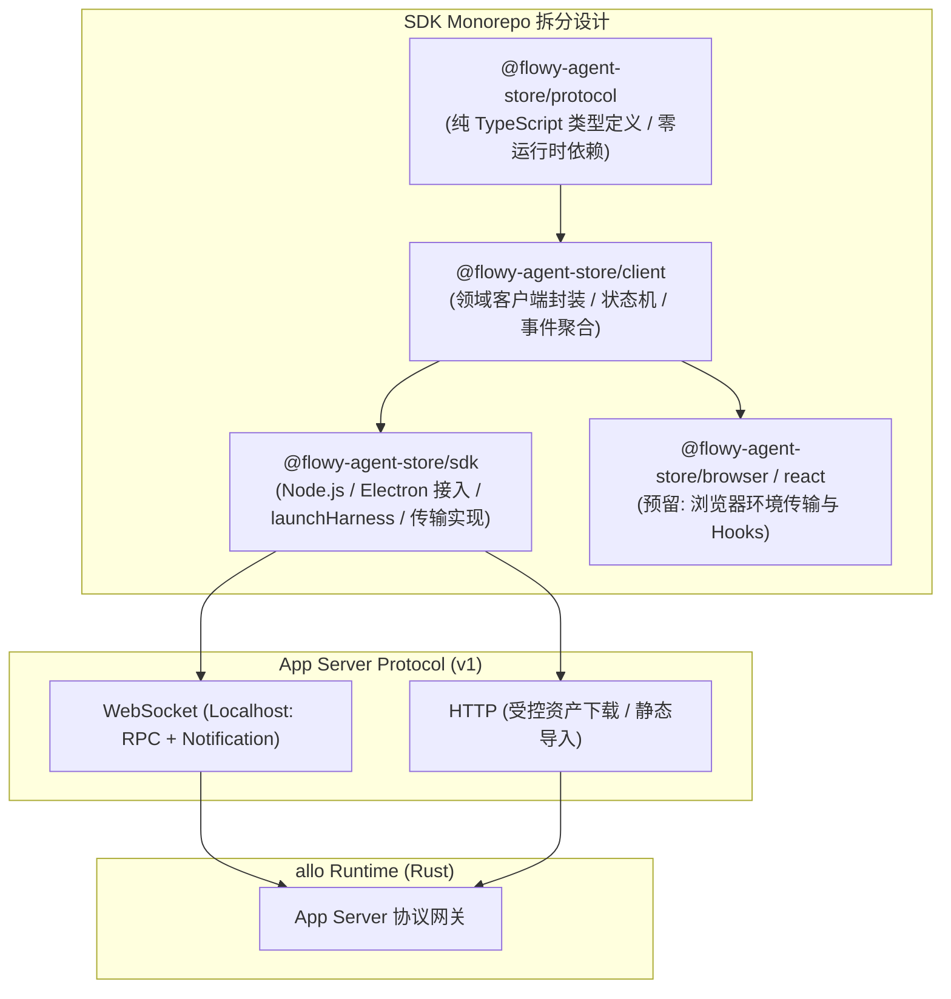
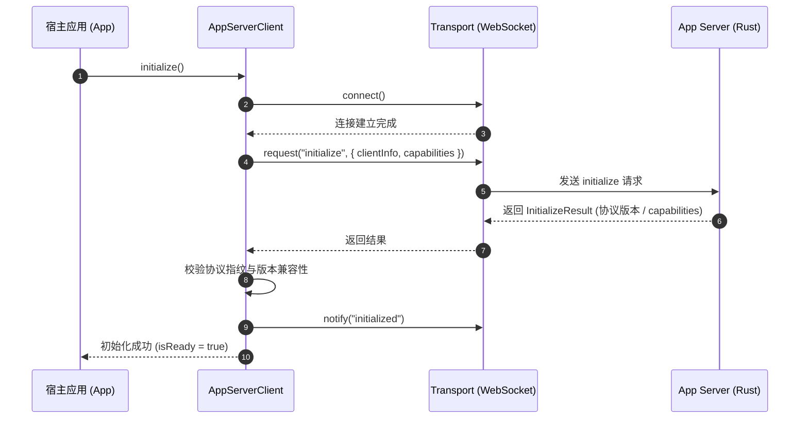
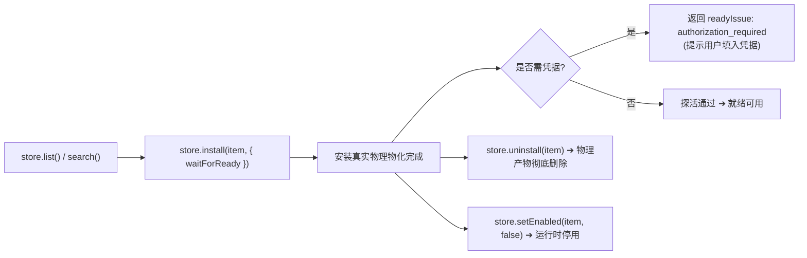
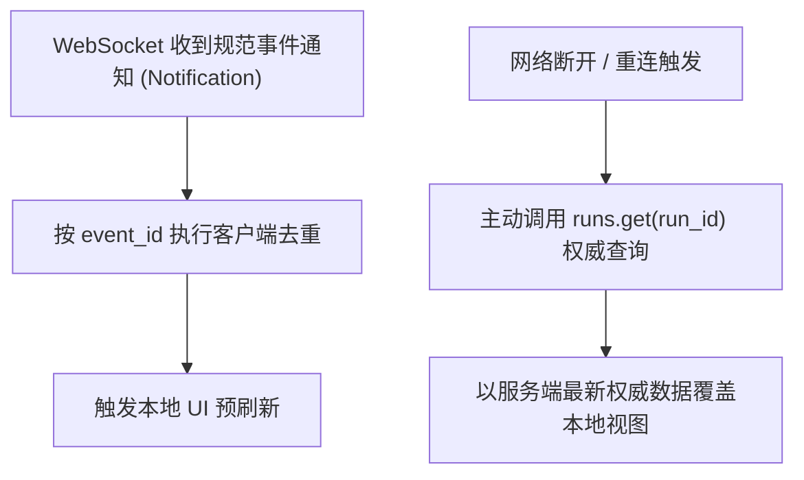

# Agent Store TypeScript SDK 规格 · 技术方案

> 状态：✅ 现行正文（未正式发版，可改；发版前统一称 v1，见 `16-sdk-webui-site-priority-plan.zh.md` §7 决策 4）；包主体已实现（见 `12-sdk-packaging.md`）
> 日期：2026-08-26（更新：2026-09-15）
> 前置：[`01-domain-model.md`](file:///c:/workspace/allo/docs/agent-store/01-domain-model.md)、[`05-flowy-agent-store-app-server-protocol.md`](file:///c:/workspace/allo/docs/agent-store/05-flowy-agent-store-app-server-protocol.md)、[`06-connector-oauth-security.md`](file:///c:/workspace/allo/docs/agent-store/06-connector-oauth-security.md)、[`10-public-contracts.md`](file:///c:/workspace/allo/docs/agent-store/10-public-contracts.md)
> 一句话原则：**作为 Versioned App Server Protocol 的类型安全客户端，严禁直接依赖 allo 内部数据库与私有结构，不私自发明 Wire 动词，严密隔离敏感凭据**

---

## 1. 背景与核心痛点

TypeScript SDK 是上层应用（如 WebUI、Flowy 桌面端、Node.js 自动化脚本）对接 Agent Store 的主要通道。在设计与实现 SDK 时，必须解决以下核心痛点：

### 1.1 核心痛点分析

1. **客户端反向绑定内部实现**：若 SDK 直接依赖 allo 内部的数据库表名、内部会话 UUID 或私有路径，底层引擎重构将导致所有下游应用瘫痪。SDK 必须且只能依赖版本化的 App Server Protocol。
2. **事件流不可靠性与状态不一致**：长连接下的推送通知可能存在丢包、乱序或重连断层。若客户端将本地推流事件当作唯一事实来源，将引发严重的 UI 状态漂移。必须确立“通知触发刷新，终态权威回填”的消费原则。
3. **客户端私自扩展与概念侵入**：例如客户端看到 `update_available` 标志后，自行拼凑“先删后装”逻辑并伪装成单一更新动词；或者将易变不稳定的宿主底层配置文件操作暴露为强类型 API，导致兼容性负担不可控。
4. **多环境适配复杂度**：Node.js、Electron 主进程与浏览器 Web 环境在传输层（WebSocket / IPC / Fetch）与凭据安全边界上差异显著，必须进行清晰的包分层。

---

## 2. 方案全景与架构拓扑

### 2.1 SDK 分层与依赖架构



### 2.2 核心目标与非目标 (Goals & Non-Goals)

- **核心目标**：
  - 提供纯 TypeScript 类型定义的 `@flowy-agent-store/protocol`。
  - 提供具备连接管理、重连、幂等生成与错误转换的 `AppServerClient`。
  - 提供多轮对话句柄 `ConversationHandle` 与单次运行句柄 `AgentRunHandle`。
  - 通过 `launchHarness` 实现开箱即用，单步直达 Client。
- **明确非目标**：
  - SDK 不保存、不处理上游 OAuth 的真实明文 Token。
  - SDK 不在协议上发明虚假更新动词，升级调用必须对应真实 Wire 语义。
  - SDK 对易变的宿主本地配置面（`config/get`、`skill/create` 等）仅暴露协议类型，刻意不提供 typed method，保持访问透明与稳定性边界。

---

## 3. 详细设计 (按领域模块内聚)

### 3.1 核心包分工规范

| 包名 | 职责定位 | 包含内容与依赖约束 |
|---|---|---|
| `@flowy-agent-store/protocol` | 协议契约类型基石 | 包含 Request / Response / Notification / ErrorCode 结构定义；禁止依赖 Node、DOM 或外部运行库。 |
| `@flowy-agent-store/client` | 领域业务客户端 | 包含 `AgentClient`, `TeamClient`, `SkillClient`, `ConnectorClient`, `RunClient`, `StoreClient` 等；处理业务逻辑与事件聚合。 |
| `@flowy-agent-store/sdk` | 官方开箱套件 | 默认携带 Node/Electron 的 `WebSocketTransport` 与 `launchHarness`；提供一键初始化与进程托管。 |

---

### 3.2 传输抽象与初始化握手



#### Transport 统一契约
```ts
export interface Transport {
  connect(): Promise<void>;
  request<T>(method: string, params: unknown): Promise<T>;
  notify(method: string, params: unknown): Promise<void>;
  onNotification(listener: (message: unknown) => void): () => void;
  close(): Promise<void>;
}
```

---

### 3.3 资产与连接器客户端 (Catalog & Connectors)

#### 1. 专家与团队导出 (`export()`)
- `agents.export(id)` / `teams.export(id)`：返回便携式 `ExpertPack`。这是**唯一携带 Persona 正文的通道**（`get` 方法刻意省略 Persona 正文以减轻网络开销）。
- 导出的只是静态配置定义，不含底层运行时执行语义；外部运行时必须自行实现调度。

#### 2. 连接器动态凭据与免市场注册 (`register()`)
- `credentials(id)` / `setCredentials(id, values)`：填入用户专属 API Key / Token。响应中敏感字段一律脱敏，永不返回明文 Secret。
- `register(registration)`：支持开发者自带 MCP 配置文件直连注册，**模板即声明**（`${secret:KEY}` 自动转换为凭据输入表单），无需在官方市场建立索引条目。

---

### 3.4 执行与交互句柄 (Run & Conversation)

#### 1. 单次执行句柄 (`AgentRunHandle`)
```ts
const handle = await launchRun(client.runs, {
  agentId: "wb-software-company-software-engineer",
  goal: "修复认证模块的 Token 刷新漏洞",
  mentions: ["skill:git-tools"]
});

// 1. 流式响应事件循环
for await (const event of handle) {
  console.log(`[${event.type}]`, event.data);
}

// 2. 等待最终聚合结果 (权威回填)
const result = await handle.finished;
console.log("执行状态:", result.status);
console.log("最终摘要:", result.final_response);
```

#### 2. 多轮长对话句柄 (`ConversationHandle`)
- 提供类似 Codex-Thread 的会话模型：通过 `open()` 创建并订阅，通过 `send()` 发送多轮轮次。
- 发送前自动安装事件收集器，`send()` 承诺阻塞直到当前轮次完成（`turn.status === "completed"`），并完成结果权威回填。

---

### 3.5 商店生命周期状态机 (`StoreClient`)

SDK 向上封装了安装五动词，对外提供面向业务的状态机调用：



- **安装幂等保障**：对已安装的条目再次调用 `install()` 直接返回 `reused=true`，绝不在安装中暗中升级。
- **条目升级语义**：调用 `store.update()` 时，底层遵循“先安装新版本快照，验证成功后再释放旧版本”原则；若新版本安装失败，旧版本原样保留，绝不让用户处于“升到一半”的破损状态。

---

### 3.6 边界控制与稳定性红线

1. **易变配置方法不提供 Typed Wrapper**：宿主配置面（`config/get`、`config/set`、`skill/create` 等）随时可能随平台底层配置调整而演变。SDK 在 `@flowy-agent-store/protocol` 中提供其类型，但在 Client 上不提供强类型方法。开发者若需调用，需显式使用 `transport.request(...)`，以此建立清晰的稳定性防线。
2. **严防凭据出境**：SDK 在任何方法、拦截器或控制台调试日志中，严禁打印或缓存从服务端拉取的敏感 Token。

---

## 4. 异常处理与事件对齐准则

### 4.1 弱保证事件流与权威拉取



- **消费原则**：WebSocket 通知仅作为即时刷新的“弱信号”。一旦发生断线重连，SDK 绝不发起历史事件重放请求，而是直接通过 `get()` 和 `result()` 拉取权威快照完成同步。

---

## 5. 验收测试用例 (TC-SDK)

| 用例编号 | 测试目标与场景 | 核心断言与通过条件 |
|---|---|---|
| **TC-SDK-001** | AppServerClient 初始化 | 验证 WebSocket 连接建立、Initialize 握手、协议版本校验成功后进入 `ready` 状态。 |
| **TC-SDK-002** | Catalog 读取与类型映射 | 验证 `agents.list()`、`connectors.list()` 能够正确反序列化为带有完整字段的 Typed 页面。 |
| **TC-SDK-003** | 异步 Run 触发与句柄等待 | 验证 `launchRun` 启动任务，流式输出事件，最终通过 `handle.finished` 拿到完整的 `TurnResult`。 |
| **TC-SDK-004** | 商店安装与真实就绪检测 | 验证 `store.install(item, { waitForReady: true })` 能在物化完成且探测通过后返回 `ready: true`。 |
| **TC-SDK-005** | 凭据单向写入与打码 | 验证 `setCredentials` 成功写入，回包中的敏感字段值为 `[REDACTED]` 或空，不含明文密钥。 |
| **TC-SDK-006** | 断线重连与状态同步 | 模拟网络中断，验证 SDK 自动重连后通过权威接口拉取状态，未完成任务无脏状态残留。 |

---

## 附录：原始技术底稿与历史归档 (Historical & Technical Reference Archive)

> **归档说明**：以下完整保留重构前的原始技术底稿、历次讨论与历史记录全文，供历史追溯、协议字段详细对照与技术审计。

---

# Agent Store TypeScript SDK 规格

> 状态：**现行正文（未正式发版，可改；改动同步更新）**——协议与 SDK 在发版前只有一个版本，统一称 v1，不设 v1/v1.1/v2 之分（`16-sdk-webui-site-priority-plan.zh.md` §7 决策 4）；包主体已实现（见 `12-sdk-packaging.md`）
> 日期：2026-08-26
> 更新：2026-09-09 —— 包名 `@flowy-agent-store/node` → `@flowy-agent-store/sdk`（以 `12` 为准）；TC 引用对齐测试总索引现有范围（001~003）
> 更新：2026-09-15 —— 新增 §6.3：安装五动词经 SDK 可达（`AppServerClient` 扁平方法 + `.store` 子客户端状态机）；非目标补「不发明更新动词」与「宿主管理面只给类型、不给 typed method（可发现性/稳定性边界，非访问边界）」
> 前置：`01-domain-model.md`、`05-flowy-agent-store-app-server-protocol.md`、`06-connector-oauth-security.md`、`10-public-contracts.md`
> 目标：提供 App Server Protocol 的 typed client；SDK 不直接依赖 allo 内部实现

## 1. 定位与边界

```text
TypeScript SDK
    ↓ Versioned App Server Protocol
Agent Store App Server
    ↓ Runtime Adapter
allo Runtime
```

SDK 负责：

- 连接和初始化 App Server；
- 暴露协议定义对应的 TypeScript 类型；
- 调用 Catalog、Thread、Run、Event、Artifact、Approval、Connector API；
- 处理请求 ID、幂等键、重连和结构化错误；
- 为 Node.js、Electron 主进程和浏览器 Web 提供合适的 Transport。

SDK 不负责：

- 定义 Agent/Team/Run 的业务语义；
- 直接访问 allo REST、WebSocket 或数据库；
- 保存真实 OAuth Token；
- 执行本地任意命令；
- 绕过 App Server 的 Tool Policy、Approval 和权限校验；
- **发明 wire 上不存在的动词**：一个待更新条目只被呈现为 `store/list` 的
  `update_available` **标志**，升级要显式叫一次 `store.update()`（`store/update-entry`，
  `fp-12` 加入；`StoreClient.updateHint()` 回答 `update` / `none` / `unknown`）。
  `install()` 对**已安装**条目仍是 no-op（`reused=true`），绝不偷偷升级——store 层
  永远不会因为看到一个「有新版本」的标志就自行拼一个更新动作。失败语义由 host 负责：
  新版本先装、装成功才释放旧的，所以 `update()` 失败时旧安装仍在（`releasedCount === 0`），
  调用方不必处理「升到一半」的条目；
- **为宿主管理面提供 typed method**：六个方法（`config/get` · `config/set` ·
  `skill/create` · `skill/update` · `skill/delete` · `skill/copy`）的**类型**
  在 `@flowy-agent-store/protocol` 里，但 `@flowy-agent-store/client` **刻意
  不给**它们 typed method——这是**可发现性 / 稳定性边界**，**不是访问边界**：
  transport 是公开的，服务端按**磁盘上的 origin** 判定可写性（`05` §4.11），
  所以真想要的人可以走 `transport.request`。不给的原因只有一个——这六个方法是
  协议里**最易变**的一批（跟着宿主配置文件与技能目录走），beta 期不承诺向后
  兼容（`16` D10=A）。

## 2. 包结构

推荐拆分：

```text
@flowy-agent-store/protocol
@flowy-agent-store/client
@flowy-agent-store/sdk
@flowy-agent-store/browser
@flowy-agent-store/react
```

> 注（2026-09-09）：`@flowy-agent-store/node` 已改名 `@flowy-agent-store/sdk`（以 `12-sdk-packaging.md` 为准）；`browser`/`react` 为预留包。

### 2.1 `@flowy-agent-store/protocol`

只包含：

```text
Request/Response/Notification 类型
Initialize 类型
Catalog 类型
Thread/Turn/Run 类型
Plan/Step/Attempt/Event 类型
Approval/Artifact 类型
Connector/OAuth 类型
错误码和错误结构
```

该包不得依赖 Node.js、Electron、浏览器 DOM 或 allo Rust 类型。

### 2.2 `@flowy-agent-store/client`

包含：

```text
AppServerClient
AgentClient
TeamClient
SkillClient
ConnectorClient
ThreadClient
RunClient
EventStreamClient
ArtifactClient
ApprovalClient
StoreClient            # 安装面状态机（§6.3）
ConversationClient     # 持久化多轮会话（§6.2）
```

### 2.3 Transport

```ts
export interface Transport {
  connect(): Promise<void>;
  request<T>(method: string, params: unknown): Promise<T>;
  notify(method: string, params: unknown): Promise<void>;
  onNotification(listener: (message: unknown) => void): () => void;
  close(): Promise<void>;
}
```

V1 实现：

```text
WebSocketTransport：Electron/Web/Flowy（V1 交付）
StdioTransport：Node.js/CLI（V2/deferred；V1 不纳入，见 `16-sdk-webui-site-priority-plan.zh.md` §7 决策 2）
```

浏览器 SDK 不直接实现 stdio，也不持有客户端 Secret。

## 3. AppServerClient

```ts
export interface AppServerClientOptions {
  transport: Transport;
  client: ClientInfo;
  capabilities?: ClientCapabilities;
  protocolVersion?: string;
  requestTimeoutMs?: number;
  reconnect?: ReconnectOptions;
}

export class AppServerClient {
  initialize(): Promise<InitializeResult>;
  close(): Promise<void>;
  isReady(): boolean;
  readonly agents: AgentClient;
  readonly teams: TeamClient;
  readonly skills: SkillClient;
  readonly connectors: ConnectorClient;
  /** 公共模型目录（`models/list`，REQ-PAR-05b；2026-09-09 增补）。 */
  readonly models: ModelClient;
  readonly threads: ThreadClient;
  readonly runs: RunClient;
  readonly artifacts: ArtifactClient;
  readonly approvals: ApprovalClient;
}
```

初始化顺序：

```text
connect transport
    → initialize
    → 校验协议版本与 capabilities
    → initialized notification
    → ready
```

初始化失败不得调用业务方法。协议版本不兼容时返回明确错误，不静默忽略字段。

## 4. Catalog Client

### 4.1 AgentDefinition 与 Team

```ts
// AgentId identifies an Agent Store AgentDefinition, not a Runtime Agent.
interface AgentClient {
  list(input?: ListInput): Promise<Page<AgentSummary>>;
  get(id: AgentId, version?: string): Promise<AgentDetail>;
  // fp-8：导出一份可移植定义。**这是唯一携带 persona 正文的方法**——`get` 刻意没有承载它的字段。
  export(id: AgentId): Promise<ExpertPack>;
}

interface TeamClient {
  list(input?: ListInput): Promise<Page<TeamSummary>>;
  get(id: TeamId, version?: string): Promise<TeamDetail>;
  run(input: TeamRunInput): Promise<TeamRunReceipt>;
  // fp-8：成员逐级展开、**团长在首位**；任一成员不可用则整包失败（不产出残缺名单）。
  export(id: TeamId, version?: string): Promise<ExpertPack>;
}
```

`TeamDetail.teamRuntimeCapabilities` 必须由服务端返回，SDK 不自行推断完整 Team 能力。Team 详情中的 Leader 是规划角色；单次 TeamRun 的 `planningContextDigest` 只从 Run 查询结果读取，不混入静态 Team 定义。`TeamDetail` 另带 `connectors`：该 Team 快照在本机**已安装且启用**的 Connector id 列表——它是 Team Run 唯一可绑定的 Connector 面（成员 Agent 的 `mcpServers` 按 `02` §5.1 只记录、不映射为授权）。

`export()` 返回的 `ExpertPack` 是**定义，不是执行语义**：persona 正文、模型提示、按引用的技能清单、
（团的）名单与策略都在，但编排、步骤调度、工具与凭据策略、事件形状都不在。接入方必须逐条回答
`32-expert-pack-export.zh.md` §5 的 **R1–R11**。两个方法都是 **WebSocket-only**（与 `agent/*` · `team/*`
整族一致），`HttpTransport` 上没有绑定；`capabilities.expert_export` 只说明方法存在，不保证某个 id
可导出（那由宿主 `[expert_export]` 逐请求判定，拒绝时是 `policy_denied`）。约定见 `05` §4.1.1 / §4.2.1。

### 4.2 Skill 与 Connector

```ts
interface SkillClient {
  list(input?: ListInput): Promise<Page<SkillSummary>>;
  get(id: SkillId, version?: string): Promise<SkillDetail>;
}

interface ConnectorClient {
  list(input?: ListInput): Promise<Page<ConnectorSummary>>;
  get(id: ConnectorId, version?: string): Promise<ConnectorDetail>;
  status(id: ConnectorId): Promise<ConnectorStatus>;
  test(id: ConnectorId): Promise<ConnectorProbeResult>;
  authStatus(id: ConnectorId): Promise<OAuthStatus>;
  authStart(id: ConnectorId): Promise<OAuthStartResult>;
  logout(id: ConnectorId): Promise<void>;
  // fp-9：用户自己填 key / token 的表单与状态。响应**永不含 secret 的值**
  // （`fields[].value` 只对 plain 字段出现），写入按调用者命名空间落库。
  // fp-10：表单自己的文案（`title` / `description` / `doc_url` / `doc_label`）挂在
  // `ConnectorCredential` 上——市场一份 schema 只声明它一次，不逐字段重复。
  // fp-11：交一个宿主从未导入过的 MCP server（自带 server 与 key 的入口）；
  // **模板即声明**，`${secret:NAME}` 就是表单字段，密钥仍只走 setCredentials。
  register(registration: ConnectorRegistration): Promise<ConnectorDetail>;
  credentials(id: ConnectorId): Promise<ConnectorCredential>;
  setCredentials(id: ConnectorId, values: Record<string, string>): Promise<ConnectorCredential>;
  clearCredentials(id: ConnectorId, keys?: string[]): Promise<ConnectorCredential>;
}

interface ArtifactClient {
  list(runId: RunId, input?: ListInput): Promise<Page<ArtifactSummary>>;
  get(runId: RunId, artifactId: ArtifactId): Promise<ArtifactDetail>;
  download(runId: RunId, artifactId: ArtifactId): Promise<ReadableStream<Uint8Array>>;
}

interface ApprovalClient {
  list(runId: RunId, input?: ListInput): Promise<Page<ApprovalSummary>>;
  get(runId: RunId, approvalId: ApprovalId): Promise<ApprovalDetail>;
  respond(input: ApprovalResponseInput): Promise<ApprovalReceipt>;
}
```

> 自带 MCP server 的开发者（`fp-11`）：把手上那份模板交给 `register()` 就是全部工作——
> `{name, transport, description?}`，`transport` 与宿主存储同形（`http`/`sse` 的
> `url`/`headers`/`values`，或 `stdio` 的 `command`/`args`/`env`）。**模板即声明**：
> `headers` 里写 `Authorization: "Bearer ${secret:ACME_KEY}"`，那个名字就成为凭据表单的字段，
> 不需要市场条目、也不需要 `token-schema.json`；`${NAME}` 归连接器自己的 `values`。
> 返回值是 `connector/get` 的形态，所以 `created.credential.missing` 直接是还差哪几个键；
> 接着 `setCredentials(created.id, {ACME_KEY: …})` 与 `test(created.id)`。
> 密钥不进 `register`；注册出来的行是 disabled（启用仍需探测通过）；方法在安装所有者专用面上；
> 同名再注册是更新。（未做 `unregister`，见 `34` §10。）

OAuth 客户端只获得：

```text
auth session id
authorization URL
状态
错误
账号摘要
```

不得获得真实 Token。

## 5. Run Client

```ts
interface RunClient {
  agent(input: AgentRunInput): Promise<RunReceipt>;
  team(input: TeamRunInput): Promise<TeamRunReceipt>;
  get(id: RunId): Promise<RunDetail>;
  result(id: RunId): Promise<RunResult>;
  cancel(id: RunId): Promise<CancelReceipt>;
  pause(id: RunId): Promise<RunControlReceipt>;
  resume(id: RunId): Promise<RunControlReceipt>;
  retry(id: RunId, input?: RetryInput): Promise<RunReceipt>;
  replan(id: RunId, input?: ReplanInput): Promise<PlanRevisionReceipt>;
  events(id: RunId, input?: EventQuery): Promise<EventPage>;
  follow(id: RunId, input?: FollowOptions): EventSubscription;
}
```

### 5.1 Run 输入

Agent Store `agentId` 标识 AgentDefinition/Preset，不标识 Claude Code、Codex 等 Runtime Agent；Runtime Agent 由服务端根据 Preset 快照和运行策略选择。

```ts
interface AgentRunInput {
  agentId: AgentId;
  agentVersion?: string;
  input: UserInput;
  workspaceId?: WorkspaceId;
  idempotencyKey: string;
}

interface TeamRunInput {
  teamId: TeamId;
  teamVersion?: string;
  goal: string;
  workspaceId?: WorkspaceId;
  idempotencyKey: string;
}

interface ApprovalResponseInput {
  requestId: string;
  approvalId: ApprovalId;
  decision: "approve" | "reject";
  idempotencyKey: string;
}
```

服务端仍然对所有参数进行安全策略裁剪，客户端参数不是最终授权。

`TeamRunInput` **没有** `planning` 字段：`16` §7 决策 3 规定成员池、并发上限、
`routing_constraints` 与权限取自绑定的 Team 模板与服务端策略。协议侧是
`deny_unknown_fields`，带上 `planning` 会得到 `invalid_request`。反过来，
`run.team(...)` 的 receipt 只保证 `{ runId, status }`（Team Run 没有 lead preset，
不带 `presetRevision` / `contentDigest`）；`agent(...)` 的 receipt 仍然带这两个字段。

## 6. EventStreamClient

```ts
interface EventSubscription {
  onEvent(listener: (event: CanonicalEvent) => void): () => void;
  onError(listener: (error: SdkError) => void): () => void;
  onEnd(listener: (result: StreamEnd) => void): () => void;
  pause(): void;
  resume(): void;
  close(): Promise<void>;
  readonly runId: string;
}
```

事件处理规则：

- 通知只是尽力而为的刷新信号：允许丢失、重复与乱序；
- 收到通知后以 runs.get() 拉取权威状态并合并；
- 按 `event_id` 去重展示；
- 断线重连后不做历史事件补发，直接重新拉取状态；
- 不能把本地 UI 状态当作事件事实来源；
- 终态以 run.result 为准，通知仅为提前刷新。

推荐消费模式：

```ts
const stream = client.runs.follow(runId);
stream.onEvent(event => dedupeByEventId(event, store)); // 通知触发刷新
stream.onError(() => scheduleReconnect());             // 重连后重新拉取状态
```

### 6.1 AgentRunHandle 与 TurnResult（REQ-PAR-04/05c）

`launchRun(runClient, input)`（`@flowy-agent-store/client`）返回 `AgentRunHandle`：
异步迭代实时事件（`for await ... of handle`），`handle.finished` 阻塞到终态
并返回聚合的 `TurnResult`（2026-09-09 由终态视图升级为聚合对象）：

```ts
const handle = await launchRun(client.runs, { agentId: "", goal, mentions });
const result = await handle.finished;   // TurnResult
result.status;          // completed | failed | cancelled
result.final_response;  // 终态文本（run/result summary）
result.output_files;
result.events;          // run/events 权威回填（sequence 序）
result.items;           // 事件派生的 plan/task/attempt/approval 条目
result.usage;           // 仅当运行时在事件流上发布 usage 时存在
```

聚合语义：`finished` 先以 `run/get` 轮询到终态，再拉 `run/result` + `run/events`
做权威回填（拉取失败时退回本地事件缓冲）；`usage` 字段在服务端投影
token 用量之前保持缺省，调用方不得假设其存在。

### 6.2 ConversationHandle（REQ-PAR-05d，多轮会话）

`@flowy-agent-store/client` 提供 Codex-Thread 式的多轮句柄：

```ts
const handle = await ConversationHandle.open(client.conversations, {
  name: "task",
  model: { provider_id: "mimo-cv", model: "mimo-v2.5" },
});
const turn = await handle.send("用一句话说明你负责什么。");
turn.completed;         // 终态（turn.status completed 或 message.error）
turn.assistant_text;    // 权威回填（send receipt.result_text），否则 delta 聚合
turn.turn_id;           // wire/billing turn id
turn.events;            // 本次 turn 的事件（sequence 序）
turn.usage;             // context.usage（运行时报告时）
turn.isError;           // receipt.result_error 或 message.error

await handle.messages(); // 分页 transcript
await handle.cancel();   // 取消在途 turn
await handle.close();    // 退订
```

`send` 在发送前安装事件收集器（不漏流式 delta/usage），`receipt.completed`
为真或等待到 `turn.status(status="completed")`/`message.error` 后返回聚合 turn；
缺省幂等键 `crypto.randomUUID()`；`open`（新建+订阅）与 `attach`（订阅既有）两种绑定。
webui 现有私有 reducer（`web/src/lib/conversation-events.ts`）为 UI 状态层，
切到同一句柄属后续（见 `15` WP-4 / WP-7）。

### 6.3 安装面：五动词与 `store` 子客户端

**五个安装动词都可从 SDK 到达**（`05` §4.5）：`install/run` · `install/status` ·
`install/disable` · `install/enable` · `install/uninstall`。SDK 把它们暴露成
**两层**：

**① `AppServerClient` 上的扁平方法（与 wire 一一对应）**：

```ts
runInstall(input: InstallRequest): Promise<InstallResult>          // install/run
getInstallStatus(snapshotId: string): Promise<InstallStatus>       // install/status
disableInstall(snapshotId: string, componentIds: string[]): Promise<InstallStatus>
enableInstall(snapshotId: string, componentIds: string[]): Promise<InstallStatus>
uninstallInstall(snapshotId: string, componentIds: string[]): Promise<InstallStatus>
installStoreEntry(marketplaceId: string, entryName: string): Promise<StoreInstallResult>
```

后三者的 `componentIds` **必须非空**——服务端对空列表返回 `invalid_request`
（`05` §4.5）。

**② `.store` 子客户端（把五动词编排成一条状态机）**：
`launchHarness(...)`（`@flowy-agent-store/sdk`）解析出的对象**就是**一个
`AppServerClient`（`31` §5 方案 B：返回值即调用入口，没有 `.client` 一跳），它带
`readonly store: StoreClient`（`@flowy-agent-store/client`）。它回答的是调用方
**真正**想问的问题——「把这个商店条目装上，并在它可用时告诉我」——而**不新增
任何 wire 方法**：全部由上面这些既有方法组合而成。

```ts
client.store.list(): Promise<StoreItem[]>
client.store.search(query, { kind? }): Promise<StoreItem[]>
client.store.installed(): Promise<StoreItem[]>
client.store.checkUpdates(): Promise<StoreItem[]>        // installed && update_available
client.store.updateHint(item): "none" | "uninstall_reinstall" | "unknown"
client.store.install(item, { waitForReady?, timeoutMs?, signal? }): Promise<StoreOperationOutcome>
client.store.uninstall(item, { componentIds? }): Promise<StoreOperationOutcome>
client.store.setEnabled(item, enabled, { componentIds? }): Promise<StoreOperationOutcome>
```

两条它自我约束的规则（`store.ts` 模块注释原文）：

- **绝不上报服务端没上报过的状态**：`components` 是 `InstallOutcome[]` 的
  **逐字透传**，就绪判定是**另一个**字段——「服务端判某个组件失败」与「客户端
  等超时了」永远不会被混为一谈；
- **绝不掩盖已文档化的不对称**：connector 是**以 disabled 注册**的（安装器既有
  默认值），所以 `waitForReady` 会先 `install/enable` 再探测；需要授权的
  connector 立即返回 `authorization_required`，不烧完超时。

`StoreOperationOutcome`：

```ts
snapshotId: string | null;
reused: boolean;
components: InstallOutcome[];   // 服务端逐组件结果，逐字
ok: boolean;                    // errors 为空 且 每个 component.ok
ready?: boolean;                // 未做就绪检查时 undefined
readyIssue?: "ready_timeout" | "authorization_required";   // 客户端侧产生
readyComponentId?: string;
```

**超时不等于安装失败**：`ready_timeout` 会连同**成功的安装**一起返回
（`ready:false` + `readyIssue` + 点名组件），一个慢 connector 永远不会被说成
「安装失败」。客户端侧的三个可分支错误码是 `not_installed` / `item_blocked` /
`aborted`；服务端失败以 `outcomes` 到达（`code` 闭集见 `05` §4.5.2），**客户端
不翻译服务端的 `code`**。

> 兼容口径：`outcomes` 是 additive 字段。**更旧的宿主**不返回它——缺值读作
> 「没有细节可给」，**绝不**读作「什么都没跑」。

## 7. 错误模型

```ts
class AppServerError extends Error {
  code: ErrorCode;
  requestId?: string;
  retryable: boolean;
  details?: unknown;
}

class TransportError extends Error {
  phase: "connect" | "send" | "receive" | "close";
  retryable: boolean;
}

class ProtocolError extends Error {
  kind: "invalid_message" | "version_mismatch" | "unexpected_response";
}
```

SDK 不应把错误 message 当作业务判断依据；应使用稳定的 `code`。

重试建议：

```text
连接失败             → 有界指数退避
429/暂时不可用        → 依据 retryable 和服务端建议
idempotency_conflict  → 不自动重试
policy_denied         → 不重试
approval_required     → 转 UI/调用方处理
attempt_stale         → 重新获取 Run 状态
```

不得自动重试有副作用的工具调用，除非 App Server 明确返回可安全重试的幂等语义。

## 8. React 集成

`@flowy-agent-store/react` 只封装服务器状态，不隐藏协议语义：

```ts
useAgents(query)
useTeams(query)
useRun(runId)
useRunNotifications(runId)
useConnectorStatus(connectorId)
useArtifact(artifactId)
```

Hook 必须支持：

```text
loading
error
stale
reconnecting
terminal
```

通知订阅建议使用外部 store，避免组件卸载导致重复建连。缓存键必须包含：

```text
protocol_version
resource_type
resource_id
resource_version
```

## 9. Node/Electron 与 Browser 边界

### Node/Electron Main

可负责：

- 启动/连接本地 App Server（V1 走回环 WebSocket；stdio 为 V2/deferred）；
- 处理 OAuth 浏览器流程；
- 访问安全凭据存储；
- 向 Renderer 提供受控 RPC。

### Browser/Renderer

只负责：

- Catalog 展示；
- Run 启动和观测；
- Approval UI；
- OAuth URL 打开和状态展示；
- Artifact 元数据和受控读取。

禁止：

- 读取安全存储；
- 拼接 Authorization header；
- 直接启动 stdio/CLI；
- 直接调用上游 MCP；
- 将 Token 写入 localStorage/sessionStorage。

## 10. 版本与兼容策略

- Protocol version 是服务端和客户端协商的公共版本；
- SDK minor 版本可以增加可选字段；
- 新增事件类型必须允许旧客户端安全忽略；
- 删除字段、改变状态语义和修改错误码含义需要 major 版本；
- `@flowy-agent-store/protocol` 与 `@flowy-agent-store/client` 的版本必须记录生成来源；
- SDK 不将 allo crate 版本当作公共协议版本。

## 11. 验收与实现顺序

SDK 测试用例的唯一正文位于 `05-flowy-agent-store-app-server-protocol.md` §14（TC-SDK-001~003），本文件只声明 SDK 范围。实现顺序由路线图统一管理：

```text
Protocol Schema → generated types → Transport → Clients → reconnect → React wrapper
```

SDK 必须通过测试总索引登记的 SDK 用例 `TC-SDK-001` 至 `TC-SDK-003`（004~010 待补用例定义）；`TC-SDK-001` 已修订为 spawn + 回环 WS（见 `13-p0-execution-plan.md`）；不要在此处复制测试步骤。
