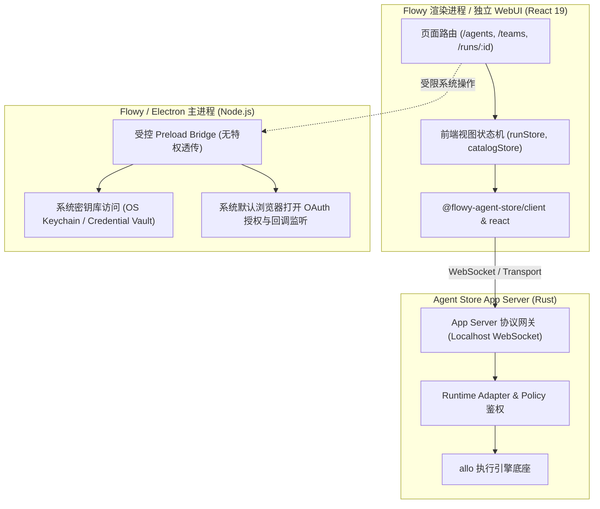
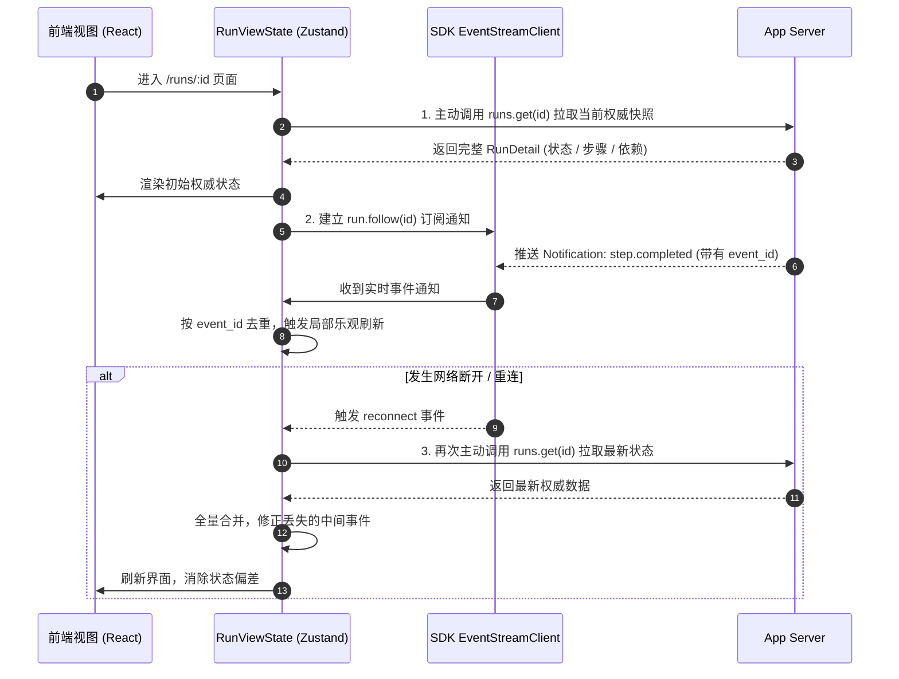
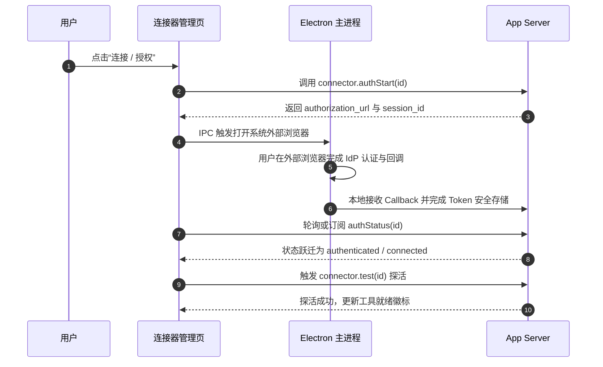
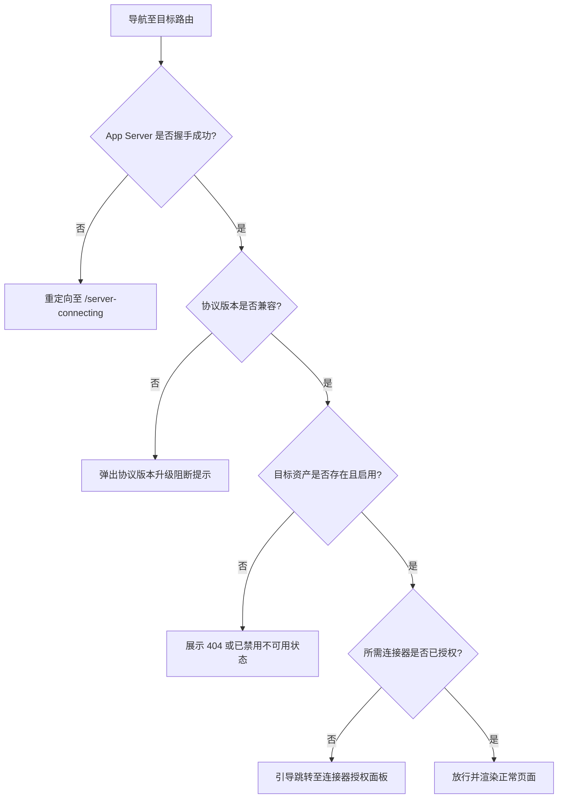

# Flowy / Agent Store Web 集成规格 · 技术方案

> 状态：🧊 架构基线（Phase 0；发版前可改，非冻结，见 `16-sdk-webui-site-priority-plan.zh.md` §7 决策 4）；Web/Flowy 待实现验证；发布阻断
> 日期：2026-08-26
> 前置：[`05-flowy-agent-store-app-server-protocol.md`](file:///c:/workspace/allo/docs/agent-store/05-flowy-agent-store-app-server-protocol.md)、[`06-connector-oauth-security.md`](file:///c:/workspace/allo/docs/agent-store/06-connector-oauth-security.md)、[`07-typescript-sdk.md`](file:///c:/workspace/allo/docs/agent-store/07-typescript-sdk.md)、[`10-public-contracts.md`](file:///c:/workspace/allo/docs/agent-store/10-public-contracts.md)
> 一句话原则：**Web/Flowy 渲染层必须且只能通过 TypeScript SDK 消费 App Server 公共契约，严禁直连底层 REST、内部 WebSocket 与 SQLite，严密隔离敏感凭据与操作系统原生接口**

---

## 1. 背景与核心痛点

WebUI 与 Flowy 桌面端是用户与专家、团队及连接器交互的统一视窗。在前端与底座集成时，必须防范以下系统性风险与痛点：

### 1.1 核心痛点分析

1. **渲染层越权访问底层**：如果前端页面直接调用 allo 底层的内部 REST API、订阅底层私有 WebSocket，或者直接读写本地 SQLite 数据库，不仅会造成前后端代码高度耦合，还会打破 App Server 的统一鉴权、审计与流控防线。
2. **事件流丢失引发 UI 假死或状态撕裂**：在长耗时的 Agent / Team 运行中，网络抖动或前端重渲染可能导致个别推送事件丢失。如果前端纯依赖“事件累加”维护状态，极易出现任务已结束但界面一直转圈的假死现象。
3. **敏感凭据在渲染层明文逗留**：若在前端页面、Redux/Zustand Store 或 LocalStorage 中存储 OAuth Token、API Key，任何 XSS 攻击或恶意的第三方页面注入都会导致用户密钥完全失窃。
4. **前端校验替代服务端授权的假安全**：仅通过“置灰或隐藏按钮”实现权限控制，未在服务端进行闭环鉴权，极易被直接伪造请求绕过。

---

## 2. 方案全景与架构拓扑

### 2.1 运行时集成架构与进程边界



### 2.2 核心禁止直连红线 (Strict Disallowed Boundaries)

Web/Flowy 渲染层代码中，**严禁出现**对以下目标的直接网络或代码访问：
- ❌ `allo` 内部 HTTP REST 接口与私有 UI WebSocket。
- ❌ 底层 SQLite 数据库文件（`nomifun.db`）。
- ❌ 底层 Rust Crate 的内部对象（`ExecutionParticipant`, `AgentExecution`）。
- ❌ 上游外部 MCP 服务的原生网络端点。
- ❌ 本地操作系统密钥链（Keytar / Secret Service）与明文凭据文件。

---

## 3. 详细设计 (按功能领域内聚)

### 3.1 页面信息架构与路由设计

```text
/agents                 -> 专家资产库（按分类/标签聚合，展示能力徽标与兼容状态）
/agents/:id             -> 专家详情页（绑定技能、可用连接器、模型推荐、启动运行入口）
/teams                  -> 专家团队资产库（协作模式、能力等级展示）
/teams/:id              -> 团队详情页（固定成员名册、Leader 角色定位、Planning 策略）
/skills                 -> 原子技能库（纯指令 / 受控执行说明）
/connectors             -> 连接器中心（安装、OAuth 授权状态、探活诊断）
/connectors/:id         -> 连接器详情与工具声明列表
/runs/:id               -> 运行工作台（Plan DAG、执行日志、事件时间线、产物下载）
```

- **详情页敏感信息脱敏**：列表与详情中只展示经过脱敏的能力摘要与兼容性状态，绝不暴露完整隐藏 System Prompt 或原始密钥。

---

### 3.2 运行工作台与 Plan DAG 可视化

运行工作台（Run Workspace）是观察任务执行的核心页面：

```text
┌────────────────────────────────────────────────────────────────────────┐
│ 运行状态栏：Run ID · 运行状态徽标 · 耗时 · [暂停] · [取消] · [重试]        │
├───────────────────────────────────┬────────────────────────────────────┤
│ 执行计划 DAG 拓扑视图              │ 当前步骤明细面板 (Step & Attempt)   │
│ - Step 节点状态 (pending/ready...)│ - 绑定参与者专家信息                 │
│ - 依赖拓扑连线                    │ - 实时模型回复输出                  │
│ - 局部并行分支                    │ - 工具调用参数与结果摘要            │
├───────────────────────────────────┴────────────────────────────────────┤
│ 时间线与产物区：规范事件日志 (Timeline) · 待审批卡片 (Approval) · 产物列表│
└────────────────────────────────────────────────────────────────────────┘
```

#### Plan DAG 渲染不变量
1. **依赖关系严格取自契约**：UI 必须根据服务端下发的 `depends_on` 数组构建图拓扑，严禁根据坐标或列表顺序猜测依赖。
2. **多版本修订历史保留 (Replan)**：当发生 Replan 时，UI 必须完整保留 `Plan v1`, `Plan v2` 历史版本选项卡，支持用户查看变更差异，禁止前端静默覆写破坏历史。

---

### 3.3 Timeline 事件消费与状态同步流水线

为解决网络波动导致的 UI 状态不一致，前端必须遵循**“弱通知触发刷新，终态权威回填”**原则：



#### 前端核心视图状态结构 (`RunViewState`)
```ts
export interface RunViewState {
  run: RunDetail | null;
  status: "loading" | "ready" | "stale" | "reconnecting" | "error";
  planRevisions: PlanRevision[];
  currentPlanRevisionId: string | null;
  stepsById: Record<string, StepView>;
  attemptsById: Record<string, AttemptView>;
  pendingApprovals: Approval[];
  artifacts: ArtifactSummary[];
  lastError?: PublicError;
}
```

---

### 3.4 连接器与 OAuth 交互模型

连接器在前端展示独立且完整的八态生命周期，避免模糊二元状态：
`installed ➔ configured ➔ authorization_required ➔ authenticated ➔ connected ➔ degraded ➔ error ➔ reauthorization_required`



- **零凭据经由原则**：全流程中，前端不接触 `code`、`client_secret` 或明文 `access_token`，只感知授权状态变化。

---

### 3.5 审批交互 (Approval) 与产物下载 (Artifact)

#### 1. 审批拦截卡片 (Approval Card)
- 触发高风险工具调用（如发送邮件、写外置文件、执行部署）时，前端弹出 Approval 卡片。
- 卡片仅展示：调用方角色、Connector/Tool 标识、脱敏参数摘要、副作用等级、过期倒计时。
- 用户点击“批准”或“拒绝”后，调用 `client.approvals.respond()` 提交决策；过期后自动标记 `approval_expired` 并禁用按钮。

#### 2. 受控产物下载 (Artifact Download)
- 前端下载文件必须携带 `artifact_id`, `run_id`, `workspace_id` 与防篡改 Digest。
- 绝不允许将用户本地绝对路径直接作为下载入参，一律通过 App Server 专属流式端点按相对路径与权限校验下发。

---

### 3.6 主进程与渲染进程严格职责划分

| 职责范畴 | Electron / Flowy 主进程 (Main) | React 渲染进程 (Renderer) |
|---|---|---|
| **网络与连接** | 负责启动守护 App Server 进程，建立 Localhost 通信环境。 | 通过 SDK 建立 WebSocket 客户端连接，订阅业务通知。 |
| **凭据与敏感数据** | 独占访问操作系统密钥库（Keychain），处理 OAuth Callback。 | 严格不落地明文密钥，仅持有会话级别的 AuthContext 引用。 |
| **外部能力交互** | 唤起外部默认浏览器，管理系统级窗口与原生通知。 | 渲染页面、表单、图表与工作台，提供纯粹的交互界面。 |
| **文件与工作区** | 处理原生文件选择器（Dialog），传递绝对路径给系统。 | 仅接收相对路径与 Workspace ID，绝不硬编码宿主绝对路径。 |

---

## 4. 前端安全准入与路由守卫 (Route Guards)

页面切换与动作触发前必须经过客户端路由守卫检查，但**前端守卫仅作为体验防御，绝不替代服务端的强鉴权**：



---

## 5. 验收测试用例 (TC-WEB)

> 本节契约对齐 `19-webui-codex-alignment.zh.md` §9 规范用例。

| 用例编号 | 场景与验证目标 | 核心断言与通过条件 |
|---|---|---|
| **TC-WEB-001** | Catalog 资产展示 | 正确渲染 Agent/Team 列表，展示名称、版本、能力徽标与三态兼容标签。 |
| **TC-WEB-002** | 详情页无凭据泄露 | 检查渲染进程 DOM、状态与网络请求，断言无任何明文 Secret 与系统 Prompt。 |
| **TC-WEB-003** | Run 启动表单提交 | 启动任务时只向 App Server 发送标准 `RunInput`，不包含前端本地拼装的 Prompt。 |
| **TC-WEB-004** | DAG 拓扑准确渲染 | 根据 `depends_on` 准确呈现依赖拓扑，节点状态变更实时体现在图元样式上。 |
| **TC-WEB-005** | 断线重连自愈 | 人为断开网络后重连，断言视图通过 `runs.get` 主动拉取并修复中间丢失的状态。 |
| **TC-WEB-006** | Replan 多版本回溯 | 模拟 Step 失败触发 Replan，验证界面呈现 v1 与 v2 历史计划并可对比查看。 |
| **TC-WEB-007** | 审批卡片交互闭环 | 弹出 Approval 卡片，点击“批准”后成功恢复执行，超时后按钮自动禁用。 |
| **TC-WEB-008** | OAuth 外部流程打通 | 点击连接正确唤起外部浏览器，授权完成后自动探活并点亮 Connected 徽标。 |
| **TC-WEB-009** | 产物安全下载 | 通过受控端点下载生成的报告，断言校验 Hash 成功且无路径遍历风险。 |
| **TC-WEB-010** | 路由守卫拦截 | 访问未安装或被禁用的专家页面，正确重定向并提示阻断原因，不产生控制台未捕获异常。 |

---

## 附录：原始技术底稿与历史归档 (Historical & Technical Reference Archive)

> **归档说明**：以下完整保留重构前的原始技术底稿、历次讨论与历史记录全文，供历史追溯、协议字段详细对照与技术审计。

---

# Flowy / Agent Store Web 集成规格

> 状态：架构基线（Phase 0；发版前可改，非冻结，见 `16-sdk-webui-site-priority-plan.zh.md` §7 决策 4）；Web/Flowy 待实现验证；发布阻断
> 日期：2026-08-26
> 前置：`05-flowy-agent-store-app-server-protocol.md`、`06-connector-oauth-security.md`、`07-typescript-sdk.md`、`10-public-contracts.md`
> 目标：定义 Web/Flowy 如何通过 SDK 使用 Agent Store，不直接依赖 allo 内部实现

## 1. 集成边界

```text
Flowy/Web UI
    ↓ @flowy-agent-store/client / @flowy-agent-store/react
TypeScript SDK
    ↓ App Server Protocol
Agent Store App Server
    ↓ Runtime Adapter
allo Runtime
```

Web/Flowy 不得直接访问：

```text
allo 内部 REST
allo UI WebSocket
allo 数据库
Execution/Participant 内部对象
MCP 上游服务
安全凭据存储
```

UI 展示的是 Agent Store 公共模型：

```text
Agent
Team
Skill
Connector
Run
Plan
Step
Attempt
Event
Artifact
Approval
```

这里的 `Agent` 指 Agent Store AgentDefinition/allo Preset，不是 Claude Code、Codex 等 Runtime Agent 实例。Runtime Agent 由 App Server 根据已解析的 Preset 和运行策略选择，Web/Flowy 不直接管理其内部身份。

## 2. 页面信息架构

### 2.1 Catalog

```text
/agents
/agents/:id
/teams
/teams/:id
/skills
/connectors
/connectors/:id
```

Catalog 页面必须显示：

```text
名称
版本
来源
兼容性状态
启用/禁用状态
所需权限摘要
可运行能力
最后验证时间
```

不得在列表中显示真实凭据或完整隐藏 Prompt。

### 2.2 Agent Detail

Agent 详情包括：

```text
身份与描述
版本与来源
绑定 Skill
可用 Connector 工具摘要
模型摘要
权限与风险摘要
兼容性报告
运行入口
```

“运行 Agent”按钮只提交 App Server 请求，不在浏览器本地拼装 Agent Prompt。

### 2.3 Team Detail

Team 页面必须明确区分：

```text
Team Definition
V1 Runtime Capabilities
成员名册
Leader（规划角色）
成员能力摘要（脱敏）
规划策略
并发限制
工具与权限摘要
兼容性状态
```

V1 Team 能力展示：

```text
固定成员
Planning Context 驱动 planned DAG
局部并行
retry
replan
事件
Artifact
```

未实现能力不得显示为已启用：

```text
Mailbox
成员自主认领
成员直连消息
长期成员会话
嵌套 Team
```

### 2.4 Run Launch

单 Agent 和 Team 共用启动流程，但 Team 额外展示：

```text
Team 成员预览
Leader（规划角色）
Planning Context 摘要
planning policy
max parallel
workspace
Connector 权限摘要
```

提交前显示有效配置摘要：

```text
Preset/Definition version
Skill versions
Connector versions
workspace
approval policy
effective max parallel
```

此摘要是用户确认依据，不包含真实凭据。

### 2.5 Run Workspace

```text
/runs/:id
/runs/:id/plan
/runs/:id/timeline
/runs/:id/artifacts
/runs/:id/approvals
```

TeamRun 详情页应展示本次运行的 `planning_context_digest`，但不展示 Planning Context 正文或成员完整 Prompt。

Run 页面布局：

```text
┌───────────────────────────────────────────┐
│ Run Header：状态 / Team / 取消 / 暂停      │
├───────────────┬───────────────────────────┤
│ Plan / DAG     │ 当前 Step / Attempt        │
│               │ Agent 输出 / 工具摘要       │
├───────────────┴───────────────────────────┤
│ Timeline / Events / Approvals / Artifacts  │
└───────────────────────────────────────────┘
```

## 3. Plan/DAG 展示

DAG 节点至少显示：

```text
step_id
标题/目标
绑定 Agent/Participant
状态
依赖
当前 Attempt
开始/结束时间
失败原因摘要
输出 Artifact
```

状态使用公共模型：

```text
pending
ready
in_progress
completed
failed
cancelled
```

禁止 UI 根据节点位置猜测依赖；依赖必须来自 App Server 的结构化字段。

Plan Revision 必须保留历史：

```text
Plan v1
Plan v2（replan）
Plan v3（replan）
```

用户可以查看差异，但不能从 UI 直接修改历史 Plan。

## 4. Timeline 与事件消费

UI 通过 SDK 的 `run.follow` 订阅事件：

```text
进入 Run 详情页
    ↓
run/get 拉取持久化状态
    ↓
订阅实时通知（尽力而为）
    ↓
收到通知 → 重新 run/get 合并
    ↓
按 event_id 去重展示
    ↓
断线重连后重新 run/get 对齐
```

UI Store 不应只保存当前屏幕可见事件。至少保留：

```text
run status
plan revisions
step status
attempt status
approval status
artifact refs
last error
```

高频 Token 流只作为可选展示数据，不作为公共状态持久化的唯一依据。

## 5. Connector 页面与 OAuth

### 5.1 Connector Detail

显示：

```text
Connector 名称和版本
类型
来源
安装状态
配置状态
授权状态
连接状态
工具 allowlist
风险等级
最后 Probe 时间
兼容性状态
```

状态分开显示：

```text
installed
configured
authorization_required
authenticated
connected
degraded
error
reauthorization_required
```

### 5.2 OAuth 交互

```text
点击连接
    ↓
SDK connector.auth.start
    ↓
打开 authorization_url
    ↓
主进程/服务端处理 Callback
    ↓
UI 轮询或订阅 auth status
    ↓
显示账号摘要与 connected 状态
    ↓
connector.test / Probe
```

UI 不接收或保存：

```text
Authorization Code
Access Token
Refresh Token
Client Secret
完整 Authorization Header
```

OAuth 失败应显示可操作原因：

```text
authorization_required
scope_insufficient
issuer_mismatch
resource_mismatch
callback_timeout
token_refresh_failed
connector_probe_failed
```

## 6. Approval UI

Approval 卡片必须显示：

```text
请求来源 Run/Step/Agent
Connector 和 Tool
脱敏参数摘要
副作用等级
目标资源摘要
过期时间
批准/拒绝按钮
```

不显示：

```text
Token
完整敏感参数
不必要的系统 Prompt
内部数据库 ID
```

批准只是一次具体操作的授权。服务端仍需重新计算有效策略和参数绑定。

## 7. Artifact UI

Artifact 列表：

```text
名称
类型
大小
sha256
来源 Run/Step
创建时间
读取/下载操作
```

浏览器只通过 App Server 的 Artifact API 获取内容，不能把任意本地路径传给服务端。

下载前必须校验：

```text
artifact_id
run_id
workspace_id
权限
文件 digest
```

## 8. Flowy 集成方式

### 8.1 主进程职责

Flowy/Electron 主进程负责：

- 启动或连接本地 App Server；
- 配置 WebSocket Transport（V1 不含 stdio，见 `16-sdk-webui-site-priority-plan.zh.md` §7 决策 2）；
- 处理 OAuth 打开浏览器与回调；
- 访问操作系统安全存储；
- 向 Renderer 暴露最小受控 API；
- 处理窗口、通知和系统级生命周期。

### 8.2 Renderer 职责

Renderer 负责：

- 使用 SDK Catalog；
- 启动和观测 Run；
- 呈现 Plan/Timeline/Artifact/Approval；
- 展示 Connector/OAuth 状态；
- 不保存凭据，不直接调用外部 Connector。

### 8.3 页面与 SDK 映射

| 页面能力 | SDK 方法 |
|---|---|
| Agent Catalog | `client.agents.list/get` |
| Team Catalog | `client.teams.list/get` |
| Agent 运行 | `client.runs.agent` |
| Team 运行 | `client.runs.team` |
| Run 状态 | `client.runs.get` |
| Timeline | `client.runs.follow/events` |
| 暂停/恢复/取消 | `client.runs.pause/resume/cancel` |
| Retry/Replan | `client.runs.retry/replan` |
| Artifact | `client.artifacts.list/get` |
| Approval | `client.approvals.respond` |
| OAuth | `client.connectors.authStart/authStatus/logout` |

## 9. 前端状态模型

建议按资源拆分 Store：

```text
catalogStore
runStore
planStore
eventStore
artifactStore
approvalStore
connectorStore
sessionStore
```

Run Store 的最小结构：

```ts
interface RunViewState {
  run: RunDetail | null;
  status: "loading" | "ready" | "stale" | "reconnecting" | "error";
  lastEventId?: string; // 通知去重辅助，可选
  planRevisions: PlanRevision[];
  stepsById: Record<string, StepView>;
  attemptsById: Record<string, AttemptView>;
  pendingApprovals: Approval[];
  artifacts: ArtifactSummary[];
  lastError?: PublicError;
}
```

Store 以服务端持久化状态为准，事件通知只触发刷新。呈现 replan 相关变化时，不能只覆盖当前 DAG，必须保存历史 Plan Revision。

## 10. 权限与路由守卫

前端按钮可根据 capability 隐藏或禁用，但安全控制必须在 App Server/Runtime 重做。

路由守卫至少覆盖：

```text
未初始化
协议版本不兼容
资源不存在
资源 disabled
兼容性 blocked
无运行权限
Connector 未授权
Workspace 不可用
```

“按钮不可见”不等于“操作安全”。

## 11. 验收与实现顺序

Web/Flowy 测试用例的唯一正文位于 `19-webui-codex-alignment.zh.md` §9（TC-WEB / TC-SEC），本文件只定义页面与主进程边界。实现顺序由路线图统一管理：

```text
SDK Provider → Catalog → Run Workspace → Plan/Timeline → Approval/Artifact → Connector 状态
```

必须通过 `TC-WEB-001` 至 `TC-WEB-010`；页面不得自行推断状态或绕过 App Server 安全校验。
