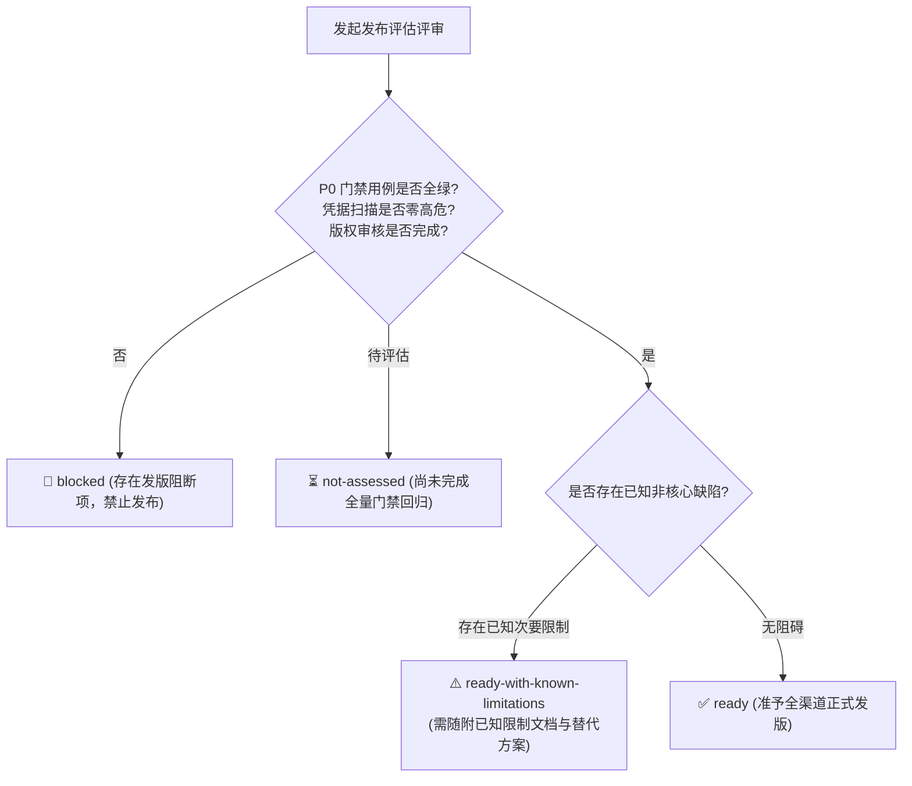

# Agent Store V1 发布准入与风险门禁 · 技术方案

> 状态：📋 发布门禁体系已建立；当前评估状态：`blocked`（待 P0 全量回归）；发布阻断
> 日期：2026-08-26（更新：2026-09-15）
> 前置：[`00-architecture-decision.md`](file:///c:/workspace/allo/docs/agent-store/00-architecture-decision.md)、[`10-public-contracts.md`](file:///c:/workspace/allo/docs/agent-store/10-public-contracts.md)、[`13-p0-execution-plan.md`](file:///c:/workspace/allo/docs/agent-store/13-p0-execution-plan.md)
> 一句话原则：**以 Gate 1~5 严格质量门禁与零凭据泄露为发布红线，严格区分“功能已实现”与“门禁已验证”，测试用例不全绿绝不放行**

---

## 1. 背景与核心痛点

Agent Store 是一个跨 Rust 后端引擎、App Server 协议网关、多端 TypeScript SDK 以及 Web 交互界面的复杂系统。在临近发版时，若缺乏结构化的发布准入门禁，将面临以下毁灭性风险：

### 1.1 核心痛点分析

1. **“代码写完”被等同于“可以发版”**：开发者常把某个特性的代码合并误认为可以立即对外发版，而忽视了回归测试是否全绿、边界异常（如断网重连、重启恢复）是否经过实测。
2. **凭据与敏感数据带病上线**：调试期打印的日志、前端状态或错误返回中可能残留用户真实的 Access Token 或 API Key，一旦发布将导致用户敏感数据失窃。
3. **版权不合规资源泄露至公网**：外部爬取或未确认商业授权的专家与技能资产若被打包进默认公开市场，将面临严重的法律侵权风险。
4. **失败无安全回滚路径**：新版本安装或升级失败时，若直接把数据库回滚做成破坏性全表清空，会导致历史运行任务和产物直接丢失。

---

## 2. 方案全景与准入判定模型

### 2.1 四级发布结论等级体系

发布评审团队依据自动化测试报告与安全扫描证据，对候选版本给出的唯一合法结论：



| 结论等级 | 判定依据与准入条件 | 操作与分发许可 |
|---|---|---|
| `ready` | P0 测试全部 PASS，凭据泄露扫描零检出，来源版权 100% 确认。 | 准许全量发布至 npm 与 GitHub Releases。 |
| `ready-with-known-limitations` | P0 核心链路全绿，但存在非阻塞限制（如某类复杂 OAuth 暂未支持）。 | 必须随附《已知限制清单》（含替代路径），准许受控发布。 |
| `blocked` | 存在任一 P0 门禁失败、发现明文凭据泄漏或存在未授权版权风险。 | **绝对禁止发布**，研发团队立刻进入阻塞修复流。 |
| `not-assessed` | 测试套件尚未执行完毕，或仅有局部单测读数而无端到端证据。 | 等价于 `blocked`，禁止提前宣称就绪。 |

---

## 3. 详细设计：五大 P0 发布门禁 (Gate 1 ~ Gate 5)

发布前必须逐项核对并机械通过以下 5 道硬性门禁，任一不满足即判定为 `blocked`：

### 3.1 Gate 1：Runtime 执行引擎门禁
- `AgentDefinition` 能成功物化为 `ResolvedPresetSnapshot` 并注入 `ExecutionParticipant`。
- Runtime Adapter 绝对不泄露 allo 内部 Session UUID 或数据库主键。
- 单 Agent 异步 Run 的完成、失败与取消状态机准确落盘。
- TeamRun 正确物化 5 人固定 Participant 池，Planning Context 绝不包含成员私有 Prompt 或凭据。
- 引擎意外退出重启后，未完成的 Run 必须如实置为 `recovery_required` 或 `failed`，严禁伪装为 `completed`。
- **关联测试**：`TC-TEAM-001 ~ 008` 与 `TC-RT-001 ~ 010` 必须全部 PASS。

### 3.2 Gate 2：Importer 导入与来源门禁
- 来源目录的相对路径校验通过，完全拦截 `../` 目录逃逸与外部符号链接攻击。
- 同身份不同哈希提交触发 Digest 冲突阻断，相同哈希返回幂等结果。
- 不支持的组件（如 Hook/LSP/Scripts）如实标记为 `manual-review`，禁止静默丢弃。
- 外部 MCP 凭据 Schema 正确生成，明文默认值绝不存入快照或数据库。
- **关联测试**：`TC-IMP-001 ~ 017` 必须全部 PASS。

### 3.3 Gate 3：App Server 协议与 SDK 门禁
- Localhost WebSocket 连接握手成功，协议指纹严格一致，版本协商通过。
- 弱通知丢失或乱序不影响最终一致性，SDK 具备断线重连主动权威查询机制。
- 幂等键防重生效，相同幂等键不产生重复 Run。
- 公共错误码分类清晰，错误文本无敏感堆栈与物理路径泄露。
- **关联测试**：`TC-API-001 ~ 004` 与 `TC-SDK-001 ~ 006` 必须全部 PASS。

### 3.4 Gate 4：Connector 与 OAuth 门禁
- 所有公开暴露的 MCP 工具强制带有 `connector__<slug>__<tool>` 命名空间前缀。
- PKCE S256 与 Localhost Loopback 回调握手全链路跑通。
- 传输层请求时按引用实时注入 Token，401 触发互斥锁并仅允许单次刷新重试。
- 必须经过真实网络探活 Probe 成功后，连接器方可跃迁为 `connected`。
- **关联测试**：`TC-CONN-001 ~ 002` 与 `TC-OAUTH-001 ~ 004` 必须全部 PASS。

### 3.5 Gate 5：系统安全与版权合规门禁
- 自动化代码库与日志扫描零明文凭据检出，敏感字段均为 `[REDACTED]`。
- 高风险破坏性操作（写文件、删数据、发消息）必须具备 Approval 审批拦截。
- CLI / STDIO 进程限制在严格参数白名单与工作区沙箱内，禁止任意 Shell 命令执行。
- 标记为 `pending-legal-review` 的资产绝不进入公开市场或默认打包产物。

---

## 4. 来源版权分级与脱敏发布证据包

### 4.1 来源版权分类标准

```text
approved-for-distribution   -> 商业版权明确，允许全渠道分发与公开上架
internal-evaluation-only    -> 仅限内部测试验证，严禁随安装包公开发布
pending-legal-review        -> 版权归属审核中，默认隔离阻断
blocked                     -> 存在明确侵权或合规风险，永久禁止入库
```

### 4.2 脱敏发布证据包规范 (Evidence Bundle)

每次正式发版必须在构建归档中沉淀一份不可篡改的证据包：

```text
evidence-bundle/
├── release-manifest.json          # 记录产品版本、Rust 引擎 Commit、协议指纹
├── protocol-schema.json           # 机器可校验的 App Server Protocol Schema
├── import-report.json             # 真实市场导入覆盖率与组件统计报告
├── compatibility-report.json      # 三态兼容性聚合判定汇总
├── p0-test-report.json            # 全量 P0 自动化测试套件执行明细 (必须 0 failed)
├── security-scan-report.json      # 静态代码与日志凭据泄露零检出扫描证明
├── oauth-integration-report.json  # 真实 OAuth 探活日志 (脱敏)
└── known-limitations.md           # 对外发布的已知限制说明书
```

---

## 5. 已知核心风险登记与安全回滚原则

### 5.1 核心风险与拦截策略

| 风险类别 | 触发条件 | 发布决策与处置策略 |
|---|---|---|
| **Agent 桥接不完整** | Preset 无法正确创建会话或工具缺失 | 立即阻断对应 Agent/Team 上线。 |
| **Team 规划发散** | DAG 依赖成环、节点调度卡死或 Replan 失败 | 立即阻断 Team 功能发版。 |
| **OAuth 虚假可用** | 登录成功但探活或请求时注入失败 | 连接器强制置为 partial，禁止点亮 connected。 |
| **未完成 Run 状态失真** | 进程崩溃重启后未标记不可恢复状态 | 立即阻断发版，修复状态投影。 |
| **任意进程执行漏洞** | CLI/Hook 绕过白名单执行了任意命令 | 立即全量阻断，相关组件默认强行停用。 |
| **凭据泄漏** | 日志或错误响应出现明文 Secret | 立即取消发布，重置被泄露的密钥。 |

### 5.2 安全回滚原则 (Rollback Invariants)

1. **版本回退不删数据**：发布失败回滚至旧版本时，历史的 Run、Step、Attempt 与生成的文件 Artifact 必须完整保留，**严禁使用破坏性清库脚本**。
2. **多租户隔离不受牵连**：某一个连接器回滚或重新授权，决不能影响其他用户已绑定的凭据与连接。
3. **不可变快照保护**：新版本安装失败时，底层数据库强制回滚新装部分，旧版本快照保持不可变且持续可用。

---

## 6. 发布签署清单与当前评估快照

### 6.1 终审发布签字清单 (Sign-Off Checklist)

```text
[ ] 架构基线与当前目录文档已全量对齐
[ ] V1 核心交付范围与延期特性已明确公示
[ ] Gate 1 ~ Gate 5 全部 P0 测试用例 100% PASS (零失败)
[ ] 静态代码与日志扫描无明文 Token / 凭据泄露
[ ] 真实环境下的 OAuth 注入与探活 Probe 成功
[ ] 来源资产版权 100% 确认无侵权争议
[ ] 发布脱敏证据包已打包归档
[ ] 离线与在线安全回滚路径已演练通过
```

### 6.2 当前准入评估快照 (截至 2026-09-15)

```text
评估结论: blocked (等价于 not-assessed，P0 用例尚未全量回归闭环)
评估时间: 2026-09-04（2026-09-15 增补安装面实操记录，门禁结论未变）
阻塞原因列表:
  - Gate 1 (Runtime): TC-RT-001 通过；TC-RT-002/005/006/009/010 待全量跑通。
  - Gate 4 (Connector): 引擎层运行证据已留存，全量协议面用例需集中重测。
  - Gate 2 (Importer): 基础导入用例通过，远程源已实现，但全量 P0 门禁需整体签署。
  - Gate 3 (App Server): 核心功能具备，TC-API-002 (幂等) / TC-API-004 (ID隔离) 待签署。
  - Gate 5 (安全与版权): 最终发布前的全仓静态自动化脱敏扫描尚未执行。
```

---

## 附录：原始技术底稿与历史归档 (Historical & Technical Reference Archive)

> **归档说明**：以下完整保留重构前的原始技术底稿、历次讨论与历史记录全文，供历史追溯、协议字段详细对照与技术审计。

---

# Agent Store V1 发布准入与风险清单

> 状态：发布门禁已定义；当前结论 blocked（评估快照见 §9）
> 日期：2026-08-26
> 更新：2026-09-09 —— §9 快照内 TC-SDK-001 矛盾已消（改为 spawn + 回环 WS，与 `12` 非目标一致）；其余门禁结论未变
> 更新：2026-09-15 —— §9 改为**显式声明为带日期的评估快照**；订正「GitHub/Git/HTTP 市场源未实现」（Phase B 已实现，但 P0 门禁仍未执行）；登记本批安装器改动**不改变**任何门禁结论（P0 未执行项原样保留）
> 适用范围：`docs/agent-store/` 中的 Agent Store 当前方案文档
> 前置：`00-architecture-decision.md` 至各线规范内的「验收用例」章节（`02` §13 · `05` §14 · `06` §11 · `13` §10–§13 · `19` §9）

## 1. 发布结论等级

```text
ready
ready-with-known-limitations
blocked
not-assessed
```

只有在 P0 测试全部通过、凭据安全检查通过、来源审核完成后，才能标记 `ready`。

`ready-with-known-limitations` 必须同时列出：

```text
限制能力
影响范围
替代路径
预计后续处理阶段
是否允许默认启用
```

## 2. 发布范围引用

V1 的范围和延期能力以 `00-architecture-decision.md` 为准；公共状态、事件、planning 和错误码以 `10-public-contracts.md` 为准。本文件只定义发布判定、门禁、证据、风险和回滚，不重复范围清单。

延期能力必须在公共 API 中使用明确 capability/status 表达，不能返回“支持但运行时失败”的模糊状态。

## 3. P0 发布门禁

以下门禁任一失败，发布结论必须为 `blocked`；P0 线要求的用例编号集合见 `13-p0-execution-plan.md` §12：

### Gate 1：Runtime

- allo Runtime Agent/Participant 实际创建链路通过；
- AgentDefinition 能解析为 Preset/ResolvedPresetSnapshot，并写入 ExecutionParticipant；
- Runtime Adapter 不泄露 allo 内部 ID；
- 单 Agent Run 完成、失败和取消状态正确；
- AgentTeam 固定成员池创建成功；
- Leader 与每个成员独立解析为 Preset/ResolvedPresetSnapshot；
- Planning Context 只含 Leader 规划指令、脱敏成员能力摘要和 Team 策略，不含完整成员 Prompt 或凭据；
- 每个 Step 使用其 Participant 自己的 Prompt Snapshot；
- Planning Context 驱动的 planned DAG、依赖、局部并行、retry、replan 通过；
- `13-p0-execution-plan.md` §10 中 TC-TEAM-001~008 全部 PASS；
- Runtime 重启后保留事件，并将未完成 Run 明确标记为不可恢复或需用户重新启动。

### Gate 2：Importer 与来源

- 有效 Plugin 可生成不可变 PluginSnapshot；
- 5 个 `software-company` Agent 和 1 个 Team 导入结果正确；
- 路径遍历、符号链接逃逸和 digest 冲突被阻断；
- 不支持组件不会静默丢弃；
- 版权状态和来源 digest 被保存；
- 凭据值没有进入 Snapshot。

### Gate 3：App Server 与 SDK

- initialize、AuthContext 和协议版本协商通过；
- Catalog、Agent Run、Team Run、Event、Artifact、Approval API 通过；
- WebSocket Transport 通过（V1 交付不含 stdio，见 `16-sdk-webui-site-priority-plan.zh.md` §7 决策 2）；
- run/get 与 run_result 返回一致的持久化状态；尽力而为通知丢失不影响一致性；event 去重通过；
- 幂等键不会重复创建 Run；
- 错误使用稳定 code，不泄露敏感信息；
- `05-flowy-agent-store-app-server-protocol.md` §14 中 TC-API-001~004、TC-SDK-001~003 全部 PASS；其中 team/run 必须验证 Planning Context 摘要和成员 Prompt 隔离。

### Gate 4：Connector 与 OAuth

- Connector 工具命名空间和 allowlist 通过；
- 标准 PKCE Loopback OAuth 通过；
- issuer、resource、state、redirect_uri 校验通过；
- Token 仅在请求时注入；
- 401 只允许刷新并重试一次；
- 刷新失败进入 `reauthorization_required`；
- Connector Probe 通过后才能显示 `connected`；
- `06-connector-oauth-security.md` §11 中 TC-CONN-001~002、TC-OAUTH-001~004 全部 PASS。

### Gate 5：安全

- 凭据泄露扫描无高危结果；
- 高风险副作用需要 Approval；
- CLI/STDIO 不允许任意命令、参数、工作目录或环境变量覆盖；
- Hook/bin/script 默认不执行；
- Artifact 不允许任意路径读取；
- 审计记录已脱敏；
- `pending-legal-review` 资源不能公开分发。

## 4. 发布证据包

每次发布必须保存一份脱敏证据包：

```text
release-manifest.json
protocol-schema.json
import-report.json
compatibility-report.json
p0-test-report.json
security-scan-report.json
oauth-integration-report.json
source-review-report.json
known-limitations.md
```

证据包必须包含：

```text
产品版本
allo Runtime 版本
App Server Protocol 版本
SDK 版本
测试环境摘要
输入来源 digest
P0 用例统计
失败/阻塞用例
安全扫描结果
来源审核结论
```

不得包含：

```text
API Key
Access Token
Refresh Token
Password
Client Secret
完整 Authorization Header
连接字符串中的秘密部分
未脱敏的工具参数
```

## 5. 来源和版权准入

来源资源分为：

```text
approved-for-distribution
internal-evaluation-only
pending-legal-review
blocked
```

`pending-legal-review` 和 `internal-evaluation-only` 资源允许用于隔离测试或内部 Spike，但不得：

- 进入公开 Marketplace；
- 进入默认安装包；
- 默认启用自动更新；
- 在产品宣传中声明为可分发能力；
- 与其他用户账户同步。

来源审核必须记录：

```text
source_id
source_type
source_url_or_origin_summary
content_digest
license_or_permission_status
reviewed_at
reviewer_or_process
restrictions
```

## 6. 已知风险登记

| 风险 | 触发条件 | 发布处理 |
|---|---|---|
| Agent 运行桥接不完整 | AgentDefinition 无法解析为 Preset/ResolvedPresetSnapshot，或无法由 Runtime Agent 执行 | 阻断 Agent/Team 发布 |
| Team planned 不稳定 | DAG 物化、依赖或 replan 失败 | 阻断 Team 发布 |
| OAuth 只能登录不能调用 | Transport 注入或 Probe 失败 | Connector 标记 partial，不得显示 connected |
| 未完成 Run 状态不可判 | 重启后状态或终态丢失 | 阻断发布；先修复状态持久化与标记 |
| 任意进程执行 | Hook/bin/script/CLI 可绕过策略 | 阻断对应组件，默认不启用 |
| 凭据泄露 | 日志、事件、Prompt 或 Renderer 出现敏感值 | 立即阻断并清理证据 |
| 来源授权不明 | 版权或分发许可未确认 | 标记 pending-legal-review，禁止公开分发 |
| allo 内部 API 变更 | Adapter 或 UI 私有接口变化 | 通过 App Server contract tests 发现并阻断升级 |

## 7. 回滚要求

发布前必须验证：

- Catalog 可选择上一版 Definition；
- 新版本导入失败不会覆盖旧 Snapshot；
- 正在运行的 Run 继续使用已冻结版本；
- SDK 协议不兼容时能明确拒绝；
- Connector 凭据删除和重新授权不会影响其他 Principal；
- 失败发布可以禁用新版本而不删除历史 Run 和 Artifact。

回滚不得使用破坏性数据库重置或删除审计记录的方式完成。

## 8. 发布签字清单

```text
[ ] 架构基线与当前目录文档已同步
[ ] V1 范围与延期能力已确认
[ ] P0 测试全部 PASS
[ ] BLOCKED/FAIL 用例已有处理结论
[ ] Runtime Adapter 证据已保存
[ ] Importer/Catalog 证据已保存
[ ] App Server contract tests 已通过
[ ] SDK Node/Browser 测试已通过
[ ] Web/Flowy 端到端测试已通过
[ ] OAuth 注入、刷新、Probe 已通过
[ ] 凭据泄露扫描已通过
[ ] Tool Policy/Approval/审计已通过
[ ] 来源版权和分发状态已确认
[ ] 发布证据包已脱敏
[ ] 回滚路径已验证
[ ] 已知限制已对外记录
```

## 9. 当前准入判断

> **本节是一份带日期的评估快照（assessment snapshot），不是门禁结果。** 下面的
> `assessed_at` 是这份快照**最后一次被重新评估**的日期；其中的结论只在该日期成立，
> 更新它之前必须重新执行测试总索引列出的用例。文中出现的「已通过」是**当时**的
> 证据读数，不代表今天的 HEAD。

本文档本身不替代实际测试。以下为截至 2026-08 迭代（Importer/Phase 1 落地后）的如实快照；更新前必须重新执行测试总索引列出的用例：

```text
release_status: not-assessed（P0 未全过，仍等价 blocked；2026-09-04 增量快照）
assessed_at: 2026-09-04（评估快照，非门禁结果；2026-09-15 只补了一条事实订正与一条本批登记，未重跑门禁）
blocking_items:
  - Gate 1（Runtime）：TC-RT-001 已通过（单 Agent 真实 Run，`13-p0-execution-plan.md` §14）；
    TC-RT-002/005/006/009/010 未执行
  - Gate 4（Connector/OAuth：登录注入、401 刷新、重试、探针）：OAuth 运行证据已留存（`06-connector-oauth-security.md` §13），TC-CONN/TC-OAUTH 其余用例未全量执行
  - Gate 2（Importer）：TC-IMP-001~009 已通过（`02-codebuddy-workbuddy-import-spec.md` §14）；
    GitHub/Git/HTTP 市场源**已实现**（Phase B：`market_source.rs` 的 git2 浅克隆 /
    `reqwest` 条件抓取 + `market_fetch.rs` 的 staging→promote）；但 P0 门禁**未执行**
    （本项仍 open）
  - Gate 3（App Server）：initialize/版本协商/store 与 run 查询一致已有真机实证（smoke --real + A1）；
    TC-API-002（幂等重放）/TC-API-004（公共 ID 隔离）未执行；TC-SDK-001 已修订为 spawn + 回环 WS，与 `12` 非目标一致（见 `13-p0-execution-plan.md`）
  - Gate 5（安全扫描与来源审核）：未执行
  - V1 默认不启用：Hook/LSP/bin/scripts 执行、跨市场依赖
  - 2026-09-15（本批）**不改变**上面的门禁结论：安装器五动词改为真正释放 /
    移动运行时产物并回报结构化 `outcomes`、`store/install-entry` 版本感知、
    指纹 bump 到 `2026-09-15`——这些是**能力实现**，不是**门禁证据**。
    对应的 P0 门禁（TC-API-002 / TC-API-004、TC-CONN、TC-OAUTH、Gate 5）
    **仍未执行**，`release_status` 仍为 `not-assessed`
```

签署清单（上文 §8）仍全部未勾选；只有 P0 测试全部通过、凭据安全检查通过、来源审核完成后才能标记 `ready`。
