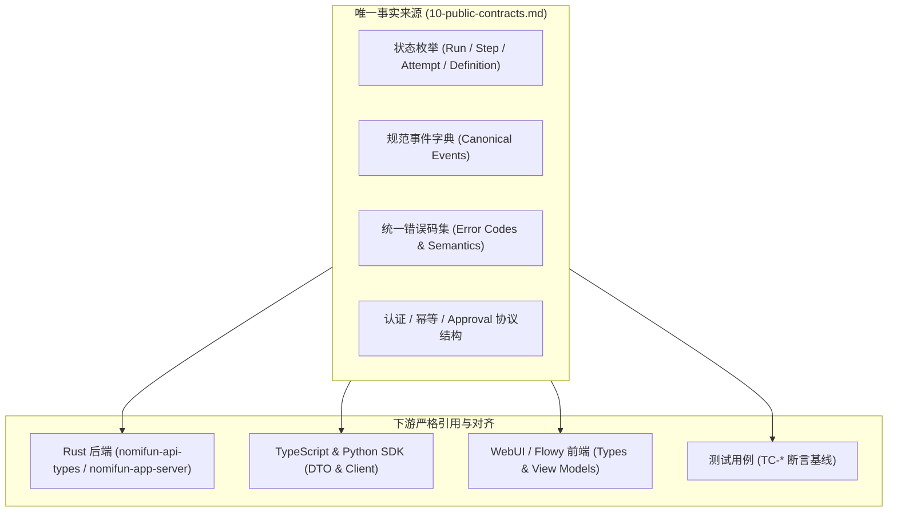
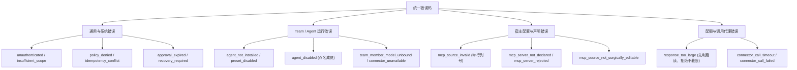

# Agent Store 公共契约索引 (Public Contracts) · 技术方案

> 状态：🧊 公共契约基线（Phase 0；发版前可改，非冻结，见 `16-sdk-webui-site-priority-plan.zh.md` §7 决策 4）；实现待验证
> 日期：2026-09-11（更新：2026-09-28）
> 前置：[`00-architecture-decision.md`](file:///c:/workspace/allo/docs/agent-store/00-architecture-decision.md)、[`01-domain-model.md`](file:///c:/workspace/allo/docs/agent-store/01-domain-model.md)、[`05-flowy-agent-store-app-server-protocol.md`](file:///c:/workspace/allo/docs/agent-store/05-flowy-agent-store-app-server-protocol.md)
> 一句话原则：**跨文档状态、事件、规划、认证、幂等与错误码的唯一事实来源；只定义公共语义与序列化名称，屏蔽底层私有实现，敏感字段零泄露**

---

## 1. 背景与核心痛点

Agent Store 由 Rust 后端引擎、App Server 协议层、TypeScript/Python SDK、CLI 以及 React WebUI 共同组成。如果没有一份集中的公共契约定义，极易出现以下系统性问题：

### 1.1 核心痛点分析

1. **跨层枚举定义漂移**：前端、协议层与 Rust Crate 各自硬编码状态字符串（例如有的写 `running` 有的写 `in_progress`，或者大小写不一致），导致联调期因字符串不匹配引发隐蔽 Bug。
2. **协议入参语义发散**：例如在 `team/run` 中，若允许客户端随意传入未经约束的 Planning 参数，会破坏服务端配置的成员池隔离与权限边界。
3. **截断与静默错误隐患**：在返回大载荷（如连接器 Schema 或技能文本）时，直接做半载荷截断会导致客户端反序列化崩溃；在错误处理中将上游工具的业务报错与网络基础设施失败混淆，会导致调用方无法正确制定重试策略。
4. **内部私有实现泄露**：底层数据库自增 ID、进程 Session UUID 或明文密钥暴露至公共错误与事件中，破坏系统的封装性与安全性。

---

## 2. 方案全景与契约拓扑

### 2.1 契约唯一事实来源拓扑



### 2.2 跨文档权威优先级约定

- **字段与枚举名称**：以本文档（`10-public-contracts.md`）为唯一权威。
- **实体概念与领域模型**：以 [`01-domain-model.md`](file:///c:/workspace/allo/docs/agent-store/01-domain-model.md) 为准。
- **Runtime 执行细节与状态映射**：以 [`04-flowy-agent-store-runtime-adapter.md`](file:///c:/workspace/allo/docs/agent-store/04-flowy-agent-store-runtime-adapter.md) 为准。
- **凭据与 OAuth 安全规则**：以 [`06-connector-oauth-security.md`](file:///c:/workspace/allo/docs/agent-store/06-connector-oauth-security.md) 为准。

---

## 3. 核心契约详细规范 (按领域内聚)

### 3.1 核心状态枚举字典

#### 执行层状态枚举
```text
RunStatus:
  queued | starting | running | paused | completed | failed | cancelled | recovery_required

StepStatus:
  pending | ready | in_progress | completed | failed | cancelled

AttemptStatus:
  created | running | completed | failed | cancelled | stale
```

#### 资产与兼容性状态枚举
```text
DefinitionStatus:
  draft | imported | validated | enabled | disabled | superseded

SemanticStatus:
  compatible | compatible-with-adapter | manual-review | unsupported | pending-legal-review

RuntimeStatus:
  not-verified | adapter-verified | runtime-verified | release-eligible

DistributionStatus:
  local-only | installable | public
```

- **V1 核心执行拓扑**：严格为 `PlanRevision ➔ Step ➔ Attempt` 三层结构。Task、Shared Task List、Mailbox 不属于 V1 公共对象。

---

### 3.2 规范事件字典与信封规范

系统对外承诺的标准事件流由 18 个规范事件组成：

```text
run.started          run.paused          run.completed       run.failed          run.cancelled
plan.created         plan.revised
step.ready           step.started        step.completed      step.failed
attempt.started      attempt.completed   attempt.failed
approval.required    artifact.created
tool.call.started    tool.call.completed
```

#### 标准事件信封 (Event Envelope)
```json
{
  "event_id": "evt_01J8K...",
  "stream_id": "run_01J8K...",
  "resource_type": "step",
  "resource_id": "step_plan_01",
  "type": "step.completed",
  "timestamp": "2026-09-11T12:00:00.000Z",
  "data": {}
}
```

- **边界声明**：底层 Event Log 为内部事实来源；公共契约承诺最终状态与产物的持久化可查。事件流通知为尽力而为（Best-effort），不提供公共 cursor 分页与断线补齐。

---

### 3.3 Team Planning 内部契约 (非请求入参)

`team/run` 的公共请求中**严禁包含 `planning` 块**（传入即触发 `invalid_request` 报错）。成员池、并发上限、路由规则与工具策略一律取自服务端绑定的 `AgentExecutionTemplate`。

以下结构仅作为**管理面与模板配置内部模型**：

```json
{
  "mode": "planned",
  "adaptation_policy": "fixed | adaptive",
  "plan_gate": "automatic | approval",
  "max_parallel": 4
}
```

#### TypeScript 对应类型 (模板管理专用，非 RunInput)
```ts
export interface PlanningOptions {
  mode?: "planned";
  adaptationPolicy?: "fixed" | "adaptive";
  planGate?: "automatic" | "approval";
  maxParallel?: number;
}
```

- **计划触发机制**：由服务端自动创建 Leader 内部会话并绑定模板，Leader 模型在会话内调用 `nomi_delegate(strategy=planned, goal=...)` 触发内部 Planner，客户端不直接指定计划参数。

---

### 3.4 认证、幂等与 Approval 协议契约

#### 认证与身份模型
- 本地传输采用 **localhost WebSocket** 建立 `LocalPrincipal` 与 `AuthContext`。
- 调用方身份由主进程绑定，Renderer 不得自行声称 `principal_id` 或 scopes。

#### 副作用 Command 幂等模型
```text
幂等键作用域 = principal_id + client_id + method
请求要素    = command_id + idempotency_key + expected_version (可选)
```
- 相同幂等键且指纹一致返回原 receipt；键相同但载荷指纹不一致时，返回 `idempotency_conflict`。

#### Approval 审批三元组
```text
事实事件: approval.required (带 request_id, tool_call_id, argument_digest, expires_at)
服务端请求: approval/request (向客户端推送 Server Request，要求用户确认)
客户端响应: approval/respond (客户端 Command: approved | rejected)
```
- 超时响应返回 `approval_expired`；重复响应返回 `approval_already_resolved`。

---

### 3.5 统一公共错误码体系与核心准则



#### 关键错误语义处理准则 (红线原则)

1. **配置面“读面 Fail-Open，写面 Fail-Closed”**：
   - 读面（`config/get.mcp`）：配置文件存在语法瑕疵时，依然尽量解析并投影展示给用户看，不直接白屏崩溃。
   - 写面（`config/set-mcp`）：严格验证，一旦解析不合法，直接返回 `mcp_source_invalid` 并提供行号列号，**磁盘保持零修改**，严禁改坏用户文件。
2. **载荷过大“先判后读、拒绝而不截断”**：
   - 遇到超出配额（如技能正文 > 2 MiB）返回 `response_too_large`。绝不在截断半截内容后返回 200，防止调用方拿着损坏数据进行哈希校验或执行。
3. **连接器工具 Schema 超限策略**：
   - 总 Schema 超过 1 MiB 预算时，放不下的 `input_schema` **整份省略**并标记 `tools_truncated`，绝不截断半个 JSON Schema。
4. **上游业务报错与基础设施故障严格区分**：
   - 上游工具返回业务错误（`isError: true`）属于**正常的成功调用结果**，进入结果载荷的 `is_error`，不产生协议级错误码。
   - 只有网络断开、超时或进程退出才返回 `connector_call_failed` / `connector_call_timeout`。

---

## 4. 契约变更与演进治理

1. **唯一修改源**：任何公共枚举、请求字段或错误码的新增与变更，必须首先在本文档定稿并提交。
2. **协议指纹联动**：破坏性或结构性扩展变更必须同步推进 Protocol Fingerprint（如 `fp-11 ➔ fp-12`），并同步更新本仓及站点文档。
3. **拒绝私有扩展**：任何客户端（TS/Py SDK、WebUI）严禁在自身代码库内私自扩展协议未定义的字段或绕过契约直接访问私有接口。

---

## 附录：原始技术底稿与历史归档 (Historical & Technical Reference Archive)

> **归档说明**：以下完整保留重构前的原始技术底稿、历次讨论与历史记录全文，供历史追溯、协议字段详细对照与技术审计。

---

# Agent Store 公共契约索引

> 状态：公共契约基线（Phase 0；发版前可改，非冻结，见 `16-sdk-webui-site-priority-plan.zh.md` §7 决策 4）；实现待验证
> 日期：2026-09-11
> 用途：跨文档共享的状态、事件、planning、认证、错误和幂等契约
> 原则：只定义公共语义和序列化名称，不描述 allo 内部实现

## 1. 唯一事实来源

### Agent 术语边界（规范）

Agent Store 的 Agent 是产品层定义，在 allo 中通过 Preset/`ResolvedPresetSnapshot` 承载；nomifun 的 Agent 才是 Claude Code、Codex 这类实际 Runtime Agent/Driver。公共 `AgentId` 指 Agent Store AgentDefinition/Preset 的 ID，不表示 Runtime Agent 实例身份。

| 主题 | 文档 |
|---|---|
| 架构决策 | `00-architecture-decision.md` |
| 对象、状态、事件 | `01-domain-model.md` 与本文 |
| 导入规则 | `02-codebuddy-workbuddy-import-spec.md` |
| 兼容性 | `03-codebuddy-compatibility-matrix.md` 与本文 |
| allo 映射、恢复 | `04-flowy-agent-store-runtime-adapter.md` |
| Protocol | `05-flowy-agent-store-app-server-protocol.md` 与本文 |
| 凭据、安全 | `06-connector-oauth-security.md` |
| SDK | `07-typescript-sdk.md` |
| Web/Flowy | `08-flowy-web-integration.md` |
| 发布门禁 | `09-release-readiness.md` |
| 排期 | `16-sdk-webui-site-priority-plan.zh.md` §6 / §7 |
| 验收用例 | 按主题分散在规范正文内：`02` §13 · `05` §14 · `06` §11 · `13` §10–§13 · `19` §9 |

冲突处理：跨文档枚举和字段以本文为准；对象语义以 `01` 为准；Runtime 细节以 `04` 为准；安全规则以 `06` 为准。

## 2. 执行状态

```text
RunStatus:
  queued | starting | running | paused | completed | failed | cancelled | recovery_required
StepStatus:
  pending | ready | in_progress | completed | failed | cancelled
AttemptStatus:
  created | running | completed | failed | cancelled | stale
DefinitionStatus:
  draft | imported | validated | enabled | disabled | superseded
```

V1 执行树：

```text
PlanRevision → Step → Attempt
```

`Task`、Shared Task List、Mailbox 和成员自主认领不是 V1 独立公共执行对象。

## 3. 规范事件

```text
run.started | run.paused | run.completed | run.failed | run.cancelled
plan.created | plan.revised
step.ready | step.started | step.completed | step.failed
attempt.started | attempt.completed | attempt.failed
approval.required | artifact.created
```

事件信封：

```text
event_id / stream_id / resource_type / resource_id
 type / timestamp / data
```

Event Log 是 allo 引擎内部的事实来源；V1 公共契约只承诺状态与结果的持久化查询。事件通知尽力而为，不承诺 cursor 重放与断线追平；终态不能被迟到写入覆盖。V1 不承诺服务端重启后续跑原 Attempt；未完成 Run 必须明确标记为 `recovery_required`/`failed`。

## 4. Team Planning

V1 Team 采用模式 A：TeamRun 创建时由服务端创建 Leader Conversation 并绑定 Team 的 `AgentExecutionTemplate`；Leader 模型在该 Conversation 的 turn 内调用 `nomi_delegate(strategy=planned, goal=…)`，服务端据此构造 Planning Context 并调用内部 `Planner/LlmPlanProducer` 生成结构化 planned DAG（2026-09-10 修订，见 `16-sdk-webui-site-priority-plan.zh.md` §7 决策 3）。`lead_agent_id` 表示规划角色，不必对应一个用户可见的独立 Conversation，但必须有一个承载工具调用的 Conversation/Attempt。

Planning Context 由以下部分组成：

```text
Leader Preset 的规划指令
+ Team 目标与 planner_policy
+ 脱敏成员能力摘要（name/role/description/model/strengths）
+ routing_constraints、workflow_limits 和有效策略
```

成员的完整 persona、Skill、Connector、Tool Policy 和凭据引用不进入共享 Planning Context；它们在 TeamRun 创建时分别冻结到各成员的 Participant/ResolvedPresetSnapshot 中。Planning Context 是本次运行的派生输入，可记录 `planning_context_digest` 用于审计和复现，但不是新的产品定义对象。

**Planning 参数不是公共请求字段**（2026-09-11 订正，`16` §7 决策 3）：成员池、`max_parallel`、`routing_constraints` 与权限一律取自绑定的 `AgentExecutionTemplate` 与服务端策略，因此 `team/run` 的请求里**没有** `planning` 块，带上即 `invalid_request`（`deny_unknown_fields`）。下面这份 JSON 描述的是**模板与执行聚合的内部/管理面**形状（桌面模板 CRUD 与 `run/plan` 投影使用），不是 `team/run` 的入参：

```json
{
  "mode": "planned",
  "adaptation_policy": "fixed | adaptive",
  "plan_gate": "automatic | approval",
  "max_parallel": 4
}
```

TypeScript 映射（模板管理面，非 `TeamRunInput`）：

```ts
interface PlanningOptions {
  mode?: "planned";
  adaptationPolicy?: "fixed" | "adaptive";
  planGate?: "automatic" | "approval";
  maxParallel?: number;
}
```

V1 只支持固定成员、Planning Context 驱动的 planned DAG、局部并行、有限 retry 和 replan。服务端必须在 Plan 物化前校验每个 Step 的成员路由、依赖、工具策略和并发限制；Prompt 不能替代这些校验。成员池、并发上限和路由来自绑定的 `AgentExecutionTemplate` 与服务端策略，不接受模型输入。`nomi_delegate(strategy=planned)` 是 Team 的计划触发入口；仅支持 `strategy=parallel` 或无持久化的实现不得用于 Team。

## 5. 兼容性维度

```text
SemanticStatus:
  compatible | compatible-with-adapter | manual-review | unsupported | pending-legal-review
RuntimeStatus:
  not-verified | adapter-verified | runtime-verified | release-eligible
DistributionStatus:
  local-only | installable | public
```

`unsupported-auth`、`ignored-by-source-runtime` 是原因码，不是一级状态。`pending-legal-review` 覆盖分发状态。

## 6. 认证、幂等与 Approval

V1 默认本地认证：由主进程在 **localhost WebSocket** 上建立 `LocalPrincipal` 和 `AuthContext`（V1 不含 stdio，见 `16-sdk-webui-site-priority-plan.zh.md` §7 决策 2）；Renderer 不自行声明身份。

有副作用的 Command 关联：

```text
command_id / idempotency_key / expected_version（可选） / AuthContext.principal_id
```

幂等作用域为：

```text
principal_id + client_id + method
```

相同 key 和指纹返回原 receipt；指纹不同返回 `idempotency_conflict`。

Approval 同时表示：

```text
approval.required = 事实事件
approval/request   = Server Request
approval/respond   = 客户端 Command
```

三者共享 `request_id`、`approval_id`、`run_id`、`step_id`、`attempt_id`。请求还必须绑定 `tool_call_id`、`argument_digest` 和 `expires_at`。重复响应幂等，过期响应返回 `approval_expired`。

## 7. 公共错误码

```text
unauthenticated | invalid_issuer | invalid_audience | insufficient_scope
policy_denied | protocol_version_unsupported | idempotency_conflict
approval_expired | approval_already_resolved | unsupported_operation
recovery_required | credential_unavailable | reauthorization_required
import_source_not_found | import_blocked | import_failed
internal_error
```

Team Run 专有（`team/run` 启动阶段，2026-09-11；`agent_disabled` 2026-09-15 加入）：

```text
version_mismatch          # team_version 与已安装版本不一致
agent_not_installed       # 成员 AgentDefinition 尚未安装（无 preset）
agent_disabled            # 成员 preset 被禁用（错误信息点名该成员，2026-09-15）
team_member_model_unbound # 成员 preset 未绑定模型且宿主无可用 provider
connector_unavailable     # Team 绑定的 Connector 已被禁用
team_run_not_started      # Leader 那一轮没有发起任何执行（错误信息带 Leader 会话 id）
```

单 Agent Run 专有（`agent/run` 启动阶段，2026-09-15）：

```text
preset_disabled           # 解析出的目标 Preset 处于 disabled 状态
agent_not_installed       # 目标 AgentDefinition 尚未安装（无 preset）
```

宿主管理面专有（`config/*` · `skill/*` · MCP 声明；`mcp_*` 五条 2026-09-17 / 2026-09-18 加入）：

```text
config_unavailable        # 宿主配置文件读不动（不是「文件没写」）
invalid_request           # 白名单外的键 / 缺键 / 值不合法（含 config/set-mcp-enabled 的非法参数）
unsupported_operation     # 该来源只读（skill 写面）
conflict                  # 同名但来源不同，不静默覆盖（skill 写面）
mcp_source_invalid        # config/set-mcp 的文本解析不过（原因含行列号）；零写入
mcp_server_not_declared   # 该 server key 不在声明文件里（含文件不存在）
mcp_server_rejected       # 条目被解析器拒绝（未知字段 / 放错传输 / 结构冲突），不「切换成功」
mcp_source_not_surgically_editable  # 开关无法在不重排版的前提下定位成员；拒绝而非改写格式
mcp_write_failed          # 读写声明文件失败（IO / 权限）
```

`mcp_*` 的语义（`21` D17、`05` §4.10）：**读面 fail-open**（坏文件照样投影出来给你看），
**写面 fail-closed**（不接受制造出坏状态的请求，一个字节都不写）。因此 `mcp_source_invalid`
的 `message` 必须带解析器自己的行列号，且**磁盘零变化**——「切换成功但文件没变」是最坏的
答复，`mcp_server_rejected` / `mcp_source_not_surgically_editable` 就是为它单列的。

读面配额与调用代理专有（`skill/*` 2026-09-20；`connector/*` 2026-09-21 加入）：

```text
response_too_large        # 读到的内容超出该面的响应上限（技能文件 2 MiB / 工具结果 1 MiB）
connector_call_timeout    # 连接器在预算内没有应答（可重试）
connector_call_failed     # 调用在到达工具之前就失败了：传输 / 协议 / 服务端（可重试）
```

`response_too_large` 的语义（`05` §4.3.1 / §4.3.2）：**先判后读、拒绝而不截断**。截断过的
内容会被调用方当成完整内容去用（例如按清单里的 digest 校验一个被截短的正文），那比明确拒绝
危险得多。`connector_call_failed` 与工具级失败**不是一回事**：上游 `isError: true` 是**成功
的调用**，走结果对象里的 `is_error` 字段，不产生错误码——把两者混为一谈会让调用方分不清
「工具说不行」和「根本没够着工具」。

**连接器工具签名面（`fp-2`）不是错误码，而是两个 additive 字段**（`05` §4.3.3）：工具 schema
的总量有 1 MiB 预算（`MAX_CONNECTOR_TOOLS_BYTES`），放不下的 `input_schema` **整份省略**并置
`ConnectorDetail.tools_truncated` / `ConnectorProbeResult.tools_truncated`。这里刻意**不复用**
`response_too_large`：该码管的是「调用方会 parse 并相信的**载荷**被截断」，而目录面上 `name` /
`description` 一个都没少，缺的是**显式标记的缺席**——把一个大连接器变成「目录完全读不出来」
是更糟的失败。**绝不截半个 JSON Schema** 这条规则不变。


`import_source_not_found`：`import/run` 的本地来源目录不存在或不可读（HTTP 404，对应 `NotFound`）；`import_blocked` / `import_failed`：快照因路径安全、清单身份缺失或 digest 冲突而阻断，或导入器内部失败。阻断原因以结构化 `ImportResult.errors` 返回，错误文本只含清单相对值与原因码，**不得包含绝对来源路径或凭据**（02 §9）。

错误响应不得包含真实凭据、内部路径、内部 ID 或未脱敏的上游响应。

## 8. 变更规则

1. 公共枚举和字段先修改本文；
2. 同步 Protocol Schema、SDK 类型和测试用例（见测试总索引）；
3. 其他文档只引用契约，不复制另一套枚举；
4. 变更必须记录兼容影响和回归测试编号；
5. 未经 Runtime/Protocol 测试验证的能力不得标记 `release-eligible`。
