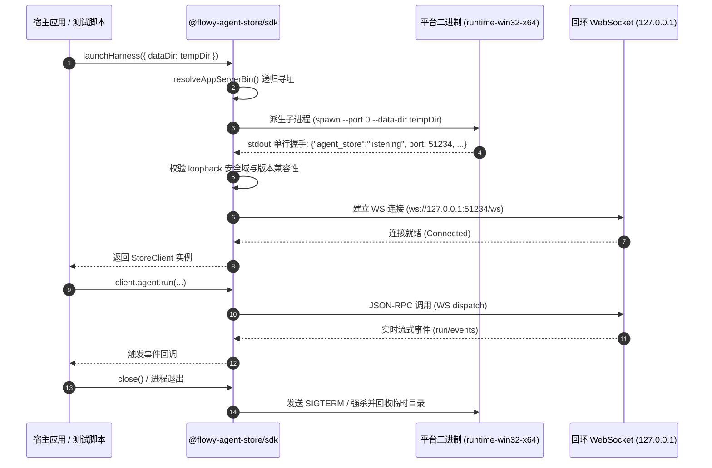

# Agent Store SDK 封装与工程化技术方案（对标 Codex SDK）

> 状态：设计规范（已校准）  
> 适用范围：`web/packages/*`、`apps/agent-store` 二进制分发及外包消费面  
> 关联设计：[`00-architecture-decision.md`](file:///c:/workspace/allo/docs/agent-store/00-architecture-decision.md)、[`05-flowy-agent-store-app-server-protocol.md`](file:///c:/workspace/allo/docs/agent-store/05-flowy-agent-store-app-server-protocol.md)、[`07-typescript-sdk.md`](file:///c:/workspace/allo/docs/agent-store/07-typescript-sdk.md)、[`10-public-contracts.md`](file:///c:/workspace/allo/docs/agent-store/10-public-contracts.md)、[`25-release-runbook.zh.md`](file:///c:/workspace/allo/docs/agent-store/25-release-runbook.zh.md)  
> 核心原则：**以独立 Rust 二进制为自承载运行时，通过回环 WebSocket 替代 STDIO 管道；提供零运行时类型包、通用子客户端与带生命周期管理的高阶 SDK。**

---

## 1. 背景与核心痛点

OpenAI Codex 等智能体运行时通常提供“子进程拉起 + 类型化客户端”的 SDK 形态（例如 `codex app-server --listen stdio://`）。Allo 早期直接将后端服务与桌面 UI 紧耦合，外部开发者或自动化脚本无法以轻量级 SDK 形式接入 Agent Store。

在推进 SDK 独立封装时，面临以下痛点：
1. **进程通道选择困境**：Rust 后端已有完备的基于回环网络（Loopback WS/HTTP）的分发层，重新开发并测试一套健壮、跨平台、支持大吞吐量事件流的 STDIO 双工通道成本极高且容易踩坑 Windows 句柄死锁。
2. **包结构紧耦合**：原 `web/src/lib` 同时混杂了纯 TypeScript 类型定义、网络传输实现、业务页面 UI 辅助函数，外部 Node/TS 项目无法单独引入纯契约。
3. **原生二进制跨平台分发缺失**：外部用户执行 `npm install @flowy-agent-store/sdk` 后，宿主机器上并没有预编译的 `agent-store` 引擎，必须手动编译 Rust 代码，交付门槛极高。
4. **多实例并发与数据污染**：同机并发运行多个 SDK 实例时，若共用默认数据目录，会触发 SQLite 锁库异常或跨租户会话串扰。

---

## 2. 方案全景与架构设计

Agent Store SDK 采用“**回环 WS 进程托管 + 模块化分层多包**”的架构体系：



### 包拓扑分层设计

```text
┌─────────────────────────────────────────────────────────────┐
│                   宿主应用 / CI 评测流水线                  │
└──────────────────────────────┬──────────────────────────────┘
                               │ 依赖
                               ▼
┌─────────────────────────────────────────────────────────────┐
│                 @flowy-agent-store/sdk                      │
│   (子进程拉起 · 握手协议扫描 · 优雅关闭 · 审批 Hook 挂载)    │
└──────────────┬──────────────────────────────┬───────────────┘
               │ 依赖                         │ 依赖 (optional)
               ▼                              ▼
┌──────────────────────────────┐ ┌────────────────────────────┐
│  @flowy-agent-store/client   │ │ @flowy-agent-store/runtime │
│ (Transport 抽象 · 7大子客户端│ │ (预编译平台独立可执行文件) │
│  RPC 路由 · 请求重试与心跳)  │ └────────────────────────────┘
└──────────────┬───────────────┘
               │ 依赖
               ▼
┌──────────────────────────────┐
│  @flowy-agent-store/protocol │
│ (纯 TypeScript 类型 · 错误码 │
│  公开事件 · 零外部第三方依赖)│
└──────────────────────────────┘
```

---

## 3. 详细技术方案

### 3.1 运行时拉起与自愈契约 (P0 契约)

1. **动态端口与单行握手发现（Stdout Ready Handshake）**：
   - SDK 启动子进程时显式传递 `--port 0`，由操作系统分配空闲回环端口。
   - 二进制绑定成功后，在 `stdout` 输出固定格式的单行 JSON（确保不包含任何秘密凭据）：
     ```json
     {"agent_store":"listening","host":"127.0.0.1","port":51234,"url":"http://127.0.0.1:51234","protocol_version":"2026-09-01","version":"0.1.0","auth":"none"}
     ```
   - SDK 启动扫描器监听子进程标准输出，匹配到该行即认为服务就绪并提取物理端口；超时（默认 10 秒）未读到则判定失败并上报子进程退出码与 stderr。
2. **绝对隔离的数据目录（Data Dir Isolation）**：
   - 每个 SDK 实例启动时，若用户未显式指定，默认在 OS 临时目录生成独占临时路径：`${os.tmpdir()}/allo-sdk-${randomUUID()}`。
   - 防止多实例竞争主程序 `flowy.db` 锁。SDK 实例生命周期结束时自动安全卸载并清空临时数据。
3. **回环地址强制防御（Loopback Assertion）**：
   - 客户端严格校验握手 URL：仅允许 `127.0.0.1`、`[::1]` 或 `localhost`。
   - 若发现远端非回环地址，SDK 立即抛出 `SecurityError` 拒绝建连，杜绝意外连向不可信公网服务。

### 3.2 Monorepo 多包拆分与导出拓扑 (P1 结构)

采用 `tsdown` 进行统一构建，支持同时输出 ESM、CJS 和 `.d.ts` 类型声明文件：

1. **`@flowy-agent-store/protocol`**：
   - 包含请求、响应、实时通知和全局错误码的类型声明。
   - **零运行时依赖**：不引入 Axios、WS 等任何第三方库，体积极小，供所有上层包及纯类型检查项目共享。
2. **`@flowy-agent-store/client`**：
   - 承载 `Transport` 通信接口定义与 7 大领域子客户端（`AgentSubClient`、`StoreSubClient`、`MarketSubClient`、`WorkspaceSubClient`、`RunSubClient` 等）。
   - 内置请求超时控制、RPC 结果解包、结构化错误映射（`AppServerError`）。
3. **`@flowy-agent-store/sdk`**：
   - 面向 Node.js 环境的高级封装包。
   - 实现 `launchHarness()`，负责平台可执行程序查找、子进程拉起、握手扫描、`process.on('exit')` 清理钩子。
   - 提供事件重连、Cursor 增量追平、审批（Approval）拦截器。
4. **`@flowy-agent-store/browser`**：
   - 专为 WebUI / Electron Renderer 设计的浏览器轻量适配包，绑定浏览器原生 `WebSocket`，内置静态图片资产 URL 拼接助手。

### 3.3 二进制原生分发与解析梯队 (P2 分发)

为解决“安装了 npm 包却无底层二进制”的体验断层，采用与 `esbuild` / `swc` 相同的 npm `optionalDependencies` 原生分发机制：

1. **平台运行时包拆分**：
   - `@flowy-agent-store/runtime-win32-x64`：内置 `agent-store.exe`。
   - `@flowy-agent-store/runtime-darwin-arm64`：内置 `agent-store`（macOS Apple Silicon）。
   - `@flowy-agent-store/runtime-linux-x64`：内置 `agent-store`（Linux x86_64）。
2. **寻址级联优先级（Fallback Cascade）**：
   ```mermaid
   flowchart TD
       Start([SDK 请求定位二进制]) --> CheckArg{配置项 opts.bin 传入?}
       CheckArg -- 是 --> UseArg[直接使用传入路径]
       CheckArg -- 否 --> CheckEnv{环境变量 AGENT_STORE_BIN 存在?}
       CheckEnv -- 是 --> UseEnv[使用环境变量指定路径]
       CheckEnv -- 否 --> CheckOptDep{require.resolve 定位平台 optionalDep?}
       CheckOptDep -- 成功 --> UseDep[使用平台 runtime 包中的内置二进制]
       CheckOptDep -- 失败 --> CheckPath{系统 PATH 中存在 agent-store?}
       CheckPath -- 是 --> UsePath[使用 PATH 中的全局二进制]
       CheckPath -- 否 --> Error[抛出 BinaryNotFoundError: 请安装对应平台包或指定 bin]
   ```

---

## 4. 关键架构决策与权衡矩阵

| 决策维度 | 备选方案 A | 备选方案 B | 最终决策 | 决策依据与权衡 |
| :--- | :--- | :--- | :--- | :--- |
| **进程间通信通道** | 重构 Rust 实现 STDIO 双工通道 | 复用现有回环网络 WebSocket 协议 | **方案 B** | Rust 后端已具备统一的 WS 路由分发器，STDIO 在跨平台（尤其 Windows 命名管道与缓冲处理）上极其脆弱且重构成本过高。回环 WS 经测试延迟 < 1ms，完全满足 SDK 吞吐量要求。 |
| **原生二进制分发** | 运行时自动从 GitHub Release 动态下载 | 走 npm `optionalDependencies` 平台包分发 | **方案 B** | 企业内网或 CI 环境通常禁止临时联网下载外部可执行文件，存在网络超时与校验和劫持风险；npm 平台包在 `npm install` 阶段即完成安装，体验平滑确定。 |
| **子进程多实例安全** | 默认复用全局数据目录 `~/.flowy` | 强制要求或默认生成独立临时数据目录 | **方案 B** | SQLite 具备单进程排他锁，并发实例会导致数据库被锁崩溃；多实例隔离保障了并发测试与脚本的纯洁性。 |
| **多语言生态支持** | 同时同步维护 TS 与 Python 双语言 SDK | 优先打磨稳定 TypeScript SDK，Python 延后 | **方案 B** | 协议当前仍处于演进期，单先做扎实 TS 体系（占当前核心集成面 90% 以上），避免维护双份异构客户端的同步成本。 |

---

## 5. 验收标准与测试用例

### 5.1 自动化与端到端测试用例

| 用例编号 | 验证阶段 | 测试操作 | 预期结果 |
| :--- | :--- | :--- | :--- |
| **TC-SDK-001** | 进程拉起与握手 | 调用 `launchHarness({ port: 0 })` | 子进程正常派生，10 秒内匹配到 stdout 握手 JSON，成功提取随机物理端口。 |
| **TC-SDK-002** | 回环防护 | 手动配置远端 IP（如 `http://192.168.1.100`）初始化 Client | SDK 抛出安全异常，拒绝发送握手或鉴权请求。 |
| **TC-SDK-003** | 端到端全生命周期 | 调用 `client.agent.run()` 启动智能体执行，监听事件流，最后调用 `close()` | 成功接收全量流式事件并获取终态结果；`close()` 后子进程干净终止，临时数据目录被回收。 |
| **TC-SDK-004** | 双开多实例隔离 | 同时拉起桌面应用与 SDK 测试实例 | 两者各持独立数据目录，无锁库异常，会话与快照完全物理隔离。 |

---

## 附录：原始技术底稿与历史归档 (Historical & Technical Reference Archive)

> **归档说明**：以下完整保留重构前的原始技术底稿、历次讨论与历史记录全文，供历史追溯、协议字段详细对照与技术审计。

---

# Agent Store SDK 封装技术方案（对标 Codex SDK）

> 状态：P0 已实现并实测；P1-1/P1-2/P1-3 主体已落地（tsdown 编译 + npm dry-run 通过）；P1-4 已决策延后；P2 未开始
> 更新：2026-09-04（P0 状态行此前写“P1/P2 未开始”，已过期更正）
> 日期：2026-09-04
> 前置：`00-architecture-decision.md`、`05-flowy-agent-store-app-server-protocol.md`（§2.1.1 传输绑定）、`07-typescript-sdk.md`、`10-public-contracts.md`
> 目标：以 `agent-store` 独立二进制为 runtime，提供可发布的 TS/Python SDK；SDK 与 Web 同走一套协议方法

## 1. 背景与结论

Codex SDK 的形态是“可被拉起的本地 runtime + typed client”：`codex app-server --listen stdio://` 子进程 + JSON-RPC。allo 具备对应物的雏形：

- `apps/agent-store` 已是独立二进制（后端 + 内嵌 Web UI，同端口，默认 `127.0.0.1:8787`，回环本地可信免登，`--auth` 切认证模式）；
- 协议层已统一：`dispatch_connection_request` 为唯一分发，`import/install/market/store/workspace` 等方法 WS/HTTP 同名同实现（`05 §2.1.1`）；
- 前端已有 `Transport` 抽象（`web/src/lib/transport.ts`）与全量 typed client（`web/src/lib/*`）。

因此最短路径**不需要等 stdio**：SDK 以“spawn 二进制 → 连回环 WS”平替 Codex 的“spawn → 连 stdio”。stdio 可作为后续优化（`main.rs` 已有 MCP stdio 子命令先例，有地方挂）。

## 2. 非目标

- 不实现 stdio 传输（`LocalTransport::Stdio` 保持仅枚举值）；
- 不做远端托管/多租户（`00 AD-08` 仍为非目标）；
- 不收编公开资产 `GET` 与 `/api/fs/browse`（非协议方法，见 `05 §2.1.1`）。

## 3. 总体结构

```text
@flowy-agent-store/protocol   纯类型（请求/响应/通知/错误），零运行时依赖
@flowy-agent-store/client     AppServerClient + 子客户端 + Transport 接口
@flowy-agent-store/sdk          spawn 二进制 + WS 建连 + 通知分发/重连/Approval 钩子
@flowy-agent-store/browser    WS 绑定 +  资产 URL 辅助（Web/Flowy 用）
python-sdk              Popen spawn + reader 线程 + typed 方法（对标 Codex client.py）
```

`07 §2.3` 的包拆分即按此落地；`web/src/lib` 是各包的抽取来源，不是发布物（`web` 包保持 `private`）。

## 4. P0：运行契约（`apps/agent-store`）

| # | 事项 | 说明 |
|---|---|---|
| P0-1 | 就绪协议 | ✅ 已实现：`--port 0` + bind 后 stdout 单行 `{"agent_store":"listening",host,port,url,protocol_version,version,auth}`（SDK 扫描该行；无秘密）。 |
| P0-2 | 版本探测 | ✅ 已实现：`--version`（clap 自带）+ 就绪行同时带 `version` 与 `protocol_version`（`PROTOCOL_VERSION` 已 `pub`）；SDK 仍需按 `initialize` 返回做兼容检查。 |
| P0-3 | 数据目录隔离 | ✅ 已实测：第二实例同 data_dir 被单实例锁干净拒绝（`already in use by another running Flowy backend (pid …)`），无损坏风险。结论：SDK 必须自带临时 `--data-dir`（文档写死独占）。 |
| P0-4 | 回环强制 | ✅ 已落地：`web/src/lib/transport.ts:isLoopbackUrl`（`127/8`、`::1`、`localhost`）+ SDK `launchHarness` 非回环拒绝（e2e 覆盖）。 |

## 5. P1：包拆分

| # | 事项 | 来源与改动 |
|---|---|---|
| P1-1 | `@flowy-agent-store/protocol` | ✅ 已落地：`web/packages/protocol`（`protocol.ts`+`errors.ts`，`git mv` 保留历史），`web` 经 `workspaces` + 精确版本引用；旧路径为单行 re-export 垫片。tsdown 编译（esm+cjs+dts），裸 Node ESM/CJS 消费验证通过。 |
| P1-2 | `@flowy-agent-store/client` | ✅ 已落地：`web/packages/client`（`Transport`+基类+7 子客户端，`transport` 必填）；Web 3 方法（`serverRootUrl`/`browseDirectory`/`registerWorkspace`+HTTP 底座）由 `web/src/lib/client.ts` 子类承载，调用点零改动。tsdown 编译，`dev/test/typecheck/build` 前置 `build:packages`（热构建约 8s，`dist/` 不入库）。 |
| P1-3 | `@flowy-agent-store/sdk` | 🔧 主体已落地（Approval 钩子除外）：`web/packages/sdk`（spawn+就绪扫描+回环建连+版本检查+退出清理），e2e 实测通过（覆盖修订后的 TC-SDK-001：spawn + 回环 WS）；tsdown 编译；npm publish dry-run 通过。`MessageRouter`/重连复用基类订阅原语，`approval/request` 等解冻。 |
| P1-4 | Python SDK | ⏸️ 已决策延后（2026-09-04）：优先完善已有 TS 功能。结构对标 Codex `client.py:CodexClient`（`Popen` + reader 线程 + pending 表）；类型用 pydantic 与 `protocol` 对齐。 |

## 6. P2：发行与文档

> **实际操作步骤见 `25-release-runbook.zh.md`**（npm 四包 + 站点仓 GitHub Release + 站点上线的有序清单与不变量）；本节只定义发行形态与取舍，不重复步骤。

- **二进制分发**（已定案 2026-09-09，走 npm optionalDependencies）：发布一组按平台的 runtime 包（`@flowy-agent-store/runtime-<platform>-<arch>`，如 `runtime-win32-x64`，每个包内置 `agent-store[.exe]`），作为 `@flowy-agent-store/sdk` 的 `optionalDependencies` 加载；`resolveAppServerBin` 查找顺序改为：`bin` 参数 → `AGENT_STORE_BIN` 环境变量 → **`require.resolve` 定位 platform 包内二进制** → PATH。runtime 包与 `protocol/client/sdk` 同版本锁步，客户额外传入 `bin` 时跳过包查找。这解决“SDK 已发布但代码库外拿不到 `agent-store` 可执行文件”的核心缺口。备选（GitHub releases + checksum 下载缓存）不采用。**实现现状（2026-09-16 实测）**：四包锁步与 pin 由 `bun run check:release-sync` 守着；但只有 `runtime-win32-x64` 这一条路径真实成立（包名 / `os` / `cpu` 是固定字面量，发布脚本不改名），多平台见 `25` §7 第 1 条。
- **版本政策**：协议版本起 changelog；Team 完整能力、事件 cursor 追平（V2）等未稳能力在 SDK 层标 experimental（参考 Codex `experimental_api`），可暂不暴露。
- **同机声明**：`import/run`、`workspace/create`、`market/* directory` 要求 client 与 server 同文件系统；文档明确，远端场景 SDK 对这类方法前置拒绝。
- **文档三件套**：getting-started / api-reference / examples（对标 Codex SDK 的 `docs/` + `examples/` 布局）。

## 7. 测试与验收

- SDK 级 roundtrip（spawn 真实二进制 + 临时 data_dir）：`initialize → store/list → store/install-entry → agent/run → run/events → run/result` 全绿。
  - 2026-09-04 进展：`agent/run → run/get → run/result → run/events` 子链已绿（TC-RT-001，见 `13-p0-execution-plan.md` §14）；
    `store/install-entry` 产品路径当时未走（A1 用 import/install 直调）——**后已由 WP-2 四链路 live 经 SDK 公共面覆盖（`15-store-chain-and-protocol-vnext-plan.zh.md` §10，2026-09-09）**。
- 与 `07-typescript-sdk.md`（现行正文）的差异：包名以本文为准（`@flowy-agent-store/sdk`；`07` 已于 2026-09-09 同步改名并加注）；
  `Transport` 必填、`exports` 直指 `dist` 等包边界结论同样以本文为准。
- 双开冒烟：桌面端 + SDK 实例同机运行，无锁库、无跨 owner 数据串扰。
- 远端 URL 被 SDK 明确拒绝；协议版本不匹配时报错信息包含两端版本号。
- 全程 SDK 不直调 HTTP（公开资产 `` 除外）；新增协议方法时 TS/Python 类型与 `dispatch` arms 同步更新（`10-public-contracts` 为准）。

## 8. 风险

1. 协议仍在加方法（本次即新增 14 个 WS arms），SDK 发布后 breaking 成本高——靠 P2 版本政策 + experimental 门缓解。
2. 事件语义是尽力而为（可丢、可乱序），远端/跨进程场景下 SDK 侧重连追平依赖 `run/events` cursor（半成品），`node` 包须自带去重排序。
3. `import` 的本地路径语义与远端天然冲突，见 §6 同机声明。
4. 当前 `web/src/lib` 仍有他处并行修改（如 `protocol.ts`），抽包时以 `10-public-contracts` 为准做一次性对齐，避免把进行中的 UI 改动带进 SDK。
