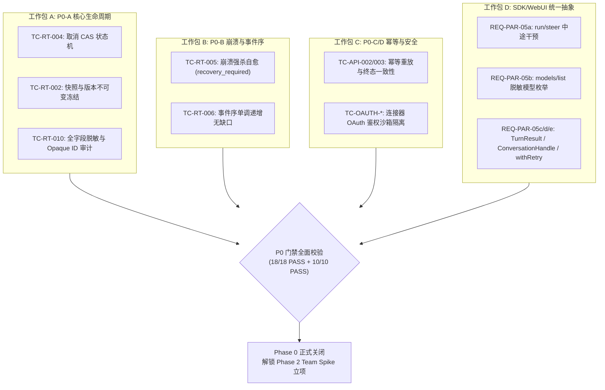

# Agent Store P0 核心收尾与运行时门禁工程方案（Execution Plan & Quality Gates）

> 状态：工程规范（P0 阶段已全部关闭并验收，证据就绪）  
> 适用范围：`nomifun-app-server`、`nomifun-agent-execution`、`web/packages/*` 与全链路集成测试  
> 关联设计：[`00-architecture-decision.md`](file:///c:/workspace/allo/docs/agent-store/00-architecture-decision.md)、[`04-flowy-agent-store-runtime-adapter.md`](file:///c:/workspace/allo/docs/agent-store/04-flowy-agent-store-runtime-adapter.md)、[`09-release-readiness.md`](file:///c:/workspace/allo/docs/agent-store/09-release-readiness.md)、[`10-public-contracts.md`](file:///c:/workspace/allo/docs/agent-store/10-public-contracts.md)、[`12-sdk-packaging.md`](file:///c:/workspace/allo/docs/agent-store/12-sdk-packaging.md)  
> 核心原则：**以真实 Rust 二进制与端到端状态机为基准，严格落地版本不可变冻结、崩溃安全自愈与零凭据泄漏，不以 Mock 替代真实链路。**

---

## 1. 背景与核心目标

Phase 0（P0）是 Agent Store 从概念验证迈向工程生产化的核心地基阶段。在 P0 启动前，系统存在单 Agent 运行状态落库异常（Actor ID 校验失败）、多实例进程崩溃后状态伪造为成功、SDK 与 WebUI 重复维护两套异构客户端等工程隐患。

### 1.1 核心目标
1. **闭环单 Agent 真实生命周期（P0-A）**：在真实模型（mimo-v2.5 等）接入下，完成 `planning → running → completed` 正常链路，支持优雅取消（Cancel CAS）、版本不可变冻结与公共协议层脱敏。
2. **崩溃自愈与事件一致性（P0-B）**：模拟进程强杀（Kill -9）重启，验证底层事件完整保留、未决 Attempt 安全收敛至 `recovery_required`、服务端全局序列号绝对单调无缺口。
3. **协议层与连接器安全验证（P0-C/D）**：完成请求级幂等重放验证与 OAuth 连接器隔离测试。
4. **SDK 与 WebUI 统一契约（工作包 D）**：共用 `@flowy-agent-store/client`，补齐工效包（REQ-PAR-05：`run/steer`、`models/list`、`TurnResult`、`ConversationHandle`、`withRetry`）。

### 1.2 明确非目标
- 不在 P0 阶段过早介入 Team planned DAG 复杂编排（留至 Phase 2 Team Spike）；
- 不做 STDIO 双工通道重构（保持回环 WS 传输）；
- 暂缓 Python SDK，集中资源保障 TypeScript 生态交付。

---

## 2. 方案全景与门禁收敛拓扑

整个 P0 收尾与门禁验证流程由 4 大工作包并行推进，汇聚于 P0 发布门禁判定矩阵：



---

## 3. 详细技术方案

### 3.1 工作包 A：核心生命周期与规范化（P0-A）

1. **取消状态机与 CAS 乐观并发控制（TC-RT-004）**：
   - 客户端调用 `run/cancel` 时，服务端通过 CAS（比较 `expected_version`）执行状态迁移。
   - 运行中任务从 `running` 进入 `cancel-accepted`，最终收敛至终态 `cancelled`，版本号相对取消前严格递增（$v_{n} \to v_{n+1}$）。
   - 彻底杜绝取消请求直接硬改终态的伪造行为，若底层 Attempt 无法安全中断，按契约返回无法取消的结构化错误。
2. **定义版本与快照不可变冻结（TC-RT-002）**：
   - 在 Run 创建时通过 `create_for_app_server` 解析并物化 `PresetSnapshot`，生成不可变内容摘要 `content_digest`（SHA-256）与 `preset_revision`。
   - 在 Run 执行中途，即使用户在后台重新发布该 Agent 的更高版本（如升级到 v9.9.9），已启动的 Run 及其轮询接口（`run/get`、`run/result`）严格锁定原有快照版本，确保历史可复现。
3. **全局脱敏与 Opaque ID 规范化审计（TC-RT-010）**：
   - 严格审查 `nomifun-app-server` 所有出参，抹除一切内部数据库主键（如 UUIDv7 原始字符串）、文件系统物理绝对路径、模型 Provider API Key 明文。
   - 统一对外暴露不透明 Public ID（`run_id`、`session_id`）与点号命名的标准化事件枚举（`run.started`、`attempt.updated` 等）。

### 3.2 工作包 B：崩溃持久化自愈与单调事件流（P0-B）

1. **硬杀崩溃恢复与安全收敛（TC-RT-005）**：
   - 在测试用例中通过 `SIGKILL` 强杀正在执行任务的 `agent-store` 进程。
   - 进程重启后，恢复调度器（`scheduler`）扫描数据库中处于未决状态（`running`）的 Run。
   - 调度器执行 `reconcile_recovered_attempt`，当无法严格证明当前 Attempt 的外部副作用安全性时，将其收敛为 `review_blocked`（原因：`process_restart`），对外将 Run 状态投影为 `recovery_required`，坚决不向客户端伪装为 `completed`。
2. **事件序列单调递增与去重（TC-RT-006）**：
   - 服务端为每个 Run 产生的事件分配物理单调递增的全局序列号 `sequence`（从 1 起算）。
   - 崩溃强杀前持久化的事件完整保留，重启后新增事件的 `sequence` 在旧值基础上继续递增，整体事件流严格保持无空隙（Gapless）且单调上升。

### 3.3 工作包 C：幂等控制与连接器安全（P0-C/D）

1. **请求指纹与幂等冲突检测（TC-API-002/003）**：
   - 客户端携带 `idempotency_key` 调用 `agent/run`。
   - 若相同的 `idempotency_key` 提交相同参数，服务端返回既有 `run_id` 与异步 Receipt；若携带相同 Key 但修改了请求内容（例如变更了 Goal），服务端返回 `idempotency_conflict` 错误。
2. **OAuth 运行时沙箱（TC-OAUTH-*）**：
   - 外部连接器 OAuth 授权凭据采用专用安全表加密存储，与用户 Session 物理隔离。
   - 接入外部工具调用时，由服务端通过凭据模板在内存中注入，绝不流向渲染前端。

### 3.4 工作包 D：SDK 与 WebUI 统一工效包（REQ-PAR-05）

1. **`run/steer` 中途干预（REQ-PAR-05a）**：
   - 基于底层的 `engine.steer_step`，向 App Server 暴露 `run/steer {run_id, text}`，将用户输入路由到当前活跃 Attempt，实现运行中交互式引导。
2. **`models/list` 脱敏模型目录（REQ-PAR-05b）**：
   - 统一由服务端 `ProviderService` 向 SDK 与 WebUI 投影可用模型元数据清单（包含 context window、能力标签），不暴露鉴权细节。
3. **高阶封装抽象（REQ-PAR-05c/d/e）**：
   - **`TurnResult`**：从流式事件自动聚合响应正文文本、Token 消耗统计（`context.usage`）及产物文件列表。
   - **`ConversationHandle`**：提供类似 Codex Thread 的多轮对话会话句柄，内置消息发送与结果等待原语。
   - **`withRetry`**：在 Client 层内置可恢复错误（网络抖动、429 超限）的指数退避重试机制。

---

## 4. 关键决策与权衡矩阵

| 决策点 | 备选方案 A | 备选方案 B | 最终决策 | 决策依据与权衡 |
| :--- | :--- | :--- | :--- | :--- |
| **崩溃恢复语义** | 重启后自动续跑未完成的 Attempt | 标记为 `recovery_required` 等待人工介入 | **方案 B** | 智能体涉及外部文件修改、API 调用等不可逆副作用，在缺乏绝对幂等保证前盲目重试会引发二次灾难；标为待恢复符合安全第一原则。 |
| **Cancel 状态迁移** | 收到取消请求立即强写 DB 终态 | 走 CAS 并发校验，由 Attempt 异步响应终态 | **方案 B** | 强写 DB 会导致底层线程与 DB 状态脱节，造成孤儿执行或事件乱序。 |
| **SDK 进程托管接口** | 暴露底层子进程 PID 与 SIGKILL 接口 | 仅暴露标准 `close()` 优雅关闭接口 | **方案 B** | 保持 SDK 接口纯洁性与跨平台稳定性；破坏性崩溃测试作为独立测试脚本自持进程，不污染正式 SDK 面。 |
| **版本递进断言** | 断言取消后版本绝对值 > 1 | 断言相对取消前版本严格递增（v0 $\to$ v1） | **方案 B** | 底层数据库主表初始化版本从 0 起算，断言绝对值大于 1 会在初次操作时误报。 |

---

## 5. 验收标准与测试用例全集

### 5.1 单 Agent 运行时用例 (TC-RT-001 ~ 010)

| 用例编号 | 等级 | 操作与场景 | 核心断言 |
| :--- | :--- | :--- | :--- |
| **TC-RT-001** | P0 | `agent/run` 异步执行 | 返回合法异步 receipt；任务经历 `planning → running → completed`；结果与事件完整。 |
| **TC-RT-002** | P0 | 运行中升级 Agent 版本 | 运行中任务严格锁定原 `preset_revision` 与 `content_digest`；不混淆 Preset ID 与 Agent ID。 |
| **TC-RT-003** | P0 | 多源策略权限交集 | Caller、Agent、Connector 策略冲突时取交集；越权操作返回 `policy_denied`。 |
| **TC-RT-004** | P1 | 运行中调用 `run/cancel` | 状态平滑过渡至 `cancelled`，版本号严格递增；绝不伪造终态。 |
| **TC-RT-005** | P0 | 运行中模拟进程强杀重启 | 历史事件完整保留；未决任务收敛为 `recovery_required`，绝不冒充 `completed`。 |
| **TC-RT-006** | P0 | 崩溃重启后事件序列校验 | 崩溃前后的所有事件全局 `sequence` 严格单调递增，无任何缺口或乱序。 |
| **TC-RT-009** | P0 | Runtime Readiness Gate | 未经 Adapter 验证的 Preset 组合禁止进入可运行 Catalog。 |
| **TC-RT-010** | P0 | 公共事件与错误脱敏 | 全字段扫描零内部数据库 ID、零凭据泄露，统一对外输出点号规范事件。 |

### 5.2 AgentTeam 运行时用例 (TC-TEAM-001 ~ 009)

| 用例编号 | 等级 | 操作与场景 | 核心断言 |
| :--- | :--- | :--- | :--- |
| **TC-TEAM-001** | P0 | 启动 TeamRun | 生成固定 Participant 池与模板；Prompt 严格隔离，不向 Leader 混入成员私有指令。 |
| **TC-TEAM-002** | P0 | 触发 planned DAG 调度 | Leader 必须且仅能通过 `nomi_delegate(strategy=planned)` 发起规划，模板驱动执行。 |
| **TC-TEAM-003** | P0 | 依赖时序控制 (A $\to$ B $\to$ C) | 调度器严格按拓扑序执行，前序任务未完成前禁止执行后续节点。 |
| **TC-TEAM-004** | P0 | 局部并行与并发限制 | 无依赖节点并行调度，全局并发数受 `max_parallel` 刚性约束。 |
| **TC-TEAM-005** | P0 | 节点失败局部重试 | 失败仅重试当前 Attempt，生成新尝试，旧 Attempt 历史保留。 |
| **TC-TEAM-006** | P0 | 规划失败触发 Replan | 生成新的 Plan Revision，保留历史计划以供回溯。 |
| **TC-TEAM-007** | P0 | 迟到事件隔离 | 隔离旧 Attempt 的过期事件，不得覆盖当前新 Attempt 的状态。 |
| **TC-TEAM-008** | P0 | Planning 上下文隔离 | 规划上下文仅包含脱敏能力摘要，私有凭据与工具细节严禁泄露给协同方。 |

---

## 附录：原始技术底稿与历史归档 (Historical & Technical Reference Archive)

> **归档说明**：以下完整保留重构前的原始技术底稿、历次讨论与历史记录全文，供历史追溯、协议字段详细对照与技术审计。

---

# P0 收尾与 SDK/Web 对齐执行方案

> 日期：2026-09-04
> 前置：`开发计划.md`（Phase 0）、`agent-store-v1-test-cases.md`、`12-sdk-packaging.md`、`13-p0-execution-plan.md` §14
> 状态：P0-A/B 已关闭（2026-09-09，证据 `13-p0-execution-plan.md` §15）；P0-C/D 的 OAuth 运行时证据已完成
> （`06-connector-oauth-security.md` §12，TC-OAUTH-001/002/004 26/26 PASS；live 另逼出并修复 B7/B8）；
> **REQ-PAR-05 全部落地**（05a run/steer、05b models/list、05c TurnResult、05d ConversationHandle、05e withRetry）
> 说明：本文件是执行层计划，不替代 `开发计划.md` 的阶段定义与 `09` 的门禁定义；
> 每个任务遵循开发计划 §11（REQ 编号/文件/契约/TC/失败场景/验证入口）

## 1. 现状基线（2026-09-04）

- TC-RT-001 PASS：临时实例 + mimo-v2.5 真实模型，`planning → running → completed`
 （`13-p0-execution-plan.md` §14）；附带修复 `runtime_adapter` actor 落库 500
 （`external_agent("app-server")` → `user(owner_id)`，已提交 `7f035f88a`）。
- TS 三包主体落地：`@flowy-agent-store/{protocol,client,sdk}` 0.1.0，tsdown 编译，
  npm dry-run 通过；`web/src/lib` 为 re-export 垫片 + Web 子类。
- 文档矛盾已消：TC-SDK-001 改为 spawn + 回环 WS；开发计划 TC 引用收缩到主表现有编号。
- 按开发计划 §12 停止条件：P0-A/B 关闭前不得扩展 Team/Web。

## 2. 目标与非目标

目标：关闭 P0-A（TC-RT-002/004/010）与 P0-B（TC-RT-005/006），补 P0-C/D 低成本验证项，
给出 Phase 0 门禁结论；并行把 SDK/Web 对齐到同一 client 实现。

非目标：Team planned DAG（Phase 2 Spike，需 P0 关闭后另行立项）、stdio 传输（V2）、
Python SDK（已决策延后）、Flowy 纵向闭环（Phase 5）。

## 3. 工作包 A：关闭 P0-A（Step 1，顺序 T3 → T1 → T2）

### REQ-P0A-01／TC-RT-004 取消（P1，先做，最快）

- 文件：点火脚本（临时）+ `nomifun-app-server`（若有缺口）
- 契约：`run/cancel`（10 §run 状态机）
- 操作：Run 进入 running 后调 `run/cancel`，轮询到终态
- 断言：终态为 `cancelled` 且版本递进；cancel 前为非终态（防伪造）
- 失败场景：cancel 后仍 completed → 查 engine cancel 语义，记 BLOCKED
- 验证：点火脚本 + `cargo test -p nomifun-app-server`

### REQ-P0A-02／TC-RT-002 版本冻结

- 文件：点火脚本 + 安装路径（`install/*` 重装同 Agent 新版本）
- 契约：receipt 的 `preset_revision`/`content_digest`（10 §不可变冻结）
- 操作：Run 运行中发布同 Agent 新版本，查 `run/get`
- 断言：运行中 Run 的两字段不变；历史记录可追溯；Preset ID 不被当作 Runtime Agent ID
- 失败场景：字段漂移 → 查 `create_for_app_server` 快照冻结，记 BLOCKED
- 验证：点火脚本

### REQ-P0A-03／TC-RT-010 规范化审计

- 文件：`nomifun-app-server`（`map_public_run_id` 周边）、`runtime_adapter::run_view/event_view`
- 契约：10 §公共 ID 与错误码（opaque ID、无内部 ID、无凭据）
- 操作：全字段扫描 `run/get`、`run/events`、`run/result`、`install` 响应
- 断言：无 allo 内部 ID、无凭据值；错误为稳定 code
- 失败场景：发现泄漏 → 修映射，转为可重复断言后再关
- 验证：新增断言脚本 + `cargo test -p nomifun-app-server`

出口：三项 PASS → P0-A 关闭，开发计划 §4 出口勾选第二轮。

## 4. 工作包 B：P0-B 事实源与重启（Step 2）

### REQ-P0B-01／TC-RT-005 重启恢复 + REQ-P0B-02／TC-RT-006 事件序

- 文件：点火脚本 + engine 恢复路径（`scheduler` 恢复扫描）
- 契约：技术方案 §6.2（sequence 服务端分配、迟到不覆盖终态）+ §6.3（`recovery_required`）
- 操作：运行中杀进程重启；查事件保留、未完成标记、`run/events` sequence 连续性
- 断言：事件保留；未完成标记 `recovery_required`；绝不伪装 completed
- 退出条件：若需改 engine 持久化超过 2 天，降级为只验“不伪装”，T4 记 BLOCKED 并写明原因
- 验证：点火脚本（杀进程版）

出口：P0-B 关闭 → Phase 0 出口条件全满足 → 按 §12 解锁 Phase 2 Team Spike 立项。

## 5. 工作包 C：P0-C/D 查漏（Step 3，纯验证）

- REQ-P0C-01／TC-API-002：同一 `idempotency_key` 重放 `agent/run` → 同一 run_id
 （实现已在 `execute_agent_run`，点火脚本加一段即可）。
- REQ-P0C-02／TC-API-003：`run/get` 与 `run/result` 终态一致（A1 已有一半）。
- REQ-P0D-01／TC-OAUTH-001/002/004 + TC-CONN-001/002：OAuth Spike 剩余用例（此前仅 003 有证据）。

出口：09 §9 快照更新，Gate 3/4 从“未执行”变为有结论。

## 6. 工作包 D：SDK/Web 对齐（Step 5，可与 A 并行）

原则：webui 与 SDK 共用 `@flowy-agent-store/client` 为唯一协议实现；
webui 不直接依赖 `@flowy-agent-store/sdk`（Node 专属，浏览器不可运行）。

- REQ-PAR-05（SDK 应用功能与工效包，用户 2026-09-04 定为优先于 PAR-01/02）：
  1. REQ-PAR-05a `run/steer`（协议 + client + handle）：runtime 能力已在
   `engine.steer_step`（durable effect + CAS + 恢复重投），App Server/协议/SDK 零暴露。
   补 `run/steer {run_id, text}`（单 Agent run 默认路由到当前活跃 step/attempt，step 不进公共契约），
   HTTP 薄适配双落；client `handle.steer(text)`；验证：协议测试 + live 脚本。
  2. REQ-PAR-05b `models/list`（协议 + client）✅ 2026-09-09 已落地：SDK/第三方无法枚举模型，唯一服务端真空缺；
   从 ProviderService 投影公共模型目录（不暴露 key）；client `models()`。
  3. REQ-PAR-05c `TurnResult` 聚合（client 层）✅ 2026-09-09 已落地：从事件流聚合 `final_response`（文本）
   + token usage（`context.usage` 事件）+ 事件/物品清单，`handle.finished` 升级返回聚合对象；
   webui 后续切同一聚合（消现有私有实现）。
  4. REQ-PAR-05d 多轮 `ConversationHandle`（client 层）✅ 2026-09-09 已落地：包装现有 conversation 域
   （create/send/cancel + 会话事件归并原语），≈Codex Thread 多轮形态；`send` 等待终态并返回聚合 turn；
   webui 切同一句柄为后续（说明：webui 的 React reducer 为 UI 状态层，非本次 client 契约）。
  5. REQ-PAR-05e 重试辅助（client 层）✅ 2026-09-09 已落地：`retryable` + 指数退避 + 抖动的 `withRetry` 助手（≈Codex `retry_on_overload`）。
  顺序：05a → 05b → 05c → 05d → 05e（a/b 动协议，c/d/e 纯 client 层）。
  图片输入、sandbox 一等参数、archive/resume/fork 不列入本包（11 §6.3 或 V2）。
- REQ-PAR-01：抽 `@flowy-agent-store/browser`（12 §3 预留）：迁移 `web/src/lib/client.ts` 子类
 （serverRootUrl/browseDirectory/registerWorkspace + HTTP 底座）；`web/src` 只剩垫片。
- REQ-PAR-02：防漂移 contract test：`web/src` 禁止协议方法名字面量；
  新增协议方法必须 dispatch arms + client 方法 + 类型三件套（12 §7 入测试）。
- REQ-PAR-03 ✅ 2026-09-04 已落地（有修正）：Run 域事件路由直接在 `client` 包内以 `EventSubscription` 补齐
  （去重 seen 集 + `run/resync-required` 自动追平 + `follow` 静默建游标 + 手动 `resync()` 并发共享单 flight），
  单测 8 项全过（FakeTransport），真机 live（SDK spawn→WS 推送→completed）PASS（6 推送/0 重/游标覆盖）。
  注：`conversation-events.ts` 是会话域 transcript 归并（React 侧），不在下沉范围，保持 webui 私有。
- REQ-PAR-04 ✅ 2026-09-04 已落地（先行 AgentHandle 部分）：`client/run-handle.ts`——
  `launchRun()`（launch+follow）→ `AgentRunHandle`：`finished`（轮询兜底阻塞到终态，≈`thread.run()`）、
  `for await` 事件迭代（≈`runStreamed()`）、`cancel()`（带 receipt 版本）；纯组合零新协议方法。
  单测 4 项 + 真机 live（`scripts/sdk-live-handle.ts`：completed/6 事件/0 重）PASS。
  市场编排 helpers（`installFromMarket` 等）仍待做。

顺序：PAR-01 → PAR-02 → PAR-03 → PAR-04。门禁事项（工作包 A/B）优先于对齐；
PAR 与 A 无文件冲突，可并行。

## 7. 门禁判定与文档同步（Step 4，随做随更）

- 每项 TC 按测试总索引 §1.2 存证据（输入摘要/公共 ID/终态/脱敏日志路径），体例见
  `13-p0-execution-plan.md` §14。
- 同步点：roadmap 进展段、12 状态表、09 §9 快照、开发计划 §4 出口勾选。
- 最终输出 Phase 0 “通过 / 附条件通过 / 阻断”结论；只有通过才立项 Team Spike。

## 8. 已定决策（不再讨论）

| 事项 | 结论 | 日期 |
|---|---|---|
| stdio 传输 | V2/deferred；TC-SDK-001 已改为 spawn + 回环 WS | 2026-09-04 |
| Python SDK | 延后，优先 TS | 2026-09-04 |
| TC 编号范围 | 收缩到主表现有（SDK 001~003、WEB 001~004），缺号待开工补 | 2026-09-04 |
| 包名 | `@flowy-agent-store/sdk`（`07` 现行正文未改，以 `12` 为准） | 2026-09-04 |
| 证据体例 | 编号文档附录（2026-09-11 前为独立 `*-runtime-evidence.zh.md`）+ 可重复入口为正式证据 | 2026-09-04 |
| 点火脚本教训 | 子进程 stdout 必须持续消费/重定向（64KB 背压冻住服务端） | 2026-09-04 |

## 9. 风险与停止条件（继承开发计划 §12，增补）

| 风险 | 停止条件 | 处理 |
|---|---|---|
| 模型供给不稳（key/额度/网络） | A1 级链路连续失败 | 先修供给，计划整体后移；不记实现 BLOCKED |
| engine 持久化缺口（T4） | 改造超 2 天 | 降级断言，记 BLOCKED 写因（见 §4） |
| 规范化泄漏（T2） | 泄漏面超出映射层 | 升级为安全项，阻断 P0-A 关闭 |
| 对齐返工（D） | client 包 API breaking | 跨 web+sdk 同步改，禁止单边 fork |

---

## 10. Runtime 验收用例（TC-RT / TC-TEAM）

> 本节由 `agent-store-v1-test-cases.md` 原 §4（单 Agent Runtime）与 §5（AgentTeam Runtime）并入（2026-09-11 文档合并）；TC 编号与用例正文保持不变，内部分节号沿用原文。

### 4. 单 Agent Runtime

#### TC-RT-001：单 Agent Run

- 等级：P0
- 操作：通过 App Server `agent/run`
- 断言：返回异步 receipt；Run 经 queued/starting/running 进入 completed 或明确 failed；结果可查询

#### TC-RT-002：Definition 版本冻结

- 等级：P0
- 操作：Run 启动后发布同一 Agent 新版本
- 断言：运行中的 Run 继续使用原 Preset/ResolvedPresetSnapshot、Skill/Connector digest；历史记录可追溯，且不把 Preset ID 当作 Runtime Agent ID

#### TC-RT-003：策略交集

- 等级：P0
- 操作：让 caller、Agent、Connector Policy 产生权限冲突
- 断言：有效权限取交集；被拒绝操作返回 `policy_denied`

#### TC-RT-004：取消

- 等级：P1
- 操作：运行中调用 `run/cancel`
- 断言：取消请求不直接伪造终态；最终收到 `run.cancelled` 或明确无法取消的结果

#### TC-RT-005：重启后的未完成状态

- 等级：P0
- 操作：在运行中模拟进程重启
- 断言：已持久化事件和终态保留；allo 内部按既有安全恢复规则处理 Attempt；无法证明安全时标记为 `recovery_required`，不得伪装为 completed；App Server 不承诺一定续跑原 Attempt

#### TC-RT-006：状态持久化与事件序一致

- 等级：P0
- 操作：完成一次含 retry/replan 的 Run，读取 run 状态与事件序列
- 断言：终态、Plan Revision 和事件序（sequence 顺序）保持一致；重启后未完成 Run 标记正确

#### TC-RT-007：Attempt fencing（V2）

- 等级：V2
- 操作：让旧 Attempt 使用失效 fencing token 写入完成事件
- 断言：写入被拒绝并记录 stale/ignored 结果，不改变当前 Step 或 Run 状态

#### TC-RT-008：副作用重试幂等（V2）

- 等级：V2
- 操作：在 Connector 已提交外部副作用后模拟响应丢失并触发恢复
- 断言：重试携带相同外部幂等键或转为人工确认，不产生第二次不可逆副作用

#### TC-RT-009：Runtime Readiness Gate

- 等级：P0
- 操作：分别提交未验证、Adapter 已验证和 Runtime 已验证的 AgentDefinition
- 断言：未达到 `runtime-verified` 的 Preset/Runtime Agent 组合不能进入可运行 Catalog；Team 不能绕过单 Agent Gate

#### TC-RT-010：公共事件和错误规范化

- 等级：P0
- 操作：触发 allo 内部成功、失败、取消和未知错误
- 断言：Adapter 输出统一点号事件、公共错误码和 opaque ID，不泄露 allo 内部 ID 或凭据

### 5. AgentTeam Runtime

#### TC-TEAM-001：固定成员物化

- 等级：P0
- 操作：启动 software-company TeamRun
- 断言：生成固定 Participant 池和 AgentExecutionTemplate；成员来自 TeamDefinition，不由模型任意新增；Leader 和每个成员分别绑定各自 Preset/ResolvedPresetSnapshot，成员 Prompt 不被合并到 Leader Prompt；TeamRun 创建时服务端创建 Leader Conversation，并把该 AgentExecutionTemplate 绑定为其 `execution_template_id`
- 断言（物化规则，2026-09-11）：模板按 `context.agent_store_team_id` 复用（同一 Team 反复启动不新增模板行）；参与者模型优先取各自 preset 已解析的模型、缺失时才回退到宿主默认模型（Store preset 默认不绑定模型）；`workflow_limits.max_parallel` 仅在是正整数时成为并发上限；Team Definition 的 `routing_constraints` / `planner_policy` / `team_runtime_capabilities` 以原文进入模板 `context`（不翻译成结构化的 `capability`/`constraints`，避免凭空发明语义）

#### TC-TEAM-002：Leader 经 `nomi_delegate(strategy=planned)` 触发 planned DAG

- 等级：P0
- 操作：提交 Team goal
- 断言：Leader 在其 Conversation 的 turn 内调用 `nomi_delegate(strategy=planned, goal=…)`；服务端据此构造 Planning Context（Leader Preset 规划指令 + Team 目标 + 脱敏成员能力摘要 + Team 策略），由内部 Planner 生成 Plan；Plan 经过依赖、成员路由、并发和策略校验后才物化 Step；成员池与并发上限取自绑定的 Template，不接受模型参数
- 断言（实现选择）：注册给 Leader 的 delegate 工具必须支持 `strategy=planned` 且绑定持久 `AgentExecutionEngine`；仅支持 `strategy=parallel` 的同步 embedded 实现不得出现在 Team 会话工具面；以 `strategy=parallel` 替代 planned 流程的顶层调用被拒绝
- Leader Conversation 的可见性（2026-09-11 订正）：`16` §7 决策 3 的原文是 Leader「**必须**有 Conversation/Attempt（**不必**用户可见）」——是许可而非禁止。本实现把它建成一个真实的 App Server 会话（`app_server_chat` 标记 + `execution_template_id` 绑定 + `delegation_policy = automatic`），因此它会出现在该 owner 的 `conversation/list` 里，用户可以看到 Leader 的规划轮次并继续对话。`team/run` 的 receipt 只返回公共 `run_id`，不返回 Leader 会话 id；客户端要定位它需自己按 `conversation/list` 过滤。原先「不创建用户可见的 Leader Conversation」的措辞是决策 3 修订前的遗留断言，已作废

#### TC-TEAM-003：依赖调度

- 等级：P0
- 操作：构造 A→B→C 依赖
- 断言：B 不早于 A 完成；C 不早于 B 完成；事件顺序和状态一致

#### TC-TEAM-004：局部并行

- 等级：P0
- 操作：构造 A/B 独立、C 依赖 A/B 的 DAG
- 断言：A/B 可并行；C 等待两者完成；实际并发不超过有效 max_parallel

#### TC-TEAM-005：失败 retry

- 等级：P0
- 操作：让一个 Step 第一次失败
- 断言：生成新 Attempt；旧 Attempt 保留；retry 次数受策略限制；成功后 Step 正确完成

#### TC-TEAM-006：失败 replan

- 等级：P0
- 操作：制造 QA 失败并触发 replan
- 断言：生成新的 Plan Revision；历史 Plan 保留；新计划包含修复和回归验证步骤

#### TC-TEAM-007：旧事件隔离

- 等级：P0
- 操作：让旧 Attempt 的迟到事件在新 Attempt 后到达
- 断言：迟到事件不覆盖新状态；记录 stale/ignored 结果

#### TC-TEAM-008：Planning Context 与成员 Prompt 隔离

- 等级：P0
- 操作：启动含不同 Leader/成员 persona、Skill 和 Connector 策略的 TeamRun
- 断言：Planning Context 只包含 Leader 规划指令、Team 策略和脱敏成员能力摘要；成员完整 Prompt、凭据引用和未授权工具细节不进入共享上下文；每个成员 Attempt 使用自己的 Prompt Snapshot

#### TC-TEAM-009：V1 延期能力边界

- 等级：P1
- 操作：请求成员自主认领、嵌套 Team 或成员任意直连消息
- 断言：明确返回 unsupported/feature_not_available；不得静默伪装支持


---

## 11. 测试基础设施（环境与证据要求 / 验收等级）

> **口径单一来源见测试总索引 `agent-store-v1-test-cases.md` §1 / §2**（2026-09-11 收敛：此前本节的重复副本已移除，避免两处漂移）。
>
> - **§1 测试环境与证据要求**：环境记录项、真实凭据记录方式、每个通过用例的证据清单（本线证据体例见测试总索引 §1.2）。
> - **§2 验收等级**：P0/P1/P2 定义、结果取值（PASS / FAIL / BLOCKED / NOT_RUN）与 `BLOCKED` 处置。
>
> 本线（P0）用例按上述口径执行并存证。


---

## 12. P0 发布门禁用例

> 本节由 `agent-store-v1-test-cases.md` 原 §9 并入（2026-09-11）。**门禁的权威定义（五道 Gate 的判定口径）见 `09-release-readiness.md` §3**；本节只固定 P0 线要求的**用例编号集合**与阻断处置。

### 9. P0 发布门禁

以下用例必须全部 PASS：

```text
TC-IMP-001/002/004/005/006/008/009
TC-RT-001/002/003/004/005/006/009/010
TC-TEAM-001/002/003/004/005/006/007/008
TC-API-001/002/003/004
TC-SDK-001/002/003
TC-OAUTH-001/002/003/004
TC-CONN-001/002
TC-CLI-001
TC-STDIO-001
TC-WEB-001/002/003/004
TC-SEC-001/002/003
```

P0 用例为 BLOCKED 时必须由产品负责人明确接受风险；未经接受不得发布。


---

## 13. 回归与记录

> 本节由 `agent-store-v1-test-cases.md` 原 §10 并入（2026-09-11）。**发布证据包的完整清单见 `09-release-readiness.md` §4**；本节定义**每次修改触发的回归范围**与测试报告字段。

### 10. 回归与记录

每次修改以下内容都必须执行相关回归：

```text
领域模型
Importer
Runtime Adapter
App Server Schema
Protocol version
Event envelope
Credential Provider
Tool Policy
OAuth metadata
SDK generated types
```

测试报告必须包含：

```text
commit/version
测试时间
环境摘要
用例总数
PASS/FAIL/BLOCKED/NOT_RUN 数量
失败用例和复现信息
已知风险
发布结论
```

测试报告不得包含真实 Token、API Key、密码、连接字符串或完整敏感参数。

---

## 14. 附录 A · 单 Agent 真实 Run 验收证据（TC-RT-001）

> 本节由 `single-run-runtime-evidence.zh.md` 整体并入（2026-09-11）。原文的时间戳与「历史实测快照，非契约」定性**保持不变**。


> 日期：2026-09-04
> 目标：开发计划 §4 P0-A（单 Agent Run 真实完成），对齐 `agent-store-v1-test-cases.md` TC-RT-001
> 状态：✅ 通过（临时实例 + mimo-v2.5 真实模型：planning → running → completed）
> 方法：独立二进制 `agent-store --port 0 --data-dir <临时> --no-open` 就绪行建连，
> 注册 mimo provider → 导入并安装 `software-company` fixture → `agent/run`（mention 指向
> `wb-software-company-software-architect`）→ 轮询 `run/get` → `run/result` + `run/events`

### 1. 实现范围

| 组件 | 位置 | 内容 |
|---|---|---|
| Run 入口 | `nomifun-app-server::execute_agent_run`（`lib.rs:2102`） | 幂等 fingerprint/scope → preset resolve（`agent-store: ` 前缀门禁）→ `AgentRuntimeAdapter::start_agent_run` → 公共 ID 映射（失败则 best-effort cancel 防孤儿） |
| Adapter | `nomifun-agent-execution::runtime_adapter.rs` | PresetSnapshot → `create_for_app_server`（Single 模型池、max_parallel=1）；`get_run`/`get_result`（终态门禁）/`list_events`/`cancel_run` |
| 生产装配 | `nomifun-app::router::routes` + `apps/agent-store` | `create_router` 全量注入 `runtime: Some` + `preset_service: Some` + 幂等/映射仓储；model 取 owner 首个 enabled provider |
| 本次修复 | `runtime_adapter.rs`（`start_agent_run`/`cancel_run`） | `external_agent("app-server")` → `user(owner_id)`：前者自由字符串违反 executions.actor_id UUIDv7 CHECK，此前任何 `agent/run` 落库必 500；后者与 UI 两条创建路径一致（`routes.rs:448`、`template_routes.rs:116`） |

### 2. 验收结果（TC-RT-001）

| 断言 | 结果 |
|---|---|
| `agent/run` 返回异步 receipt（run_id/preset_revision/content_digest） | ✅ `status=planning, preset_revision=1, digest=sha256:b06a…` |
| Run 经 planning/running 进入 completed | ✅ `planning → running(v4) → completed(v6)`，轮询全程 2~5ms |
| 结果可查询且与终态一致 | ✅ `run/result` 200：中文一句话总结，`output_files=[]`，终态 completed |
| 事件可查询 | ✅ `run/events` 200（limit=50） |

### 3. 自动化证据

```text
cargo build -p agent-store（adapter fix 后）                        ✅ 3m14s（仅既有 nomifun-app 警告）
cargo test -p nomifun-app-server                                    ✅ 58/58（含新增 14 个 WS arms 门禁测试）
cargo test -p agent-store                                           ✅ 5/5
A1 点火脚本（临时实例真机链路，见 §5）                               ✅ planning→running→completed
```

### 4. 关键边界（已验证）

- **actor 归因**：App Server Run 的执行 actor 为连接用户本人（`user_id`），与 UI 创建一致；`system` 仍只保留给 scheduler/recovery。
- **版本冻结就绪**：receipt 已携带 `preset_revision` + `content_digest`，为 TC-RT-002 断言提供抓手（本次未执行）。
- **provider 隔离**：测试用临时 data_dir + 临时 provider 注册（`mimo-a1`），本机 `~/.agent-store` 零污染；key 只存在于脚本进程内存，全程未落盘明文、未进日志与文档。

### 5. 复现入口与已知边界（如实披露）

- 复现入口：点火脚本（临时目录，已归档会话；正式回归待 B1 固化进 `smoke --real`/sdk e2e）+
  `cargo test -p nomifun-app --test importer_e2e importer_mention_resolves_installed_preset_and_agents_run_gate`
 （import→install→mention 解析→run 门禁，模型/runtime 边界前）。
- 本次 goal 显式要求不调工具；工具调用、retry/replan、cancel、重启恢复均未覆盖（TC-RT-004/005/006 待 Step 2）。
- 点火脚本教训：读子进程 stdout 做就绪扫描后必须持续消费或重定向到文件，否则 64KB 管道背压会冻住服务端（曾误报为“服务端昏迷”，实为 harness bug，已在脚本内修复）。
- 原始日志随临时目录清理；本页 + 可重复入口为正式证据，符合测试总索引 §1.2（输入摘要/公共 ID/终态/脱敏）。

---

## 15. 附录 B · P0 运行时证据（WP-3）

> 本节由 `p0-runtime-evidence.zh.md` 整体并入（2026-09-11）。定性同附录 A。


> 状态：📎 证据（运行时实测快照，非契约）
> 日期：2026-09-09
> 脚本：`web/scripts/sdk-live-p0a.ts`（P0-A）、`web/scripts/sdk-live-p0b.ts`（P0-B）
> 模型：mimo-v2.5（key 仅脚本内存）

### 摘要

| 工作包 | 用例 | 结果 |
|---|---|---|
| P0-A | TC-RT-004 / TC-RT-002 / TC-RT-010 / TC-API-002 / TC-API-003 | **18/18 PASS** |
| P0-B | TC-RT-005 / TC-RT-006 | **10/10 PASS** |

**P0-A/B 已关闭**（无 engine 持久化改造，未触发降级条件）；按 `13` §4 出口与
`15` §7 门禁，Phase 0 出口条件满足，Team Spike（Phase 2）可立项。
剩余 P0-C/D：OAuth 运行时证据（TC-OAUTH-001/002/004）待补；TC-CONN-002 已在 WP-2 覆盖。**（该余项后已补齐：`06-connector-oauth-security.md` §12，26/26 PASS。）**

### P0-A（TC-RT-004 / TC-RT-002 / TC-RT-010 / TC-API-002 / TC-API-003）

最近一次：**18/18 PASS**（`RESULT PASS`，data `agent-store-p0a-1788933195275`）。

| 用例 | 判据 | 实测 |
|---|---|---|
| TC-RT-004 取消 | cancel 前非终态；终态 `cancelled`；版本递进 | `planning@v0` → `cancel-accepted` → `cancelled`，版本 **v0→v1** |
| TC-RT-002 版本冻结 | 运行中发布同 Agent 新版本，冻结字段不变；历史可追溯；preset_id ≠ runtime agent id | 重装 v9.9.9（9 组件）后 `preset_revision:1` + `content_digest:sha256:1fd66d36…` 在 run/get 与 run/result 均不变；`preset_id=01a084ba-…` ≠ `agent_id=wb-software-company-software-architect` |
| TC-RT-010 规范化 | 无内部 ID、无凭据；错误为稳定 code | run/get、run/result、run/events、store/install-entry、install/status、agents/list 六处扫描零泄漏；未知 run → `not_found` |
| TC-API-002 幂等重放 | 同 key + 同请求 → 同 run_id；同 key + 不同请求 → `idempotency_conflict` | 重放返回同一 run_id `01a084ba-537e-…`；改 goal 后返回 `idempotency_conflict` |
| TC-API-003 终态一致 | `run/get` 与 `run/result` 终态一致 | 两者均 `completed@v6` |

#### 语义澄清（本轮 live 校准）

- **version 从 0 起算**：`agent_executions` INSERT 显式 `version=0`，每次状态迁移 +1。
  TC-RT-004 的「版本递进」应断言**相对取消前严格递增**（v0→v1），而非绝对值 >1。
- `run/cancel` 走 CAS（`expected_version`），并发失配返回 conflict；脚本按「重读→重试」处理。

#### 判据与用例原文的差异

`13-p0-execution-plan.md` 对 TC-RT-004 写「终态为 cancelled 且版本递进」；用例原文
（`agent-store-v1-test-cases.md` §TC-RT-004）为「取消请求不直接伪造终态；最终收到
`run.cancelled` 或明确无法取消的结果」。两者均满足。

### P0-B（TC-RT-005 重启恢复 / TC-RT-006 事件序）

最近一次：**10/10 PASS**（`RESULT PASS`，data `agent-store-p0b-6X0Zum`）。

脚本 `web/scripts/sdk-live-p0b.ts`：自持进程（硬杀 pid 模拟崩溃）→ 同一 data dir
重启 → 协议面仍走 SDK client。

| 用例 | 判据 | 实测 |
|---|---|---|
| TC-RT-005 重启恢复 | 事件与终态保留；不伪装 completed；无法证明安全时 `recovery_required` | 杀前 `running@v4`（seq1–5）→ 重启后可解析且首读 `running`（非 completed）→ 安全收敛 `recovery_required@v5` |
| TC-RT-006 事件序 | 已持久化事件保留、序列无缺口、重启后续号单调 | 崩溃前 seq1–5 完整保留；重启后新增 seq6；最终 [1..6] 单调无缺口 |

```text
PASS P0B.pre-kill.running :: {"status":"running","version":4}
PASS P0B.pre-kill.events-exist :: ["1:run.started","2:run.plan_changed","3:run.status_changed","4:attempt.updated","5:attempt.updated"]
KILLED pid=24464
PASS TC-RT-005.run-resolvable-after-restart :: "running"
PASS TC-RT-005.not-fake-completed :: "running"
PASS TC-RT-006.events-preserved :: {"pre":[1,2,3,4,5],"post":[1,2,3,4,5]}
PASS TC-RT-006.sequence-gapless :: [1,2,3,4,5]
PASS TC-RT-005.settles-safely :: {"status":"recovery_required","version":5}
PASS TC-RT-006.final-sequence-monotonic :: [1,2,3,4,5,6]
```

说明：恢复路径 `reconcile_recovered_attempt` 判定无法证明安全 → `review_blocked`
（`runtime_state.reason=process_restart`）→ run 投影为 `recovery_required`；
未做任何 engine 持久化改造，未触发 §4 的 2 天降级条件。

#### 方案选择（P0-B 前置）

SDK `SpawnedServer` 只暴露 `close()`（优雅停），不暴露 pid/child。采用**方案 1**：
脚本自持进程（`Bun.spawn` + 持续排空 stdout/stderr 防背压），协议面经
`AppServerClient` + `WebSocketTransport` 连回环 WS——**不动 SDK 公共面**。
若后续需要 App 侧进程管理能力，再单独评估给 `SpawnedServer` 增补 `pid`。

### 复现

```bash
cd web
AGENT_STORE_BIN=<repo>/target/debug/agent-store.exe bun scripts/sdk-live-p0a.ts
# CHAIN_KEEP_DATA=1 保留实例数据目录供取证
```

退出码即判据：0 = 全部 PASS。
