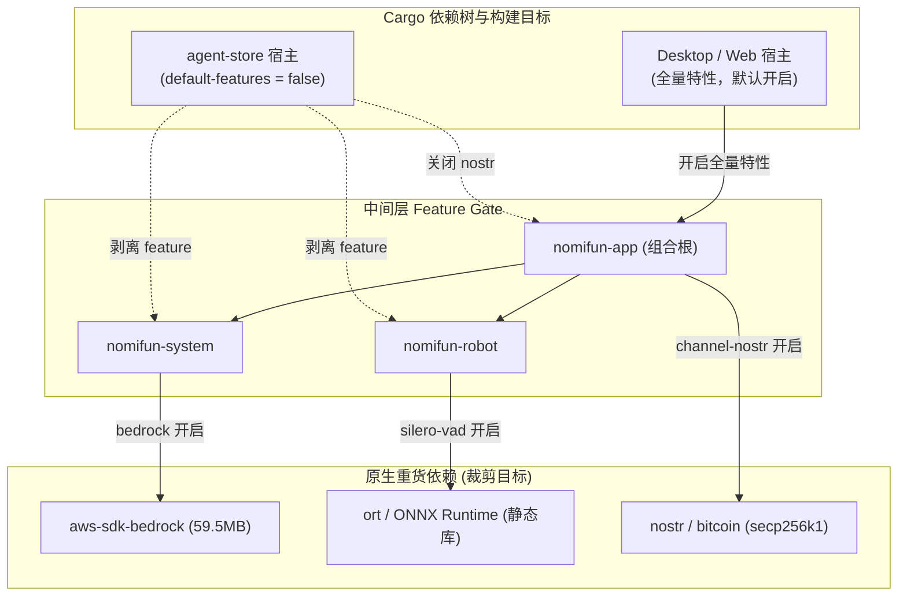

# Agent Store 二进制瘦身：Feature Gate 裁剪 · 技术方案

> **状态**：✅ **代码与编译验证完成**（Windows x86_64 二进制体积优化）  
> **核心原则**：按需打包与平滑降级 —— **Feature Gate 默认开启保持既有宿主零影响**，**独立 Store 宿主剔除原生重货依赖**，**特性未启用时提供类型安全与显式错误**。

---

## 1. 背景与核心痛点

### 1.1 业务背景
`agent-store.exe` 是 Agent Store 独立分发的轻量级宿主服务。用户在 CLI 或通过 SDK 启动时，期望获得小巧、快速拉起的服务进程。

### 1.2 现状与两大痛点
在早期构建中，`agent-store.exe` 的 Release 二进制体积高达 **218.7 MiB**：

1. **后端单体全量链接，背负大量无用机器码**  
   PE 节区实测显示，机器代码（`.text`）占到了 **160.7 MiB**，内嵌静态资产实际仅占 ~6.4 MiB。体积大头主要来源于全量静态链接的 Rust 依赖库。
2. **打包了与 Store 无关的桌面端专属原生“重货”依赖**  
   - `aws-sdk-bedrock`：自动生成的 AWS SDK 库，单个 rlib 体积高达 **59.5 MiB**；
   - `ort` / `ort-sys`：包含预编译的 ONNX Runtime 静态 C++ 运行时，仅用于桌面端的语音端点检测（Silero VAD）；
   - `nostr` / `bitcoin`：包含 secp256k1 加密库的第三方渠道集成（11.1 MiB）。

### 1.3 裁剪预期对比表

| 依赖模块 | 原体积贡献 | 裁剪手段 | 关停后行为 |
|---|---|---|---|
| **AWS Bedrock SDK** | ~59.5 MiB | `bedrock` Feature Gate | 显式返回 `BadRequest("Bedrock is not supported in this build")` |
| **ONNX Runtime (Silero)** | ~25+ MiB | `silero-vad` Feature Gate | 自动降级为轻量能级检测（`EnergyVad`），零外部二进制依赖 |
| **Nostr (Bitcoin Crate)** | ~11.1 MiB | 禁用 `nomifun-app` 的 `channel-nostr` | 彻底移除对 secp256k1 的静态链接 |
| **整体可执行文件体积** | **218.7 MiB** | — | **预计降至 ~150-160 MiB（体积压减 ~25-30%）** |

---

## 2. 方案全景与架构设计

### 2.1 依赖裁剪架构图

通过在顶层与中间层精准引入 Feature Gate，切断 Store 宿主对底层原生二进制重货的依赖传递：



### 2.2 目标与非目标

#### 核心目标
1. **显著缩减体积**：剔除三大无用重货，大幅减轻网络下载与启动冷加载开销。
2. **零副作用与宿主兼容**：所有 Feature Gate 默认保持开启，确保桌面端（Desktop）与 Web 端的全量功能不受任何破坏。
3. **类型安全与优雅降级**：特性关闭时，代码结构和类型定义依然无条件保留，路由挂载保持契约一致，仅在内部函数执行时提供受控的显式报错或平滑降级。

#### 明确的非目标
- **不拆解大型单体 Crate**：本阶段不开展巨型结构体 `AppServices` 的解耦手术，以最低工程代价获取最高收益。

---

## 3. 详细设计

### 3.1 模块一：`nomifun-system` 引入 `bedrock` Feature

#### 1. Cargo 依赖配置
```toml
[features]
default = ["bedrock"]
bedrock = ["dep:aws-config", "dep:aws-sdk-bedrock"]

[dependencies]
aws-config = { workspace = true, optional = true }
aws-sdk-bedrock = { workspace = true, optional = true }
```

#### 2. 代码受控降级
- 路由挂载类型（如 `ConnectionTestRouterState`）无条件保留，确保与上位组合根类型兼容；
- 当 `bedrock` 关闭时，发起 Bedrock 连接测试或模型获取均返回显式错误：`AppError::BadRequest("Bedrock is not supported in this build")`。

---

### 3.2 模块二：`nomifun-robot` 引入 `silero-vad` Feature

#### 1. Cargo 依赖配置
```toml
[features]
default = ["silero-vad"]
silero-vad = ["dep:ort"]

[dependencies]
ort = { workspace = true, optional = true }
```

#### 2. VAD 算法自动回退
- 开启时：使用基于 ONNX Runtime 的深度学习语音活动检测模型（Silero VAD）；
- 关闭时：打印告警日志并自动降级为基于纯算力的轻量能级检测（`EnergyVad`），完全移除对底层 C++ ONNX Runtime 的物理依赖。

---

### 3.3 模块三：Store 宿主精准收敛构建

在 `apps/agent-store/Cargo.toml` 中，通过禁用默认特性并按需显式指定核心模块，排除 Nostr 渠道与两大原生重量级特性：

```toml
# apps/agent-store/Cargo.toml

[dependencies]
nomifun-app = { workspace = true, default-features = false, features = [
  "channel-web",
  "channel-wecom",
  # 显式排除 channel-nostr, bedrock, silero-vad
] }
```

---

## 4. 核心决策与权衡

| 编号 | 决策点 | 选定方案 | 放弃的替代方案与理由 |
|---|---|---|---|
| **D1** | **裁剪实施路径** | **基于 Cargo Feature Gate 精准裁剪** | ❌ 彻底重构拆分 Backend Crate：涉及 40+ Crates 的组合根重写，周期长且破坏性极大。 |
| **D2** | **特性默认值** | **默认开启（Default = ON）** | ❌ 默认关闭：导致桌面端和其他全功能宿主发生破坏性功能丢失。 |
| **D3** | **关闭期降级语义** | **显式报错 / 优雅降级** | ❌ 直接让代码物理消失（编译期宏消除函数）：导致上层路由组装断裂，编译大面积报错。 |

---

## 5. 验收标准与测试矩阵

| 编号 | 验证场景 | 断言标准与验收口径 |
|---|---|---|
| **S1** | **依赖树彻底剥离** | 执行 `cargo tree -p nomifun-app-server` 与 `cargo tree -p agent-store`，输出中完全不包含 `aws-sdk-bedrock` 与 `ort`。 |
| **S2** | **宿主编译正常通过** | `cargo check -p agent-store` 编译一次性通过，类型断言无异常。 |
| **S3** | **桌面端零功能回归** | `cargo test -p nomifun-system` 与 `cargo test -p nomifun-robot` 默认特性下单测全部全绿。 |
| **S4** | **受控报错验证** | 在 Store 宿主中尝试调用 Bedrock 连接探测，系统返回可读的 `Bedrock is not supported in this build` 错误。 |

---

## 附录：原始技术底稿与历史归档 (Historical & Technical Reference Archive)

> **归档说明**：以下完整保留重构前的原始技术底稿、历次讨论与历史记录全文，供历史追溯、协议字段详细对照与技术审计。

---

# Agent Store 二进制瘦身：feature gate 裁剪记录

> 2026-09-04。目标：降低 `agent-store.exe`（Windows x86_64）体积。
> 状态：**代码改动完成、编译验证通过；release 重构建与全量测试未跑**。
> 结论先行：砍掉 AWS SDK / ONNX Runtime / bitcoin 三块重货（依赖树已验证归零），预计 exe 218MB → ~150-160MB（未实测）；模块级冗余（外部 runtime 通路、语音栈等）需要组合根手术，暂缓，决策依据见 §4。

## 1. 背景：218MB 都是什么

### 1.1 体积构成实测

对 `target/release/agent-store.exe`（218,724,864 字节）做 PE 节区分析：

| 节区 | 大小 | 内容 |
|---|---|---|
| `.text` | **160.7MB** | 机器代码 |
| `.rdata` | **50.5MB** | 常量/字面量/内嵌资产数据 |
| `.pdata` | 6.0MB | 异常展开表 |
| `.reloc` + `.data` | ~1.6MB | 重定位/可写数据 |

关键事实：**内嵌前端只占 5.8MB**（web/dist，经 rust-embed 落在 `.rdata`），builtin-skills 0.5MB——内嵌资产合计 ~6.4MB，不是体积主因。大头是机器代码，即"静态链接了什么"的问题。

### 1.2 根因：后端单体全量链接 + 桌面级原生依赖

agent-store 的定位是"商店宿主"，但实现上不是轻量服务：

1. **链接整个 Flowy 后端单体**。`apps/agent-store/src/main.rs:346` 调 `nomifun_app::create_router(&services)`，与 desktop（Tauri）、web 共用同一组合根。AppServices 是 30+ 字段的巨型结构体，路由挂载 60 个路由组，所有模块 boot 无条件构造。
2. **依赖树包含桌面产品专属的原生重货**：
   - `aws-sdk-bedrock`（nomifun-system 硬依赖）：AWS 生成的 SDK，单 crate rlib 59.5MB——全依赖树最大单项
   - `ort`/`ort-sys`（nomifun-robot 硬依赖）：ONNX Runtime 静态库，Silero VAD 语音端点检测用，构建期从 download-binaries 拉预编译二进制
   - `nostr` → `bitcoin`（nomifun-channel/nostr）：Nostr 渠道 + secp256k1，rlib 11.1MB
3. release profile 已开 `lto = "thin"` + `codegen-units = 1` + `strip = true`（Cargo.toml 有注释记载这是专为压体积调的），218MB 是裁剪后的数字，不是"没优化"。

### 1.3 rlib 体积排行（`build.noindex/release/deps` 实测）

| crate | rlib | 说明 |
|---|---|---|
| aws_sdk_bedrock | 59.5MB | AWS SDK 代码生成产物 |
| nomifun_gateway | 51.3MB | Platform Gateway（MCP 签发器 + provider 能力） |
| nomifun_ai_agent | 49.4MB | Agent 核心：工具执行、ACP、知识补全 |
| nomifun_app | 38.0MB | 组合根：bootstrap、路由、桌面/lan 逻辑 |
| nomifun_db | 31.8MB | SQLite 仓储层 |
| nomifun_channel | 31.6MB | 12 渠道插件框架 |
| nomifun_conversation | 29.8MB | 会话/消息/流式 |
| nomifun_api_types | 28.1MB | 全量 API 类型 + serde |
| nomifun_companion | 24.0MB | 数字员工模型 |
| nomifun_cron | 14.0MB | 定时任务（依赖 chrono-tz 17.8MB） |
| nomifun_knowledge | 14.3MB | 知识库（→ anydoc → lopdf 14.0MB） |
| nomifun_extension | 15.1MB | 技能目录/插件 |
| nomifun_app_server | 17.1MB | App Server WS 协议（商店核心） |

自有 crate 合计 ~350MB rlib，加第三方框架（axum/tokio/hyper/rustls/reqwest/sqlx+rusqlite bundled/prost/rmcp/chrono-tz/lopdf）构成 `.text`+`.rdata` 的主体。

## 2. 已落地：feature gate 裁剪

### 2.1 原则

**gate 默认开启，现有宿主（desktop/web）行为零变化；只有 agent-store 关闭。** 避免任何"顺手改默认"造成桌面产品回归。

### 2.2 新增 feature 与源码改动

**`nomifun-system` 加 `bedrock` feature（default 开启）**

Cargo.toml：
```toml
[features]
default = ["bedrock"]
bedrock = ["dep:aws-config", "dep:aws-sdk-bedrock"]   # 两个 aws 依赖均改 optional
```

源码 gate 点（feature 关闭时语义 = 明确报错，不是静默消失）：
- `src/lib.rs`：`bedrock_probe` 模块声明与 re-export **保留无条件**（`ConnectionTestRouterState`/`ConnectionTestService`/`connection_test_routes` 是 nomifun-app 路由挂载点，类型必须存在）
- `src/bedrock_probe/service.rs`：`test_bedrock_connection` 函数体 `#[cfg(feature = "bedrock")]` 二选一——开启走原 AWS 逻辑；关闭返回 `AppError::BadRequest("Bedrock is not supported in this build")`。`validate_bedrock_config` 纯 serde 校验，无条件保留（测试模块原样）
- `src/model_fetcher/fetchers.rs`：match 臂 `"bedrock"` 分裂——开启走 `fetch_bedrock`；关闭返回 BadRequest。`fetch_bedrock` 函数本体 `#[cfg(feature = "bedrock")]`

**`nomifun-robot` 加 `silero-vad` feature（default 开启）**

Cargo.toml：
```toml
[features]
default = ["silero-vad"]
silero-vad = ["dep:ort"]
[target.'cfg(not(all(target_os = "macos", target_arch = "x86_64")))'.dependencies]
ort = { workspace = true, optional = true }
```
（原注释保留：Intel macOS 无 ONNX Runtime 预编译包，该平台本来就无 ort——现在的 feature 语义与之对齐。）

源码 gate 点：
- `src/vad/mod.rs`：`pub mod silero` 的 cfg 变为 `all(feature = "silero-vad", not(macos x86_64))`；`build_engine` 中 Silero 分支同 cfg，新增 `#[cfg(any(not(feature = "silero-vad"), macos x86_64))]` 分支打日志 "silero VAD not linked (silero-vad feature off or ONNX Runtime unavailable), using energy VAD" 后降级 `EnergyVad`——与既有运行时降级语义一致（模型缺失本来就会降级）
- 两个直连 `silero::SileroVad` 的测试（`vad/mod.rs` 内 + `session.rs:1051`）加同样的 cfg

**`nomifun-app` 加转发 feature**

```toml
bedrock = ["nomifun-system/bedrock"]
silero-vad = ["nomifun-robot/silero-vad"]
default = [ ...原 12 渠道..., "bedrock", "silero-vad" ]
```

**`nomifun-app` 关闭 nostr 渠道（经既有 channel feature 机制，无需新 gate）**

agent-store 不开 `nostr` feature，`nomifun-channel/nostr` 的 optional 依赖 bitcoin/nostr 自然脱落。

### 2.3 workspace 声明改为 no-default（关键机制，踩过一次错）

Cargo 规则：**workspace 继承（`.workspace = true` 或 `features` 简写）时成员不能写 `default-features = true` 去重开默认**——agent-store 最初这么写直接报错 `default-features = false cannot override workspace's default-features`。反过来，把 workspace 声明改成 no-default 后，成员也不能重开。

因此最终形态：
- workspace 根 `Cargo.toml`：`nomifun-app`、`nomifun-system`、`nomifun-robot` 三处 `default-features = false`
- `apps/desktop/Cargo.toml`：显式列出 nomifun-app 全部 12 渠道 + bedrock + silero-vad + computer-use + browser-use + managed-search（等于原 default + 原有 extras，语义不变）
- `apps/web/Cargo.toml`：显式列出 12 渠道 + bedrock + silero-vad
- `apps/agent-store/Cargo.toml`：`nomifun-app = { workspace = true, features = ["qqbot"] }`——只开 qqbot 渠道（保守占位，见 §5 待办 3），bedrock/silero-vad/nostr 不开

feature unification 注意：nomifun-app-server/gateway/shell 直连 `nomifun-system.workspace = true`（无 features），在 agent-store 构建里它们看到的是 no-default 的 system——安全，因为 system 源码已保证 no-default 可编译；在 desktop 构建里 nomifun-app 的 `bedrock` 转发使统一后的 system 带 bedrock——同一次构建里 feature 全局统一，`cargo tree` 已验证两条链一致。

### 2.4 验证结果

| 验证 | 命令 | 结果 |
|---|---|---|
| system 无 bedrock 可编译 | `cargo check -p nomifun-system --no-default-features` | ✅ |
| system 默认（bedrock）可编译 | `cargo check -p nomifun-system` | ✅ |
| robot 无 silero 可编译 | `cargo check -p nomifun-robot --no-default-features` | ✅ |
| robot 默认可编译 | `cargo check -p nomifun-robot` | ✅ |
| agent-store 整链可编译 | `cargo check -p agent-store` | ✅ |
| 依赖树归零 | `cargo tree -p agent-store -e normal` grep aws-sdk-bedrock/ort-sys/bitcoin/nostr | ✅ 全部 0 命中 |
| nomifun-app feature 收敛 | `cargo tree -p agent-store -f "{p} {f}"` | 只剩 `qqbot` |

### 2.5 预期收益（推算，未实测）

| 项 | rlib 体积 | 状态 | 依据 |
|---|---|---|---|
| aws-sdk-bedrock | 59.5MB | 已砍 | cargo tree 归零 |
| ort/onnxruntime | 数十 MB（静态 .lib） | 已砍 | cargo tree 归零 |
| nostr + bitcoin | 11.1MB | 已砍 | cargo tree 归零 |
| chrono-tz | 17.8MB | 保留 | cron 时区核心，商店 preset 若含调度即需要 |
| lopdf | 14.0MB | 保留 | 知识库 PDF 解析链 |

注：rlib ≠ exe 增量（exe 只收被调用代码，LTO 还会再删），59.5MB rlib 不等于 exe 减 59.5MB。按 `.text`/`.rdata` 比例与 LTO 残留推算，**预计 exe 218MB → ~150-160MB**。精确数字待 release 重构建。

## 3. 附带修复（同会话，非体积目标）

- **B 兜底市场源**（nomifun-app-server）：config.toml 缺失/无 `[default_marketplaces]` 时自动注册内置三源（experts/skills/connectors，当时指向 VPS 公网 manifest `http://111.170.173.22:10072/…`；**2026-09-15 起改为官网站点 `https://agent-store.flowyaipc.cn/source/…`**，见 `18` §11 D1）
- **A `agent-store init` 子命令**（apps/agent-store/src/init.rs 新文件）：`--template-only` 非交互生成模板；交互式收集 provider（API key 只从 `AGENT_STORE_INIT_API_KEY` 环境变量读）；`--force` 覆盖已存在文件
- **agent_store_config 默认路径**：agent-store 二进制此前从不设置 `agent_store_config`（web 主机有设），兜底机制对它不生效——现在启动默认指向 `~/.agent-store/config.toml`
- 测试：agent-store 7/7、nomifun-app-server 59/59 全绿（含新增 builtin 源完整性测试）

## 4. 未做：模块级冗余（组合根手术）

### 4.1 已验证的冗余清单（源码证据）

**① 四个外部 Agent runtime 通路——最实在的一块**

`AgentType` 枚举（nomifun-common/src/enums.rs）五种：`Acp` / `OpenclawGateway` / `Nanobot` / `Remote` / `Nomi`。工厂（nomifun-ai-agent/src/factory/mod.rs:321-325）对五种全部 match 编译：

```rust
match options.agent_type {
    AgentType::Acp => acp::build(...),
    AgentType::OpenclawGateway => openclaw::build(...),
    AgentType::Nanobot => nanobot::build(...),
    AgentType::Remote => remote::build(...),
    AgentType::Nomi => nomi::build(...),
}
```

但 App Server 有硬策略门（nomifun-app-server/src/lib.rs:3720）：

```rust
fn validate_nomi_runtime_type(runtime_type: Option<&str>) -> ... {
    if runtime_type != Some("nomi") {
        return Err(...Forbidden(
            "App Server compatibility policy only allows Presets resolved to a Nomi Runtime Agent"));
    }
}
```

测试明确断言 `validate_nomi_runtime_type(Some("acp")).is_err()`。**商店运行的永远是 Nomi runtime**。ACP 通路（factory/acp.rs 896 行 + acp_assembler.rs + manager/acp/ 四个文件）包含：Codex/Claude CLI 子进程 spawn（`CliAgentProcess::spawn_for_sdk`）、codex sandbox 命令准备、bunx 崩溃恢复（下载缓存重装）、agent-client-protocol 0.11（带 unstable features）、tokio-tungstenite。OpenClaw/Nanobot/Remote 三条同理全部白编。

**② 会议/语音栈**（AppServices boot 无条件构造，services.rs:2891-2900）
`MeetingSessionService` + `MeetingRuntime` + `MeetingListenService` + `spawn_event_loop` fanout ×2。商店没有麦克风，录音/转写触发点不存在。连带 symphonia（音频解码）、opus 编解码（nomi-agent 内嵌 FFI）。

**③ 终端/SSH/机器人装配**
`TerminalService`（进程级 PTY 池，AutoWork 与终端路由共用）、`ssh_pool`（SSH 连接池 + host book）、`robot_wiring`（LAN 机器人网关装配——本轮只砍了 ONNX 推理器，装配代码与 opus/symphonia 仍在）、`meeting_tray` 模块。

**④ 渠道框架本体**
`nomifun_channel` 的 manager/plugin_factory/message_loop/queue_drain/message_service 仍在链接（本轮只摘了 nostr 的 bitcoin 11MB）。商店没有收件箱；qqbot 是否需要待查证（§5）。

**⑤ 知识库 PDF 链**
`nomifun_knowledge` → `anydoc` → `pdf-inspector` → `lopdf`（14.0MB）。商店 preset 的 `knowledge_mcp_config: None` 是合法构造态（AgentFactoryDeps 注释明确 None 时禁用 ACP knowledge_search，对 Nomi runtime 同理为可选）。

**⑥ 杂项无条件构造**
media/vimax/canvas（视频画布！）三个 service 在 services.rs:3103-3115 无条件 new；requirement MCP 服务器（AutoWork 声明工具，`requirement_complete`/`requirement_update_status`）；nomifun_cron（商店流程未证实使用，chrono-tz 17.8MB 挂在它下面）。

**⑦ nomifun-gateway（51.3MB）——不能直接砍**
商店会话可能经 `GatewayMcpConfig` 注入 `nomi_*` 平台工具；该 config 在商店启动路径是否 Some 未查证（§5 待办 4）。查证前保持链接。

### 4.2 结构性原因：为什么 feature gate 到此为止

`AppServices`（nomifun-app/src/services.rs:1087 起，30+ 字段）与 `create_router`（60 个路由组）是三个宿主共用的单一组合根，没有"商店模式"开关。meeting/terminal/ssh/media 等字段是**非 Option 的具体类型**，字段级别无法用 `None` 规避——必须 `#[cfg]` 整段条件编译（字段 + 构造 + 全部消费点），牵一动百。这就是本轮只能砍"依赖树叶子"（optional dep + 函数体 gate）而砍不动模块的原因。

### 4.3 若做：方案、预期与代价

**方案**：nomifun-app 加 `agent-store` feature 组（或反向 `host-minimal`）；AppServices 各模块字段改 `Option` + cfg（或空实现类型）；`create_router` 对应路由组条件挂载；工厂 match 臂限 `AgentType::Nomi`（其余 `unreachable!`/编译期剔除）；App Server 的 store/install/market/conversation-run 路径原样保留。

**预期**：①外部 runtime 四通路 + ②语音 + ③PTY/SSH + ⑤PDF 链 + ⑥杂项，估再砍 40-60MB，exe 至 80-100MB。

**代价**：组合根级手术。每个 cfg 遗漏会在 create_router 状态构造连环爆编译错（fail-fast，但也意味着要逐个补）；desktop/web 必须全量回归。估 2-4 个专注日。

**建议**：先跑本轮 release 基线；若 81MB zip 下载体验可接受，手术推迟到商店独立成熟、确需轻量 runtime 交付时再做。

## 5. 待办

1. **release 基线实测**：`cargo build --release -p agent-store --features static-webui`，记录 exe/zip 实际大小，回填 §2.5
2. **全量回归**：nomifun-app-server 59 测试、robot 测试、`cargo check -p Flowy -p nomifun-web`（desktop/web 宿主的显式 feature 列表改动需确认无回归）
3. **查证 qqbot**：agent-store 是否真需要任一渠道；若可零渠道，channel 框架整块进下一轮裁剪候选
4. **查证 GatewayMcpConfig**：商店启动路径是否 Some（决定 gateway 51.3MB 可否进下一轮）
5. **组合根手术决策**：依据 §2.5 实测 + §4.3 建议
6. 改动已入库：commit `720354a4d`（feat(agent-store): 二进制瘦身 feature gate（bedrock/silero-vad）+ run steer 通路 + init 子命令与内置市场 fallback）——含 §3 的 A+B 功能改动。

## 6. 改动文件清单（已提交 `720354a4d`）

| 文件 | 改动 |
|---|---|
| `Cargo.toml`（workspace） | nomifun-app/nomifun-system/nomifun-robot 三处 `default-features = false` |
| `crates/backend/nomifun-system/Cargo.toml` | `[features]` 新增；aws 两依赖改 optional |
| `crates/backend/nomifun-system/src/lib.rs` | （中途方案迭代，最终无 gate 残留） |
| `crates/backend/nomifun-system/src/bedrock_probe/service.rs` | 函数体 cfg 二选一 + 明确错误分支 |
| `crates/backend/nomifun-system/src/model_fetcher/fetchers.rs` | `"bedrock"` match 臂分裂 + `fetch_bedrock` cfg |
| `crates/backend/nomifun-robot/Cargo.toml` | `silero-vad = ["dep:ort"]`，ort 改 optional |
| `crates/backend/nomifun-robot/src/vad/mod.rs` | `pub mod silero`/`build_engine` cfg + 降级日志 + 测试 cfg |
| `crates/backend/nomifun-robot/src/session.rs` | silero 测试 cfg |
| `crates/backend/nomifun-app/Cargo.toml` | bedrock/silero-vad 转发 + default 扩充 |
| `apps/agent-store/Cargo.toml` | `default-features = false, features = ["qqbot"]` + 注释 |
| `apps/desktop/Cargo.toml` | 显式全量 feature 列表 |
| `apps/web/Cargo.toml` | 显式全量 feature 列表 |
| `apps/agent-store/src/init.rs`（新） | `init` 子命令实现（§3） |
| `apps/agent-store/src/main.rs` | `init` 子命令分发 + agent_store_config 默认路径（§3） |
| `crates/backend/nomifun-app-server/src/agent_store.rs` | 内置兜底市场源常量 + 完整性测试（§3） |
| `crates/backend/nomifun-app-server/src/lib.rs` | `ensure_default_marketplaces` 兜底逻辑（§3） |
