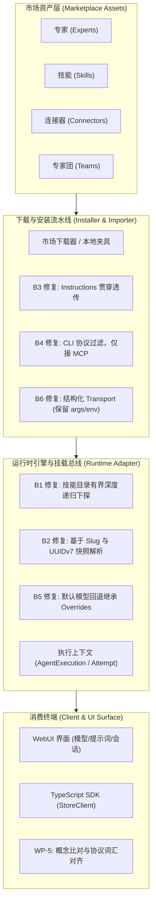

# Agent Store 四链路资产闭环与协议概念对齐技术方案（Four-Chain Lifecycle & Protocol Alignment）

> 状态：工程规范（四链路已闭环实测通过，协议词汇对齐按 v1 内部推进）  
> 适用范围：Agent Store 全品类资产生命周期（专家、专家团、技能、连接器）、`webui` 与 TypeScript SDK 通信协议面  
> 关联设计：[`05-flowy-agent-store-app-server-protocol.md`](file:///c:/workspace/allo/docs/agent-store/05-flowy-agent-store-app-server-protocol.md)、[`07-typescript-sdk.md`](file:///c:/workspace/allo/docs/agent-store/07-typescript-sdk.md)、[`12-sdk-packaging.md`](file:///c:/workspace/allo/docs/agent-store/12-sdk-packaging.md)、[`13-p0-execution-plan.md`](file:///c:/workspace/allo/docs/agent-store/13-p0-execution-plan.md)、[`16-sdk-webui-site-priority-plan.zh.md`](file:///c:/workspace/allo/docs/agent-store/16-sdk-webui-site-priority-plan.zh.md)  
> 核心原则：**打通四类资产“下载 $\to$ 安装 $\to$ 挂载 $\to$ 使用”端到端链路；协议层面严格对齐 Codex app-server 概念内涵，保持协议 v1 内部演进，不虚构 v2 与跨版本迁移包袱。**

---

## 1. 背景与核心问题

Agent Store 旨在构建统一的智能体资产交易与运行底盘。但在早期开发集成时，系统呈现“局部能力割裂”状态，集中表现为两大核心断层：

1. **四链路资产消费割裂（断点频发）**：
   - **技能不可见/无法挂载**：安装后的技能目录层级与扫描器预期不一致（两层子目录 vs 一层扫描），且 Mention 解析时无法正向穿透快照子树；
   - **专家人设丢失**：前端导入后安装器在生成底层 Preset 时硬编码丢弃了 Body Instructions，导致专家运行失去灵魂；
   - **连接器伪装与崩溃**：CLI 类工具被无脑映射为伪 MCP Server 造成启动即崩溃，且 stdio 传输丢失了命令行参数与环境变量；
   - **Mention 覆盖丢弃**：由于默认模型回退解析逻辑重新初始化了 Overrides，导致用户显式 Mention 的技能与连接器在运行时被丢弃。
2. **协议词汇与生态主流（Codex）脱节**：
   - 内部命名空间与调用习惯自成一体，外部集成人员认知成本高，需要明确梳理与 Codex app-server（`thread` / `turn` / `item`）的映射关系。

---

## 2. 方案全景与资产调度拓扑

系统通过 7 个有序工作包（WP-1 至 WP-7）推进修复与对齐，打通四类资产的生命周期闭环：



---

## 3. 详细技术方案

### 3.1 四大关键断点深度修复方案 (WP-1, WP-2)

针对真实联调中发现的核心断点（B1 至 B6），确立底层解决方案：

1. **B1 & B2：技能扫描下探与快照路径解析**：
   - `nomifun-extension` 的 `scan_skill_dirs` 扩展为**有界两层深度扫描**，当一级子目录不含 `SKILL.md` 时继续探测子目录，确保覆盖 `agent-store/<snapshot_id>/<slug>/` 路径。
   - `resolve_skill_source_path` 增加按 slug 模糊匹配逻辑，当存在多个历史快照版本时，依据 UUIDv7 时间序自动锁定最新活跃快照。
2. **B3：专家人设 Body 透传**：
   - 在 `nomifun-importer` 的 `AgentDoc::to_payload` 中显式绑定 Frontmatter 之后的 Markdown 正文为 `instructions`。
   - `app_server_installer` 在执行 `create_agent_store_preset` 时将该 instructions 存入 Preset 持久化行，确保模型提示词完整。
3. **B4 & B6：连接器分类适配与完整传输参数保留**：
   - `app_server_installer` 校验连接器类型：仅对 `stdio-mcp` 与 `remote-mcp` 创建 MCP Server 注册项；纯 `cli` 工具跳过 MCP 注册并记录安全审计警告。
   - 连接器 Payload 扩展结构化 `transport` 配置块（包含 `command`、`args: Vec<String>`、`env: HashMap<String, String>`），消除仅靠 Summary 纯文本反解析丢失参数的缺陷。
4. **B5：Mention 覆写继承保障**：
   - 在处理无预设模型的 Agent Run 时，提供 `with_default_model` 辅助函数，确保在赋予系统默认模型时，完整继承 `apply_mentions` 产出的 `include_skills` 与 `mcp_server_ids`，杜绝技能在运行瞬间被丢弃。

### 3.2 资产“使用”边界判定标准

| 资产类型 | “使用 (Use)”的生产标准定义 | 边界与当前约束 |
| :--- | :--- | :--- |
| **专家 (Expert)** | `agents.list` 暴露合法 `preset_id` $\to$ 发起 `agent/run` 顺利完成 | 真实模型（mimo-v2.5 等）全链路已实证。 |
| **技能 (Skill)** | `skills.list` 可见 $\to$ 随 Run 发起 Mention $\to$ 成功挂载至 Prompt 上下文 | 必须与 Expert 联合 Mention 启动，不可单独裸跑。 |
| **连接器 (Connector)** | `connectors.list` 可见 $\to$ 用户启用（Enable） $\to$ 探针发现工具 $\to$ Run 内被模型实际调用 | 默认状态为 `enabled=false`（安全防线）；真实调用通过本地/远程 MCP 验证。 |
| **专家团 (Team)** | `teams.list` 呈现团队拓扑与角色配置 | **V1 阶段仅验收元数据安装**，复杂 planned DAG 运行时依赖 Phase 2 Team Spike。 |

### 3.3 协议词汇对齐规范 (WP-5 架构指导)

针对与 Codex app-server 的对齐，制定以下准则：

1. **坚持 v1 内部演进，摒弃“v2”虚名**：
   - 系统尚未发布正式 1.0 版本，当前所有协议调整均属于 v1 内部概念重构，不设冗长的双版本兼容与弃用废弃期。
2. **基于实体内涵而非表象映射（Concept Fidelity）**：
   - **`run` 概念保留**：Allo 的 `run` 是对复杂持久化执行聚合（`AgentExecution`）的公共投影，涵盖规划、重试、子步骤与崩溃自愈，不同于单一轮次交互 `turn`，因此保留 `run` 命名空间。
   - **`thread` / `conversation` 语义对齐**：对于多轮聊天流，规范化采用 `conversation` / `thread` 语义，下沉 `ConversationHandle`。
3. **保留底层核心传输契约**：
   - 维持 `initialize` 握手契约指纹校验；
   - 维持回环 WebSocket 传输（不对齐 STDIO）；
   - 维持单向递增 sequence 游标事件驱动模型。

### 3.4 模块实施路线图 (WP-1 至 WP-7)

| 阶段 | 编号 | 核心工作内容 | 关键产出与验收判定 |
| :--- | :--- | :--- | :--- |
| **P0** | **WP-1** | 服务端内部断点修复 (B1–B4) | 补齐 extension / importer / installer 单测，全部通过。 |
| **P0** | **WP-2** | 四链路端到端 Live 验收 | 脚本 `sdk-live-store-chain.ts` 20/20 PASS（逼出并解决 B5/B6）。 |
| **P0** | **WP-3** | P0-A/B 稳定性与安全收口 | 18/18 PASS + 10/10 PASS，硬杀自愈标为 `recovery_required`。 |
| **P1** | **WP-4** | SDK 核心工效包 (REQ-PAR-05) | `models/list`、`TurnResult`、`ConversationHandle`、`withRetry` 落地。 |
| **P1** | **WP-5** | Codex app-server 概念比对与词汇拍板 | 产出精确字段映射表，统一双端命名。 |
| **P1** | **WP-6** | npm 跨平台发行链路 | 发布 `0.1.0-beta.2` 及 `runtime-win32-x64`，支持零配置拉起。 |
| **P2** | **WP-7** | WebUI 生产化交互补齐 | 模型选择器联动、默认模型标记、附件上传（推进中）。 |

---

## 4. 关键决策与权衡矩阵

| 决策点 | 备选方案 A | 备选方案 B | 最终决策 | 决策依据与权衡 |
| :--- | :--- | :--- | :--- | :--- |
| **协议演进版本策略** | 设立全新 Protocol v2，为 v1 提供 6 个月弃用期 | 在 v1 正式发版前直接完成重构，不设 v2 迁移包袱 | **方案 B** | 产品尚未公开发布，引入多版本维护会造成 SDK 与服务端的双倍开发与测试浪费，直接在正式发版前完成收敛性价比最高。 |
| **四链路测试策略** | 全程依赖远端公网市场与真实 API | 本地静态 Fixture 夹具为主 + 官网站点冒烟 | **方案 B** | 网络波动与公网资产变更会导致 CI 假红；本地独立夹具保证测试 100% 可重复、无外部网络副作用。 |
| **连接器默认状态** | 安装后立即自动启用（Enabled=true） | 安装后保持禁用（Enabled=false），提示人工确认 | **方案 B** | 外部连接器具备系统命令执行与网络请求权限，遵循最小特权原则，防止恶意或不受信资产自动提权。 |
| **技能路径结构** | 强制打平安装目录为单层结构 | 保留 `agent-store/<snap>/<slug>` 隔离并在扫描器支持两层探针 | **方案 B** | 多层快照路径保障了不同版本同名技能的隔离与原子回滚能力，改动扫描器深度成本极低。 |

---

## 5. 验收标准与测试用例

### 5.1 四链路 Live 验收用例表

| 编号 | 测试链 | 测试夹具 / 场景 | 核心断言与通过标准 |
| :--- | :--- | :--- | :--- |
| **C1** | 专家链 | `software-company` (codebuddy 插件) | `agents.list` 包含目标 Agent，`preset_id` 非空，真实发起 `agent/run` 终态达到 `completed`。 |
| **C2** | 技能链 | `skill-market` (workbuddy 技能市场) | `skills.list` 成功发现已装技能；专家 + 技能双 Mention 顺利执行，技能成功挂载至提示词。 |
| **C3** | 连接器链 | `connectors` (stdio/remote MCP) | `connectors.list` 成功呈现；启用后通过 Probe 获取 Tool 清单；模型在 Run 中能真实触发并收到回包。 |
| **C4** | 专家团链 | `software-company` (teamInfo) | `teams.list` 成功呈现团队拓扑与 Leader 标识（不执行 DAG 运行时调度）。 |
| **S1** | 真实市场源 | 官网站点真实市场镜像 | 成功拉取并缓存目录索引，无网络超时崩溃。 |
| **TC-CONN-002** | 连接器异常 | 模拟 Probe 探测失败的连接器 | 服务端状态标记为 `error`，禁止虚报为 `connected`。 |

---

## 附录：原始技术底稿与历史归档 (Historical & Technical Reference Archive)

> **归档说明**：以下完整保留重构前的原始技术底稿、历次讨论与历史记录全文，供历史追溯、协议字段详细对照与技术审计。

---

# Agent Store 实施计划：四链路闭环与协议词汇对齐（原「协议 vNext」）

> 状态：现行计划（2026-09-09；发版前可改，非冻结，见 `16-sdk-webui-site-priority-plan.zh.md` §7 决策 4）；按优先级顺序执行，排期为范围值、按实测校准，不构成承诺
> **优先级调整（2026-09-09）**：SDK 与 WebUI 功能列为第一优先级、站点开发者体验为高优先级，**WP-5（协议词汇与概念对齐，原称「协议 vNext」）顺延**；新的执行顺序见 `16-sdk-webui-site-priority-plan.zh.md`。本文件中 WP-1~WP-4/WP-6 已完成部分继续有效，WP-7 剩余项（附件 / 图片输入）并入 `16`。
> 进展：WP-1 完成（B1–B4 修复）；WP-2 完成（四链路 live 20/20 PASS，live 另逼出 B5/B6 并修复，见 `15-store-chain-and-protocol-vnext-plan.zh.md` §10）；WP-3 P0-A/B 已关闭（18+10 PASS，见 `13-p0-execution-plan.md` §15），P0-C/D 的 OAuth 协议面证据完成（TC-OAUTH-001/002/004 26/26 PASS，live 另逼出 B7/B8 并修复，见 `06-connector-oauth-security.md` §12）；**WP-4 完成**（05a steer、05b models/list、05c TurnResult、05d ConversationHandle 9/9 PASS、05e withRetry）；**WP-6 已发布**（npm 四包 `0.1.0-beta.2` + `runtime-win32-x64`，第三方零配置安装实测通过）；WP-7 模型选择器完成（`models/list` 合并 config providers + webui 默认行/徽标/思考等级默认项），附件与图片输入待做
> 说明：模型 provider 唯一来源是 `~/.agent-store/config.toml`（`[providers.*]`），live 脚本不再经 `/api/providers` 运行时注册。
> 日期：2026-09-09
> 前置：`05`（协议 v1）、`07`（SDK v1）、`12-sdk-packaging.md`、`13-p0-execution-plan.md`、`16-sdk-webui-site-priority-plan.zh.md` §7（决策记录）
> 范围：① webui 与 SDK 的 专家/专家团/技能/连接器「下载 → 安装 → 使用」全链路；② App Server 协议对齐 Codex app-server

## 1. 两个主要目标（用户 2026-09-09 确认）

1. **全链路**：Agent Store 的 webui 与 SDK 均支持 专家 / 专家团 / 技能 / 连接器 四类资产「下载 → 安装 → 使用」；
2. **协议对齐**：App Server 协议对齐 Codex app-server 实现（影响 webui 与 SDK 的公共面）。

本计划另增补 A/B/C 三档补充目标（§5 排序、§6 执行要点、§8 延后清单）。

## 2. 现状：四链路的四个服务端断点（目标 1 的前置）

| 编号 | 断点 | 证据级别 | 根因 | 修复方向 |
|---|---|---|---|---|
| **B1** | 安装成功的技能在 `skill/list` 不可见，用户选不到 | **真机**（SDK live 脚本 `INSTALLED-SKILL-VISIBLE: false`；落盘 `<data>/skills/agent-store/<snap>/<slug>/SKILL.md` 已确认） | `scan_skill_dirs`（`nomifun-extension/src/skill_service.rs`）只扫一层；安装器落盘在两层深 | 扫描器对无 SKILL.md 的子目录有界下探；catalog local_key 自然变为 `agent-store/<snap>/<slug>` |
| **B2** | 技能 mention 到不了运行时（挂载为空） | 代码级 | `resolve_skill_source_path` 按名字只查平铺目录，不认识 agent-store 子树；`name_based_runtime_skill_names` 丢弃 source-qualified id | 名字解析增加 agent-store 子树查找（UUIDv7 目录取最新快照） |
| **B3** | 专家人设丢失：install 生成的 preset `instructions` 恒为空 | 代码级 | `AgentDoc::to_payload` 丢弃 `body`；`create_agent_store_preset` 写死空 instructions | payload 补 `instructions`（body），installer 透传 |
| **B4** | CLI 连接器被映射为 `stdio: npm install -g …` 的伪 MCP server | 代码级 | `connector_transport` 不区分 kind，任何非 http 摘要都当 stdio 命令 | cli 连接器跳过 MCP 注册（受控包装归 Phase 2）；V1 只注册 remote-mcp / stdio-mcp |

> 说明：SDK live 脚本中「skill mention run 被拒（invalid preset_id）」是脚本未带 agent mention 的构造问题，非产品断点；C2 用例须同时安装专家并以 agent mention 启动。

## 3. 边界定义（避免验收口径不清）

| 资产 | 「使用」的 V1 口径 | 说明 |
|---|---|---|
| 专家 | `agents.list` 可见（含 `preset_id`）→ run 完成 | A1 / TC-RT-001 已实证 |
| 技能 | `skill/list` 可见 → mention 被 run 接受并挂载 | B1/B2 修复后验收 |
| 连接器 | 安装 → `connectors.list` 可见 → enable → run mention 校验通过 + 工具列举 | 默认 `enabled=false` 属预期 UX；真实工具调用用本地 mock MCP 烟测；OAuth 运行时证据并入本链 |
| 专家团 | 下载 → 安装 → `teams.list` 可见 | **运行时为 Phase 2**，受 §12 门禁约束（P0-A/B 关闭前不立项 Team Spike） |

下载源：本地 fixture 为主（可重复），另加一条 VPS-A 真实市场（8305 / 公网 10072）冒烟；`ensure_default_marketplaces` 的超时放宽（120s→600s）随该冒烟验证。✅ **订正（2026-09-15）：VPS-A 的两条公网入口已退役**——默认市场源改为官网站点 `https://agent-store.flowyaipc.cn/source/…`（见 `18` §11 D1、`14` §3），`:10072` 明文镜像与 `:10014/downloads/` 旧产物目录都不再是对外入口；本条保留为当时的冒烟记录。

## 4. 目标 2：协议词汇与概念对齐（原称「协议 vNext」；方向已拍板）

> **术语与版本框架订正（2026-09-11，`16-sdk-webui-site-priority-plan.zh.md` §7 决策 4）**：工作包编号 **WP-5 不变**，但「vNext」这个说法在协议语境里退休——它隐含"下一版"，而本项属**协议 v1 内部**调整。协议在正式发版前只有一个版本（统一称 v1），因此**不设 v2、不设迁移窗口、不设弃用期、不设兼容承诺**。

- **对齐深度**：词汇与概念对齐 Codex app-server（候选：`thread / turn / item`），**属 v1 内部调整，不是 v2**。**rename 集合由概念比对决定**：只有概念确实重合才借用对方词汇——例如 `run` 是执行聚合（`AgentExecution` 的公共投影），与 `turn`（一轮对话）语义不同，故很可能**应保留 `run`**，强行改名是把名字改错而非"未对齐"；
- **stdio 不纳入**：SDK 维持 spawn + 回环 WS（`12` §2 非目标不变）；
- **保留资产**：`initialize` 握手（其值**不是版本号而是契约指纹**，须随 wire 变更 bump）、`dispatch_connection_request` 唯一分发、事件 sequence/cursor 语义；
- **第一步交付物**：Codex app-server **概念比对**——只回答「对方用这个词时指的是不是同一个东西」，据此定词汇。对齐对象是 **codex app-server**（IDE 用 JSON-RPC 服务端），不是 `sdk/python`；
- **影响面**：webui 事件层（`conversation-events` / `RunHandle` / REQ-PAR-03/04）、`@flowy-agent-store/client`、`@flowy-agent-store/sdk`、`05`/`07` 同步更新（无"标 v1 基线"这回事，也没有 SDK 0.2.0 这种版本门槛）；
- **动工条件**：概念比对 + approvals/stdio 边界确认后立项（WP-5）。

## 5. 优先级排序（执行顺序）

| 序 | 工作包 | 归属 | 为什么这个顺序 | 解锁 |
|---|---|---|---|---|
| **WP-1** | B1–B4 修复 + 单测 | 目标 1 | 纯服务端内部（extension / importer / installer），不碰协议面、风险低；不修则 webui 与 SDK 同断 | 四链路可验收 |
| **WP-2** | 四链路 live 验收 + 脚本资产化 | 目标 1 | 一次钉死四类资产；连接器链路顺带补 OAuth 运行时证据 | 可重复门禁脚本 |
| **WP-3** | P0-A/B 关闭（TC-RT-002/004/005/006/010 + P0-C/D 低成本项） | 稳定性 | §12 门禁：不关闭不能立项 Team Spike、不能宣布 v1 稳定；KPI 是「杀进程重启不伪装 completed」 | Team Spike 立项 + v1 发布资格 |
| **WP-4** | REQ-PAR-05 剩余（models/list、TurnResult 聚合、多轮 ConversationHandle、retry 辅助） | 目标 1 可用性 | 纯增量方法 / 纯 client 层，不与 WP-5 冲突；models/list 是唯一服务端真空缺 | SDK / webui 体验齐 |
| **WP-5** | Codex app-server 概念比对 → 拍板 → 协议词汇对齐立项 | 目标 2 | 先比对后动工；放最后，避免四链路验收做两遍（发版前只有 v1，无兼容窗口需要安排） | 目标 2 启动 |
| **WP-6** | 发行链路（npm 发布 + 二进制分发） | A 档 | 依赖 SDK 接口稳定（WP-4 后） | 第三方可真正安装 |
| **WP-7** | webui 生产就绪剩余（附件 / 图片输入、模型选择器联动） | 可用性 | 依赖 models/list（WP-4）；图片输入为全线缺口 | 产品化收尾 |
| 持续 | 提交清账 + 文档同步 | — | 每项完成即落 commit，避免发布前集中爆雷 | — |

并行准备：WP-5 的 spec diff 可与 WP-1~3 并行，不占主线。

## 6. 工作包执行要点

### WP-1 B1–B4 修复

- **B1**：`nomifun-extension/src/skill_service.rs` 的 `scan_skill_dirs` 增加有界下探（对无 `SKILL.md` 的子目录继续向下一层，上限覆盖 `agent-store/<snap>/<slug>`）；`list_available_skills` 与 `extend_catalog_with_directory` 两个 user 入口同时生效。
- **B2**：`resolve_skill_source_path` 在平铺查找未命中时，于 `user_skills_dir/agent-store/*/` 下按 slug 匹配（多个快照同名时取 UUIDv7 最新）。
- **B3**：`nomifun-importer/src/frontmatter.rs` 的 `AgentDoc::to_payload` 增加 `instructions`（`body`）；`app_server_installer.rs` 的 `create_agent_store_preset` 接收并写入。
- **B4**：`app_server_installer.rs` 的 `connector_transport` 前置 kind 判断，`cli` 类型不注册 MCP server（记 warning + 跳过）。
- 验收：各断点补单测（extension / importer / app-server 各自 crate）。

### WP-2 四链路 live 验收

脚本：`web/scripts/sdk-live-store-chain.ts`（SDK 进：`launchClient` + `client.*`，不直调 HTTP）。

| 链 | 夹具 / 源 | 判据 |
|---|---|---|
| C1 专家 | `fixtures/software-company`（codebuddy-plugin） | `agents.list` 含目标 agent 且 `preset_id` 非空；run 完成 |
| C2 技能 | `fixtures/skill-market`（workbuddy-skill-market） | `skills.list` 含已装技能；**agent + skill 双 mention** 的 run 完成且技能挂载 |
| C3 连接器 | connector 市场（remote-mcp 条目） | `store/install-entry` → `connectors.list` 可见 → enable → run mention 校验通过；真实调用用本地 mock MCP |
| C4 专家团 | `fixtures/software-company`（teamInfo） | `teams.list` 含团队；**不做运行时** |

附带：VPS-A 真实市场冒烟一条（验证下载源与超时放宽）；OAuth 运行时证据（TC-OAUTH-001/002/004 + TC-CONN-001/002）并入 C3。

### WP-3 P0-A/B 关闭

沿用 `13-p0-execution-plan.md` §4/§5 的范围与出口条件，不重复定义：

- P0-A：TC-RT-004 取消、TC-RT-002 版本冻结、TC-RT-010 规范化审计；
- P0-B：TC-RT-005/006 重启恢复 + 事件序（退出条件：engine 持久化改造 > 2 天则降级只验「不伪装」，记 BLOCKED 并写明原因）；
- P0-C/D：TC-API-002 幂等重放、TC-API-003 终态一致、OAuth 剩余用例。

### WP-4 REQ-PAR-05 剩余

按 `13` §6 既定条目：05b `models/list`（协议 + client，从 ProviderService 投影公共模型目录、不漏 key）→ 05c `TurnResult` 聚合（client 层，webui 后续切同一聚合）→ 05d 多轮 `ConversationHandle`（client 层）→ 05e `withRetry` 重试辅助（client 层）。顺序 05b→05c→05d→05e。

### WP-5 Codex app-server 概念比对 → 协议词汇与概念对齐

1. 拉取 codex app-server 协议文档 / 源码，产出**方法清单对照 + 事件对照 + 概念比对表**（含 approvals / login 等边界项的取舍标注）；方法清单可从 `dispatch_connection_request` 的现有 arm（约 63 个）机械导出；
2. 评审后拍板：**rename 集合**（哪些命名空间的概念真能映射、哪些应保留自有词汇）、approvals 是否纳入、webui 改动节奏（无迁移窗口 / 无弃用期需要拍板——发版前只有 v1）；
3. 协议文档（`05`/`07`）同步更新；实施含 webui 事件层重写（REQ-PAR-03/04 成果按新词汇重做）。

### WP-6 发行链路

- **二进制**：npm optionalDependencies（已定案，`12` §6）——按平台发布 `@flowy-agent-store/runtime-<platform>-<arch>`，`resolveAppServerBin` 查找顺序 `bin` → `AGENT_STORE_BIN` → `require.resolve` 包内二进制 → PATH；
- **npm 发布**：`protocol` / `client` / `sdk` 三包 + runtime 包，同版本锁步；发布前清理 dist 与 license 检查。

### WP-7 webui 生产就绪剩余

`11-webui-production-readiness.md` 剩余项：附件 / 图片输入（全线缺口）、模型选择器联动（依赖 WP-4 的 models/list）。

**模型选择器联动（2026-09-09 完成）**：`models/list` 改为 DB providers ∪ `~/.agent-store/config.toml`（裸启动不再为空，默认项取 config `default_model`）；webui 拉取该目录并补齐 DB-only provider、标注 `is_default`，新增「默认模型」行（已有会话解析回目录默认项）、思考等级「默认」项与提示文案。剩余：附件 / 图片输入。

## 7. 门禁与依赖

- §12 停止条件：P0-A/B 关闭前不得扩展 Team / Web；WP-1/2 属 v1 收口，不受限；Team Spike 在 WP-3 关闭后立项；
- WP-5 动工条件：spec diff 完成 + 边界拍板；
- WP-6 依赖 WP-4 接口稳定；
- WP-7 依赖 WP-4 的 models/list。

## 8. 明确延后（防 scope 蔓延）

```text
Team 运行时（Phase 2，WP-3 关闭后立项）
sandbox 一等参数
图片输入进 run
archive / resume / fork
approvals（除非 WP-5 拍板纳入）
多租户 / HA（00 AD-08 非目标）
```

## 9. 决策记录引用

1. 二进制分发走 npm optionalDependencies（`12` §6、`16` §7 决策 1）；
2. 协议词汇与概念对齐（候选 `thread/turn/item`，rename 集合由概念比对决定）、stdio 不纳入（`16` §7 决策 2；其**版本框架部分**已被 §7 决策 4 取代）。

---

## 10. 附录 · 四链路 live 验收证据（WP-2）

> 本节由 `four-chain-live-evidence.zh.md` 整体并入（2026-09-11）。原文的时间戳与「历史实测快照，非契约」定性**保持不变**。


> 状态：📎 证据（运行时实测快照，非契约）
> 日期：2026-09-09
> 脚本：`web/scripts/sdk-live-store-chain.ts`（SDK 公共面：`launchClient` + `client.*`）
> 模型：mimo-v2.5（provider 来自 Hermes attachments config，key 仅脚本内存）
> 最近一次结果：**20/20 PASS**（`RESULT PASS`）

### 1. 覆盖与判据

| 链 | 判据 | 结果 |
|---|---|---|
| C1 专家 | `agents.list` 含目标 agent 且 `preset_id` 非空；run 完成 | PASS |
| C2 技能 | `skills.list` 含已装技能；agent+skill 双 mention run 完成；会话快照冻结技能绑定 | PASS |
| C3 连接器 | `store/install-entry` → `connectors.list` 可见 → enable → probe 工具列举 → mention run 真实调用本地 mock MCP | PASS |
| C4 专家团 | `teams.list` 含团队（运行时为 Phase 2） | PASS |
| S1 真实市场 | 宿主默认市场（VPS-A 全树镜像：`experts` / `workbuddy-skills` / `connectors`）全部镜像进 store | PASS |
| TC-CONN-002 | 探针失败的连接器不得报 `connected` | PASS |

### 2. 最近一次运行记录

```text
data=C:\Users\15165\AppData\Local\Temp\agent-store-chain-1788932261601
PASS C1.import :: "completed"            # software-company 夹具
PASS C1.install :: 9
PASS C1.catalog-visible :: {"preset_id":"01a084ac-17fc-7251-a6cf-30d05796c94e"}
PASS C1.run-completed :: "completed"
PASS C4.team-visible :: {"id":"wb-software-company-team","lead":"wb-software-company-software-team-lead"}
PASS C2.import :: "completed"            # skill-market 夹具
PASS C2.install :: 2
PASS C2.skill-visible :: "hello"         # B1 修复实证
PASS C2.run-completed :: "completed"
PASS C2.skill-frozen-in-conversation     # B5 修复实证（会话 extra.skills 冻结 legacy:hello）
PASS S1.real-market-mirrored :: {"configured":["experts","workbuddy-skills","connectors"],"hit":[三个全中]}
PASS C3.store-visible / install(1) / catalog-visible / enabled
PASS C3.tool-listing :: {"success":true,"tools":["echo"]}     # B6 修复实证
PASS C3.mention-accepted / C3.run-completed
PASS C3.tool-called                      # 模型实际调用 MCP 工具，返回 echo:four-chain
PASS TC-CONN-002.install :: 1
PASS TC-CONN-002.probe-failure-not-connected :: {"probe_success":false,"status":"error"}
```

### 3. live 逼出的两个断点与修复

| 断点 | 根因 | 修复 | 验证 |
|---|---|---|---|
| **B5** 商店专家的技能/连接器 mention 永远失效 | `agent/run` 的 owner 默认模型回退分支用 `PresetOverrides{..Default::default()}` 重解析，丢掉 `apply_mentions` 产出的 `include_skills`/`mcp_server_ids`；agent-store preset 无模型绑定，必然走该分支 | `with_default_model` 合并助手，回退解析继承原 overrides | `default_model_fallback_keeps_mention_overrides` + C2.skill-frozen |
| **B6** stdio MCP 连接器丢 args/env | 导入只把 command 写进 `transport_summary`，注册时从 summary 重建 transport（`args=[]`），`bun.exe`/`npx` 类 server 空参启动即退出 | payload 增结构化 `transport`（command+args+env / url），`connector_transport` 优先取结构化值 | importer/installer 单测 + C3.tool-listing / C3.tool-called |

> 两个断点均由本脚本真机复现（B5：`C2.skill-frozen` FAIL；B6：probe 报 `Server closed stdout before responding`，库内 `transport_config.args=[]`）。

### 4. 未覆盖 / 后续

- **TC-OAUTH-001/002/004、TC-CONN-001**（OAuth 登录/凭据隔离/错误边界/工具命名空间）：需要 OAuth-capable MCP 服务与浏览器回环流程，本轮未做；已有证据见 `06-connector-oauth-security.md` §13（覆盖 TC-OAUTH-003 注入与刷新）。
- **C4 运行时**：受 §12 门禁约束（P0-A/B 关闭后立项 Team Spike），本轮只验「下载→安装→可见」。
- **夹具市场为本地目录**：真实市场只做了 S1 镜像冒烟；四链路的完整安装链路用本地夹具保证可重复。

### 5. 复现

```bash
cd web
AGENT_STORE_BIN=<repo>/target/debug/agent-store.exe bun scripts/sdk-live-store-chain.ts
# CHAIN_KEEP_DATA=1 保留实例数据目录供取证
```

退出码即判据：0 = 全部 PASS。宿主管理面（provider 注册、MCP enable/toggle）不是 App Server 协议方法，脚本内经 admin HTTP 完成并已标注 `[host admin]`。
