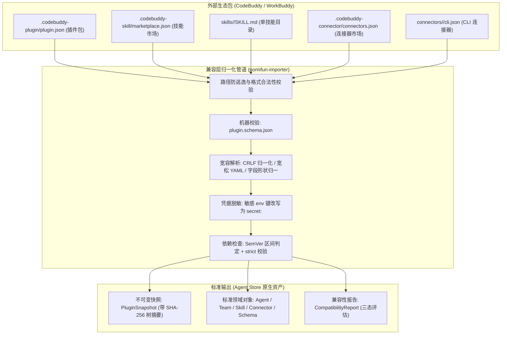

# 插件规范（兼容层） · 技术方案

> 状态：✅ 现行正文（未正式发版，可改；发版前统一称 v1，见 `16-sdk-webui-site-priority-plan.zh.md` §7 决策 4）；P1/P2/P3/P4 均已落地
> 日期：2026-08-26（更新：2026-09-11）
> 前置：[`00-architecture-decision.md`](file:///c:/workspace/allo/docs/agent-store/00-architecture-decision.md)、[`02-codebuddy-workbuddy-import-spec.md`](file:///c:/workspace/allo/docs/agent-store/02-codebuddy-workbuddy-import-spec.md)、[`03-codebuddy-compatibility-matrix.md`](file:///c:/workspace/allo/docs/agent-store/03-codebuddy-compatibility-matrix.md)
> 一句话原则：**以兼容吸收既有生态为首要目标，对来源格式只做安全归一化与快照封装；外部脚本一律零执行，敏感键自动改写为引用，机器校验守护格式底线**

---

## 1. 背景与核心痛点

CodeBuddy 与 WorkBuddy 生态积累了大量现存的专家与工具包。若直接强行推行全新的私有格式，会导致既有生态资产无法平滑迁移。引入兼容层规范的核心痛点在于：

### 1.1 核心痛点分析

1. **格式多样与语法松散**：外部生态包由不同作者在不同历史时期编写，存在单目录、市场包、插件包等不同布局；部分文件存在 Windows CRLF 换行、非严格 YAML、字段形状多变（如字符串与数组混用）等现实瑕疵。
2. **缺乏机器可校验的形式化约束**：仅依靠口头约定或非结构化文档，开发者与测试工具无法通过自动化脚本快速判断插件包是否合规。
3. **明文凭据与任意脚本执行威胁**：外部包中的 MCP 配置可能直接硬编码了开发者个人的明文 API Key，包内的生命周期钩子（Hooks）试图在导入期执行系统 Shell 命令。
4. **依赖语义混乱**：缺乏标准 SemVer 范围解析，或者未对缺少 Manifest 的破损条目进行显式拦截，导致装上后运行时报错。

---

## 2. 方案全景与兼容模型

### 2.1 兼容层归一化模型



### 2.2 核心目标与非目标 (Goals & Non-Goals)

- **核心目标**：
  - 稳定兼容吸收 CodeBuddy/WorkBuddy 既有五类资产结构。
  - 确立 `name` 为唯一必需字段，其余字段明确默认值。
  - 建立自动化机器校验机制（`plugin.schema.json`）。
  - 导入期零代码执行，敏感环境变量自动替换为受控安全引用。
- **明确非目标**：
  - V1 不定义私有原生插件格式（先专注兼容层）。
  - 不在导入期执行插件携带的 `bin/` 脚本或外部 Hook。
  - 不支持无 `plugin.json` 且未配置清单合成的非标准条目。

---

## 3. 详细设计 (按领域模块内聚)

### 3.1 兼容包识别路径布局

| 路径定位 | 结构含义与适用场景 | 必需级别 |
|---|---|---|
| `.codebuddy-plugin/plugin.json` | 独立插件清单（插件根目录即插件包） | 插件型必需 |
| `.codebuddy-plugin/marketplace.json` | 专家市场清单（条目分布在 `plugins/<id>/`） | 专家市场必需 |
| `.codebuddy-skill/marketplace.json` | 技能市场清单（条目分布在 `skills/<slug>/`） | 技能市场必需 |
| `skills/<slug>/SKILL.md` | 单技能目录（无市场清单） | 单技能必需 |
| `.codebuddy-connector/connectors.json` | 连接器市场清单（条目分布在 `connectors/`） | 连接器市场必需 |
| `connectors/<id>/cli.json` | 单 CLI 连接器定义文件 | 单 CLI 必需 |
| `agents/*.md` | 专家 Markdown 定义（Frontmatter + 正文） | 可选组件 |
| `hooks/` / `commands/` | 兼容源保留位（静态导入，不启用执行） | 可选组件 |

---

### 3.2 清单字段模型与宽容解析规则

三类清单中，**`name` 是全网唯一必填字段**（为空即触发 `MissingIdentity` 阻断）；其余字段均具备明确的默认行为：

| 字段名称 | 必需 | 预期类型 | 默认值 | 归一化与处理策略 |
|---|---|---|---|---|
| `name` | ✅ | `string` | — | 唯一必填项；参与派生稳定组件 ID；空白直接阻断。 |
| `version` | — | `string` | `"1.0.0"` | 记录为声明版本 `declared_version`。 |
| `description` | — | `string` | `""` | 基础文本说明，用于展示。 |
| `author` | — | `string \| {name, email}` | `""` | 宽容处理：对象形式归一化为 `"Name <email>"` 字符串。 |
| `agents` / `skills` / `commands` | — | `string \| string[]` | `[]` | 宽容处理：单字符串路径（`"./agents/"`）自动转为数组。 |
| `mcpServers` | — | `object` | `{}` | 解析为 ConnectorDefinition；敏感 env 自动脱敏改写。 |
| `userConfig` | — | `object` | `{}` | 配置 Schema 映射为 CredentialSchema；敏感项仅存引用。 |
| `dependencies` | — | `array \| object` | `[]` | 宽容处理：按类型分组的对象 `{connectors: [...]}` 展开为带 `group` 标记的条目。 |
| `teamInfo` | — | `object` | 无 | WorkBuddy 团队扩展 ➔ 映射为 `AgentTeamDefinition`。 |
| `displayName` / `profession` / `avatar` | — | `string \| object` | 无 | 界面展示元数据，完全保真透传；头像文件随快照复制。 |
| `quickPrompts` / `tags` | — | `localized[]` | `[]` | 双语数组完整保留，用于前端快捷动作展示。 |

#### 宽容解析容错机制 (Tolerant Parsing)
- **CRLF 归一化**：解析前强制转换 Windows 行尾，杜绝跨平台 Digest 计算不一致。
- **宽松 YAML 回退**：针对包含裸冒号、内嵌 JSON 字符串的非标 Frontmatter，标准解析失败后自动降级到行级正则提取，确保核心元数据不丢失。
- **同名消歧**：当插件内 Agent 与 Skill 同名时，Skill 自动追加 `-skill` 后缀。

---

### 3.3 真实市场已出现但未消费字段治理

通过对真实市场数据的普查（Census），以下字段在兼容源中真实存在，系统采取**保真透传但不消费（宽容忽略）**策略：

| 字段名称 | 出现频率与场景 | 现状与处理策略 |
|---|---|---|
| `plugin` | experts 市场内 7 个插件清单 | 透传元数据，不参与功能映射。 |
| `members` | 3 个团队插件清单 | 透传；团队结构严格以 `teamInfo` 为准。 |
| `license` / `homepage` / `repository` | 少量开源插件清单 | 仅存入快照 Provenance，供展示与合规审计。 |
| `distribution` / `settings` | 个别定制化插件清单 | 透传；不影响标准运行时调度。 |

---

### 3.4 凭据安全改写与沙箱隔离 (`secret:<KEY>`)

1. **导入期零执行铁律**：导入仅进行磁盘文件复制与结构化解析，禁止唤起任何外部脚本或二进制解释器。
2. **敏感环境变量自动脱敏改写**：
   - 当检测到 MCP 连接器的 `env` 中存在敏感键（键名包含 `api`, `token`, `secret`, `key`, `password` 等）时，导入器在生成快照前自动将其值改写为受控引用：
     $$\text{值} \longrightarrow \text{"secret:<KEY>"}$$
   - 真实 Token 绝不落库、不写入快照 JSON；运行时启动 MCP 进程时，由宿主进程内存中的 `[credentials]` 字典按引用替换注入。如果缺少对应凭据，该变量直接被省略（Fail-Closed）。

---

### 3.5 依赖与冲突规则

- **依赖表示**：支持纯字符串（`"plugin-a"`）或带版本约束的对象（`{"name": "plugin-a", "version": "^1.2.0"}`）。
- **SemVer 范围解析**：支持裸版本（精确）、`^`（次版本兼容）与 `~`（修订版本兼容）。
- **双层依赖阻断与逃生口**：
  - 导入层与扩展加载层均具备严格依赖检查能力。
  - 系统提供全局逃生配置：`~/.agent-store/config.toml` 中的 `[import].strict_dependencies = false`（默认关，保留宽松历史行为；设为 true 时不可满足强依赖直接阻断安装）。
- **市场条目 `strict` 约束**：
  - 市场条目声明 `strict=true` 时，来源目录必须自带 `.codebuddy-plugin/plugin.json`，缺失时条目在列表可见但标记 `blocked` 且不可安装。

---

## 4. 机器可校验架构与验收口径

本规范的正式机器可校验契约落地于：
- Schema 定义：[`docs/agent-store/schemas/plugin.schema.json`](file:///c:/workspace/allo/docs/agent-store/schemas/plugin.schema.json)
- 自动化校验脚本：`scripts/check-agent-store-market.mjs`

### 4.1 自动化校验验收命令

```bash
# 1. 对官方三大市场执行全量合规校验 (断言 0 errors)
node scripts/check-agent-store-market.mjs --market experts=./market/experts --market skills=./market/skills

# 2. 运行 Schema 自测 (断言非法测试样本被精确定位并拦截)
node scripts/check-agent-store-market.mjs --self-test
```

---

## 5. 已知偏差与实现状态总表 (P1 ~ P5)

| 编号 | 偏差现象与风险 | 修复证据与实施落点 | 最终状态 |
|---|---|---|---|
| **P1** | MCP 连接器 `env` 明文写入快照 | `nomifun-importer` 自动改写为 `secret:<KEY>` 引用；装配期动态注入；真实值仅在内存。 | ✅ **已闭环** |
| **P2** | 数组形式裸字符串依赖丢失名称 | 新增 `normalize_dependency`，支持裸字符串与分组对象双向解析。 | ✅ **已修复** |
| **P3** | 依赖 SemVer 范围检查未闭环 | 导入层与 Extension 加载层引入 `semver::VersionReq`；配置 `strict_dependencies` 统一受控。 | ✅ **已闭环** |
| **P4** | 市场条目 `strict=true` 未强制阻断 | `app_server_marketplace` 增加判定，缺失清单时条目展示阻断原因且禁止安装。 | ✅ **已闭环** |
| **P5** | `strict=false` 时条目代替清单未实现 | 历史行为跳过无清单条目，反向清单合成涉及架构扩充，列入后续专项。 | ⏸ **未实现 (单独立项)** |

---

## 附录：原始技术底稿与历史归档 (Historical & Technical Reference Archive)

> **归档说明**：以下完整保留重构前的原始技术底稿、历次讨论与历史记录全文，供历史追溯、协议字段详细对照与技术审计。

---

# 插件规范（兼容层）

> 状态：**现行正文（未正式发版，可改；改动同步更新）**——本规范在发版前只有一个版本（统一称 v1），不设 v1/v1.1/v2 之分（`16-sdk-webui-site-priority-plan.zh.md` §7 决策 4）。覆盖范围：字段表（§3）、组件映射（§4）、版本/溯源/幂等（§5）、权限与安全边界（§6）、依赖与冲突（§7），以及机器可校验形态（`docs/agent-store/schemas/plugin.schema.json` + `scripts/check-agent-store-market.mjs`）。
> 已知偏差见 §10：**P2 已修**；**P3 / P4 已于 2026-09-11 落地**（依赖阻断两层 + 市场条目 `strict`）；**P1（凭据明文）已于 2026-09-11 落地**（值不入快照、只留 `secret:NAME` 引用，MCP 启动时按引用解析注入）；**P5（条目代替清单）仍为未实现项**（在唯一现行版本内补齐，无版本路径）。**保留的约束**：任何变更走**显式修订 + 偏差登记**，不静默修改本规范。
> **定位：本规范只定义「兼容层」。** 依 `16` §4 Q5 的决策——**先只做兼容层**——Agent Store **尚未定义原生插件格式**；此处规定的是「Agent Store 当前接受什么、如何归一化、边界在哪」，而非插件作者应当遵循的自有格式。
> 字段级映射详表见 `02-codebuddy-workbuddy-import-spec.md`（本规范不重复，只固定必填/可选/默认与冲突规则）。
> 代码事实来源：`crates/backend/nomifun-importer/`、`crates/backend/nomifun-extension/`、`crates/backend/nomifun-api-types/src/app_server.rs`。

---

## 1. 定位与非目标

**当前接受的格式**是 CodeBuddy / WorkBuddy 生态的既有格式（`.codebuddy-plugin/`、`.codebuddy-skill/`、`.codebuddy-connector/`）。Agent Store 的角色是**归一化 + 快照**，不是定义格式。

因此：

- 字段语义、默认值、保留位**以兼容源为准**；Agent Store 不擅自扩展语义；
- 兼容源新增字段时，Agent Store 的行为是「保真透传展示元数据」或「忽略」，**不猜测**；
- 一旦未来定义原生格式，本规范以**新增章节或独立文档**承载该格式，兼容层降为「导入源」并保留（这是**范围**问题，不是版本升级）。

**非目标（V1）**：原生格式定义；插件脚本执行；生命周期钩子执行；LSP；`bin/` / `scripts/` 运行；权限沙箱（见 §6）。

---

## 2. 插件包布局（兼容层接受）

| 路径 | 含义 | 必需 |
| --- | --- | --- |
| `.codebuddy-plugin/plugin.json` | 插件清单（根即一个插件） | 插件型必需 |
| `.codebuddy-plugin/marketplace.json` | 专家市场清单（`plugins[]`，条目在 `plugins/<id>/`） | 市场型必需 |
| `.codebuddy-skill/marketplace.json` | 技能市场清单（条目在 `skills/<slug>/`） | 技能市场必需 |
| `skills/<slug>/SKILL.md` | 单技能目录（无清单） | 单技能必需 |
| `.codebuddy-connector/connectors.json` | 连接器市场清单（条目在 `connectors/`） | 连接器市场必需 |
| `cli.json` | 单 CLI 连接器 | 单 CLI 必需 |
| `agents/*.md` | Agent 定义（frontmatter + 正文） | 可选 |
| `hooks/`、`commands/` | 兼容源保留位 | 可选，**不启用** |

---

## 3. 清单字段：必填 / 可选 / 默认

三份清单按 §2 的路径发现。**`name` 是唯一必填字段**（空白视为缺失，导入阻断为 `MissingIdentity`）；其余全部可选且有明确默认。

| 字段（wire key） | 必填 | 类型 | 默认 | 处理 |
| --- | --- | --- | --- | --- |
| `name` | ✅ | string | — | 唯一必填；参与 ID 派生（§5）；空白 → 阻断 |
| `version` | — | string | 无 | 记为 `declared_version` |
| `description` | — | string | 无 | 展示 |
| `author` | — | string \| `{name, email}` | 无 | 对象形式归一化为人名（有 email 时附上） |
| `agents` / `skills` / `commands` | — | string \| string[] | `[]` | 单字符串与数组都接受；`agents`/`skills` 参与归一化，`commands` 仅记录 |
| `hooks` | — | object | 无 | 仅记录，**不启用** |
| `mcpServers` | — | object | 无 | 参与归一化 |
| `lspServers` | — | string \| object | 无 | V1 元数据级（仅保留服务器名清单），**不启用** |
| `userConfig` | — | object | 无 | 配置 schema → `CredentialSchema`；敏感值仅引用安全存储 |
| `dependencies` | — | array \| object | `[]` | 对象形式按 kind 展开为条目并附 `group` 标记（§7） |
| `teamInfo` | — | object | 无 | WorkBuddy 扩展 → `AgentTeamDefinition`（`02` §6） |
| `displayName` / `profession` / `displayDescription` / `defaultInitPrompt` | — | localized | 无 | 展示元数据，**保真透传** |
| `quickPrompts` / `tags` | — | localized \| localized[] | `[]` | 同上 |
| `avatar` | — | string（相对路径） | 无 | 资产随快照复制，经受控端点 serve |
| `expertType` / `categoryId` / `agentName` | — | string | 无 | 展示 / 分类 |
| `defaultEnabled` / `channels` | — | — | — | 安装 / 启用策略元数据 |

**宽容解析规则**（兼容源真实数据形态不一，以下差异一律归一化，不报错）：

| 字段 | 接受形态 |
| --- | --- |
| `author` | `"张三"` 或 `{"name": "张三", "email": "…"}` |
| `agents` / `skills` / `commands` | `"./agents/"` 或 `["./agents/a.md"]` |
| `dependencies` | 数组 `[{name}]` 或按 kind 分组的对象 `{connectors: ["x"]}` |
| 展示元数据 | 字符串或按语言的对象 |

> **字段级唯一正文是 `02-codebuddy-workbuddy-import-spec.md` §4 / §5**（含每个字段的来源与保留清单）；本规范只固定**必填性、默认值与宽容规则**。

> 📌 **`strict` 不是插件清单字段，而是市场条目字段**（表位置订正，2026-09-11）——它写在 `.codebuddy-plugin/marketplace.json` 的 `plugins[]` 行上（`02` §8），**检查的对象**才是插件清单：`true` 要求插件来源**自带** `.codebuddy-plugin/plugin.json`，`false`（默认）允许市场条目补充或代替清单。上面这张表只列**插件清单**字段，故不再包含它。实现现状见 §10 P4（`strict=true` 阻断已落地）与 §10 P5（条目代替清单未实现）。

**冲突规则**：市场条目字段与插件清单字段合并时逐项比对，冲突以**插件清单为准**并记录冲突（不静默覆盖）。

**真实市场已出现、本规范未消费的字段（普查 2026-09-10，T20）**——下列字段在当前实现里**透传但不消费**（宽容解析接受，不参与归一化）。登记在此是为了让字段表与真实数据一致；若要真正消费其中某一项，按**显式修订**定义：

| 字段 | 出现处 | 现状 |
| --- | --- | --- |
| `plugin` | experts 市场内 7 个插件清单 | 透传（未消费） |
| `members` | 3 个专家团队的插件清单 | 透传（团队扩展以 `teamInfo` 为准） |
| `license` / `homepage` / `repository` | 少量插件清单 | 透传（未消费） |
| `distribution` | 1 个插件清单（`{channels, primaryChannel}`） | 透传（未消费） |
| `settings` | 1 个插件清单（`{defaultAgent, channelManifest}`） | 透传（未消费） |

> 复现：`node scripts/check-agent-store-market.mjs --census --market <name>=<dir>`（输出里 `?` 前缀即本表来源）。市场清单层面的同类字段（如 `owner`）登记在 `18` §11 D3/D7。

---

## 4. 组件映射

| 来源 | 归一化为 | 备注 |
| --- | --- | --- |
| `agents/*.md` | `AgentDefinition` | frontmatter 字段按 `02` §5.1 保留清单 |
| `skills/<slug>/` | `SkillDefinition` | 含 `SKILL.md` 与其附属文件 |
| 连接器清单条目 | `ConnectorDefinition` | 凭据按 §6 处理 |
| Team 扩展（WorkBuddy/CodeBuddy 特有） | `AgentTeamDefinition` | 见 `02` §6 |
| 插件根 | `PluginSnapshot` | 一次导入产出一个不可变快照 |

---

## 5. 版本、兼容性与溯源

| 项 | 语义 |
| --- | --- |
| `declared_version` | 清单声明的版本（可缺省） |
| `resolved_revision` | 解析到的修订（git commit / HTTP ETag / 内容摘要标记） |
| `content_digest` | 快照内容摘要，用于幂等与去重 |
| `imported_at` | 导入时间戳 |
| ID | 来源 slug 不作为业务 ID；建议 `wb-<pluginId>-<agentId>`（来源稳定前提下） |

**幂等**：相同 `content_digest` 重复导入 → 返回已有快照，不产生新快照。

**兼容性状态**取值：`compatible` / `compatible-with-adapter` / `manual-review` / `pending-legal-review`（未确认版权资源不进公开分发）。

**对外不暴露来源路径**：`source_kind` / `source_uri` / `relative_path` 仅供内部追溯。

---

## 6. 权限、凭据与安全边界（导入期）

- 导入**只复制与解析，不执行任何脚本或命令**；
- 生命周期钩子、LSP、`bin/` / `scripts/` 在执行安全模型落地前**不启用**；
- 权限声明与风险标签**不是沙箱**；不受信内容一律以「来源不可信」对待；
- 敏感字段（API Key、Token 等）导入时**只建立 schema 与引用**，值由用户后续通过安全存储提供；文档与日志统一写作 `[REDACTED]`。**引用的具体载体**：MCP 连接器 `env` 中**敏感键**（键名含 `api` / `token` / `secret` / `password` / `apikey`）的**值**被改写为 `secret:<KEY>`（`21` D5=C），真值由 `~/.agent-store/config.toml` 的 `[credentials]`（或进程 env）提供，MCP 启动时按引用解析注入——值既不落快照也不落库，缺凭据时该变量被省略（fail-closed）。

> ✅ **当前现状（2026-09-11 收口）**：`userConfig` 路径符合本节（只建 schema、值写 `[REDACTED]`）；**MCP 连接器的 `env` 值也不再原样写入快照**——导入期改写为 `secret:<KEY>` 引用（见上），原 **P1** 已闭合（§10 P1）。

---

## 7. 依赖与冲突

- `dependencies` 支持**字符串**或**对象**（`name` + `version` + 可选 `marketplace`）；
- 版本使用 **SemVer 范围**；
- 依赖不可满足时：阻断安装并给出缺失项，不做静默降级；
- `strict=true` 且插件源缺 `plugin.json` → 阻断（见 `02` §11.1 阻断规则）。

> ⚠️ **当前现状（T20 反向验证，2026-09-10；2026-09-11 补层级界定 + 两层阻断落地）**：**导入层**（本规范约束的这一层，`nomifun-importer`）的依赖声明既已归一化（数组与按 kind 分组两种形态，见 §10 P2），**SemVer 范围解析与「不可满足即阻断」也已于 2026-09-11 落地**（§10 P3；逃生口＝同一个 `[import].strict_dependencies`，**默认关**＝完全保留历史行为）；`strict=true` 的阻断同日落地在**条目发现 / 条目导入**这一层（§10 P4），`strict=false` 的「条目代替清单」仍未实现（§10 P5）。**层级界定**：`nomifun-extension` 的 extension 层**另有**一条链（`semver::VersionReq` 解析 + 已接进真实加载路径的加载期阻断），与导入层**不是同一物**，两层的逃生口是**同一个键**（一个键管两侧）。这两条在**本规范内直接补齐**（无版本路径）。

---

## 8. 演进

- 原生插件格式**待生态起量后**再定义；届时以**新增章节或独立文档**承载，并明确原生格式与兼容层的字段优先级（这是范围扩展，不是版本升级，故不涉及迁移路径与弃用窗口）；
- 在原生格式定义前，**不接受**任何以 Agent Store 名义扩展的私有字段。

---

## 9. 验收口径

按本规范 + `02`，能够**独立复现**一个可被 `market/add` → `market/refresh` → `store/list` → 安装 的插件包，且现有真实市场（experts / skills / connectors）逐条对照无例外。字段级细节以 `02` 为唯一正文。

**机器可校验形式（D2 / T19，2026-09-10）**：`docs/agent-store/schemas/plugin.schema.json` 是本节的机器可读版本（唯一必填 `name`、宽容形态、`avatar` 相对路径约束）。复核方式：

```bash
node scripts/check-agent-store-market.mjs --market experts=<dir> [--market …]   # 三个真实市场应 0 error
node scripts/check-agent-store-market.mjs --self-test                          # 非法样例必须被拒并给出字段级定位
```

---

## 10. 已知偏差

**登记规则（强制）**：规范与实现不一致时，**先在本节登记，再择一修正**——要么改实现，要么改规范，不允许默默不一致。每条偏差须写明：现象、证据位置、影响、待决选项。

| # | 现象 | 证据 | 影响 | 待决 |
| --- | --- | --- | --- | --- |
| P1 | ✅ **已修（2026-09-11，`16` R22）**——MCP 连接器的 `env` 值不再原样写入快照（§6 要求敏感值只留引用） | 落地：`nomifun-common/src/secret_ref.rs`（`secret:NAME` 语法 + 进程级凭据注册 + `resolve_env`，缺凭据即省略）；导入期 `import.rs` 的 `rewrite_secret_env` 把**敏感键**的值改写为 `secret:<KEY>`（`looks_sensitive_key` 与 `userConfig` 同一谓词）；装配期在 `nomifun-mcp` 连接测试与 `nomifun-ai-agent` 的 nomi / acp 两条装配路径（`factory/nomi.rs`、`factory/acp.rs`）按引用解析注入；宿主 `apps/agent-store` 启动时把 `[credentials]` 注册进进程（`AgentStoreConfig.credentials`，**不进** `config/get` / `config/set`）。原证据 `import.rs:1100-1112` 已改；测试 `importer_tests.rs` 改为断言快照只留 `secret:DEMO_TOKEN` 且无明文 | API Key / Token 不再随快照持久化；DB 行同样只存引用，真值仅存在于宿主进程内存与 `~/.agent-store/config.toml` | ✅ **已完成**：值不入快照 / 不落库、启动时按引用解析、缺值 fail-closed（两个安全面同批收口）。**边界**：仅按**键名**判定敏感（与 `userConfig` 同口径）——键名不含敏感词的凭据不自动脱敏（如需强制，属后续增强） |
| P2 | **数组形式的裸字符串依赖丢名** | 旧 `manifest.rs` 数组分支原样透传 → 消费端 `import.rs:667-670` 取 `name` 失败，回退 `dependency-<index>`；`version` / `marketplace` 也未解析 | 快照里的依赖成了无名条目，用户看不出依赖了什么 | ✅ **已修（2026-09-10，T20）**：新增 `normalize_dependency`（裸字符串 → `{"name": …}`），数组与按 kind 分组两种形态共用；单测 `bare_string_dependencies_keep_their_name`；`cargo test -p nomifun-importer --lib` **25 passed** |
| P3 | **依赖的 SemVer 范围与「不可满足即阻断」未实现——⚠️ 仅限「导入层」，须与 extension 层分开登记** | 导入层：`import.rs:664-681` 只把依赖登记为组件，从不参与安装决策（**此处「全仓无 `semver` 解析」的结论只对本消费面成立**）。extension 层**另有**一条链：`nomifun-extension/src/dependency.rs:112-129` 用 `semver::VersionReq` 解析（裸版本=精确 / `^` / `~`）且**已接进真实加载路径**（`registry_helpers.rs:46-61` 的 `load_and_validate` 在 `:56` 调用、`:57` 用 `load_order` 排序 ← `registry.rs:111` / `:166`），**阻断已于 2026-09-11 落地**（原结论「只缺阻断」已闭合：`registry.rs:136-138` 原先只 `warn!`，现由同文件的 `apply_dependency_policy` 把 `blocked_dependents` 当门） | §7 的版本范围与阻断语义当前只有「登记」这一半；**两层现状不同**，若混写成一句会互相打脸（`16` R23 行原即如此，已订正） | ✅ **两层均已落地（2026-09-11，`16` R23 两侧同批）**——extension 层不再「只 warn」：新增 `registry_helpers::blocked_dependents`（只取 `Missing` / `VersionMismatch` 的**依赖方**，环按 API 规范仍尽力加载）＋ `ExtensionRegistry::with_strict_dependencies`，初始化与热重载都经 `apply_dependency_policy`；逃生口＝`~/.agent-store/config.toml` 的 `[import].strict_dependencies`（`AgentStoreConfig::strict_dependencies()` → `nomifun-app` 的 `build_extension_states` 注入），**默认 `false`**＝保留历史行为（用户 2026-09-11 拍板；`16` §5.2 R23 行原写「阻断默认开」已据此更正为默认关）。**导入层亦已落地**：`nomifun-importer/src/dependency.rs` 新写 `check_dependencies`（SemVer 范围解析 + 与目录投影比对；裸版本=精确、`^`/`~` 同 extension 层语义），`ImporterService` 加 `.with_strict_dependencies(bool)`（默认 `false`），闸门放在**幂等判定之后、持久化之前**——已存在的快照不因重导被收回，新导入命中即返回 `blocked` 并列出缺失项（**不落库**）。**两处有意保守**（避免误伤，详见该模块文档）：① 只有**插件快照名**带可信版本，组件行只按**存在性**判定（组件 payload 的 `version` 是它宿主插件的版本，拿来比区间等于猜）；② 目录外部满足的依赖（内置技能、手工配置的 MCP 连接器）不可见，故不阻断。 |
| P4 | ✅ **`strict=true` 阻断已落地（2026-09-11）**（属**条目发现 / 条目导入**层；原判「完全未实现」已闭合） | 落地：`nomifun-app/src/app_server_marketplace.rs` 的 `strict_entry_block`（纯判定）+ `probe_plugin_market`（**保留**被阻断行而非静默跳过）+ `import_entry`（导入前闸门，不产生快照）；`nomifun-app/src/market_fetch.rs` 的 URL 内联清单同口径；线协议 `MarketplaceEntry.strict` / `blocked_reason` → `AppServerMarketplaceEntry` → `AppServerStoreItem.blocked_reason`；`nomifun-importer` 导出 `blocked_import_result` 让条目级阻断复用同一结果契约。**归属的独立旁证**：机器可校验形态 `docs/agent-store/schemas/marketplace.schema.json:55` **本来就把 `strict` 定义在 `$defs.entry`（市场条目）上**——与 §3 原表位置矛盾，本轮以 schema + `02` §8 为准 | §3（表位置已订正：`strict` 是**市场条目**字段）与 §7 / `02` §11.1 现已兑现 | ✅ **已完成**：`strict=true` 且来源缺 `.codebuddy-plugin/plugin.json` → 条目**可见且带原因**、导入返回 `blocked` 且**不落库**；`strict=false`（默认）行为逐字不变。**无逃生口**——`strict` 本身就是逐条声明。验证：真 app 端到端 `importer_market_strict_entry_is_listed_but_refused` + 3 条单测；见 `16` §5.3「R24 落地记录」 |
| P5 | **`strict=false` 的「市场条目可补充或代替清单」未实现**（2026-09-11 **有意拆出**，不属 `16` R24 验收范围） | 发现层对「无 `plugin.json`、且未声明 `strict`」的行**保持历史行为：跳过**（`probe_plugin_market`）；全仓没有从条目的 `commands` / `agents` / `skills` / `hooks` / `mcpServers` 反向构造清单的路径 | §3 的 `strict=false` 语义只实现了一半：不阻断，但**也不代替清单**——条目直接不可见 | ⏸ **未实现（需单独立项）**：打通它等于实现兼容层的清单合成，规模远大于「补一处判定」。与 P4 同源（`21` D6=A）但独立成条 |

> 说明：`02` §8 的「自动更新默认值」偏差登记在 `18-marketplace-spec.zh.md` §11（属市场行为，不属插件格式）。
