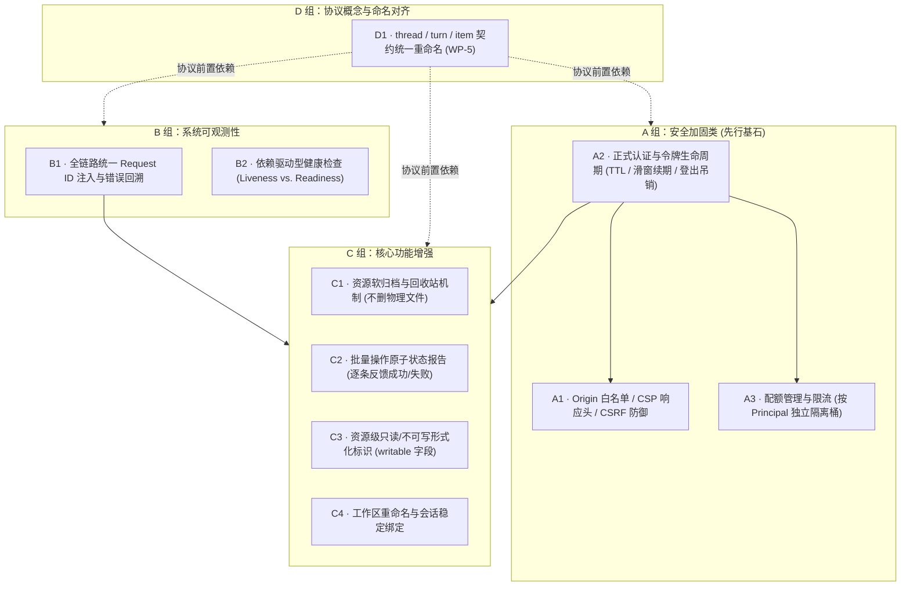
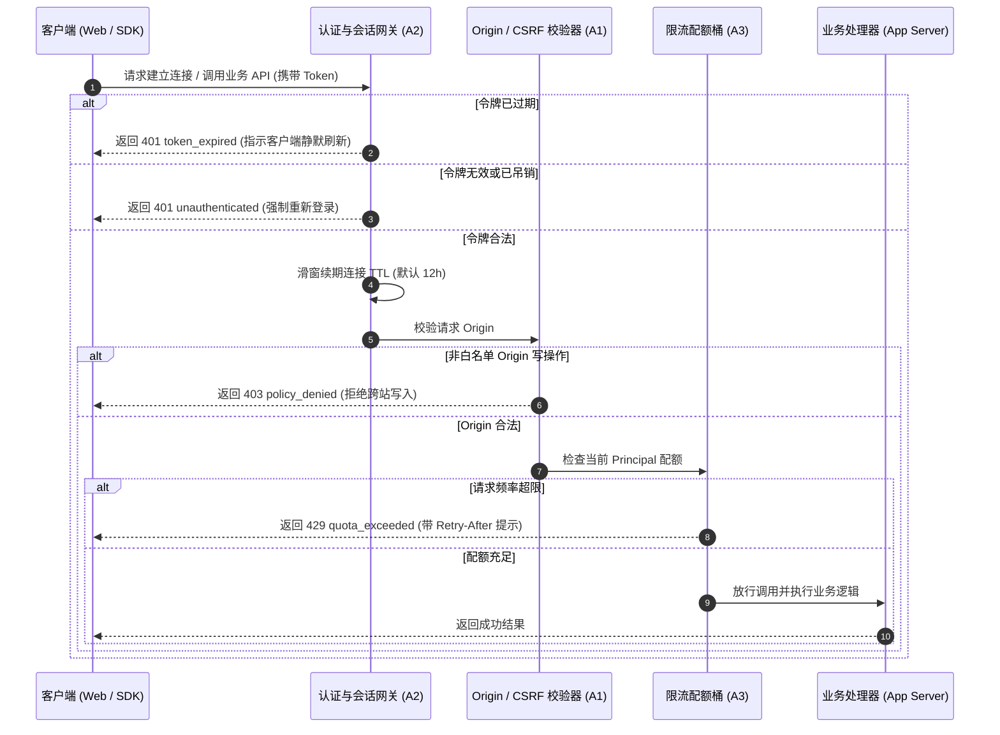

# WebUI / App Server 生产化方案 (Productionization) · 技术方案

> 状态：📋 专项立项实施中（A 组安全类动工中，以 A2 令牌管理为起点）；各组严格执行“不做假保护”红线
> 日期：2026-09-11
> 前置：[`05-flowy-agent-store-app-server-protocol.md`](file:///c:/workspace/allo/docs/agent-store/05-flowy-agent-store-app-server-protocol.md)、[`06-connector-oauth-security.md`](file:///c:/workspace/allo/docs/agent-store/06-connector-oauth-security.md)、[`16-sdk-webui-site-priority-plan.zh.md`](file:///c:/workspace/allo/docs/agent-store/16-sdk-webui-site-priority-plan.zh.md)
> 一句话原则：**以真实安全拦截、权威可观测性与严谨协议对齐为核心，坚决杜绝“只记录不拦截”的假保护，宁缺毋滥**

---

## 1. 背景与核心痛点

Agent Store 完成前期功能闭环验证后，必须从“原型可用”走向“生产就绪（Production-ready）”。在深入生产环境时，必须解决以下结构性问题：

### 1.1 核心痛点分析

1. **“假保护”比没有保护更危险**：若安全类（CSRF/Origin 校验）或配额限流类功能做成“仅记录日志但不阻断请求”，调用方会误以为系统具备安全防护，实质上任何恶意网页均可跨站发包攻击。
2. **连接令牌无生命周期治理**：开发期的 App Server 连接凭证常采用内存明文 UUID，缺乏过期时间（TTL）、缺乏主动吊销机制，一旦凭证泄露将永久有效。
3. **调用链追踪断层**：一次前端操作在“宿主后端日志”、“App Server 响应”与“前端错误提示”中没有统一的全局 Request ID 串联，导致排查线上故障时如同大海捞针。
4. **健康检查名不副实**：仅提供一个简单的 `ping` 返回 200，无法反映底层 SQLite 数据库是否锁死、数据目录是否不可写等真实健康状况。

---

## 2. 方案全景与四组条目拓扑

### 2.1 生产化四大专项领域

### 2.2 核心开发红线 (Strict Non-Negotiable Lines)

1. **坚决不做假保护**：安全类与配额类机制必须具备“硬性拒绝并返回结构化 4xx 错误”的能力。若只能做到“打日志记录”，必须明确标注未完成，绝不上线。
2. **拒绝空壳开关**：`capabilities.*` 中声明的特性必须精准映射到后端真实执行代码；未实现的能力保持 `false`，绝不在界面上放置不可用的占位控件。
3. **先定身份再定来源**：A1（Origin 校验）与 A3（配额限流）必须严格依赖 A2（正式认证体系），杜绝在未建立可靠主体身份前引入全局模糊限流。

---

## 3. 详细设计 (按组别内聚)

### 3.1 A 组：安全加固体系

#### A2 · 正式认证与令牌生命周期管理 (核心落地规格)
- **闲置 TTL 与滑窗续期**：每个 App Server 连接记录创建时间与过期时间。默认闲置 TTL 为 **12 小时**，每次接收到合法业务调用时自动顺延过期时刻。
- **错误码明确区分**：
  - 令牌超时过期 ➔ 返回 `token_expired`（401，`retryable=true`），驱动客户端自动续期。
  - 令牌伪造、不存在或已被吊销 ➔ 返回 `unauthenticated`（401，`retryable=false`）。
- **登出即时全局吊销**：用户在宿主端发起 `/logout` 时，触发 `SessionRevocationSink` 钩子，立即吊销该 `user_id` 下属的全部活跃 App Server 连接（包含已建立的 WebSocket 长连接）。
- **敏感信息零落盘与脱敏**：连接 Token 绝不写入系统日志，自动化测试强制断言日志脱敏。

#### A1 · Origin 校验与 CSP 响应头
- 非白名单域名的写操作（POST / WS 写入动词）一律硬性拦截，返回明确错误码。
- 宿主自身渲染页面强制注入严格的 `Content-Security-Policy` 响应头，阻止内嵌恶意脚本。

#### A3 · 细粒度配额管理
- 限流与配额按 `principal_id` 独立建桶，严禁采用可能造成不同用户互相干扰的“全局共享单一令牌桶”。

---

### 3.2 B 组：系统可观测性与真实健康检查

#### B1 · 全链路统一 Request ID
- 服务端为每个请求分配唯一的 `request_id`（基于 UUIDv7），贯穿整个调用生命周期：
  $$\text{Client Request} \longrightarrow \text{App Server Log} \longrightarrow \text{Response Header} \longrightarrow \text{WebUI Error Toast}$$
- 用户在前台遭遇报错时，弹窗直接展示该 ID，支持运维人员在后台日志中一键精确定位。

#### B2 · 依赖驱动型真实健康检查 (Liveness vs. Readiness)
- **Liveness 端点（免认证）**：仅检查进程基础事件循环与内存状态。
- **Readiness 端点（需鉴权）**：真实执行数据库轻量探测、工作区存储目录可写性检查。任一关键依赖不可用时，状态立即转为 `unhealthy`。

---

### 3.3 C 组：核心功能增强

| 功能条目 | 核心能力定义 | 边界与设计红线 |
|---|---|---|
| **C1 软归档与回收站** | 资产或会话归档后从默认列表隐藏，但保留底层文件；支持独立查询与一键恢复。 | 归档决不物理删除文件；删除操作保持显式不可逆。 |
| **C2 批量操作反馈** | 支持多选条目批量启用/禁用/删除；响应体中逐条回报各组件执行结果（成功/失败/跳过及原因）。 | 拒绝“部分失败却返回整体 200”的不透明行为；不支持跨组件复杂分布式事务。 |
| **C3 只读与不可写标识** | 资源模型正式扩展 `writable` 布尔字段，协议侧直接表达可操作性。 | 规则一处定义，严禁前后端分别硬编码鉴权逻辑；越权写入统一定义为 `policy_denied`。 |
| **C4 工作区安全重命名** | 允许用户修改工作区展示名称；系统内部仅更新别名映射，底层工作区物理目录保持不变。 | 绝不修改物理路径，防止断开历史任务与产物链接。 |

---

### 3.4 D 组：协议词汇与概念统一对齐 (WP-5)

- 将 App Server 协议中的早期术语统一收敛为标准概念模型：
  $$\text{Session} \longrightarrow \text{Thread}, \quad \text{Exchange} \longrightarrow \text{Turn}, \quad \text{Message/ToolCall} \longrightarrow \text{Item}$$
- **一次性切换，不设遗留兼容层**：发版前严格统一，SDK 与站点文档同步推进，避免长期维护两套命名增加认知负荷。

---

## 4. 验收测试用例 (以 A2 专项为例)

| 用例编号 | 验证场景与输入 | 预期可观察断言 |
|---|---|---|
| **TC-PRD-A2-001** | 令牌自然超时过期 | 注入小 TTL（如 100ms）连接，等待超时后调用 API，断言返回 `token_expired`。 |
| **TC-PRD-A2-002** | 活跃连接滑窗续期 | 在 TTL 内连续调用业务方法，断言连接成功续期，未被过早中断。 |
| **TC-PRD-A2-003** | 登出即时吊销 | 调用宿主 `/logout` 注销身份，原长连接再次发送消息立即被拒并返回 `unauthenticated`。 |
| **TC-PRD-A2-004** | 多用户连接隔离 | 吊销 User A 的连接，断言 User B 的并发连接不受任何影响，业务继续正常执行。 |
| **TC-PRD-A2-005** | 日志脱敏验证 | 扫描服务端执行全过程日志，断言无任何连接 Token 明文输出。 |

---

## 附录：原始技术底稿与历史归档 (Historical & Technical Reference Archive)

> **归档说明**：以下完整保留重构前的原始技术底稿、历次讨论与历史记录全文，供历史追溯、协议字段详细对照与技术审计。

---

# WebUI / App Server 生产化：立项页（A 组动工中）

> 状态：**立项页（2026-09-11）**。本页只做两件事：把 `16` §5.2 里 R33 那一行（方向四 11 项 + WP-5 协议词汇与概念对齐）拆成**可验收条目**，并把「不做假保护」写成红线。
> **本页不代表排期，也不含实现**：条目一律未开工；动工前先在本页登记范围与验收口径。
> **2026-09-11 状态更新（用户指令「22 A 组」）**：**A 组（安全类）已授权动工**，起点＝**A2**（A1/A3 依赖它）。范围、验收口径与实现决策登记在 **§7**；V1（优先级信号）由该指令兑现。B / C / D 组仍未排期。
> 相关：`16-sdk-webui-site-priority-plan.zh.md`（R33 行、§5.3「卡点处置四档」C 档判定）、`11-webui-production-readiness.md`、`15-store-chain-and-protocol-vnext-plan.zh.md`（WP-5）、`21-open-decisions.zh.md`。

---

## 0. 为什么单独立项

- **体量与性质**：11 项跨后端 / 协议 / 前端 / 安全，任何一项都不是「补个字段」；混在「继续完成任务表」里会被稀释成半条链路。
- **做错比不做更危险**：安全类与配额类若做成「只记录不拒绝」，就是**假保护**——比现状更危险（`16` §6 口径：宁可没有，不要假的）。
- **现状边界基本正确**：App Server 面已有连接令牌 + owner 闸门 + 只读来源判定；下面每一条都是在**这之上加密**，不是补漏。
- **顺序依赖**：**D 组（协议词汇与概念对齐）**会重命名 thread / turn / item 与若干载体字段 —— 它是 A–C 组里协议类改动的**前置**，先做会返工（`16` §1 已定：SDK / UI 稳定后再动）。

## 1. 现状（2026-09-11 实测）

| 事实 | 证据 |
| --- | --- |
| Origin / CSP / CSRF、限流配额、归档在 App Server 模块内**零命中** | `crates/backend/nomifun-app-server/src` 内搜 `csrf` / `Origin` / `CSP` / `rate_limit` / `quota` / 归档无命中；`app_server_routes` 是裸 `Router::new()`（`nomifun-app-server/src/lib.rs:880-884`），`.layer(` 的命中全在测试内 |
| 安全模型＝连接令牌 + owner 闸门 | 每个方法的 `registry.require_ready(connection_id, &user.id)`（`skill/*`、`config/*` 等一致） |
| 宿主侧另有会话 / 限流体系，但**不覆盖** App Server 面 | `nomifun-auth` 带 `rate_limit`，作用于桌面 / Web 路由；App Server 不经过它 |
| Request ID **半有** | 只回显客户端提供的 `req.id`（`lib.rs:532-538` / `:4468-4500`），无服务端生成并贯穿日志 / 响应 / 前端的上报面 |
| 健康检查 **半有** | `ping` 在**认证路由组内**（`lib.rs:883`），没有未认证的 liveness / readiness |
| 能力开关可表达「不支持」 | `capabilities.*` 已有 `artifacts=false` 这类显式假值（不假装支持） |
| 无障碍 / E2E 只有组件级 | 前端 `vitest`（render tests）+ 后端单测；无浏览器级 E2E 回归 |
| **4 条「未验证」** | 批量操作 / 只读标识 / 工作区重命名 / 无障碍 E2E —— 取用前须先补取证（见 §6 V2） |

## 2. 四组条目

> 分组与 `16` R33 行一致：**A 安全类** · **B 可观测类** · **C 功能类** · **D 协议词汇与概念对齐**。
> 每条给「可验收条目 + 边界 + 依赖」；验收一律写成**可观察的行为**，实现方式留待动工时定。

### A 安全类

**A1 · Origin / CSP / CSRF**
- **可验收**：非白名单 Origin 的**写操作被拒**（4xx + 明确错误码）；白名单内行为与现状一致；策略可读（设置面或配置文件）；宿主自身页面有 CSP 响应头。
- **边界**：**不接受**「只记录不拒绝」；CSP 只约束宿主自身页面，不为第三方站点背书。
- **依赖**：A2（先知道「谁」，再决定「从哪来」）。

**A2 · 正式认证与令牌管理**
- **可验收**：过期令牌被拒且错误码区分「过期」与「无效」；吊销后旧令牌**立刻**失效；令牌明文不出现在日志。
- **边界**：不做多租户隔离、不做企业 SSO；不改变 owner 闸门语义（身份变强，作用域不变）。
- **依赖**：`21` 中与凭据存放相关的决定（值不入库、不入快照）。

**A3 · 配额 / 限流**
- **可验收**：超限返回可重试错误码 + 重试提示；**不同 owner 互不影响**（不是全局共享桶）；关掉配置即回到无限额。
- **边界**：不做计费；跨进程边界写清（单进程内一致即可）。
- **依赖**：A2。

### B 可观测类

**B1 · 统一 Request ID / 错误上报**
- **可验收**：一次用户动作在**宿主日志 / 协议响应 / 前端提示**三处可用同一 id 串起来（服务端生成，客户端透传不覆盖）。
- **边界**：不引入外部 APM；不做遥测上报（隐私优先）。
- **依赖**：无。

**B2 · 健康检查**
- **可验收**：检查结果**由真实依赖决定**（数据目录可写、数据库可用），故意让依赖不可用时转为不健康；有**未认证**的 liveness 与认证后的 readiness 之分。
- **边界**：不向非本机调用方暴露内部路径 / 版本细节。
- **依赖**：无。

### C 功能类

**C1 · 归档 / 回收站**
- **可验收**：归档后默认列表不含该项、显式查询可见、可恢复；**归档不删磁盘文件**；删除仍不可逆（与归档区分）。
- **边界**：不做版本历史 / 快照回滚；不改变现有删除语义。
- **依赖**：状态列迁移（**新迁移**，不改既有迁移）+ 列表查询与视图投影。

**C2 · 批量操作**
- **可验收**：多条目动作一次提交，**逐条报告**成功 / 失败 / 跳过及原因；部分失败**不**返回整体成功；重复提交幂等或可辨识。
- **边界**：不做「全有或全无」的事务保证；若决定不做批量，则**显式拒绝**并说明原因，不留半条链路。
- **依赖**：C1（批量归档需要状态模型）。**取证未完成（§6 V2）**。

**C3 · 只读 / 不可访问标识**
- **可验收**：资源级「只能看 / 看不到」在协议上是**字段**而非 UI 推测；越权写返回 `policy_denied`；规则**一处定义**（前后端不可各写一份）。
- **既有先例**：技能读面的 `writable`（`16` R17）——本项是把同一口径推广到其他资源。
- **依赖**：无。**取证未完成（§6 V2）**。

**C4 · 工作区重命名**
- **可验收**：改名后历史会话仍指向同一工作区；**磁盘目录不变**；重名被拒或自动区分（写明）。
- **边界**：只改显示名。
- **依赖**：无。**取证未完成（§6 V2）**。

**C5 · 无障碍与 E2E 回归**
- **可验收**：关键路径（连接 → 会话 → 发送 → 产物 → 设置 → 技能写面）有浏览器级回归且可重复运行；键盘可完成关键路径；表单控件有可访问名称。
- **边界**：不做全量截图比对；先覆盖关键路径。
- **依赖**：无。**取证未完成（§6 V2）**。

### D 协议词汇与概念对齐（WP-5）

**D1 · thread / turn / item 重命名 + 概念映射**
- **可验收**：`05` 的概念模型与实现命名一致；给出**旧→新映射表**并覆盖所有公开方法 / 事件 / 字段；SDK 与站点文档同批更新；旧名一律改为新名（不留兼容层）。
- **边界**：一次性重命名——协议在正式发版前只有一个版本，故**不设迁移窗口、不设弃用期、不承诺兼容层**（`16` §7 决策 4），也**不**长期维护两套命名。
- **依赖**：`15-store-chain-and-protocol-vnext-plan.zh.md`（范围以它为准，本页只登记验收与依赖）。**它是 A–C 组协议类改动的前置。**

## 3. 红线：不做假保护

- 安全类 / 配额类若只能做到「记录」而不能「拒绝」，一律记为**未完成**，不得以半条链路交付。
- `capabilities.*` 的每个 `true` 必须指到实现点；没有实现就保持 `false`（现状已如此：`artifacts=false`）。
- 不做禁用占位 / 「即将推出」空壳：没做就是没做（`16` §6）。
- 4 条「未验证」项在取证完成前**不得**进入实现（§6 V2）。

## 4. 与既有计划的关系

- **与 `16` R33**：本页即该行要求的那张立项页；`16` 的任务表不再展开这 11 项。**R33 本体仍未排期。**
- **与 `16` §6**：本页所有条目都受「不做假开关 / 不把宿主管理面收编进协议」约束。
- **与 `15`（WP-5）**：D 组是 WP-5 的落地容器。
- **与 W12 技能管理**：C3 已由技能写面先走一步（`writable`），后续资源照此口径推广。

## 5. 边界与不做什么

- 本页**不承诺排期**：动工顺序由范围与依赖决定；动工时先在此登记验收口径。
- 不混装：本页条目**不**并入 `16` 的任务表推进，避免稀释当前闭环。

## 6. 未决项（动工前必须先解）

| # | 未决项 | 现状 | 解锁动作 |
| --- | --- | --- | --- |
| **V1** | 优先级信号 | 11 项无外部触发条件，纯「应该做」 | 需要一个真实触发（用户反馈 / 上线阻塞 / 安全评审结论），否则维持未排期 |
| **V2** | 4 条「未验证」取证 | 批量操作 / 只读标识 / 工作区重命名 / 无障碍 E2E 尚未取证（`16` R33 行只对前 7 项给了证据） | 按第 1 节口径补「零命中 / 半有」判定，取证完成后才可进入实现 |
| **V3** | A4 / A5 的编号与设计归属 | `16` 引用了 A4「是否与 `06` 合并设计」与 A5「作用域与部署形态」；本页 A 组只落了 A1–A3 三条已实测主题 | 动工时对齐编号：若 A4 确指「认证与 `06` 合并设计」，需先读 `06` 定边界 |
| **V4** | 部署形态与作用域 | 未定：单机宿主 / 局域网共享 / 公网，各自对 A 组的要求不同 | 先定部署形态，再定 A5 的作用域 |

---

## 7. A 组动工登记（2026-09-11，用户指令「22 A 组」）

> 顺序：**A2 → A1 → A3**（A1「先知道『谁』，再决定『从哪来』」与 A3「按 owner 隔离配额」都依赖 A2 的身份模型）。本节按条目登记**范围 / 验收（可观察行为）/ 实现决策 / 边界**；B–D 组未动工，不改本节。V1（优先级信号）由本次用户指令兑现。

### 7.1 A2 · 正式认证与令牌管理（动工中）

**现状（实测，见 §1）**：连接身份＝明文 UUIDv7，存进程内 `HashMap`（`nomifun-app-server/src/lib.rs` 的 `AppServerRegistry`），**无有效期、无吊销、无签名**；错误码里**没有**区分「过期」与「无效」（`ConnectionNotFound` 现映射 `not_found` / 404）。宿主侧已有 `auth_middleware` + owner 闸门 + JWT 黑名单登出（`nomifun-auth`）；WS 关闭已调 `registry.close`。

**范围（本轮交付）**：
1. **令牌有效期（闲置 TTL + 滑窗续期）**：连接记录发放时间与到期时刻；默认 TTL = **12 小时**，每次成功使用续期；宿主可配（`None` = 关闭，回到不过期）。
2. **错误码区分**：过期 → 新码 **`token_expired`**（401、`retryable=true`）；未知 / 已吊销 → **`unauthenticated`**（401）——把 `ConnectionNotFound` 的映射从 `not_found` / 404 更正为 `unauthenticated` / 401（`05` §3.1 原本就规定认证失败返回 `unauthenticated`）。
3. **吊销立即生效**：新增 `revoke_principal(user_id)`；接到**宿主登出**（`nomifun-auth` 的 `logout_handler` 经一个 `SessionRevocationSink` hook）——登出后该 principal 的所有 App Server 连接（含已建立的 WS）**立刻**失效。WS socket 关闭仍即时移除连接（既有 `close`）。
4. **令牌明文不入日志**：App Server 模块本身不打印连接 id / 令牌（现状 0 命中）；本轮不新增任何打印令牌的日志，并以测试钉住。

**验收（可观察行为）**：
- 注入极小 TTL 的连接在 TTL 过后调用业务方法 → `token_expired`（**不是** `not_found` / `unauthenticated`）；活跃连接每次调用后续期，不被误杀。
- 未知 / 已 `close` / 已吊销的连接 → `unauthenticated`。
- 登出该 principal 后，用其旧连接令牌再调用 → 立即 `unauthenticated`；其它 principal 的连接不受影响。
- `capabilities` 与 owner 作用域**不变**：本轮只增强身份校验，不改任何方法的可见 / 可写范围。

**边界（不做）**：不做多租户隔离、不做企业 SSO、不引入外部 IdP；不改 `require_ready` 的 owner 语义（同 principal 才通过）；不新增协议方法（登出沿用宿主既有 `/logout`）。

**实现决策（按此执行）**：TTL 默认 **12h**（活跃连接滑窗续期，故不误杀长会话）；「吊销」触发＝**宿主登出**（唯一真实、可观察的吊销动作），不新造管理端点；`05` §10 错误码清单同步补 `unauthenticated` / `token_expired`。

### 7.2 A1 · Origin / CSP / CSRF（待 A2）
### 7.3 A3 · 配额 / 限流（待 A2）
