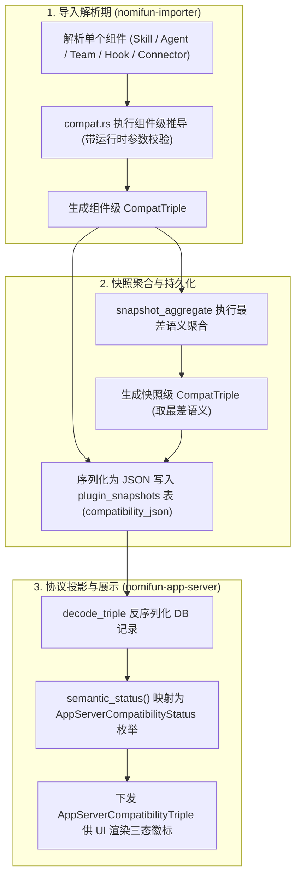

# 兼容性三维报告实现规格 (Compatibility Report Implementation) · 技术方案

> 状态：✅ 核心推导与聚合已落地（`nomifun-importer`）；代码与规格双向对齐
> 日期：2026-09-11
> 前置：[`03-codebuddy-compatibility-matrix.md`](file:///c:/workspace/allo/docs/agent-store/03-codebuddy-compatibility-matrix.md)
> 一句话原则：**组件级独立生成 CompatTriple 三维元组，快照级按最差语义单向聚合，运行与分发两轴严守未经验证边界，拒绝虚标运行就绪度**

---

## 1. 背景与核心痛点

[`03-codebuddy-compatibility-matrix.md`](file:///c:/workspace/allo/docs/agent-store/03-codebuddy-compatibility-matrix.md) 定义了兼容性的高层三维模型理论。但在代码工程落地时，如果缺乏严密的实现规格，会导致以下质量隐患：

### 1.1 核心痛点分析

1. **“机制上可桥接”被客户端误判为“已实测能跑”**：例如解析出一个 `agent` 组件时标记为 `compatible_with_adapter`，前端若不结合运行态，极易直接给用户展示“就绪绿色徽标”，而底层引擎尚未真正完成该 Agent 的端到端测试。
2. **整包快照就绪度被局部高估**：一个插件包可能包含 10 个完美的 Skill，但携带了 1 个危险且未受控的外部 Hook。若不遵循“最差语义聚合”，该插件会被误判为安全可用。
3. **推导状态无法持久化与复算**：导入结果若只保存在内存中，前端刷新后状态即丢失；若数据库存储格式非标准化，跨语言/跨客户端反序列化极易出错。

---

## 2. 方案全景与推导架构

### 2.1 三维评估推导与投影全流程



---

## 3. 详细设计 (按模块内聚)

### 3.1 核心数据结构与取词约束

Rust 核心结构体定义于 `crates/backend/nomifun-importer/src/models.rs`：

```rust
pub struct CompatTriple {
    pub semantic_status: String,     // 语义轴：结构和模型能否映射进系统
    pub runtime_status: String,      // 运行轴：底座与适配器是否完成真实执行验证
    pub distribution_status: String, // 分发轴：是否具备合规分发许可
    pub reasons: Vec<String>,        // 稳定的短横线原因码清单
}
```

#### 状态取值词表与常量收敛
- **语义状态 (`semantic_status`)**：`compatible`, `compatible_with_adapter`, `manual_review`, `unsupported`, `pending_legal_review`。
- **运行状态 (`runtime_status`)**：`not-verified` ➔ `adapter-verified` ➔ `runtime-verified` ➔ `release-eligible`。
- **分发状态 (`distribution_status`)**：`local-only`（V1 阶段恒为此值，禁止对外公开发布）。
- **稳定原因码 (`reasons`)**：
  - `ignored-by-source-runtime`：来源平台官方明确忽略的字段（如插件 Agent 的 `mcpServers`）。
  - `unsupported-auth`：复杂或未受支持的认证流程。

---

### 3.2 组件级推导逻辑规范

所有组件推导统一调用受保护的 `triple()` 构造函数，该函数**强制固定**：
$$\text{runtime\_status} = \text{"not-verified"}, \quad \text{distribution\_status} = \text{"local-only"}$$

```rust
fn triple(semantic_status: &str, reasons: Vec<String>) -> CompatTriple {
    CompatTriple {
        semantic_status: semantic_status.to_owned(),
        runtime_status: RUNTIME_NOT_VERIFIED.to_owned(),
        distribution_status: DIST_LOCAL_ONLY.to_owned(),
        reasons,
    }
}
```

#### 各组件推导行为矩阵

| 组件类型 (`kind`) | 推导函数签名 | 推导得出的 `semantic_status` | 核心判定逻辑与理由代码 (`reasons`) |
|---|---|---|---|
| `skill` | `skill()` | `compatible` | 唯一开箱原生支持。Markdown 指令与模板完整保留；内部脚本默认关闭。 |
| `agent` | `agent(has_ignored_permission_fields)` | `compatible_with_adapter` | 需由 Preset 适配承载；若检测到 `mcpServers` 注入原因码 `ignored-by-source-runtime`。 |
| `team` | `team(all_members_resolved)` | 成员全部解析 ➔ `compatible_with_adapter`<br/>成员缺失 ➔ `manual_review` | 固定成员由 AgentExecutionTemplate 承载；成员未解析必须人工介入审查。 |
| `command` | `command()` | `compatible_with_adapter` | 转换为用户可调用的 Prompt/Skill 契约。 |
| `connector` | `connector()` | `compatible_with_adapter` | 强制进行工具命名空间隔离，运行时校验凭据。 |
| `credential` | `credential()` | `compatible_with_adapter` | 导入期仅建立 Schema 结构，敏感数据只存引用。 |
| `dependency` | `dependency()` | `compatible_with_adapter` | 跨市场依赖默认禁止，需显式白名单放行。 |
| `hook` | `hook()` | `manual_review` | 外部生命周期脚本未经沙箱隔离，默认静止执行。 |
| `lsp` | `lsp()` | `manual_review` | 进程托管能力尚未闭环，仅保留元数据。 |
| `script` | `script()` | `manual_review` | 导入期严禁执行外部二进制或 Shell 命令。 |

---

### 3.3 快照级“最差语义”单向聚合算法

整张快照的综合评价取所有组件中“最差”的语义状态，**只降不升**：

$$\text{优先级：} \text{manual\_review} > \text{unsupported} > \text{compatible\_with\_adapter} > \text{compatible}$$

```rust
pub fn snapshot_aggregate(components: &[Component]) -> CompatTriple {
    let mut semantic = "compatible".to_owned();
    for component in components {
        match component.compatibility.semantic_status.as_str() {
            "manual_review" => semantic = "manual_review".to_owned(),
            "unsupported" if semantic != "manual_review" => semantic = "unsupported".to_owned(),
            "compatible_with_adapter" if semantic == "compatible" => {
                semantic = "compatible_with_adapter".to_owned()
            }
            _ => {}
        }
    }
    // 原因码去重并截断保留最多 8 条
    reasons.truncate(8);
    triple(&semantic, reasons)
}
```

- **聚合表现**：全为 Skill ➔ `compatible`；一旦混入 1 个 Hook ➔ 整包降级为 `manual_review`。

---

### 3.4 持久化与公共协议投影流

1. **数据库存储**：组件级与快照级三维元组序列化为 JSON，落入 SQLite `plugin_snapshots` 表的 `compatibility_json` 列。
2. **协议 DTO 转换**：`nomifun-importer` 通过 `to_public_triple()` 转换为 `nomifun_api_types::AppServerCompatibilityTriple`。
3. **前端枚举映射**：`nomifun-app` 通过 `semantic_status()` 映射为强类型枚举 `AppServerCompatibilityStatus`，下发给 WebUI 渲染徽标：
   ```rust
   match triple.semantic_status.as_str() {
       "compatible"              => Compatible,
       "compatible_with_adapter" => CompatibleWithAdapter,
       "manual_review"           => ManualReview,
       "unsupported"             => Unsupported,
       "pending_legal_review"    => PendingLegalReview,
       _                         => Unsupported,
   }
   ```

---

## 4. 实现期硬约束 (防踩坑指南)

1. **导入期两轴恒定不变**：在导入阶段，`runtime_status` 恒为 `not-verified`，`distribution_status` 恒为 `local-only`。导入器自身绝不推进运行与分发两轴的升级。
2. **`compatible_with_adapter` 绝不等于已验证可用**：该状态仅说明架构上有适配桥梁，端到端可用性必须依赖真实执行测试（Runtime Gate）。
3. **聚合算法仅作用于语义轴**：快照级聚合只对 `semantic_status` 求最差值，运行态与分发态在快照级依然保持默认未验证状态。
4. **异常回退兜底**：反序列化损坏的旧数据时，系统强制安全降级回退为 `unsupported / not-verified / local-only`，防止脏数据引发 Panic。

---

## 5. 组件扩展标准化 SOP (5 步清单)

若未来需接入新的资产组件类型，严格按以下步骤扩展：
1. **常量定义**：在 `nomifun-importer/src/models.rs` 中新增 `KIND_*` 常量。
2. **推导实现**：在 `compat.rs` 中编写 `fn <kind>() -> CompatTriple`，必须通过 `triple()` 构造。
3. **聚合覆盖**：在 `snapshot_aggregate` 的 `match` 中确认该状态落在正确的降级优先级阶梯中。
4. **协议映射**：在 `app_server_importer.rs` 的 `semantic_status()` 中补充分支映射。
5. **单元测试回归**：在 `compat_tests.rs` 中增加单测，断言矩阵推导与最差聚合行为符合预期。

---

## 附录：原始技术底稿与历史归档 (Historical & Technical Reference Archive)

> **归档说明**：以下完整保留重构前的原始技术底稿、历次讨论与历史记录全文，供历史追溯、协议字段详细对照与技术审计。

---

# 兼容性三维报告 · 实现总结

> 状态：实现落地记录（与 `03-codebuddy-compatibility-matrix.md` 配套；03 是规格，本文是代码落地）
> 日期：2026-09-11
> 前置：`03-codebuddy-compatibility-matrix.md`
> 用途：记录"每个导入组件 / 整张快照各算一份三维判定"在代码中的真实落地位置、数据结构、推导函数与对外投影。

---

## 1. 一句话概述

导入 CodeBuddy / WorkBuddy 插件时，对 **每个组件** 和 **整张快照** 各产生一份 `CompatTriple`（语义态 / 运行态 / 分发态 + 原因码）。组件级写入 `plugin_snapshot.compatibility_json`，快照级经"最差语义态"聚合后随导入结果对外暴露，最终映射到 `AppServerCompatibilityStatus` 枚举供 catalog / UI 展示。

实现主体位于 `crates/backend/nomifun-importer/src/compat.rs` 与 `models.rs`，对外投影在 `nomifun-app-server` / `nomifun-app` 两处。

---

## 2. 数据结构

定义在 `nomifun-importer/src/models.rs:76-87`：

```rust
pub struct CompatTriple {
    pub semantic_status: String,     // 第一轴：结构上能否映射进 nomi
    pub runtime_status: String,      // 第二轴：有没有被证明能跑
    pub distribution_status: String,  // 第三轴：能否分发
    pub reasons: Vec<String>,        // 稳定的 hyphenated 原因码
}
```

### 2.1 取值词表（`models.rs:18-25`）

| 轴 | 常量 | 取值 |
|---|---|---|
| 语义 | — | `compatible` / `compatible_with_adapter` / `manual_review` / `unsupported` / `pending_legal_review` |
| 运行 | `RUNTIME_*` | `not-verified` → `adapter-verified` → `runtime-verified` → `release-eligible` |
| 分发 | `DIST_LOCAL_ONLY` | `local-only`（V1 恒为此值，永不分发就绪） |

### 2.2 原因码（`models.rs:29-30`）

```rust
pub const REASON_IGNORED_BY_SOURCE_RUNTIME: &str = "ignored-by-source-runtime";
pub const REASON_UNSUPPORTED_AUTH: &str = "unsupported-auth";
```

原因码**不是**第一级状态（02 §11.2）。`REASON_UNSUPPORTED_AUTH` 已声明但当前 `compat.rs` 中尚未被任何推导函数引用（预留给复杂 OAuth 场景，`03 §2`）。

---

## 3. 组件级推导（`compat.rs`）

所有推导函数都经内部 `triple()` 构造，该函数**写死** `runtime_status = not-verified`、`distribution_status = local-only`：

```rust
// compat.rs:13-20
fn triple(semantic_status: &str, reasons: Vec<String>) -> CompatTriple {
    CompatTriple {
        semantic_status: semantic_status.to_owned(),
        runtime_status: RUNTIME_NOT_VERIFIED.to_owned(),
        distribution_status: DIST_LOCAL_ONLY.to_owned(),
        reasons,
    }
}
```

> 推论：**导入期真正被区分的只有 `semantic_status` 一轴**；运行 / 分发两轴的升级属于 Phase 2（Runtime Adapter）与 Phase 3（实际 Run）之后的事，导入管线从不推进。

### 3.1 各组件推导结果

| 组件 kind | 推导函数 | `semantic_status` | 关键 reasons |
|---|---|---|---|
| `skill` | `skill()` | `compatible` | SKILL.md 正文/frontmatter/`$ARGUMENTS` 保留；脚本执行默认关闭 |
| `agent` | `agent(has_ignored_permission_fields: bool)` | `compatible_with_adapter` | frontmatter 可结构化保留；`AgentDefinition→Preset/ResolvedPresetSnapshot→Runtime` 链路待验证；当含 mcpServers/permissionMode 时追加 `ignored-by-source-runtime` |
| `team` | `team(all_members_resolved: bool)` | 成员可解析 → `compatible_with_adapter`；否则 `manual_review` | 固定成员 + Planning Context 驱动 planned DAG 属 V1；完整 Mailbox/自主认领/长期会话不属于 V1 |
| `command` | `command()` | `compatible_with_adapter` | 映射为用户可调用 prompt/skill（`plugin:command`） |
| `connector` (mcp) | `connector()` | `compatible_with_adapter` | 工具命名空间化 `connector__name__tool`；凭据绑定/授权在连接器运行时验证 |
| `credential` | `credential()` | `compatible_with_adapter` | 导入只生成 schema 与引用；值由用户经安全存储后续提供 |
| `dependency` | `dependency()` | `compatible_with_adapter` | 跨市场依赖默认禁止，需显式 allowlist |
| `hook` | `hook()` | `manual_review` | V1 只导入与静态校验，默认不执行 |
| `lsp` | `lsp()` | `manual_review` | V1 元数据级；进程托管能力未落地 |
| `script` | `script()` | `manual_review` | 导入期不执行任何脚本或命令 |

要点：
- 仅 `agent` / `team` 的推导接收**运行期参数**（`has_ignored_permission_fields` / `all_members_resolved`），用于细化 reasons 与决定 `team` 是否降级为 `manual_review`；其余函数无参。
- 唯一 `compatible` 的组件是 `skill`（其 markdown 可直接丢进现有技能目录被按名 materialize，无需 adapter 翻译）。

---

## 4. 快照级聚合（`compat.rs:99-121`）

导入结果使用 `snapshot_aggregate(components)` 生成整张快照的一份聚合报告，**取各组件"最差"语义态**，确保 UI 不会高估就绪度：

```rust
pub fn snapshot_aggregate(components: &[Component]) -> CompatTriple {
    let mut semantic = "compatible".to_owned();
    for component in components {
        match component.compatibility.semantic_status.as_str() {
            "manual_review" => semantic = "manual_review".to_owned(),
            "unsupported" if semantic != "manual_review" => semantic = "unsupported".to_owned(),
            "compatible_with_adapter" if semantic == "compatible" => {
                semantic = "compatible_with_adapter".to_owned()
            }
            _ => {}
        }
        // reasons 去重合并，最多保留 8 条
    }
    reasons.truncate(8);
    triple(&semantic, reasons)
}
```

语义优先级（只降不升）：`manual_review` > `unsupported` > `compatible_with_adapter` > `compatible`。

- 全为 `skill` → `compatible`
- 混有 `hook`（manual_review）→ 整张 `manual_review`（一个 hook 拉低整张）
- 仅 `agent` + `team` → `compatible_with_adapter`

> 注意：聚合**只**合并语义轴；`runtime_status` / `distribution_status` 仍由 `triple()` 固定为 `not-verified` / `local-only`，不在快照级推进。

---

## 5. 持久化与对外投影

### 5.1 存储

每个组件的三维结构以 JSON 存入 `plugin_snapshot` 表的 `compatibility_json`（见 `nomifun-db/src/repository/sqlite_plugin_snapshot.rs`）。

### 5.2 内部 → 公共协议

`nomifun-importer/src/import.rs:1546` 的 `to_public_triple()` 把内部 `CompatTriple` 转成 `nomifun_api_types::AppServerCompatibilityTriple`（字段名一致，snake_case 串）。同文件还有两条直写路径：
- 幂等复用（`import.rs:312`）：相同 digest 复用既有快照，仍发出 `compatible_with_adapter` / `not-verified` / `local-only`。
- 失败阻断（`import.rs:1532`）：`semantic_status = "blocked"`。

### 5.3 读路径：字符串 → 枚举

`nomifun-app/src/app_server_importer.rs` 负责把 DB 里的 JSON 还原：
- `decode_triple()`（`app_server_importer.rs:138`）：反序列化失败则回退 `unsupported / not-verified / local-only`。
- `semantic_status()`（`app_server_importer.rs:161`）：把 `CompatTriple.semantic_status` 映射到 `AppServerCompatibilityStatus` 枚举变体：

```rust
match triple.semantic_status.as_str() {
    "compatible"              => Compatible,
    "compatible_with_adapter" => CompatibleWithAdapter,
    "manual_review"           => ManualReview,
    "unsupported"             => Unsupported,
    "pending_legal_review"    => PendingLegalReview,
    ...
}
```

该枚举即 catalog / UI 中每个 agent / team / skill / connector 的 `compatibility_status` 字段来源（如 `nomifun-app-server/src/lib.rs` 中导入项展示 `CompatibleWithAdapter`）。

### 5.4 技能来源映射（补充）

`nomifun-app/src/app_server_catalog.rs:55-60` 将 skill 来源映射到兼容态：`Builtin → Compatible`、`Extension` / `Custom → CompatibleWithAdapter`。这与 `03` 中"skill 主体 `compatible`"并不矛盾——`03` 指的是导入时 CodeBuddy 技能本身的语义态，catalog 层额外按 nomi 内部的 `SkillSource` 做了二次标注。

---

## 6. 当前实现的硬约束（容易误读的点）

1. **运行 / 分发两轴在导入期恒为 `not-verified` / `local-only`。** 升级阶梯（`adapter-verified` → `runtime-verified` → `release-eligible`）是设计预留，需 Gate 3 / Phase 2-3 实际验证后由外部流程写入，导入器自身不推进。
2. **`compatible_with_adapter` ≠ 已验证能跑。** 它仅表示"有 adapter 桥接路径、机制上可桥接"，链路仍 `not-verified`（见 `03 §6` 验收条件）。
3. **快照聚合只看语义轴。** 即使某组件运行态未来被外部升级，聚合报告里的 `runtime_status` 也不会自动反映——该字段在聚合处始终取 `triple()` 默认值。
4. **原因码目前仅 `ignored-by-source-runtime` 被实际使用**；`unsupported-auth` 已定义但未挂接。
5. **`pending_legal_review` / `unsupported` 两个语义态在当前 `compat.rs` 推导函数中没有产出方**——它们由导入失败 / 版权阻断等特例路径（如 `import.rs:1532` 的 `blocked`）或后续人工流程触发，而非常规 kind 推导。

---

## 7. 如何扩展

新增一种组件 kind 时，落地清单：
1. 在 `models.rs` 增加 `KIND_*` 常量（如已有 10 种）。
2. 在 `compat.rs` 新增 `fn <kind>() -> CompatTriple`，必须经由 `triple()` 构造（以保证运行/分发两轴默认 `not-verified` / `local-only`）。
3. 在 `snapshot_aggregate` 的 `match` 中确认该 kind 产出的 `semantic_status` 已被正确的最差优先级覆盖（若新增了 `unsupported` 之外的状态需评估排序）。
4. 在 `app_server_importer.rs` 的 `semantic_status()` 映射中补充分支（若新增枚举变体）。
5. 在 `03` 矩阵 §2 表格补一行，保持规格与实现一致；必要时补充 `compat.rs` 单测（参考 `statuses_follow_the_matrix` / `snapshot_aggregate_takes_the_worst_semantic`）。
