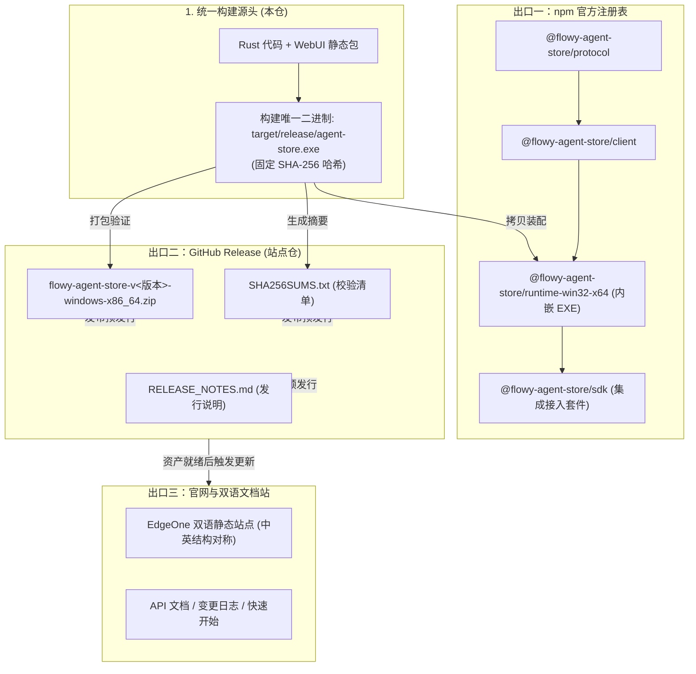
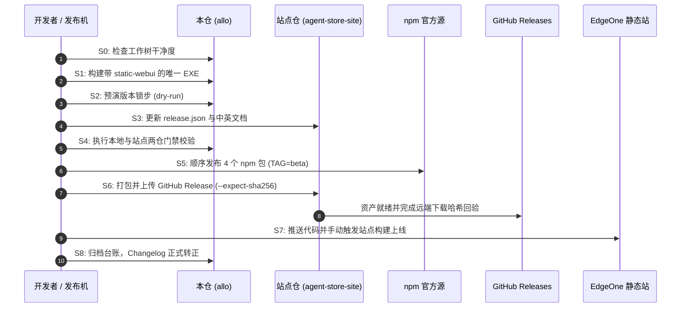

# Agent Store 发版操作手册 (Release Runbook) · 技术方案

> 状态：✅ 现行操作规范（Beta 发版执行依据，覆盖 `0.1.0-beta.N`）；发版流水线实操验证通过
> 日期：2026-08-26（更新：2026-09-20）
> 适用范围：Agent Store npm 四包 + 站点仓 GitHub Release 资产 + 官网文档站上线
> 前置：[`09-release-readiness.md`](file:///c:/workspace/allo/docs/agent-store/09-release-readiness.md)、[`12-sdk-packaging.md`](file:///c:/workspace/allo/docs/agent-store/12-sdk-packaging.md)、[`18-marketplace-spec.zh.md`](file:///c:/workspace/allo/docs/agent-store/18-marketplace-spec.zh.md)
> 一句话原则：**一次发版覆盖 npm 四包、GitHub Release 与站点三大出口，严守 7 条不变量与 S0~S8 顺序流水线，以同一二进制与版本锁步杜绝破损发布**

---

## 1. 背景与核心痛点

Agent Store 包含 Rust 编写的引擎服务端可执行程序、四个互相依赖的 npm 前端/Node SDK 包，以及面向用户的双语文档网站与 GitHub Release 下载包。发版涉及跨仓库协同，面临以下典型痛点：

### 1.1 核心痛点分析

1. **多出口产物不一致（二义性二进制）**：若 npm 运行时包中的 `agent-store.exe` 与 GitHub Release 下载的 ZIP 中的可执行文件是在不同环境下分别编译构建的，会导致两类用户拿到不同行为的底层，排查 Bug 极其困难。
2. **“先宣称上线，后上传资产”引发 404**：若在 GitHub Release 资产尚未上传完成前就抢先推送站点，会导致官网首页的下载链接直接抛出 404，严重损害产品信誉。
3. **包依赖顺序与发布时差窗口**：npm 上 `@flowy-agent-store/sdk` 强依赖 `@flowy-agent-store/runtime-win32-x64`。若发布顺序错乱或中间失败，用户在窗口期执行 `npm i` 会静默装成“无二进制”的破损状态。
4. **注册表 CDN 滞后引发假告警**：npm 刚刚发布完成后，CDN 缓存存在 1~10 分钟的生效延迟。盲目依赖 `npm view` 会误判为发布失败并重复操作，导致版本号污染。

---

## 2. 方案全景与三大出口架构

### 2.1 一次发版的三大出口协同



### 2.2 三大出口交付定义

| 出口标识 | 交付产物与格式 | 执行载体与脚本 | 成功判据 |
|---|---|---|---|
| **出口一: npm** | 4 个同版本号 npm 包（全部挂 `beta` 标签） | `web/scripts/publish-packages.ts` | Canonical Packument 返回最新版本且无 404。 |
| **出口二: GitHub Release** | ZIP 归档包 + `SHA256SUMS.txt`（标 prerelease） | 站点仓 `scripts/release.mjs` | `bun run release:status` 状态为绿，下载回验通过。 |
| **出口三: 站点上线** | 官网与双语文档站（预渲染 HTML） | 站点仓手动触发 EdgeOne Makers | 页面正文渲染成功，下载直链真能获取 ZIP。 |

---

## 3. 发版 7 大核心不变量 (Invariants)

发版操作必须严格满足以下 7 条硬性不变量，任一不成立直接终止流程：

| 序号 | 核心不变量 | 违背后的系统后果 | 自动化/机械判据 |
|---|---|---|---|
| **1** | **协议指纹全仓处处一致** | 漏改一处会导致 SDK 握手时严格相等校验失败，直接拒绝连接。 | `bun run check:fingerprint` (exit 0) |
| **2** | **跨仓版本号严格锁步** | 4 个 `package.json`、SDK 内部依赖、平台 Pin 与站点 `release.json` 必须同值。 | `bun run check:release-sync` (exit 0) |
| **3** | **API 方法计数与路由表精准吻合** | 文档公开承诺的方法数（现行 `48 / 71`）必须与真实 Rust 路由表一致。 | `bun run check:release-sync` (exit 0) |
| **4** | **同一份 EXE 服务两个出口** | npm runtime 包内的 EXE 必须与 GitHub Release ZIP 内的 EXE 拥有**完全一致的 SHA-256**。 | `release:pack --expect-sha256 <hash>` |
| **5** | **站点双语文档结构镜像对称** | 中英文档的标题层级、代码块数量、表格列数必须一致，防止单语信息脱落。 | 站点 `bun run check:docs-sync` (exit 0) |
| **6** | **先有 Release 资产，后有站点宣告** | 严禁颠倒顺序。必须先在 GitHub Release 就绪并完成下载回验，再推站点上线。 | 遵循流水线顺序 (S6 ➔ S7) |
| **7** | **历史发布事实永不改写** | 已经发布过的版本号、发布日期和 Changelog 条目属于历史不可变事实，写错仅追加更正。 | 人工审计遵守 D10=A 原则 |

---

## 4. 标准有序发版流水线 (S0 ~ S8)



### S0: 检查环境与工作树
```powershell
git -C . status --short                          # 必须干净，无未暂存修改
git -C ..\agent-store-site status --short         # 站点仓必须干净
bun install ; bun install --cwd ..\agent-store-site
```

### S1: 构建唯一的可执行二进制
```powershell
# 必须带 static-webui 特性，保证 SPA 资源内嵌
bun run agent-store:build
# 记录权威哈希
Get-FileHash target\release\agent-store.exe -Algorithm SHA256
```

### S2: 版本锁步预演 (Dry-run)
```powershell
$env:DRY_RUN="1"; $env:VERSION="0.1.0-beta.5"; $env:TAG="beta"
bun web/scripts/publish-packages.ts
Remove-Item Env:DRY_RUN,Env:VERSION,Env:TAG

# 验证 dry-run 修改仅限于版本与依赖 Pin
git diff --stat
bun web/scripts/verify-published-sdk.ts web/packages/runtime/vendor/flowy-agent-store.exe
```

### S3: 站点版本配置与文档同步
1. 将站点仓 `content/release.json` 中的 `version` 改为目标版本。
2. 按照本方案第 5 节的对照清单，同步更新中英双语文档。

### S4: 两端门禁全量校验
```powershell
bun run release:check            # 本仓门禁 (Fingerprint, Release-sync, Web 测试)
bun run release:check:site       # 站点门禁 (Docs-sync, Market-check, TS Check)
```

### S5: npm 原子顺序发布
```powershell
$env:VERSION="0.1.0-beta.5"; $env:TAG="beta"
# 内部顺序保证: protocol ➔ client ➔ runtime ➔ sdk
bun web/scripts/publish-packages.ts
Remove-Item Env:VERSION,Env:TAG

# 验证 Packument 元数据 (注意 CDN 缓存提示)
npm view @flowy-agent-store/sdk dist-tags versions --json
```

### S6: GitHub Release 资产发布
```powershell
cd ..\agent-store-site
bun run release:pack -- --exe C:\workspace\allo\target\release\agent-store.exe --expect-sha256 <S1步得到的哈希>
bun run release:publish          # 创建草稿 ➔ 上传 ➔ 下载回算 SHA256 ➔ 转为正式 Prerelease
bun run release:status
```

### S7: 官网发布与多级自检
```powershell
git add content/docs content/release.json
git commit -m "docs(release): 发布 0.1.0-beta.5"
git push origin main
```
- **手动触发构建**：登录 EdgeOne Makers 控制台手动触发本次构建。
- **发布后自检三部曲**：
  1. 访问中英文档，断言页面包含预渲染正文而非空白 SPA 壳。
  2. 执行 `bun run publish:market -- --verify-only` 确认三个市场的 ModelScope 归档摘要一致。
  3. 真实点击下载直链，确认浏览器能成功下载对应的 Windows ZIP 资产。

### S8: 归档后台账与变更转正
1. 将 `changelog.md` 中原先挂在“未发布”区域的说明正式转正至已发布版本列表，固定时间戳。
2. 在 `docs/agent-store/README.md` 顶部的核对记录中登记本轮发布。

---

## 5. 站点文档同步核对清单

| 站点文件路径 | 同步触发场景 | 校验依据与判据 |
|---|---|---|
| `content/docs/{zh-CN,en-US}/typescript-sdk.md` | 协议指纹更新 | `bun run check:fingerprint` (exit 0) |
| 同上文件的方法计数标注 (`48 / 71`) | 路由表方法发生增减 | `bun run check:release-sync` (exit 0) |
| `content/docs/{zh-CN,en-US}/changelog.md` | 每次发版 | 填入正式发版日志与 JSON 块，清空未发布待办。 |
| `content/docs/{zh-CN,en-US}/upgrade.md` | 涉及升级与破坏性改动 | 新增当前版本的升级步骤与破坏性变更公告。 |
| `content/release.json` | 每次发版 | 与 npm 包版本完全一致。 |
| 全量 Markdown 双语结构 | 任何文档变更 | 站点 `bun run check:docs-sync` (exit 0) |

---

## 6. 异常处置与故障回退方案

| 故障场景 | 影响与表现 | 应急处置与回退策略 |
|---|---|---|
| **npm 部分包发布中断** | 例如 `runtime` 已发布但 `sdk` 失败 | 用户侧无感知（旧版 SDK 仍指向旧版 runtime）。直接排查错误后单独补发缺失的包。 |
| **npm 已全量发布但二进制存在严重缺陷** | 缺陷包已在注册表公开 | **npm 严禁删除已发布版本**。立刻执行 `npm deprecate` 标注弃用，并快速构建修正版本发布为 `beta.N+1`。 |
| **GitHub Release 上传文件损坏** | 下载回验哈希不匹配 | 若仍处于草稿态，执行 `release:publish --replace-existing` 重传；若已正式发布，通过 `gh release upload --clobber` 覆盖。 |
| **站点文档发布后显示 404** | 路由缺失或预渲染失败 | 检查新文档是否已在 `react-router.config.ts` 的 `prerender()` 数组中登记，补齐后重新推站。 |
| **npm CDN 出现短时 404** | 发布后 1~10 分钟内 `npm i` 报 404 | 属于 npm 边缘节点同步延迟的正常物理现象。以 Canonical Packument 元数据为准，切勿误判为失败。 |

---

## 附录：原始技术底稿与历史归档 (Historical & Technical Reference Archive)

> **归档说明**：以下完整保留重构前的原始技术底稿、历次讨论与历史记录全文，供历史追溯、协议字段详细对照与技术审计。

---

# Agent Store 发布流程（npm + agent-store-site）

> 定位：**发一次版的操作手册**——回答「怎么发」，不回答「能不能发」。产品准入（P0 门禁与发布结论等级）见 `09-release-readiness.md`；桌面端 Flowy 的发版见仓库根 `RELEASING.md`；市场树刷新见站点仓 `docs/market-maintenance.md`。三者互不替代。
> 最后核对：2026-09-17
> 适用范围：Agent Store 预览版（`0.1.0-beta.N`）——**npm 四个包** + **站点仓的 GitHub Release 资产** + **站点上线**
> 前置阅读：`web/AGENTS.md` §5（协议指纹与跨仓同步）· `12-sdk-packaging.md` §6（发行形态）· `18-marketplace-spec.zh.md` §8（市场发布门禁）

## 1. 一次发布有三个出口

| 出口 | 产物 | 由谁执行 | 判据 |
|---|---|---|---|
| npm | `@flowy-agent-store/protocol` / `client` / `sdk` / `runtime-win32-x64`，**同一个版本号** | 本仓 `web/scripts/publish-packages.ts` | `npm view @flowy-agent-store/sdk dist-tags versions --json` |
| GitHub Release | `flowy-agent-store-v<版本>-windows-x86_64.zip` + `SHA256SUMS.txt` + `RELEASE_NOTES.md`，**一律标 prerelease** | 站点仓 `scripts/release.mjs` | `bun run release:status` |
| 站点上线 | 官网 + 双语文档站；**GitHub 自动触发自 2026-09-17 起失效，推送后需按站点仓 `docs/deploy-trigger.md` 手动触发一次构建**；三个市场源自 doc 30 起迁至 ModelScope 归档，**不在站点产物里** | 站点仓 | 线上页面 + 产物文件数不超限（自检见 S7） |

> **发布刚完成时不要信 `npm view`**（实测 2026-09-16）：注册表读取侧有 CDN 缓存——四个包都打印 `✓ published` 之后的一两分钟里，`npm view` 仍可能返回旧值，甚至对新版本返回**假 404**。复核用 canonical packument URL：`https://registry.npmjs.org/@flowy-agent-store%2Fsdk`——**不要**给它加查询串（某些缓存节点会对带查询串的请求直接 404）；某个版本的 tarball 是否真的在，用 `HEAD .../-/<pkg>-<version>.tgz`，并先用一个**不存在的版本**确认这个探针确实会返回 404。

**不属于本流程**：桌面端 Flowy 的发版（`RELEASING.md`）；P0 准入判定（`09`）；市场树刷新（`bun run sync`，站点 `docs/market-maintenance.md`——`16` R6② 已延后，只有本次发布确实改了市场树才做）；`14-binary-size-trimming.zh.md` 的瘦身验证。

## 2. 不变量（发布前必须同时成立）

| # | 不变量 | 为什么 | 判据 |
|---|---|---|---|
| 1 | 协议指纹处处一致 | 握手与 SDK 对它做**严格相等**校验，漏一处那个夹具/mock/SDK 就直接连不上。**别把当前值抄进文档**：它是计数器，权威只有 `nomifun-app-server::PROTOCOL_VERSION` 与 `protocol.ts` 的 `APP_SERVER_PROTOCOL_VERSION` | `bun run check:fingerprint` |
| 2 | 版本锁步：四个 `package.json` + sdk 的 2 个依赖 pin + 5 个平台 runtime pin + 站点 `content/release.json` 全部同值 | `publish-packages.ts` 用一个 `VERSION` 发布四个包，站点用 `release.json` 生成下载链接 | `bun run check:release-sync` |
| 3 | 站点两语言文档引用的方法计数与实际路由表一致（现行 `48 / 71`） | 这是对消费者承诺的覆盖面 | `bun run check:release-sync` |
| 4 | **同一份 exe 服务两个出口**（npm runtime 包内的二进制 = Release zip 内的二进制） | 同版本号对应两个不同二进制，等于两类用户拿到不同的东西 | `release:pack --expect-sha256` |
| 5 | 站点双语文档结构一致 | 站点硬约束（标题层级 / 代码块 / 表格列数 / 内链） | 站点 `bun run check:docs-sync` |
| 6 | **先有 Release 资产，后有站点宣告** | 站点 `release.json` 驱动首页下载直链；先推站点就会出现指向不存在资产的 404 | 顺序约束（§3 S6 → S7） |
| 7 | 已发布事实永不改写：站点 `changelog` §2 与 `upgrade` §2/§3 的版本表 | D10=A：版本号与发布时间是历史；写错了追加「更正（日期）」 | 人工 |

`check:release-sync` 与 `check:fingerprint` 都同时看本仓与站点仓；站点不在场时**跳过并提示**（用 `AGENT_STORE_SITE_DIR` 指定别的 checkout）。

## 3. 有序清单

### S0 前置

```powershell
git -C . status --short                          # 干净
git -C ..\agent-store-site status --short         # 干净
bun install ; bun install --cwd ..\agent-store-site   # 两仓各自装一次
```

站点仓默认在同级 `..\agent-store-site`（与 `check:release-sync` 的默认一致）。放别处就用 `AGENT_STORE_SITE_DIR` 指过去，并手工在站点目录里跑它那半边的门禁。

### S1 构建唯一的 exe

```powershell
bun run agent-store:build        # web build → cargo build --release -p agent-store --features static-webui → 复制到 cli/
Get-FileHash target\release\agent-store.exe -Algorithm SHA256
```

> **必须带 `--features static-webui`**（`bun run agent-store:build` 已经带上）。该 feature 默认关闭，不带它二进制只提供 API、SPA 兜底直接 404；而 `publish-packages.ts` 在找不到现成二进制时的**兜底自动构建恰恰不带这个 feature**。要么先按本步构建好，要么用 `AGENT_STORE_BIN` 指一个明确构建过的文件。

### S2 版本锁步预演（dry-run）

```powershell
$env:DRY_RUN="1"; $env:VERSION="0.1.0-beta.5"; $env:TAG="beta"
bun web/scripts/publish-packages.ts
Remove-Item Env:DRY_RUN,Env:VERSION,Env:TAG

git diff --stat                  # 只应出现版本号与依赖 pin 的变化
bun web/scripts/verify-published-sdk.ts web/packages/runtime/vendor/flowy-agent-store.exe
```

dry-run **不上网**，但照常改写 4 个 `package.json` 的版本、照常把二进制落进 `web/packages/runtime/vendor/`（该目录已 gitignore）。它**会跳过** `verify-published-sdk.ts`，所以上面这条要手工补跑，期望输出 `VERIFY-OK`。这一步的结果就是「版本锁步」的终态，单独提交。

### S3 站点侧版本与文档

1. 站点仓 `content/release.json` 的 `version` 改成同一版本；
2. 按 **§4 同步清单**逐项过一遍站点文档（`changelog` §4 与 `upgrade` §8 的「未发布」条目在发版后要转成已发布事实，见 S8）。

### S4 门禁（两个半边都要绿）

```powershell
bun run release:check            # 本仓：仓级门禁 + web typecheck/test + nomifun-app-server 协议测试
bun run release:check:site       # 站点半边：docs-sync + market + typecheck（需要同级 checkout）
```

### S5 npm 发布

```powershell
$env:VERSION="0.1.0-beta.5"; $env:TAG="beta"
bun web/scripts/publish-packages.ts
Remove-Item Env:VERSION,Env:TAG

npm view @flowy-agent-store/sdk dist-tags versions --json
```

- 包内顺序由脚本固定：`protocol` → `client` → **`runtime`** → `sdk`。runtime 必须先于 sdk 上线，否则 `npm i` 落在窗口期会静默装成「没有二进制」（可选依赖失败只警告）。
- `TAG` **必须显式给**：预发布只挂 `beta`，绝不能落到 `latest`（脚本注释里已写明这条的理由）。
- **不带 `VERSION` 直接跑会写回脚本内置的默认版本**——那会同时打坏版本锁步（`check:release-sync` 会红）。所以每次都显式给 `VERSION`。
- 发布失败或中断：见 §5。
- **复核时注意读取侧 CDN 滞后**（见 §1 的提示）：刚发完 `npm view` 可能给旧值或假 404，用 canonical packument URL 复核，别据此判断发布失败。
- **发布前先确认 `bun run dev` 不会被打死**（2026-09-17 实测）：本步会把约 181 MiB 的二进制写进 `web/packages/runtime/vendor/`。Windows 在写入期间锁住该文件，Vite 的 watcher 抛 `EBUSY: resource busy or locked, watch '…/runtime/vendor/…exe'`，而这是 FSWatcher 的未捕获 error —— **整个 dev server 连同 Vite 一起退出**，看起来像发布把开发环境搞崩了。该目录已加进 `web/vite.config.ts` 的 `watch.ignored`；换 checkout 或回退那份配置后会复现。
- **认证用 granular token，别依赖全局 `~/.npmrc`**（§7 第 6 条的落地做法）：本机全局 `~/.npmrc` 的 `registry` 指 npmmirror，而 `//registry.npmjs.org/:_authToken` 只对 npmjs 生效，所以裸 `npm whoami` 会报 `ENEEDAUTH`——那是**注册表不匹配**，不是没凭据。用 `npm_config_userconfig` 指一个只含 `registry=https://registry.npmjs.org/` 与该 token 的临时文件即可（`whoami` 应能打印用户名）。

### S6 GitHub Release（站点仓）

```powershell
cd ..\agent-store-site
bun run release:pack -- --exe C:\workspace\allo\target\release\agent-store.exe --expect-sha256 <S1 的 sha256>
bun run release:publish          # 建草稿 Release → 上传资产 → 回读体积 → 下载回验 sha256 → 转正式（prerelease）
bun run release:status
```

`--expect-sha256` 请填 **`web/packages/runtime/vendor/flowy-agent-store.exe` 的哈希**：那才是 npm 里真正发布出去的那份字节。想先人工核对，就加 `--keep-draft` 停在草稿态。

> **慢点在「下载回验」而不是上传**（实测 2026-09-16）：上传 69 MB 资产只用 59 秒，但 `release:publish` 最后要把资产从 GitHub **下载回来**算 sha256——国内网络会在这里长时间挂住。给 `gh` 配 `HTTPS_PROXY=http://127.0.0.1:7890` 再跑；也可以先用 GitHub API 里该资产的 `digest`（服务端算的 sha256）与本地文件比对确认完整性，再决定是否重跑回验。

### S7 站点上线

```powershell
git add content/docs content/release.json
git commit -m "docs(release): 发布 0.1.0-beta.5"
git push origin main
```

推送后**不会**自动上线：EdgeOne Makers 的 GitHub 自动触发**自 2026-09-17 起失效**，且本站项目是
`Github` 型（`edgeone makers deploy` 的上传通道对它不可用）。所以推送后要**手动触发一次构建**——
接口形状、实测与失败定位见站点仓 `docs/deploy-trigger.md`。触发的提交必须是刚推上去的那个 sha。
然后做**部署后自检**（顺序即用户体验顺序）：

1. `/<lang>/docs/typescript-sdk` 中英两页都有正文（不是 SPA 空壳——空壳说明该页没进 `react-router.config.ts` 的 `prerender()`）；
2. **站点产物文件数**：EdgeOne Makers 构建日志里没有 `File count exceeds project limit`。上限是 20,000 个文件——`market-source/` 三个市场合计 22,612 个，所以自 doc 30 起整树**不再进产物**，产物里只应有站点自身约 94 个文件 + 目录页头像约 648 个（本地 `bun run build` 后数 `build/client` 即可预检）。⚠️ **`/source/<market>/…` 与 `/source/<market>/_files.txt` 已退役**，不要再把它们当作部署自检项；
3. **市场归档可达且摘要一致**：`bun run publish:market -- --verify-only` 三个市场全绿（它 `HEAD` 每个稳定 URL，比对 `X-Linked-Etag` 与 `content/market-hosts.json` 记录的 sha256）。归档在 ModelScope，**不在本站产物里**；
4. 首页/兼容性页的下载直链真能下到 zip：`https://github.com/szStarWave/agent-store-site/releases/download/v<版本>/flowy-agent-store-v<版本>-windows-x86_64.zip`。

### S8 发布后台账

1. 站点 `changelog` §2 追加本次「已发布事实」（版本号 + 发布时间 + 改了什么；改了什么只引已成文的差异结论，不编条目）；版本号与发布时间**永不改写**；本次的「未发布」条目（原 §4 台账）从 §4 转成 §2 的正式条目，`upgrade.md` §8 同步。
2. 本仓 `docs/agent-store/README.md` 加一条「本轮（日期）」记录（受影响的文档 + 跨仓事项）。
3. 记下 dist-tag 决策（是否有意移动 `latest`）——预发布不应移动它。

## 4. 站点文档同步清单

改动落到站点时**逐项对照**；「判据」一列的机械项已有门禁，人工项必须自己看一遍。

| 站点文件 | 何时改 | 判据 |
|---|---|---|
| `content/docs/{zh-CN,en-US}/typescript-sdk.md` §2 常量行 | 协议指纹 bump（任何 wire 增量） | `bun run check:fingerprint` |
| 同页 §5.3「HTTP 绑定」的 `**48 / 71**` 与路由表外方法名单 | 路由表映射数变化 | `bun run check:release-sync` |
| 同页 §1 的「版本状态」注（当前版本号 + `latest` / `beta` 指向） | **每次发版** | 人工 |
| 同页 §5/§7 的方法签名、子客户端、错误码 | 新增/删除 wire 方法或错误码 | 人工 |
| 同页 §8 MCP 接入指南 | 工具面 / allowlist / 声明文件语义变化 | 人工 |
| `content/docs/{zh-CN,en-US}/changelog.md` §2（已发布事实 + JSON 块）与 §4 台账 | 每次发版：§4 清零并把条目转正；JSON 块用注册表输出逐字更新 | 人工（S8） |
| `content/docs/{zh-CN,en-US}/upgrade.md` §2 发布序列 + §3 dist-tag/JSON | 每次发版 | 人工（S8） |
| 同页 §6 逐版本升级步骤（**带破坏性变更的发布必须新增一节**） | 任何破坏性发布 | 人工（S8） |
| 同页 §8「已发布产物的差异与自查方法」 | 未发布项清零时同步改写 | 人工（S8） |
| `content/docs/{zh-CN,en-US}/examples-sdk.md` | 对外用法（新子客户端、错误处理）变化 | 人工 |
| `content/docs/{zh-CN,en-US}/compatibility.md` | 已发布平台变化 | 人工（与站点 `app/lib/platform.ts` 的 `RELEASED_PLATFORMS` 同改） |
| `content/docs/{zh-CN,en-US}/{configuration,plugins-market}.md` | 市场源**类型**（`source_kind` 取值表）或**官方默认源地址**变化 | 人工（两页都写这两件事，必须同改；`30` §7 的迁移口径也在此） |
| `content/market-hosts.json` + `dist-market/*.zip` | 市场内容变化 | `bun run pack:market` 产出、`bun run publish:market` 上传并回验（**不要手改**） |
| `content/release.json` | 每次发版 | `bun run check:release-sync` |
| 所有页的双语结构 | 任何时候 | 站点 `bun run check:docs-sync` |

## 5. 失败与回退

| 情况 | 处置 |
|---|---|
| npm 半发布（`runtime` 已上、`sdk` 未上） | 不用慌：新版 `sdk` 还不存在，旧版 `sdk` 仍指向旧 runtime，用户侧无感。修好后只补发 `sdk`。 |
| npm 已全上但二进制有问题 | npm **不能删版本、不能改已发布内容**。`npm deprecate` 标注 + 立刻发下一个版本（`beta.N+1`），**不要复用版本号**。 |
| Release 资产传错 | 仍在草稿态 → `release:publish --replace-existing` 重传；已正式发布 → 只补缺的资产用 `gh release upload --clobber`，需要换二进制则发下一版（同版本两个二进制正是 `--expect-sha256` 要挡的事）。 |
| 站点文档已发布的数字写错 | 不改写，追加「更正（日期）」（D10=A）。 |
| `check:fingerprint` / `check:release-sync` 红 | 改**落点**（常量、站点文档、`release.json`），绝不改门禁；门禁模式失配也要修模式而不是删检查。 |
| 部署后页面是空壳 | 新页没进 `react-router.config.ts` 的 `prerender()`（站点 `AGENTS.md` 硬约束），补上再推。 |
| 构建期拷贝漏了市场树 | 站点 `bun run build` 才带 `copy-market-tree.mjs`；直接 `react-router build` 会让线上 `/source/**` 全 404。 |

## 6. 一页速查

```powershell
# ── 本仓 C:\workspace\allo ──────────────────────────────────────────
bun run agent-store:build
$env:DRY_RUN="1"; $env:VERSION="0.1.0-beta.5"; $env:TAG="beta"
bun web/scripts/publish-packages.ts
Remove-Item Env:DRY_RUN,Env:VERSION,Env:TAG
bun web/scripts/verify-published-sdk.ts web/packages/runtime/vendor/flowy-agent-store.exe
# 改站点 content/release.json + 站点文档（§4 清单）
bun run release:check
bun run release:check:site
$env:VERSION="0.1.0-beta.5"; $env:TAG="beta"
bun web/scripts/publish-packages.ts
Remove-Item Env:VERSION,Env:TAG
npm view @flowy-agent-store/sdk dist-tags versions --json

# ── 站点仓 C:\workspace\agent-store-site ────────────────────────────
bun run release:pack -- --exe C:\workspace\allo\target\release\agent-store.exe --expect-sha256 <哈希>
bun run release:publish
bun run release:status
git add content/docs content/release.json
git commit -m "docs(release): 发布 0.1.0-beta.5"
git push origin main
# 部署后自检（§3 S7）→ changelog §2 / README「本轮」台账（§3 S8）
```

## 7. 已知缺口（登记，不在本流程修复）

1. **runtime 包只有 Windows x64 这一条真实路径**：`web/packages/runtime/package.json` 的 `name` / `os` / `cpu` 固定 `win32-x64`，而 `publish-packages.ts` 只改版本、**不改包名**，脚本头注释里「linux/darwin 由 CI 走同一脚本」并没有对应 CI。换平台前先解决包名与 `os`/`cpu` 的推导。
2. **两仓都没有发布 CI**：`.github/workflows` 只有 `release-modelscope.yml`；本流程全部动作手工执行（本手册就是为此而写）。
3. **资产名与已发布平台是两处字面量**：站点 `app/lib/platform.ts` 的 `RELEASED_PLATFORMS` / `assetName()` 与站点 `scripts/release.mjs` 的 `PLATFORM = "windows-x86_64"` 必须人工保持一致，换平台时两处同改（`check:release-sync` 只守版本号，不守这个）。
4. **站点域名与 HTTPS 未定**：EdgeOne 预览域名带签名 `eo_token` 会过期，不能长期作为对外公布的市场源地址（站点 `README.md` §部署「待定」）。
5. **`web/scripts/verify-published-sdk.ts` 里的 `VERSION = "0.1.0-beta.1"` 是遗留字面量**（只作为客户端的自称名，不影响判据），发版时别被它误导。
6. **npm 发布需要「带 bypass 2FA」的凭据**：账号开了 2FA 写保护时，`npm login` 得到的 token 会在**第一个包**上失败（`E403 … Two-factor authentication or granular access token with bypass 2fa enabled is required`）——脚本在第一个包就中止，所以**注册表未被改动**（2026-09-16 实测）。改用 **Granular Access Token**（Scope 选 `@flowy-agent-store` 的 Read and write、勾 **Bypass 2FA**），用一个临时 `npm_config_userconfig` 指向的文件注入即可，不必改全局 `~/.npmrc`。
7. **S0 的「工作树干净」与并发写入者冲突，而 S1 恰恰基于工作树构建**（2026-09-18 发布 `0.1.0-beta.6` 时实测）：当时工作树里另有 546 行**未提交**的 provider 改动（`agent_store.rs` +148 / `lib.rs` +377 / `routes.rs` +7），`cargo check` 能过，但 `lib.rs` 留了一条 `unused import: AppServerModelSummary`，说明它没写完。它们**会被烧进已发布的 exe**，且「已发布二进制 == 某个提交」这条不再可复核。两条出路：**等它们提交**（S0 成立后再发），或在**干净 HEAD 的独立 worktree** 里只做 S1 那一步（Rust 源码不进 npm 包，只有 exe 进，所以不必把整条流程搬过去）。本次用户知情后选择了仍在工作树构建——**这不是默认做法，是显式决定**。
8. **`release:check` 的第 1 环恒红，S4 只能逐环跑**（2026-09-18 实测）：`release:check` = `bun run check && …`，而 `check` 的第 1 环是 `bun run typecheck`（`ui/`），那里有 **73 个既有错误 / 28 个文件**（TS2339 ×38、TS7006 ×11、TS2322 ×7、TS2345 ×6、TS2554 ×3…）——与 Agent Store 无关，且**全在已提交的代码里**（`ui/` 工作树是干净的）。所以「两仓门禁全绿」当前只能在**逐环**层面成立：本仓跑 `check:fingerprint`、`check:release-sync`、`cd web && bun run typecheck && bun run test`、`cargo test -p nomifun-app-server`，跳过 ui 那一环并**如实登记**（不得声称 `release:check` 通过）；站点半边 `release:check:site` 不受影响。修 ui 那批是独立一轮（其中 `updateTelemetry.ts` 的重复 import 只是 2 个错误）。
9. **npm 读取侧的 tarball 404 可能持续十分钟以上，别据此判定发布失败**（2026-09-20 发布 `0.1.0-beta.7` 时实测）：四个包都打印 `✓ published` 之后，canonical packument 约 1 分钟就转正（`dist-tags.beta` 与 `time` 都是新值、`versions` 里有新版本、`npm view <pkg>@<version> version` 也能打印），但 **`.../-/<pkg>-<version>.tgz` 的 `HEAD` 与 `npm i` 继续 404 / `ETARGET` 达 10 分钟以上**，之后自行恢复。判据是 **manifest 已转正**（版本出现在 `versions`、`time` 有该版本、`dist-tags` 指向它），而不是 tarball 可下载；`npm i` 装回来复核这一步要等它恢复后再做。§1 的告警只说了「一两分钟」与「假 404」，这次的**时长**是新的。
10. **发布链与「不许直接提交 `main`」的关系**（2026-09-20 记录）：`AGENTS.md` 的 §Git Workflow（从 `origin/main` 起分支、rebase、PR，禁止直接提交 `main`）是 **2026-09-20 的 PR #246 才合并**的，而 `0.1.0-beta.4`/`beta.5`/`beta.6` 三次发布都在此之前，走的是**直接提交 `main`**。规则生效后，本手册的 S2/S8（版本锁步提交、索引台账提交）与站点 S7（`git push origin main`）都应改走**分支 + PR**；`main` 当前的分支保护只有 `non_fast_forward` + `no deletion`（**没有**强制 PR），所以直接提交在技术上仍可行——那是**规则**与**门禁**的不一致，不是权限错误。站点仓 `main` 没有保护规则。
