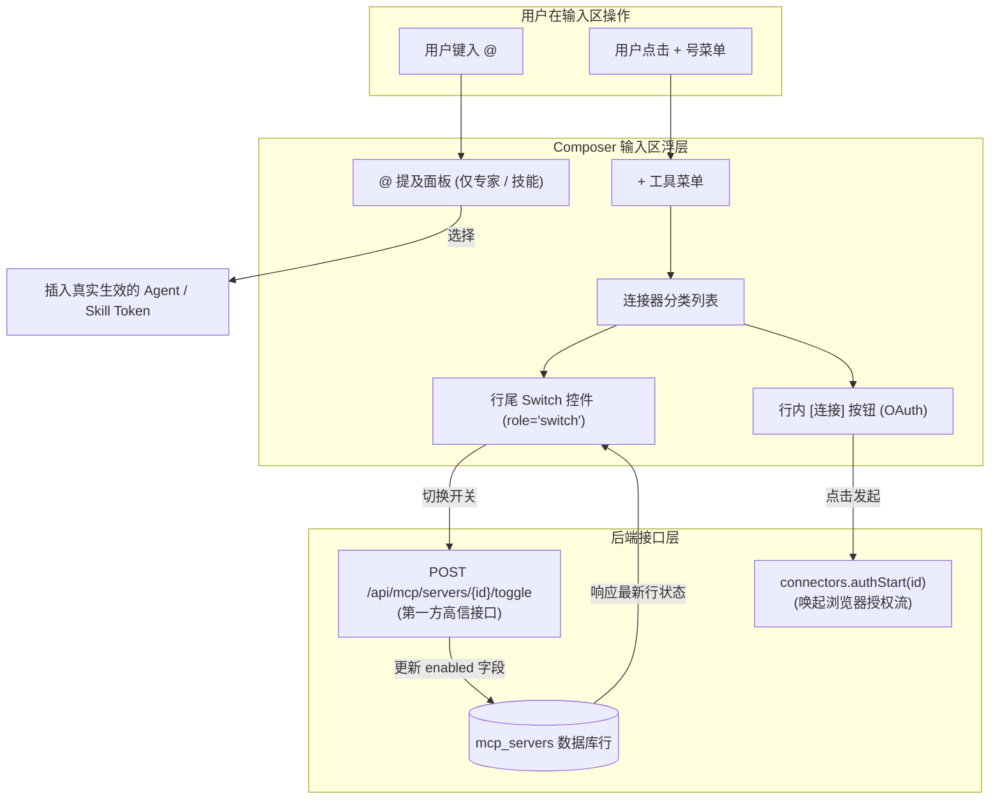

# WebUI 输入区：连接器改为开关（`+` 菜单）而非 `@` 提及 · 技术方案

> **状态**：✅ **已实施落地**（2026-09-23，零 wire 变更，协议指纹保持不变）  
> **核心原则**：概念与实体对齐 —— **连接器退出输入框 `@` 提及**，**转入 `+` 菜单作为宿主工具开关**，**支持行内快捷 OAuth 授权**，**保持零协议变更**。

---

## 1. 背景与核心痛点

### 1.1 业务背景
在 Agent Store WebUI 的消息输入区（Composer）中，用户可通过键盘键入 `@` 唤出快捷浮层，或点击输入框左侧的 `+` 号菜单，将扩展能力挂载到对话中。

### 1.2 现状与两大痛点
此前输入区将连接器（Connector）与专家、技能混在一起处理，带来了严重的交互假象与认知错位：

1. **“提及”连接器在运行时完全不生效（假 Mention）**  
   当用户在输入框键入 `@连接器名称` 时，系统在输入框插入了一个形如 `@github` 的 Mention Token。然而在底层执行链路中，**连接器根本没有单轮消息级的装配路径**（只有专家会转换为 `agent/run`，技能会注入提示词）。用户误以为“提及了该工具本轮就会用”，实际完全被系统忽略。
2. **连接器在 `+` 菜单中仅有装饰性开关**  
   在 `+` 菜单的连接器列表项后方，虽然渲染了一个滑动开关视觉，但该开关标记为 `aria-hidden`，点击整行实际上是向输入框插入一条无效的 `@` 提及文本，用户无法直接在菜单中启停连接器。

### 1.3 核心设计结论

| 维度 | 改造前 | 改造后（本方案） |
|---|---|---|
| **`@` 快捷唤出面板** | 包含专家、技能、连接器三类 | **连接器彻底退出 `@` 提及**，仅保留专家与技能 |
| **`+` 菜单连接器项** | 点击插入假 Mention 文本 | **变为真正的开关控件**，直接翻转宿主连接器 `enabled` 状态 |
| **行内快捷授权** | 必须进入详情抽屉才能点击授权 | 状态为 `authorization_required` 时，**菜单行内直接提供“连接”按钮** |
| **生效层级** | 容易误导为会话级临时生效 | **明确为宿主级全局开关**，操作即时同步至连接器底表 |
| **底层协议变动** | — | **零 Wire 协议变更**，复用第一方 `/api/mcp/servers/{id}/toggle` 路由 |

---

## 2. 方案全景与交互架构

### 2.1 交互与数据流向图



### 2.2 目标与非目标

#### 核心目标
1. **消除无用 Token**：确保输入框内出现的每一个 `@` 提及都在运行时有确定的解析通道，杜绝假功能。
2. **就地启停与授权**：用户无需跳转至管理后台或打开深层抽屉，在输入区即可完成常用工具的启停与登录。
3. **保持端到端一致性**：`+` 菜单中的启停状态与侧边栏抽屉、设置页面实时联动。

#### 明确的非目标
- **不做会话级连接器隔离**：连接器属于宿主底座能力，遵循既有架构决策，不引入“仅对当前会话启用连接器”的复杂隔离逻辑。
- **不改动公共 RPC 协议**：不引入新的 `connector/toggle` 协议方法，不改动指纹与公共 DTO。

---

## 3. 详细设计

### 3.1 模块一：连接器退出 `@` 提及系统

1. **面板数据源剥离**：在 `Composer` 的 Mention 自动补全列表中，移除连接器分类，仅加载并检索 `agents` 与 `skills`。
2. **类型系统收敛**：
   - 将 `PaletteItemKind` 联合类型收窄为 `"agent" | "skill"`；
   - 移除 `@` 提及解析器中针对连接器的无效分支，彻底消除“提及了却不生效”的逻辑漏洞。
3. **协议向后兼容**：底层数据契约中保留 `MentionKind::Connector` 枚举，防止历史会话或第三方客户端产生反序列化异常，前端自身不再主动生产该类型。

---

### 3.2 模块二：`+` 菜单宿主级开关实现

#### 1. 交互与无障碍（A11y）设计
- 列表项由原来的文本点击项转变为语义化开关按钮（`role="switch"`）；
- 具备明确的 `aria-checked={item.enabled}` 状态与无障碍标签；
- 请求处理过程中自动置为 `disabled` 防止重复连击。

#### 2. 底层接口调用
复用宿主已有的第一方轻量管理路由：

```ts
// web/src/lib/client.ts
export async function toggleMcpServerEnabled(connectorId: string): Promise<{
  mcp_server_id: string;
  enabled: boolean;
}> {
  return httpPostRoot(`/api/mcp/servers/${encodeURIComponent(connectorId)}/toggle`);
}
```

- **真实回显原则**：接口成功后以返回包中的 `enabled` 布尔值为准刷新 UI，严禁纯前端乐观假设，确保多端并发时的准确性。

---

### 3.3 模块三：行内 OAuth 快捷授权集成

当连接器处于未授权状态时（`status === "authorization_required"`）：
- 开关左侧动态展示 **「连接」** 操作链接；
- 点击后就地调用 `client.connectors.authStart(id)` 唤起浏览器 OAuth 授权流；
- 授权流程完成后，利用既有的状态轮询机制就地刷新连接器状态为 `connected` 并将开关置为可用。

---

## 4. 核心决策与权衡

| 编号 | 决策点 | 选定方案 | 放弃的替代方案与理由 |
|---|---|---|---|
| **D1** | **交互形态定位** | **移出 `@` 提及，放入 `+` 菜单作为开关** | ❌ 维持 `@` 提及并在后台自动挂载：连接器本质是全局工具，按单次消息提及挂载违背模型工具链的生命周期设计。 |
| **D2** | **接口复用选择** | **复用既有第一方 `/api/mcp/servers/{id}/toggle`** | ❌ 新增标准 App Server 协议动词：产生不必要的跨仓指纹升级与两端同步成本。 |
| **D3** | **作用域范围** | **明确为宿主全局级别** | ❌ 伪造每会话隔离：连接器配置涉及本地进程拉起与共享端口，做会话级临时隔离架构成本过高。 |

---

## 5. 验收标准与测试矩阵

| 编号 | 验证场景 | 断言标准与验收口径 |
|---|---|---|
| **S1** | **`@` 面板无残留** | 在输入区键入 `@`，弹出的候选项中不再展示任何连接器条目。 |
| **S2** | **开关状态真实持久化** | 在 `+` 菜单中将某连接器切换为关闭后刷新页面，该连接器依然保持关闭状态。 |
| **S3** | **抽屉状态同步** | 在 `+` 菜单切换开关后，打开侧边栏连接器详情抽屉，其启停状态与徽标实时对齐。 |
| **S4** | **行内 OAuth 唤起** | 未授权的 HTTP 连接器在菜单中展示「连接」按钮，点击能正确唤起授权流程。 |
| **S5** | **零 Wire 指纹影响** | `bun run check:fingerprint` 保持常绿，协议方法计数与接口定义无任何变更。 |

---

## 附录：原始技术底稿与历史归档 (Historical & Technical Reference Archive)

> **归档说明**：以下完整保留重构前的原始技术底稿、历次讨论与历史记录全文，供历史追溯、协议字段详细对照与技术审计。

---

# WebUI 输入区：连接器改为开关（`+` 菜单）而不是 `@` 提及 · 技术方案

> 状态：**✅ 已落地（2026-09-23 起草并实施）**——逐层改动、验证读数与 4 处偏差见 §9.1；
> 手测项（宿主起停后 `enabled` 保持、运行中实例的生效时机）见 §9.1 末。
> 前置：`05-flowy-agent-store-app-server-protocol.md` §4.3（连接器目录）、`19-webui-codex-alignment.zh.md`
> §3 W1（命令面板与 `@` 提及）、`20-tool-injection-policy.zh.md`、`24-external-agent-skill-and-mcp-access.zh.md`、
> `26-connector-schema-and-grant-policy.zh.md`（连接器授权单位上移）、`27-conversation-binding-plan.zh.md`
> （会话绑定：连接器**不**做每轮）、`web/AGENTS.md` §5。
> 用途：回答三件事——**(1)** 连接器为什么不能 `@`；**(2)** `+` 菜单里的开关到底改什么、走哪条 API、
> 边界在哪里；**(3)** 行内的「连接」与抽屉里的开关。结论是：**零 wire 变更、零指纹变更**，
> 但语义必须在正文里写死（§4.3）。三个待定项已于 2026-09-23 拍板（§7）。

---

## 1. 结论先行

| 目标 | 现状 | 本方案 |
|---|---|---|
| 连接器**不能**被 `@` 提及 | `@` 面板与 `+` 菜单都把连接器当第三类目录，会写入 `@名称` + 结构化 mention；而这条 mention **在聊天路径上无处落地**（只有 `agent` 会转成 `agent/run`），等于一个只显示不生效的 token | 连接器退出 mention：`@` 面板不再列、`+` 菜单连接器行不再 pick |
| `+` 菜单里**开关控制启用** | 行尾已有一个**装饰性**开关（`aria-hidden`，点整行走 pick/mention），点了不改变任何状态 | 行变成真正的 `role="switch"`，翻转该连接器在**本宿主**的 `enabled`；次行改显示 `status` 文案 |
| 行内**「连接」**（OAuth 发起） | 无（只在 Catalog 抽屉里有「授权」按钮） | `status === authorization_required` 时出现，调 `connectors.authStart` + 刷新授权态与次行（§4.4） |
| 抽屉里也有开关 | 抽屉只有「已停用」chip 与探针 / OAuth 动作 | 同一 helper、同一文案，成功后同步抽屉与列表卡片（§4.5） |
| 走哪条 API | 协议里**没有**设置连接器 `enabled` 的方法 | 复用既有的第一方路由 `POST /api/mcp/servers/{id}/toggle`（宿主本地信任模式可达） |
| 会话级"这个会话用哪些连接器" | 无入口（create 期冻结 + PATCH 明确拒绝） | **不做**——`27` 已定连接器不参与会话/每轮绑定（§2） |

**一句话**：连接器不是"随消息解析的引用"，而是"宿主的工具面开关"——所以它离开 `@`，
进入 `+` 菜单的开关位；而那个开关改的是**宿主行**，不是会话。

---

## 2. 边界（非目标）

- **不做会话级连接器选择**。`27-conversation-binding-plan.zh.md` §2/§8 已定：连接器不参与每轮绑定，
  且本轮也不开放"创建时由客户端指定连接器"。本文不改变这个结论。
- **不动 `connector/*` 协议面**：不新增 `connector/set-enabled`，不改任何 DTO，**不 bump 指纹**。
  （如果将来要"协议级的宿主开关"，那是另一件事：它要按 `web/AGENTS.md` §5 走两仓 + 指纹。）
- **不动 MCP 声明文件面**：`config/set-mcp-enabled` 改的是 `~/.agent-store/mcp.json` 的**文本**，
  与本文的 `mcp_servers` 数据行是两条腿，互不替代。
- **不改 OAuth 的既有语义**：新增的「连接」只是把抽屉里那颗按钮搬到行内，仍由可信宿主持有 token，
  WebUI 不接触也不缓存凭据；开关本身只翻转 `enabled` 一个布尔值。
- **不改 `@` 提及的 wire 契约**：`MentionRef.kind = "connector"` 在协议里**仍然合法**（第三方客户端
  可能仍在生产它）；本文只让**本 WebUI 不再生产**它。这一条必须写明，否则下一个人会误以为协议收窄了。
- **不新增自动轮询**：OAuth 完成与否仍由用户/刷新按钮驱动，与 Catalog 抽屉一致（§4.4 第 3 条）。

---

## 3. 设计依据（既有事实 + 证据位置）

| 事实 | 位置 |
|---|---|
| `connector/list` 是 `mcp_servers` **数据行**的投影，每行带 `enabled` / `status` / `transport_summary` | `crates/backend/nomifun-app/src/app_server_catalog.rs:303-324`；`ConnectorSummary`（`web/packages/protocol/src/protocol.ts:859-873`） |
| 协议方法面里**没有**设置 `enabled` 的方法 | `nomifun-app-server/src/lib.rs:6350-6450`（`connector/list·get·status·test·authStatus·authStart·authLogout·call`）+ `config/set-mcp-enabled`（只编辑 `mcp.json`） |
| `install/enable·disable` 面向**快照组件**，且 `InstallComponent` **不带** `mcp_server_id` | `protocol.ts:1038-1045`；`web/packages/client/src/store.ts:299-313`、`:337-342`（组件 id 由 `install/status` 派生） |
| 第一方路由存在：`POST /api/mcp/servers/{id}/toggle` → 翻转并**返回更新后的行** | `crates/backend/nomifun-mcp/src/routes.rs:51-54`、`:121-128`；行为实测 `nomifun-app/tests/mcp_crud_e2e.rs:578-617`（404 用例 `:619-633`） |
| 该路由在 Agent Store 宿主里**可达**（无需 token/CSRF） | 宿主默认**本地信任模式**（auth 关闭）：`apps/agent-store/src/main.rs:24-25`、`:253-264`；CSRF 层在 NoAuth 下**整层跳过**：`nomifun-app/src/router/routes.rs:1426-1437` |
| WebUI 已有"同源第一方路由"的先例与现成 helper | `/api/fs/*` 经 `httpPostRoot` + 连接 id 头：`web/src/lib/client.ts:408-427`、`:438-446` |
| `@` 提及当前把连接器当第三类目录 | `web/src/components/Composer.tsx:246-266`（palette 行）、`:141-157`（`+` 菜单 pick）、`CommandPalette.tsx:21-26`（图标）、`lib/palette-model.ts:12`（kind 联合） |
| 连接器 mention 在聊天路径上**被丢掉**（只有 `agent` 会转成一次 `agent/run`） | `web/src/store/appStore.ts:1385-1400`；`submitTurn` 的入参不含 mentions（`:1430`） |
| `+` 菜单的连接器行已有**装饰性**开关（`aria-hidden`，不改变状态） | `web/src/components/ComposerCatalogMenu.tsx:132-134` |
| 连接器状态**已经**把 OAuth 就绪性折进去了：`!enabled → installed`、最近探测失败 `→ error`、`connected`、oauth 且未连通 `→ authorization_required`、其余 `→ configured` | `nomifun-app/src/app_server_catalog.rs:206-216`（`summary_status`） |
| 状态 → 文案的映射与样式**已存在**，无需新造 | `web/src/components/catalog/shared.tsx:25-34`（`CONNECTOR_STATE_KEYS`）、`:68`（`stateLabel`）、`:103`（`connectorStateClass`）；文案 `web/src/i18n/zh-CN.ts:297-309` |
| 抽屉里已经有「已停用」chip 与 OAuth 动作（授权 / 吊销 / 刷新状态 / 测试连接），**但没有启停开关** | `web/src/components/CatalogView.tsx:1331-1358`（`ConnectorDrawer`）、`:394-412`（`startAuth`）、`:382-392`（`refreshAuth`） |
| OAuth 发起 + 状态读取有现成方法（宿主浏览器流，客户端只触发与轮询） | `client.connectors.authStart(id)` / `authStatus(id)`（`web/packages/client/src/connectors.ts`；契约 `05` §4.3.2、`24` §5） |
| 连接器与技能在**安装期**就是两条腿（技能进 skills 根、连接器进 MCP 行），所以"连接器自带 SKILL.md"不等于"挂技能就有工具" | `nomifun-app/src/app_server_installer.rs:408-458`；镜像实测 241 条目中 215 带 `SKILL.md`（`27` §3 末两行） |
| `MentionKind` 协议层仍有 `connector` | `nomifun-app-server/src/lib.rs:5170-5179` |

---

## 4. 方案

### 4.1 连接器退出 `@` 提及（纯 UI 边界）

1. `@` 面板不再加载、不再列出连接器（`Composer` 的 mention 目录只保留 agents / skills）。
2. `+` 菜单的连接器行**不再**触发 pick/写 token：`onPick` 的类型收窄为 `"agents" | "skills"`。
3. 类型收敛（清掉本次改动产生的悬空类型）：`PaletteItemKind` 去掉 `"connector"`、`CommandPalette`
   的图标表随之去掉一项、`pickCatalogItem` / `pickPaletteItem` 的 kind 映射只剩两条分支。
4. **wire 不动**：`MentionRef`（协议）保留 `connector`。本仓 WebUI 不再生产它；服务端行为不变。
5. 附带效果：`@` 面板的"删 token 同步删 mention"不变量只覆盖专家/技能，逻辑更简单（连接器不再有 token）。

### 4.2 `+` 菜单的开关 = 宿主级 `enabled`

- **数据**：仍是 `client.connectors.list()`（`ConnectorSummary.enabled`），搜索/空态/加载态不变。
- **动作**：WebUI 侧新增一个 helper（与 `/api/fs/*` 同址同形的第一方调用）：

  ```ts
  // web/src/lib/client.ts（宿主自己的面，不进 @flowy-agent-store/client）
  toggleMcpServerEnabled(connectorId: string): Promise<{ mcp_server_id: string; enabled: boolean }>
  // → POST /api/mcp/servers/{id}/toggle   （宿主根路径，带 x-app-server-connection-id）
  ```

- **权威性**：该路由是 **toggle**，不是"设置为"——所以 UI 的新状态**只能**取响应里的 `enabled`，
  不得假定请求生效（陈旧状态下的乐观翻转会谎报一次能力授予）。
- **UI**：行本身是 `role="switch"` 的按钮（`aria-checked` + 点名连接器的 `aria-label`），
  飞行中 `disabled`；失败 → toast 报因由，**UI 状态保持不变**。
- **复用**：沿用既有 `.catalog-submenu-item` / `.catalog-submenu-switch` 视觉，只补一条 `:disabled` 样式。

行的三段结构（自左到右）——这是本方案的最终形状：

| 段 | 内容 | 依据 |
|---|---|---|
| 图标 | 市场图标，缺省用首字母 | 沿用现状（`ComposerCatalogMenu.tsx:121-127`） |
| 主行 + 次行 | 名字 + **状态文案**（不是 `transport_summary`） | `stateLabel(t, CONNECTOR_STATE_KEYS, item.status)`；**`!enabled` 时显示「已停用」**（`catalog.disabled`）而不是 `installed` 映射出的「已安装」——否则开关明明关着、次行却写「已安装」 |
| 右侧 | 「连接」（仅 OAuth 未授权时出现，§4.4）+ 启用开关 | 开关见上；「连接」见 §4.4 |

> **实现期订正（2026-09-23）：行不是按钮。** 本节原写「行本身是 `role="switch"` 的按钮」，
> 但行内还有一颗「连接」按钮，**嵌套按钮是非法 HTML**。落地形状是 `div` + 两个**并列**按钮
> （「连接」在左、开关在右），行体不再可点——与设置里 MCP 开关行同构（只有开关可点）。
> 实现为 `ComposerCatalogMenu.tsx` 的连接器分支。

### 4.3 语义边界（必须同时写进正文与 UI 文案）

1. 开关 = **"本宿主的会话可以用这个连接器"**（`mcp_servers` 行），**不是**"这个会话正在用"。
2. 对**已存在**的会话无效：会话的连接器栅栏在创建时冻结（`extra.mcp_server_ids`，`27` §3），
   开关只影响**之后**新建/绑定该连接器的会话。已开会话即使连接器被关，其栅栏不变（运行时按
   `enabled` 过滤，缺的 server 直接不注入）。
3. **运行中的实例**是另一回事：MCP manager 在运行时实例**构建期**装载（`27` §3 第 12/13 行），
   所以"关掉之后当前这个会话立刻失去工具"**不成立**，需要实测确认生效时机（§5 第 4 条）。
4. 这个开关**不只是本地偏好**：`26` 把授权单位上移到连接器之后，`enabled == false` 会让第三方
   `connector/call` 得到 `connector_unavailable`。所以文案不能写成"仅本会话/仅本界面"。
5. 与 `install/*` 的区别要写清：`install/disable` 关的是**快照组件**，这里是**宿主行**；
   两条路都会让连接器不可用，但身份不同。

### 4.4 行内的「连接」= 发起 OAuth（已定，2026-09-23）

- **什么时候出现**：`auth_mode === "oauth"` 且 `status === "authorization_required"`。
  条件不必额外查询：`connector/list` 的 `status` 已经把 OAuth 就绪性折进去了
  （`summary_status`：oauth 且最近探测未连通 → `authorization_required`，`app_server_catalog.rs:206-216`）。
  所以一屏 N 行**不需要** N 次 `connector/status`。
- **动作**：`client.connectors.authStart(id)` —— 与 Catalog 抽屉里那颗按钮**同一方法、同一语义**
  （浏览器流由可信宿主持有，客户端只触发与轮询，`24` §5）。随后重取一次 `connector/list`。
  > **实现期订正（2026-09-23）**：原写「刷新授权态（`authStatus`）**并**重取 `connector/list`」。
  > 落地时只做了后者：菜单不展示 auth 状态（次行来自 `status`），调 `authStatus` 只会拿到一个
  > 立即被丢弃的值。授权态是 Catalog 抽屉的面（那里才有 auth chip）。
  >
  > **同样要写清的事实**：`status` 由宿主**最近一次探测**（`last_test`）派生
  > （`summary_status`，`app_server_catalog.rs:206-216`），所以**授权完成不会让次行变成
  > 「已连接」**——那需要跑一次「测试连接」，与抽屉的既有行为一致（抽屉也只刷新授权态）。
  > 本方案不因此自动触发探测：探测是一次真实的 MCP 调用，必须是用户的显式动作。
- **不做自动轮询**：Catalog 抽屉的现行行为是「发起 + 手动刷新状态」（`CatalogView.tsx:394-412`、
  `:382-392`）。行内按钮保持同一行为，避免同一动作在 WebUI 里出现两套时序（SDK 示例里的轮询循环
  是给第三方调用方的）。
- **文案**：按钮写「连接」（新的 `composer.connectorConnect`）；结果提示复用既有键
  `catalog.authStarted` / `catalog.authStartFailed`，不复制一份措辞。
- **失败**：`authStart` 返回 `started.error` 或抛错都不改行状态；toast 说明原因（同上键）。

### 4.5 抽屉里也放同一个开关（已定，2026-09-23）

- 位置：`ConnectorDrawer` 的动作区（`CatalogView.tsx:1344-1359`），与「测试连接」同排；
  抽屉里那颗「已停用」chip（`:1334`）保留——它描述的是**状态**，开关是**动作**。
- 复用同一个 helper（§4.2 的 `toggleMcpServerEnabled`），避免两处各写一份调用。
- 状态同步：开关成功后要同时更新
  (a) `CatalogView` 的 `connectors` 列表项（卡片行上的状态点与文案）、
  (b) 打开中的 `connectorDetail.enabled`（抽屉里的 chip）。
  失败同 §4.2：不改状态 + toast。
- 唯一性：这是本次唯一新增的第二个入口；`+` 菜单与抽屉**共用**同一个 helper 与同一套文案键，
  不允许出现两套"启用"语义。

---

## 5. 验收

| 层 | 检查点 |
|---|---|
| 行为 1 | `@` 面板里**没有**连接器（只有专家/技能）；输入 `@` 后连接器名字搜不到 |
| 行为 2 | `+` → 连接器 → 点整行**翻转开关**（不插入 `@名称`、不产生 mention）；草稿文本不变 |
| 行为 3 | 开关只在**响应返回后**变化；服务端失败时行不变 + 出现错误 toast（文案含原因） |
| 行为 4 | 次行显示 `status` 的本地化文案；`enabled=false` 时显示「已停用」而不是「已安装」 |
| 行为 5 | OAuth 连接器在 `authorization_required` 时出现「连接」：点击 → 宿主浏览器流被发起 + 提示「授权已启动」+ 授权态与次行刷新；非 oauth / 已授权时**不出现**该按钮 |
| 行为 6 | 抽屉里同一开关：翻转后抽屉 chip 与列表卡片的状态点/文案同步更新；失败时都不变 |
| 行为 7 | 手测（用户手动）：翻转后重启宿主，`enabled` 保持（已落库）；开着的会话工具面变化时机（§4.3 第 3 条）如实记录 |
| 单测 | `ComposerCatalogMenu`：连接器行点击 → 调 toggle helper 且**不**调 onPick；`CommandPalette`：不再存在 connector kind 的行；`Composer`：mention 模式只请求 agents+skills 两个目录；开关失败路径不改变行状态 |
| 命令 | `cd web && bun run typecheck && bun run test` |
| 不需要 | 指纹门禁、站点文档、`cargo test`——本方案不含 wire 变更（若实现时发现需要新增协议方法，**立即停下**改走 `web/AGENTS.md` §5） |

---

## 6. 风险与失败模式

| 风险 | 处置 |
|---|---|
| 盲 toggle 撞上陈旧状态（并发/多窗口） | 以响应为唯一权威；飞行中禁用该行；不做乐观翻转 |
| 用户以为"这是给本会话加连接器" | §4.3 第 1/2 条写进正文；`aria-label` 与 toast 文案都用"启用/停用连接器"而非"添加到会话" |
| 关掉连接器却以为当前会话立刻少工具 | §4.3 第 3 条：实例构建期装载；验收里如实记录实测时机，不承诺立即生效 |
| 误把 `install/*` 当成同一条路 | §4.3 第 5 条点明两者身份不同 |
| 顺手把协议面的 `connector` mention 也删掉 | §2 / §4.1 第 4 条：那会让第三方客户端静默失效，属于破坏性变更，本方案明确不做 |
| 「连接」按钮被当成"立即可用" | 它只发起浏览器流（宿主持有 token）；授权是否完成由 `authStatus` 说了算，文案用「授权已在可信主机上启动」（既有键），不写"已连接" |
| 菜单与抽屉两处开关状态不同步 | 两处共用同一个 helper；成功后各自刷新自己的数据源（菜单重取 `connector/list`，抽屉更新 `connectorDetail` + 列表项） |
| 行内「连接」在非可信宿主上失败 | `authStart` 的错误原样进 toast（复用 `catalog.authStartFailed`）；组件不因此隐藏按钮，用户可重试 |

---

## 7. 已定（2026-09-23 用户拍板）

| 原待定 | 决定 | 落点 |
|---|---|---|
| 截图里的「连接」按钮是什么 | **OAuth 发起**（`connectors.authStart`），仅在 `authorization_required` 时出现 | §4.4 |
| 开关是否也进 Catalog 的连接器抽屉 | **进**，与 `+` 菜单共用同一 helper 与文案 | §4.5 |
| 连接器行第二行显示什么 | **`status` 的本地化文案**（复用 `CONNECTOR_STATE_KEYS` + `stateLabel`）；`enabled=false` 时显示「已停用」 | §4.2 行结构表 |

实现时若发现这三条与既有组件结构冲突（例如抽屉的状态同步需要新的 store 字段），
**先回写本文再动代码**，不要就地改设计。

---

## 8. 实施顺序（每步一个验证）

```text
 1. 连接器退出 mention（纯 UI）
    → cd web && bun run typecheck；@ 面板不再出现连接器
 2. WebUI helper：toggleMcpServerEnabled（第一方 /api/mcp/servers/:id/toggle）
    → 类型通过；错误路径有明确抛错（无 data 视为失败）
 3. + 菜单连接器行：真开关 + status 次行 + 「连接」(OAuth) 动作
    → 组件测试：点击调 toggle、不调 onPick；失败保持原状态；非授权态不出现「连接」
 4. 抽屉接入同一开关（同步 connectorDetail + 列表项）
    → 既有 CatalogView 测试不回归；开关成功后两处状态一致
 5. i18n（中英：启用开关 aria / 失败 toast / 「连接」）+ 类型收敛清理
    → cd web && bun run typecheck && bun run test
 6. 手测：宿主起停一轮确认落库；OAuth 连接器点「连接」走完浏览器流；生效时机（§5 行为 7）
```

---

## 9. 与 `27` 的关系与落地记录

- `27-conversation-binding-plan.zh.md` 管"**会话绑定**"：技能每轮（`conversation/send`）、专家与专家团
  在会话开始粘性指定（`conversation/create`）。本文管"**宿主级开关 + mention 边界**"。
- 两文的共同点（刻意一致）：**都不给连接器开"会话级/每轮"入口**。连接器在本仓的定位是
  "宿主工具面"，不是"随消息解析的引用"，也不是"会话属性"。

### 9.1 落地记录（2026-09-23 实施）

| 层 | 实际改动 | 验证读数 |
|---|---|---|
| 连接器退出 mention | `Composer.tsx`：mention 目录只加载 agents/skills、`pickCatalogItem` 类型收窄为 `"agents" \| "skills"`、palette 行去掉 connector；`lib/palette-model.ts`：`PaletteItemKind` 去掉 `"connector"`；`CommandPalette.tsx`：图标表去掉 `AtSign` 并更新头注 | `bun run typecheck` → **exit 0** |
| 第一方 helper | `lib/client.ts`：`toggleMcpServerEnabled(id)` + `McpServerToggleResult`（`POST /api/mcp/servers/:id/toggle`，复用 `httpPostRoot`） | 同上 |
| `+` 菜单连接器行 | `ComposerCatalogMenu.tsx`：`div` 行 + `status` 次行 + 条件「连接」+ `role="switch"` 开关；`style.css`：开关从 `span` 变 `button` 需要的一次 reset + 「连接」样式 | 同上 |
| 抽屉开关 | `CatalogView.tsx`：`toggleConnectorEnabled`（响应定 `enabled` → 重取 `connector/list` 同步派生 `status`）+ `ConnectorDrawer.onToggleEnabled`（复用既有 `switch-pill`） | 同上 |
| 纯函数 + 单测 | `components/catalog/shared.tsx`：`connectorNeedsAuth` / `connectorRowStatusLabel`；新增 `components/catalog/shared.test.ts`（6 例） | `bun run test` → **67 passed / 1 skipped**（511 例，含本批 6 例） |
| i18n | `composer.connectorConnect` / `composer.connectorToggleAria` / `composer.connectorToggleFailed`（zh-CN + en-US） | `bun run test` 内的 i18n 结构守卫通过 |
| 指纹 / 站点 | **未动**（无 wire 变更） | 无需 `check:fingerprint`；站点无需同步 |

**与方案的偏差（4 处，均为实现期发现）**：

1. **行不是按钮**（见 §4.2 的订正）：嵌套按钮非法，行改为 `div` + 两颗并列按钮。
2. **不调 `authStatus`**（见 §4.4 的订正）：菜单不展示授权态，调用即弃用。
3. **授权完成不等于次行变「已连接」**（见 §4.4 的订正）：`status` 来自最近一次探测；
   不自动探测（探测是真实 MCP 调用，须由用户显式触发）。
4. **测试形态**：§5 原写「连接器行**点击** → 调 toggle helper 且不调 onPick」。
   本仓 vitest **没有 DOM 环境**（既有组件测试用 `react-dom/server` 的
   `renderToStaticMarkup` 静态渲染，见 `CommandPalette.render.test.tsx`），点击断言做不了。
   没有为一个断言引入 `jsdom` / `happy-dom`，改为把两个判定抽成纯函数并单测；
   组件接线由 typecheck + 手测覆盖。**这条是能力边界，不是遗漏。**

**顺带清理（登记）**：重写 `ComposerCatalogMenu.tsx` 时删掉了 4 个原本就没用到的 lucide 图标导入
（`AtSign` / `Bot` / `Plug` / `Sparkles`）——它们与本次改动无关，但同一行 import 被重写了。

**仍未做（等用户手测）**：§5 行为 7 —— 宿主起停后 `enabled` 是否保持、以及关掉连接器后
**运行中实例**的工具面何时变化（§4.3 第 3 条，实例构建期装载，故不承诺立即生效）。
