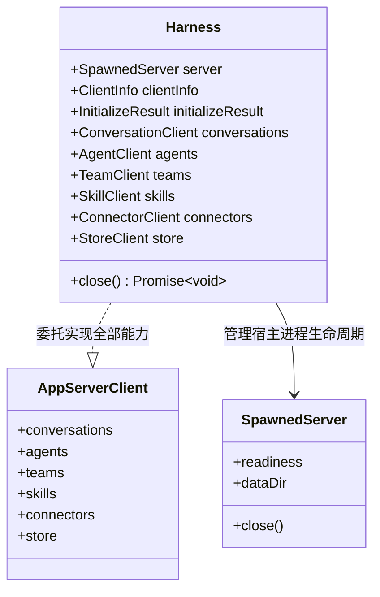

# SDK 入口的形状与命名（`launchHarness` / `Harness`）· 技术方案

> **状态**：✅ **已实施落地**（2026-09-18，方案 B 委托模式落地，零 wire 变更）  
> **核心原则**：工效优先与心智统一 —— **返回值即调用入口（消除多余一跳）**，**清晰区分调用主体与客户端身份声明**，**主对象内聚生命周期控制**。

---

## 1. 背景与核心痛点

### 1.1 业务背景
在 TypeScript SDK（`@flowy-agent-store/sdk`）中，开发者通过启动本地服务子进程并建立客户端连接来操作 Agent Store。

### 1.2 现状与两大痛点
在早期设计中，SDK 启动函数存在严重的心智模型错位：

1. **“Client” 一词三义，产生严重歧义**  
   在一个代码片段中，`client` 同时指代了三件完全不同的东西：
   - 身份声明参数：`launchClient({ client: { name, version } })`（传入的 `ClientInfo` 结构）；
   - 外层包装容器：`const session = await launchClient(...)`；
   - 真实调用入口：`session.client.conversations.create(...)`。
2. **函数名声称返回 Client，实际返回外壳（多一跳调用）**  
   若开发者按直觉编写 `const client = await launchClient(...)`，得到的却是一个仅包含包装属性的外壳对象，无法在其上直接访问 `.conversations`、`.agents` 等子客户端，必须写成 `client.client.*`，极为别扭。

### 1.3 改造前后体验对比

```ts
// ❌ 改造前：概念混乱，调用必须多一跳
const session = await launchClient({ client: { name: "my-app", version: "1.0.0" } });
await session.client.conversations.create(...);
session.close();

// ✅ 改造后 (本方案)：概念清晰，返回值即全功能入口
const harness = await launchHarness({ clientInfo: { name: "my-app", version: "1.0.0" } });
await harness.conversations.create(...); // 直接调用全量客户端方法
await harness.close();                   // 生命周期直接挂载在主对象上
```

---

## 2. 方案全景与架构设计

### 2.1 外部标杆对照（业界主流实践）

对比 OpenAI Codex 与 Moonshot Kimi Code 的 SDK 设计，优秀方案均具备一致特征：**启动函数直接返回具备完整调用能力的主对象，且生命周期由该对象统一接管**：

| 维度 | OpenAI Codex (Python) | Kimi Code (Node) | 本方案 (`Harness`) |
|---|---|---|---|
| **启动方法** | `Codex(config)` | `createKimiHarness(...)` | `launchHarness(...)` |
| **主对象角色** | 全局调用主入口 | 全局调用主入口 | 全局调用主入口 (继承 Client) |
| **调用链层级** | `codex.thread_start(...)` | `harness.createSession(...)` | `harness.conversations.create(...)` |
| **生命周期** | 上下文管理器 `__exit__` | `harness.close()` | `harness.close()` |
| **身份参数** | `config` | `identity` | `clientInfo` (消除歧义) |

### 2.2 架构设计与委托模型

`Harness` 采用复合委托设计，既能作为全功能的 `AppServerClient` 访问全量 RPC 业务方法，又内聚了底层子进程服务器生命周期：



---

## 3. 详细设计

### 3.1 模块一：类型与接口契约

新接口收拢于 `web/packages/sdk/src/index.ts`：

```ts
import type { AppServerClient, ClientInfo, InitializeResult } from "@flowy-agent-store/client";
import type { SpawnedServer, SpawnOptions } from "./spawn.js";

/** 启动参数配置 */
export interface LaunchOptions extends SpawnOptions {
  /** 调用方身份声明 (消除 client 参数名歧义) */
  clientInfo?: ClientInfo;
}

/**
 * 测试/控制线束主对象
 * 既拥有 AppServerClient 的全部子业务客户端，又持有底层 Server 生命周期
 */
export interface Harness extends AppServerClient {
  /** 底层拉起的子进程控制柄 */
  readonly server: SpawnedServer;
  /** 服务端初始化返回的元数据 */
  readonly initializeResult: InitializeResult;
  /** 关闭客户端连接并安全退出底层子进程服务 */
  close(): Promise<void>;
}

/** 启动全套 App Server 宿主并建立就绪连接 */
export async function launchHarness(options: LaunchOptions = {}): Promise<Harness>;
```

---

### 3.2 模块二：委托代理与双通道生命周期释放

#### 1. 扁平化属性委托
`launchHarness` 内部实例化底层 `AppServerClient` 和 `SpawnedServer` 后，通过属性委托直接将 9 个子客户端（`conversations`、`agents`、`teams`、`skills`、`connectors`、`store` 等）提升至 `Harness` 顶层，彻底省去中间的 `.client` 一级跳转。

#### 2. 安全退出（Graceful Shutdown）
调用 `harness.close()` 时，系统自动按序执行双重清理：
1. 断开与宿主的客户端传输管道（关闭 HTTP Keep-Alive 或断开 WebSocket 连接）；
2. 向底层子进程发送退出信号并等待其安全终结，释放临时数据目录锁。

---

## 4. 核心决策与权衡

| 编号 | 决策点 | 选定方案 | 放弃的替代方案与理由 |
|---|---|---|---|
| **D1** | **命名选型** | **命名为 `launchHarness` / `Harness`** | ❌ 命名为 `launchClient` / `Client`：Client 无法准确描述“进程控制 + 协议客户端”的复合概念。 |
| **D2** | **参数去重** | **将身份参数更名为 `clientInfo`** | ❌ 保留 `client: { name }`：同一段代码中持续产生“两个 client 不是一回事”的理解障碍。 |
| **D3** | **对象架构模式** | **复合委托模式（返回值即 Client）** | ❌ 维持包装模式（返回 `{ server, client }`）：强迫开发者每次调用都进行解构或多写一层属性访问。 |
| **D4** | **协议指纹联动** | **纯前端 SDK 重构，不变更协议指纹** | ❌ 提升协议指纹：本次完全属于客户端人体工程学优化，服务端 wire 契约未作任何变动。 |

---

## 5. 验收标准与测试矩阵

| 编号 | 验证场景 | 断言标准与验收口径 |
|---|---|---|
| **S1** | **直接接口调用** | 验证通过 `harness.conversations.list()` 能够直接执行，无需访问中间嵌套属性。 |
| **S2** | **身份声明透传** | 传入 `clientInfo: { name: "test-runner" }`，在服务端能够准确识别该调用端身份。 |
| **S3** | **双重生命周期退出** | 执行 `await harness.close()` 后，网络连接断开且对应子进程退出码为 0，临时目录锁正确释放。 |
| **S4** | **兼容性测试** | 现有的全量 SDK 端到端测试（`smoke.ts`、`readiness.test.ts`）在改用新入口后全绿通过。 |

---

## 附录：原始技术底稿与历史归档 (Historical & Technical Reference Archive)

> **归档说明**：以下完整保留重构前的原始技术底稿、历次讨论与历史记录全文，供历史追溯、协议字段详细对照与技术审计。

---

# 31 · SDK 入口的形状与命名（设计记录 · 待决）

> 状态：✅ **已实现**（2026-09-18，方案 B + 改名）——入口形状已重构（`web/packages/sdk/src/index.ts`），随后 API 改名为 `launchHarness` / `Harness`（见 §10）；读数与两个实现期才发现的约束见 §9，§2 / §4 记录的是**改造前**的事实。
> 触发：站点 `examples-sdk` §7.5（一个宿主里同时管多个会话）的示例被读作「`const session = await launchClient(...)` 是不是该写成 `const client = ...`」。用户的改法本身会让代码编译不过（`LaunchedClient` 上没有 `conversations`），但**它指向的错位是真的**：`launchClient()` 返回的不是 client。查两个外部实现后确认，这不是"我们和别人风格不同"，而是**入口形状**本身的问题。
> 关联：`07-typescript-sdk.md`（SDK 现行基线）、`12-sdk-packaging.md`（发行）、`16` §7 决策 4（发版前只有一个版本，可改）、站点 `typescript-sdk.md` §4.1、站点 `examples-sdk.md` §7.5。

## 1. 结论摘要

三处**真问题**（§4.1–§4.3）、两处**看着像问题但不是**（§4.4–§4.5）、一个推荐方案（§5 方案 B：返回值即调用入口），以及一条关键约束：**这不是 wire 变更**，不 bump 协议指纹（§6.4）。

## 2. 改造前的现状（逐条证据，2026-09-18 方案 B 落地前）

| 落点 | 事实 |
|---|---|
| `web/packages/sdk/src/index.ts:42` | `interface LaunchedClient { server; client; initializeResult; close() }` |
| 同上 `:55` | `export async function launchClient(options: LaunchOptions): Promise<LaunchedClient>` —— **函数名说 client，返回类型不是 client** |
| 同上 `:36` | `LaunchOptions.client: ClientInfo`（必填；握手时自报身份） |
| `web/packages/client/src/client.ts:60` | `AppServerClient.conversations`（同级另有 8 个子客户端，`:58`–`:78`） |
| 同上 `:79` | `readonly clientInfo: ClientInfo` |
| `web/packages/client/src/conversation-handle.ts:104` | `static async open(conversations: ConversationClient, …)` |
| `web/packages/sdk/src/spawn.ts:59` | `interface SpawnedServer { readiness; dataDir; exited; close() }` |

### 2.1 一个词，三种含义

| 写法 | 实际类型 | 含义 |
|---|---|---|
| `launchClient({ client: { name, version } })` | `ClientInfo` | 调用方**身份声明**（进服务端日志与审计） |
| `session.client` | `AppServerClient` | **调用入口** |
| `session.client.clientInfo` | `ClientInfo` | 上面那份身份，读回来 |

同一屏里 `client` 指两件不同的东西，第三处又绕回来。站点 §7.5 那句「两个 client 不是一回事」的注释是**补丁**，不是修好。

## 3. 外部对照

### 3.1 OpenAI Codex（Python，`openai_codex`）

来源：[`__init__.py`](https://github.com/openai/codex/blob/main/sdk/python/src/openai_codex/__init__.py) · [`01_quickstart_constructor/sync.py`](https://github.com/openai/codex/blob/main/sdk/python/examples/01_quickstart_constructor/sync.py) · [`06_thread_lifecycle_and_controls/sync.py`](https://github.com/openai/codex/blob/main/sdk/python/examples/06_thread_lifecycle_and_controls/sync.py)

```python
with Codex(config=runtime_config()) as codex:          # 构造 = 起进程 + 连接 + 拿到主对象
    print("Server:", server_label(codex.metadata))     # 服务端信息挂在主对象上
    thread = codex.thread_start(model="gpt-5.4", config={...})
    result = thread.run("Say hello in one sentence.")
```

- 工厂返回的就是**主对象本身**，没有 `.client` 那一跳；
- 生命周期在同一个对象的上下文管理上（`__enter__` / `__exit__`）；
- 子对象用**扁平动词**造：`thread_start` / `thread_resume` / `thread_list` / `thread_archive` / `thread_unarchive` / `thread_fork`；
- 拿到 `thread` 之后驱动它：`thread.turn(...).run()` / `thread.read()` / `thread.set_name()` / `thread.compact()`；
- 异步孪生 `AsyncCodex` 同面。

### 3.2 Moonshot Kimi Code（Node，`@moonshot-ai/kimi-code-sdk`）

来源：[`kimi-harness-smoke.ts`](https://github.com/MoonshotAI/kimi-code/blob/main/packages/node-sdk/examples/kimi-harness-smoke.ts) · [`runtime-smoke-helpers.ts`](https://github.com/MoonshotAI/kimi-code/blob/main/packages/node-sdk/examples/runtime-smoke-helpers.ts) · [`t8-race-create.ts`](https://github.com/MoonshotAI/kimi-code/blob/main/packages/node-sdk/examples/t8-race-create.ts)

```ts
import { createKimiHarness } from '@moonshot-ai/kimi-code-sdk';

const harness = createKimiHarness({ identity: smokeIdentityFromEnv(), homeDir });
try {
  const config  = await harness.getConfig();
  const session = await harness.createSession({ workDir, model });
  const all     = await harness.listSessions({ workDir });
  await harness.renameSession({ id: session.id, title: 'kimi-harness-smoke' });
} finally {
  await harness.close();          // 生命周期也在主对象上
}
```

子对象 `Session` 自带事件面与驱动面：`session.onEvent(cb)` / `session.prompt(text)` / `session.id` / `session.summary.sessionDir`。

- `createKimiHarness()` 返回的就是**主对象**（`KimiHarness`），同样没有 `.client`；
- 生命周期 `harness.close()` 在同一个对象上；
- 造子对象同样是**扁平动词**：`createSession` / `listSessions` / `renameSession` / `exportSession` / `getConfig`；
- **调用方身份参数叫 `identity`，不叫 `client`**；
- 两个 harness 指向同一个 `homeDir` 会竞争（`t8-race-create.ts` 就是这条的驱动脚本）——与我们的「同一 data-dir 有单实例锁」是同一条语义。

### 3.3 三方对照

| 维度 | Codex（Python） | Kimi Code（Node） | 我们（TS） |
|---|---|---|---|
| 工厂返回 | 主对象 `Codex` | 主对象 `KimiHarness` | `LaunchedClient`（**外壳**） |
| 调用入口 | 同一个对象 | 同一个对象 | `.client` 一跳 |
| 生命周期 | `with` / 同对象 | `close()` / 同对象 | `session.close()` |
| 造子对象 | `codex.thread_start()` | `harness.createSession()` | `client.conversations.create()` |
| 子对象 | `Thread`（自带 turn/read/compact） | `Session`（自带 onEvent/prompt） | `ConversationView` + 另设 `ConversationHandle` |
| 身份参数名 | `config=` / 无 | `identity` | **`client`** |
| 服务端信息 | `codex.metadata` | `harness.getConfig()` | `session.server.readiness`（兄弟对象） |

**两个独立实现在同一批点上的选择完全一致，而我们在这批点上全部不同。**

## 4. 判定

### 4.1 真问题 P1：`launchClient` 名不副实

它返回的是一次已建连会话的**外壳**，不是 client。照着名字写 `const client = await launchClient(...)`，拿到的是一个没有 `.conversations` 的对象。两个外部实现的工厂都返回主对象，不存在这个错位。

### 4.2 真问题 P2：`client` 一词三义（§2.1）

两个外部实现里，`client` 都不是身份参数名（一个用 `config`，一个用 `identity`）。

### 4.3 真问题 P3：调用点恒多一跳

`session.client.conversations.…`；连造 handle 也是二跳：`ConversationHandle.open(session.client.conversations)`。两个外部实现都是零跳。

### 4.4 不是问题：子客户端的命名空间风格

我们用 `client.conversations.create()`（资源命名空间），两个外部实现都用扁平动词。这一条**判不是错误**：

- 它逐字对应 wire 方法名（`conversation/create`），可追溯性是真的；
- 它是 OpenAI 自家 Node SDK 的风格（`client.chat.completions.create`）；
- 改它的收益远小于 §4.1–§4.3，且会让「站点文档 §7.3 计数 ↔ `httpRouteTable()`」的对照关系脱钩。

**本轮只动入口形状，不动子客户端命名空间**；若将来要统一，单开一轮。

### 4.5 不是问题：client 与 session 是两个类型

看着像"多此一举"，其实有架构理由：**我们的 `AppServerClient` 是传输无关的，且支持连已经在跑的宿主**（站点 `typescript-sdk.md` §1 / §13；`24` §8 假设 6 明确「不改 SDK 语义」）。Codex 与 Kimi 的入口**永远自己 spawn**，所以它们的"主对象"可以天然拥有进程；我们不能让 `AppServerClient` 拥有进程。

**问题只在命名与那一跳，不在"多一个类型"。**

## 5. 候选方案

| | 方案 | 形状 | 破坏性 | 代价 |
|---|---|---|---|---|
| A | 仅正名 | `launchSession()` → `Session`，内部仍是 `.client` | 是 | 小（纯机械改名） |
| **B** | **扁平（推荐）** | 返回值**就是**调用入口：`session.conversations.*` + `session.server` + `session.close()` | 是 | 中（新增代理层 + 全量改名） |
| C | 只改文档 | 保持现状，文档写清两个 client | 无 | 已部分落地（站点 §7.5 注释） |

**选定 B（2026-09-18），一次做完。** A 也是破坏性变更，先 A 后 B 等于**破坏两次**——而 beta 线内每次破坏都要走 `25` 的发版链、并在站点 `changelog` / `upgrade` 逐条标注（站点 `changelog` §3 现行口径）。既然只破坏一次，就一次到位。

B 的实现口径（§8 已拍板，§10 另行改名）：`Harness` **转发** `AppServerClient` 的全部公开面，并把 `server` / `handshake` / `close()` 挂在自己身上。

## 6. 影响面（实测计数，2026-09-18）

`launchClient` 两仓落点：**allo 48 处 / 站点 62 处**。

### 6.1 必须机械改名（本仓 15 个文件）

- 定义与测试：`web/packages/sdk/src/index.ts`、`web/packages/sdk/src/spawn.test.ts`、`web/packages/sdk/README.md`（**随 npm 包发布**）
- 发布闸门：`web/scripts/verify-published-sdk.ts`
- live 脚本 10 个：`web/scripts/sdk-live-{conversation,follow,handle,mention-agent,oauth,p0a,send-model,steer,store-chain,team-leader}.ts`
- 承重注释：`crates/backend/nomifun-app/src/services.rs`（2 处）——**改名后已一并更新**（见 §10；§9 一度记为"不用改"，那是因为改名决定晚于它）

### 6.2 站点（13 个文件 / 62 处）

6 个文档 ×2 语言（`examples-sdk` / `typescript-sdk` / `plugins-market` / `configuration` / `changelog` / `upgrade`）+ `app/components/DevSection.tsx`（**首页 SDK 片段**）。

### 6.3 文档按「现行正文改、历史记录不改」逐条判

- **现行正文，要改**：`07-typescript-sdk.md`、`06-connector-oauth-security.md`、`12-sdk-packaging.md`
- **历史记录，不改**：`15` / `16` / `20` / `24` / `27` 的相关段落——它们是当时的记录，改写等于篡改历史（本仓惯例）

### 6.4 关键约束：这不是 wire 变更

`launchClient` 与 `AppServerClient` 都是 TS 侧符号。因此：

- **不 bump** `PROTOCOL_VERSION` / `APP_SERVER_PROTOCOL_VERSION`；`check:fingerprint` 的落点不动；
- 方法计数不动（站点 `48 / 71`、路由守卫 `48 / 23`）；
- `check:release-sync` 的版本锁步照旧。

发布口径按站点 `changelog` §3 现行修订：**beta 线内随下一个预发布序号发布并逐条标注**（minor 号留给退出 beta 之后）。

## 7. 待办（选定方案后照此执行）

| | 步骤 | 验收 |
|---|---|---|
| S1 | 定案本记录（§8 四问拍板） | 本文件状态由 📋 改为 ✅ 已定 |
| S2 | 改 `sdk` 导出与类型；`client` 侧按 §8-Q2 实现转发 | `cd web && bun run typecheck` 0 错、`bun run test` 全绿 |
| S3 | 全仓改名（§6.1） | 旧名在本仓**代码**里归零（`grep` 只剩历史散文） |
| S4 | 站点 13 个文件同步（中英逐条对齐） | 站点 `bun run check:docs-sync` 0 drift、`check:release` exit 0 |
| S5 | 发版（走 `25` 手册全流程） | npm 四包同版本；站点 `changelog` / `upgrade` 逐条标注 |
| S6 | 真机验收：`verify-published-sdk.ts` 对**已发布**产物 | 干净目录 `npm i` 后按新形状跑通 |
| S7 | 回填 §9 落地记录（含读数） | §9 有实测读数，不是"应该可以" |

## 8. 拍板结果（2026-09-18）

- **Q1 → 保留 `client`**（不改成 `identity`）。理由：§4.2 的「三义」里第二义 `session.client` 已随方案 B 消失，剩下的是「声明身份的入参 `client: ClientInfo`」与「读回来的 `harness.clientInfo`」——两者**同指一件事**，不再互相矛盾。改名要动站点 6 个文档 ×2 语言的**每一条** `launchHarness({ client: … })`，收益不抵改动面。**将来要改仍是一轮独立的破坏性变更。**
- **Q2 → `interface Harness extends AppServerClient`**（类型自带）+ `Object.assign` 挂运行期成员。比"显式逐项转发"短得多，且 `AppServerClient` 的成员本来就是 `readonly` 字段，转发层只会制造第二份真相。
- **Q3 → 不留 `session.client` 别名。** 留了就等于把"两个 client"永久写进类型。
- **Q4 → 不需要**（代码已改，站点 §7.5 的临时注释随之简化）。

## 9. 落地记录（2026-09-18 · 方案 B）

**改了什么**（`web/packages/sdk/src/index.ts`）：

```ts
export interface LaunchedClient extends AppServerClient {
  readonly server: SpawnedServer;
  readonly handshake: InitializeResult;   // 非空
  close(): Promise<void>;                 // 异步：退订 → 关传输 → 杀进程 → 删临时目录
}
```

**两个实现期才撞到的硬约束**（都不在方案里）：

| 冲突 | 事实 | 处理 |
|---|---|---|
| `initializeResult` | 基类有 **`private initializeResult`**（`client/src/client.ts:82`）→ 派生接口不能重名声明（TS2430 一族） | 会话侧改叫 **`handshake`**（非空）；基类的 `initializeInfo`（可空、`close()` 后为 `null`）语义保持为"当前连接状态" |
| `close()` | 基类 **`close(): void`**（`:160`，只关传输） | 覆盖为异步。`() => Promise<void>` 可赋给 `() => void`，所以持基类引用的调用方不受影响；但**必须先 `bind` 捕获基类方法再 `Object.assign`**——赋值后 `client.close` 走自有属性，回调里再调它就是无限递归 |

**调用点**：`launched.client.X` → `launched.X`（会话变量直接改名为 `client`，下游一处不动）。本仓 12 个文件：`packages/sdk/src/spawn.test.ts`、`packages/sdk/README.md`（随 npm 包发布）、`scripts/verify-published-sdk.ts`、10 个 `scripts/sdk-live-*.ts`。**`crates/.../services.rs` 的两处注释不用改**——`launchClient` 这个名字保留了。

**顺带修掉一个既有缺陷**：`verify-published-sdk.ts` 的 `finally` 此前只调 `server.close()`，**客户端传输从未被关闭**；现在一次 `session.close()` 收全。

**站点同步**（**11 个文件**，比 §6.2 的 13 个少两处：`configuration.md` 只提到 `launchClient` 这个名字，而名字未变，两语言都无需改）：5 个文档 ×2 语言（`examples-sdk` 46 处、`plugins-market` 8 处、`typescript-sdk` 2 处的机械替换 + `typescript-sdk` §4.1 的接口块与成员表重写 + `changelog` §4.1 与 `upgrade` §8.2 两条**未发布台账**）+ `app/components/DevSection.tsx`（首页片段）。按站点 `changelog` §1/§3 的纪律，这**不写 §2 的发布条目**（未发布不预告），只登记在两处未发布台账里。

**读数**：

| 检查 | 结果 |
|---|---|
| `cd web && bun run typecheck` | **EXIT=0** |
| `cd web && bun run test` | **EXIT=0**，67 passed / 1 skipped（68 文件） |
| `spawn.test.ts` 新增断言 | `typeof harness.conversations.create === "function"`——把「返回值即 client」钉在测试里 |
| 站点 `check:docs-sync` | **10 页 / 2 语言 / 0 drift** |
| 站点 `check:release` | **EXIT=0**（26 + 8 pass、`tsc` 干净） |
| 站点 `bun run build` | **EXIT=0**，四个改动页面均 prerender |
| 产物探针 | `examples-sdk` / `plugins-market` 的 `session.client` 残留 **0**；`extends AppServerClient` 已进产物；剩下的 `session.client` 全在迁移对照表与 §8.2 标题里，是**有意的** |

**未做**：发版（S5）与对已发布产物的真机验收（S6）——`launchClient` 的破坏性变更**尚未随任何版本发布**，已发布的最新版仍是 `0.1.0-beta.5`（形状为 `session.client.xxx`）。按站点 `changelog` §3 的口径，它将随下一个预发布序号发布。

> **后续**：`launchClient` 这个名字与 `LaunchedClient` 类型在 **§10** 被改成了 `launchHarness` / `Harness`；本节另有几处因此过时，§10 逐条更正（不改写本节正文）。

## 10. 追加决定：改名 `launchClient` → `launchHarness`（2026-09-18）

§9 落地之后用户提出两件事，都采纳：

1. **同一个 API 在文档里有两种变量写法**（实测：`const session = await launchClient(...)` **10 处**、`const launched = …` **1 处**，中英各自）——统一为 **`harness`**。
2. **API 名与类型名统一到 `harness` 这个词**（对齐 §3.2 的 Kimi Code：`const harness = createKimiHarness(...)`）：
   - 函数 `launchClient` → **`launchHarness`**
   - 类型 `LaunchedClient` → **`Harness`**
   - 选项 `LaunchOptions` → **`HarnessOptions`**

```ts
const harness = await launchHarness({ client: { name: "my-app", version: "1.0.0" } });
await harness.conversations.create({ name: "demo" });
harness.handshake.protocol_version;
await harness.close();
```

**§9 因此有三处过时（本仓惯例：不改写历史，在此逐条更正）**：

| §9 的原话 | 更正 |
|---|---|
| "`crates/.../services.rs` 的两处注释**不用改**——`launchClient` 这个名字保留了" | **已一并改成 `launchHarness`**；§6.1 那条"若改名则需要"的投影因此兑现 |
| "站点同步（**11 个文件**，比 §6.2 的 13 个少两处…名字未变）" | 改名后 `configuration.md` 两语言**也要改** → 站点共 **13 个文件**，即 §6.2 的投影 |
| §2 表格里的 `session.client` / `initializeResult` 等 | 仍作**改造前证据**保留（§2 已标注"改造前"） |

**站点侧**：`changelog` §4.1 与 `upgrade` §8.2 的迁移对照表现在同时给出**改名**与**形状**两件事（`launchClient` + `.client` 一跳 → `launchHarness` + 零跳）。

**约束不变**：仍是纯 TS 变更，指纹与 `48 / 71` 都不动，仍随下一个预发布序号发布。

**读数（改名后）**：`cd web && bun run typecheck` **EXIT=0**；`cd web && bun run test` **EXIT=0**，513 passed / 1 skipped（514 条 / 68 文件）。
