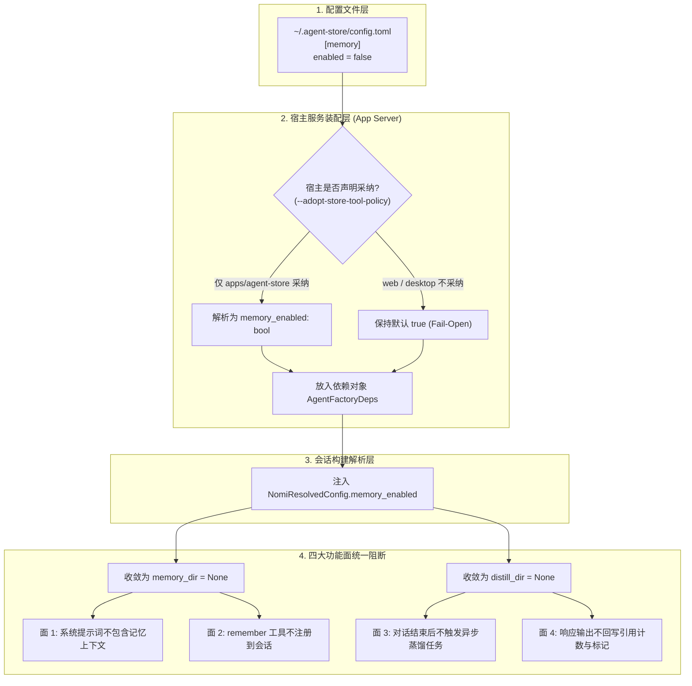

# 内置记忆总开关 `[memory] enabled` · 技术方案

> **状态**：✅ **已实现落地**（2026-09-20，零 wire 变更，协议指纹保持不变）  
> **核心原则**：四面一体停用 —— **一个布尔开关控制四个子系统面**，**按值透传防并发污染**，**Fail-Open 默认开启**，**宿主精准采纳**。

---

## 1. 背景与核心痛点

### 1.1 业务背景
平台的内置记忆系统包含提示词上下文注入、`remember` 工具调用、轮后异步蒸馏以及记忆引用回写四大功能面。此前，系统仅提供了一个子项开关 `distill_enabled`（用于控制是否在每轮对话后发起额外的模型调用执行记忆提取，耗时约 6~15 秒）。

### 1.2 现状与两大痛点
1. **缺乏子系统级的总闸门**  
   `distill_enabled` 仅能关闭蒸馏，无法彻底关闭内置记忆。用户若希望在特定场景（如严苛的排障环境、私有安全隔离或轻量无状态测试）下完全停用记忆能力，系统无能为力。
2. **多面状态容易分叉与漂移**  
   记忆系统的四个面跨越了两个核心底层模块：提示词注入与工具注册位于引擎层（`nomi-agent`），而蒸馏与引用回写位于后端管理层（`nomifun-ai-agent`）。若各模块自行读取配置或依赖全局静态变量，在并发会话与自动化测试中极易出现状态冲突与环境污染。

### 1.3 核心开关矩阵对比

| 开关组合 | 提示词段落注入 | `remember` 工具注册 | 轮后异步蒸馏 | 引用回写与计数 | 适用场景 |
|---|---|---|---|---|---|
| `enabled=true`<br/>`distill_enabled=true` | ✅ 注入 | ✅ 注册 | ✅ 发起蒸馏 (耗时 6~15s) | ✅ 回写 | **默认状态**：全功能开启 |
| `enabled=true`<br/>`distill_enabled=false` | ✅ 注入 | ✅ 注册 | ❌ **跳过蒸馏** | ✅ 回写 | **快速交互**：保留记忆检索但消除轮次尾巴延迟 |
| **`enabled=false`**<br/>(任意 distill 值) | ❌ **全停** | ❌ **全停** | ❌ **全停** | ❌ **全停** | **彻底禁用**：无状态隔离、轻量运行与故障排查 |

---

## 2. 方案全景与架构设计

### 2.1 整体透传架构图

系统采用 **“宿主启动读取一次，按值逐级透传”** 的设计模式，杜绝引擎层反向依赖服务端配置，同时避免使用进程级全局变量导致并发污染：



### 2.2 目标与非目标

#### 核心目标
1. **真正的四面同步**：`enabled = false` 时四个面同时关闭，不存在任何部分生效的中间态。
2. **纯值依赖与环境隔离**：配置值作为不可变字段伴随工厂和会话解析传递，保证并发测试与多会话环境零串扰。
3. **安全容错与零破坏**：配置文件缺失、损坏或语法错误时一律 **Fail-Open** 维持开启；关闭仅影响运行期解析，**绝不物理删除**磁盘已有记忆数据。

#### 明确的非目标
- **不提供前端 WebUI 开关**：总开关定位为运维与宿主部署级配置，不开放界面交互与动态热改，避免制造未落地的“假开关”。
- **不进入 `config/set` 写入白名单**：防止外部请求随意停用平台核心认知底座。
- **不影响伙伴记忆库**：独立于伙伴伴侣人格数据（`shared/memory.db`），仅作用于内置文件型记忆系统。

---

## 3. 详细设计

### 3.1 配置文件规范与排他性声明

#### 1. TOML 配置形状
开关置于 `~/.agent-store/config.toml` 文件中：

```toml
# ~/.agent-store/config.toml

[memory]
enabled = false           # 关掉内置记忆系统全部四个面（缺省为 true）
distill_enabled = false   # 仅关掉轮后记忆蒸馏（缺省为 true）
```

#### 2. 重要排他说明（配置命名澄清）
- **唯一真源**：仅认准 TOML 格式的 `~/.agent-store/config.toml`。
- **排除项**：运行环境可能存在的 `<data-dir>/config.yaml` 属于网关与云端登录配置，与记忆系统无关。

---

### 3.2 宿主采纳位与 Fail-Open 容错

#### 1. 宿主作用域隔离（`adopt` 门禁）
由于同一份 `~/.agent-store/config.toml` 可能被多个不同角色的宿主读取，系统通过 `--adopt-store-tool-policy` 启动参数作为采纳开关：
- 仅 `apps/agent-store` 专用宿主将 `adopt` 置为 `true` 并采纳 `[memory]` 设置；
- 独立 Web 宿主及桌面宿主（Tauri）均忽略该配置（`adopt = false`），避免运维调试时误伤其他共存服务。

#### 2. 容错规则（Fail-Open）
- 配置文件缺失、语法错误、或未显式声明 `enabled` 字段时，逻辑统一解析为 `true`。
- 保证系统在异常情况下优先提供完整服务能力，不因配置小错误使智能体失去上下文记忆。

---

### 3.3 四大消费面的门控实现

四大消费面均巧妙地收敛为核心目录路径的 `Option` 判定，无需增加冗余逻辑通道：

```rust
// 1. 引擎层 (nomi-agent)：收敛为 memory_dir
let memory_dir = if self.memory_enabled {
    nomi_memory::paths::auto_memory_dir(cwd_path)
} else {
    None // 停用面 1（提示词段落）与 面 2（remember 工具）
};

// 2. 后端层 (nomifun-ai-agent)：收敛为 distill_dir
let distill_dir = if !config_extra.memory_enabled {
    None // 停用面 3（蒸馏 Task 拉起）与 面 4（引用回写）
} else {
    auto_memory_dir(cwd_path)
};
```

- **面 1（提示词段落）**：`memory_dir` 为 `None` 时，系统提示词直接跳过记忆目录扫描，模型对历史记忆完全无感。
- **面 2（`remember` 工具）**：当且仅当 `memory_dir` 为 `Some` 时才向模型注册 `remember` 工具，关闭时模型工具箱中无此工具。
- **面 3（轮后记忆蒸馏）**：对话完成后，仅在 `distill_dir` 存在时才拉起蒸馏子任务，关闭后彻底消除 6~15 秒的额外模型请求延迟。
- **面 4（引用回写）**：输出流沉降层仅在 `distill_dir` 存在时才解析 `<nomi-mem-citation>` 标签并累加命中权重，关闭后不做任何写盘。

---

## 4. 核心决策与权衡

| 编号 | 决策点 | 选定方案 | 放弃的替代方案与理由 |
|---|---|---|---|
| **D1** | **配置结构选型** | **保持 `[memory]` 表结构加 `enabled` 键** | ❌ 做成标量 `memory = false`：破坏 TOML 表扩展性，后续无法平滑新增模型或路径覆写配置。 |
| **D2** | **状态传递机制** | **启动期单次读取，按值注入依赖** | ❌ 进程级全局变量（Atomic/Mutex）：导致并发会话互相污染，且单元测试并行执行时产生伪失败。 |
| **D3** | **配置容错策略** | **Fail-Open（错误保持开启）** | ❌ Fail-Closed：记忆属于核心服务能力，因文件 typo 导致能力静默下线是不可接受的严重故障。 |
| **D4** | **数据清理边界** | **开关只管逻辑解析，绝不删除磁盘文件** | ❌ 关掉时自动归档或删除历史记忆文件：产生不可逆的数据破坏，违背配置开关的幂等可逆原则。 |

---

## 5. 验收标准与测试矩阵

| 编号 | 验证场景 | 断言标准与验收口径 |
|---|---|---|
| **S1** | **默认与缺省开启** | 缺失配置文件或留空 `[memory]` 表时，`memory_enabled()` 恒返回 `true`。 |
| **S2** | **两键独立性验证** | `enabled=false` 时，无论 `distill_enabled` 配何值，四大功能面均全停。 |
| **S3** | **宿主采纳隔离** | 在 `adopt = false` 的宿主上即便文件写了 `false`，内部仍保持 `true`。 |
| **S4** | **Fail-Open 验证** | 配置文件损坏或存在非法语法时，系统保持启动并回退为开启状态。 |
| **S5** | **Prompt 与工具阻断** | `enabled=false` 时，`tool_names()` 中不包含 `remember`，系统 Prompt 不含记忆段。 |
| **S6** | **蒸馏与回写阻断** | `enabled=false` 时，对话结束后的蒸馏子任务不被拉起，输出流不进行计数回写。 |

---

## 附录：原始技术底稿与历史归档 (Historical & Technical Reference Archive)

> **归档说明**：以下完整保留重构前的原始技术底稿、历次讨论与历史记录全文，供历史追溯、协议字段详细对照与技术审计。

---

# 33 · 内置记忆总开关 `[memory] enabled` · 实现方案

> 状态：✅ **已实现**（2026-09-20）。代码落地 + 测试锁定，读数见 §9；**未提交**（工作树变更）。
> 需求背景：内置记忆需要一个**由配置驱动的总开关**——`~/.agent-store/config.toml` 配了 `false`
> 即关闭内置记忆系统。三处口径已拍板：**全关四面**（注入 + `remember`
> + 蒸馏 + 引用回写）、**只做 `~/.agent-store/config.toml` 一个来源**、**宿主启动时读一次**
> （与同表 `distill_enabled`、`[tools]` 一致）。
> 关联：`20-tool-injection-policy.zh.md`（**姊妹篇**：同一份文件的 `[tools]` 表，本文的采纳/失效
> 口径全部照抄它）、`05-flowy-agent-store-app-server-protocol.md`（§12.4 `config/set` 白名单）、
> `21-open-decisions.zh.md`（D-STREAM-2 与 `[memory] distill_enabled` 的由来）、
> `16-sdk-webui-site-priority-plan.zh.md`（R16 `agent` 分区）、
> `19-webui-codex-alignment.zh.md`、`31-sdk-entry-shape.zh.md`（同一时期的入口改名，无交集）。
> 用途：说明为什么内置记忆需要一个比 `distill_enabled` 更宽的开关、这个开关挂在哪份文件、
> 谁采纳它、关掉之后究竟停了哪四件事，以及**开工前必须先排除的那个命名陷阱**（§2）。

---

## 1. 结论先行

`~/.agent-store/config.toml` 新增一个键：

```toml
[memory]
enabled = false      # 关掉这台宿主的整个内置（文件型）记忆系统
```

`false` 时**四个面同时停**——它们是一个系统的四个面，不存在「只关一半」：

| # | 面 | 关掉后的行为 | 门控点 |
|---|---|---|---|
| 1 | 系统提示词的记忆段落 | 不注入（连 `MEMORY.md` 索引都不给模型看） | `nomi-agent/src/bootstrap.rs:677` |
| 2 | `remember` 工具 | 不注册，模型无法写入新记忆 | `nomi-agent/src/bootstrap.rs:768` |
| 3 | 轮后记忆蒸馏 | 不发起那次额外模型调用 | `manager/nomi/agent.rs:821` → `:2103` |
| 4 | 引用回写 | 不解析 `<nomi-mem-citation>`、不累加使用计数 | `capability/backend_output_sink.rs:1315` |

**一句话**：`distill_enabled` 是**一个功能的开关**（每轮多一次模型调用，值 6~15 秒收尾延迟），
`enabled` 是**一个子系统的开关**。两者独立、可任意组合，`enabled = false` 让 `distill_enabled`
失去意义（§4）。

**这不是 `[tools]` 加一个键那么简单，也不是 `distill_enabled` 换个名。** 差别在于消费面跨了
crate 边界：面 1/2 在 `nomi-agent`（引擎），面 3/4 在 `nomifun-ai-agent`（后端 manager），
而**读文件的那一层（`nomifun-app-server`）依赖后两者**，方向反过来会成环。所以正确形状是
**宿主读一次、按值透传**，而不是让引擎各自去读文件（§5.2、§6.2）。

---

## 2. 前置：先排除命名陷阱（本节是本文最该先读的部分）

仓库里同时存在**四份** config 文件。本次实现的第一版**接错了文件**，代价是整套返工 + 一轮
作废的提问，原因就是下面这个同名陷阱：

| 文件 | 格式 | 谁读 | 管什么 |
|---|---|---|---|
| `%APPDATA%\nomi\config.toml`（Linux `~/.config/nomi`） | TOML | 引擎 `Config::resolve` 的 global 段 | 引擎自己的 `[tools]` / `[memory] distill_enabled` / provider |
| `<会话 workspace>/.nomi.toml` | TOML | 同上，project 段 | 同上，按项目覆盖 |
| **`~/.agent-store/config.toml`** | **TOML** | **只有 `AgentStoreConfig`** | **providers / `[memory]` / `[tools]` / marketplace / import / credentials** |
| `<data-dir>/config.yaml` | **YAML** | `GatewayConfig` | **server（云登录）/ media / insights / interest** |

**陷阱**：用户口语说的「config.yaml 配置了 false」，**指的是第三行那份**。它叫 `config.toml`、
是 TOML；而第四行那份**真的**叫 `config.yaml`，名字更像、扩展名还正好对得上，但它管的是云登录与
媒体生成，**与记忆毫无关系**。

判别方法只有一个，且是一句话的代价：**看目录里到底有什么文件**。

```powershell
Get-ChildItem "$env:USERPROFILE\.agent-store"     # → 只有 config.toml，没有 config.yaml
```

本次实现事后核对：`~/.agent-store/` 下**只有 `config.toml`**；全仓库 `grep` 也**不存在**
任何 `agent-store/config.yaml` 的读取路径。**「先确认文件存在、再动手」** 是本文留下的第一条
操作纪律——它本可以省掉整套返工。

> 附带结论：`<data-dir>/config.yaml` 那条路**本次完全未改**（第一版曾改过，已 `git checkout`
> 全部回退）。`GatewayConfig` 今天仍只有 `home_dir` / `server` / `media` / `insights` /
> `interest` 五段。

---

## 3. 数据模型

### 3.1 `AgentStoreMemory` 的两个键

`crates/backend/nomifun-app-server/src/agent_store.rs:381-398`：

```rust
pub struct AgentStoreMemory {
    pub distill_enabled: Option<bool>,   // 已有：只管「轮后蒸馏」一半
    pub enabled: Option<bool>,           // 本次新增：整个内置记忆系统
}
```

两者都是 `Option<bool>`，`None` = **该键缺席**，与 `Some(false)`（显式关闭）**刻意不合并**。
这与同文件既有口径一致（`mcp: Option<..>`「无文件 ≠ 空文件」、`distill_enabled: null`
「未配置 ≠ 关闭」，见 `20` §9.5）。

### 3.2 默认值：缺席 = 开

`agent_store.rs:404-406`、`:413-418`：

```rust
impl AgentStoreMemory {
    pub fn enabled(&self) -> bool { self.enabled.unwrap_or(true) }
}
impl AgentStoreConfig {
    pub fn memory_enabled(&self) -> bool {
        self.memory.as_ref().map(AgentStoreMemory::enabled).unwrap_or(true)
    }
}
```

三种「没说关」的写法**全部等于开**：不写 `[memory]`、写空的 `[memory]`、写 `enabled = true`。
于是**升级后行为逐字节不变**，关闭必须显式写出来。`[tools]` 的 `tool_policy()` 用的是同一个
形状（`unwrap_or_default()` = 不约束任何东西），本文照抄。

### 3.3 为什么不做成裸布尔

第一版曾考虑 `memory: false`（无表、直接布尔）。**否掉了**，理由是可扩展性：`[memory]` 表已经
有 `distill_enabled` 兄弟键，将来还会有 `distill_model` / 根目录覆盖等，做成标量就得再来一次
迁移。现在保持表形状，新增键是纯加法。

> 注意：这里的「`memory: false`」是 **TOML 表名**，与 §2 那份 **YAML** 文件无关；两者只是
> 恰好都能写出 `memory: false` 这个字面量，**语义完全不同**。

---

## 4. 两个键的关系：独立，且宽者吞并窄者

| `enabled` | `distill_enabled` | 实际行为 |
|---|---|---|
| `true` / 缺 | `true` / 缺 | 全部开启（上游默认） |
| `true` / 缺 | `false` | **只**停蒸馏；提示词段落、`remember`、引用回写照常 |
| `false` | 任意 | **四面全停**；`distill_enabled` 写什么都不再起作用 |

第二种组合是本次实现的**主要价值**：它对应 D-STREAM-2 的真实诉求——「回答完成」与「轮次结束」
同步（去掉 6~15 秒收尾尾巴），**但不要**顺手把记忆的读与写也砍掉。在本次改动之前，用户想
「只要前者」是做不到的（`distill_enabled` 就是唯一的开关）。

`NOMIFUN_MEMORY_DISTILL` 环境变量仍然只覆盖**蒸馏**这一半（`manager/nomi/distill.rs:77-84`
的优先级链），**不能**把被 `enabled = false` 关掉的系统重新打开——这个不对称是刻意的：
环境变量是历史兼容口，不是宿主策略口。

---

## 5. 透传链路

### 5.1 五跳

```
~/.agent-store/config.toml  [memory] enabled
   │  ① 读一次（宿主启动期）
   ▼
AppServices::from_config  →  resolve_host_memory_enabled(adopt, path)
   │      crates/backend/nomifun-app/src/services.rs:1675 / :3330
   │  ② 按值进工厂依赖
   ▼
AgentFactoryDeps.memory_enabled: bool          factory/mod.rs:197
   │  ③ 按值进会话解析结果
   ▼
NomiResolvedConfig.memory_enabled: bool        types.rs:329
   │            │  factory/nomi.rs:979 透传
   │  ④ 后端 manager                        │  ⑤ 引擎 bootstrap
   ▼                                        ▼
manager/nomi/agent.rs:820                  bootstrap.rs:677
  → distill_dir: None  ⇒ 停面 3 + 面 4       → memory_dir: None  ⇒ 停面 1 + 面 2
```

**关键**：四个面读的是**同一个布尔值**，不是四次独立的文件读取。这样「四个面必须一致」是
**构造保证**，而不是「碰巧四处的解析结果相同」——后者会在任何一处口径改动时静默漂移。

### 5.2 为什么不用进程全局

第一版用 `static AtomicI8`（照 `set_distill_host_override` 的先例）在启动时装填。**跑测试时当场
暴露缺陷**：`bootstrap_embedded_agent_execution_is_host_composed` 丢了 `remember` —— 该校验
枚举**全部**工具名并做集合相等断言，而并行的另一个用例刚把全局置成了 `false`。

即：**进程全局会让并发构建的会话互相污染**。`startup 读一次` 这个需求用「宿主读一次、
把结果放进 `AgentFactoryDeps`」就能满足（依赖对象本来就在启动期构造一次），**不需要**全局。
改法即 §5.1 的按值透传。

> `distill_enabled` 继续用全局（`set_distill_host_override`）**不动**：它只被一处读取
> （`distill::distill_enabled`），没有跨构建泄漏面。两者形状不同是**有意的**，不是不一致。

---

## 6. 采纳规则（三处，全部照抄 `[tools]`）

### 6.1 只由「主张自己拥有这份文件」的宿主采纳

`services.rs:1675-1682`：

```rust
fn resolve_host_memory_enabled(adopt: bool, path: Option<&Path>) -> bool {
    if !adopt { return true; }                       // 没采纳 = 忽略文件
    path.and_then(AgentStoreConfig::load_ok)
        .map(|stored| stored.memory_enabled())
        .unwrap_or(true)                             // 读不动 = fail-open
}
```

`adopt` 就是既有的 `--adopt-store-tool-policy`（`cli.rs:133`），**且只有 `apps/agent-store`
把它置 true**（`apps/agent-store/src/main.rs:276`）。理由是同一份文件被多宿主共享：

| 宿主 | 指向 `~/.agent-store/config.toml`？ | 采纳 `[memory]`？ |
|---|---|---|
| `apps/agent-store`（专用 Store 宿主） | ✅ `main.rs:268-271` | ✅（`adopt = true`） |
| `apps/web`（独立 Web 宿主） | ✅ `main.rs:247-252` | ❌ |
| `apps/desktop`（Tauri 桌面） | ❌ 完全不接线（实测：`apps/desktop/` 全目录 grep 无 `agent-store`） | ❌ |

**如果不做这枚宿主位**，Web 宿主的运维者在 `~/.agent-store/config.toml` 里写一行
`[memory] enabled = false`，会**静默关掉 Web 宿主的记忆**——而他根本没瞄准这个宿主。
这正是 `20` §2.3 记下的「本路线唯一的残留风险点」，本次沿用同一枚闸门解决。

### 6.2 失败一律 fail-open（保持开启）

文件缺失 / 不可解析 / 无 `[memory]` 表 → **保持开启**。一个 typo 不该把宿主的记忆能力悄悄剥掉。
这与 `[tools]` 的「fail-open 到 permissive 默认」是同一条口径，测试镜像同名
（`tool_policy_fails_open_when_the_file_is_unusable` → `host_memory_switch_fails_open_when_the_file_is_unusable`）。

> 与 `[connector_proxy]` 的 **fail-closed** 恰好相反，且都是对的：那是个**授权**表（开了就
> 允许第三方调用），默认必须关；这是个**能力**开关，默认必须开。

### 6.3 生效时机：启动读一次

与同表 `distill_enabled`、`[tools]` 完全一致（`20` §9.1 第 4 条已登记该惯例）：
`config/get` 立即回读磁盘真实值，但**运行期的会话不受影响**，要重启宿主。

---

## 7. 四个消费面的门控点

### 7.1 面 1 + 面 2：引擎侧（一个 `Option` 同时管住）

`bootstrap.rs:674-686` 把开关收束成 **`memory_dir: Option<PathBuf>`**：

```rust
let memory_dir = if self.memory_enabled {
    nomi_memory::paths::auto_memory_dir(cwd_path)
} else { /* log */ None };
```

这一个 `Option` 同时供给两个消费点，于是**它们不可能不一致**：

| 消费点 | 位置 | 写法 |
|---|---|---|
| 提示词段落 | `bootstrap.rs:944` | `build_system_prompt(.., memory_dir.as_deref(), ..)` |
| `remember` 注册 | `bootstrap.rs:768` | `if let Some(mem_dir) = memory_dir.clone() { register(..) }` |

**这是本次实现最省的一处**：`memory_dir` 本来就是 `Option`，原先只有「平台没有配置目录」一种
`None` 来源；现在多一种。**没有新增任何管道**，只是把它的来源从「恒定 `Some`」改成「可关」。

### 7.2 面 3 + 面 4：后端侧（同样是一个 `Option`）

`manager/nomi/agent.rs:820-825`：

```rust
let memory_enabled = config_extra.memory_enabled;
let distill_dir = if companion_sink.is_some() || !memory_enabled { None } else { auto_memory_dir(..) };
```

`distill_dir` 同样是既有 `Option`，原本只有「伙伴会话红线」一种 `None` 来源：

| 消费点 | 位置 | 依赖 |
|---|---|---|
| 蒸馏 child 的 spawn 判定 | `agent.rs:2103-2105` | `distill_dir.clone()` 为 `Some` |
| 引用回写 | `backend_output_sink.rs:1315` | `self.distill_dir.as_ref()` 为 `Some` |

**伙伴红线保持不变**：`companion_sink.is_some()` 仍然独立地把 `distill_dir` 归零
（伙伴人格记忆属于 companion SQLite store + learner，**不是**内置记忆）。两个条件用 `||` 合成，
**任一条成立即为 None**——这是「只收窄」方向，与全仓的 ceiling 语义一致。

### 7.3 「关掉」不删任何磁盘内容

`enabled = false` **不**删、**不**隐藏、**不**改已有记忆文件。`auto_memory_dir` 只是不再被
解析，`<data-dir>/projects/<sanitized>/memory/` 下的文件原样留着，改回 `true` 即恢复原状。
这是「开关」而非「删除」——测试用 `memory_enabled_reads_the_real_file_shape` 之外的用例锁定了
默认值是开，从而保证「改回去」有明确可断言的行为。

---

## 8. 边界与非目标

| 项 | 状态 | 理由 |
|---|---|---|
| `config/set` 写入白名单 | **不加** | `AgentStoreMemoryPatch`（`agent_store.rs:1135-1139`）仍只认 `distill_enabled`。总开关的影响面远大于蒸馏，先不开放程序化写入。**这是刻意的当前状态，不是漏做**——`05` §12.4 已同步登记「`enabled` 不在白名单」。 |
| `config/get` 读投影 | **不加** | `AppServerConfigMemoryView`（`api-types/src/app_server.rs:1125-1129`）仍只有 `distill_enabled`。设置界面因此也没有这个开关——**不做假开关**（`16` §6 的红线：点了没反应的控件不做）。 |
| WebUI 开关 | **不做** | 同上；与读投影是一件事。 |
| `~/.nomi/config.toml` 的 `[memory]` 加总开关 | **不做**（用户拍板：只做 `config.yaml`/`agent-store` 一个来源） | 那份是引擎全局配置，与桌面会话共享且无产品写入面。 |
| 删/归档已有记忆文件 | **不做** | 见 §7.3。 |
| 伙伴记忆（`shared/memory.db`） | **不受影响** | 那是另一套系统（companion SQLite store + learner），本次完全不碰。 |
| 语义/向量记忆 | **不做** | 与本次无关；现状见 `agent-harness-architecture-review` H7。 |

---

## 9. 验收与读数

### 9.1 测试点（每条都做了「去掉门禁必须变红」的反向验证）

| 层 | 测试 | 锁定的东西 |
|---|---|---|
| 解析 | `memory_enabled_defaults_on_and_is_independent_of_distill` | 缺表/空表 = 开；两键独立（两个方向） |
| 解析 | `memory_enabled_reads_the_real_file_shape` | 在**完整的真实文件形状**（providers + models + `[memory]`）下仍正确，兄弟表不受影响 |
| 采纳 | `host_memory_switch_is_adopted_only_by_the_host_that_opts_in` | `adopt = false` 时文件里写了 `false` 也**不采纳** |
| 采纳 | `host_memory_switch_fails_open_when_the_file_is_unusable` | 缺失 / 坏 TOML / 无路径 / 声明无关键 → 全部保持开启 |
| 引擎面 1+2 | `memory_switch_controls_the_remember_tool` | `remember` 默认注册、关掉后不在 `tool_names()` |
| 引擎面 1+2 | `memory_switch_controls_the_prompt_section` | **先断言默认确实注入**（正对照，防真空通过），再断言关掉后不注入且提示词其余部分仍在 |
| 后端面 3+4 | `host_memory_switch_zeroes_the_distill_dir` | 后端开关 → `distill_dir` 为 `None` |

反向验证记录（实施期实跑）：去掉 `|| !memory_enabled` → 后端那条 **FAILED**；去掉
`resolve_host_memory_enabled` 的采纳判定 → 采纳两条 **FAILED**。即断言是**承重**的，不是
「碰巧为真」。

### 9.2 读数（2026-09-20）

| 命令 | 结果 |
|---|---|
| `cargo check --workspace --tests` | ✅ 通过（仅既有 warning） |
| `cargo fmt --check` | ✅ 干净 |
| `cargo test -p nomi-agent --lib` | **826 passed / 0 failed** |
| `cargo test -p nomi-agent --test bootstrap_test` | **17 passed / 0 failed** |
| `cargo test -p nomifun-app-server --lib` | **167 passed / 0 failed** |
| `cargo test -p nomifun-app --lib services::tests` | **27 passed / 0 failed** |
| `cargo test -p agent-store` | **9 passed / 0 failed** |
| `cargo test -p nomifun-ai-agent --lib` | 1064 passed / **31 failed** |
| 站点 `node scripts/check-docs-sync.mjs` | 10 页 **0 drift** |
| 站点 `bun run test:docs-sync` | **16 pass / 0 fail** |

**那 31 个失败是既有基线红，与本次改动无关**：全部是 Windows 上缺 `sh` 的
`capability::cli_process` / `manager::acp` 环境性失败（`Failed to spawn CLI process '"sh" …':
program not found`）。已用 `git stash` 在**未改动的基线**上复现同样 31 个（基线 1063 passed /
31 failed；本次新增 1 条测试后为 1064 / 31）。

> 实施期曾读到一次 `1063 passed / 32 failed`，重跑回到 `1064 / 31`——是其中一个进程测试的
> 偶发抖动，不是新缺陷。

---

## 10. 影响到的既有文档（订正登记）

| 文档 | 原表述 | 现状 | 处置 |
|---|---|---|---|
| `05` §12.4 | `config/set` 白名单 = `default_model` / `memory.distill_enabled` / `tools.*` | 仍然准确（`enabled` **不在**白名单） | 已补一段说明「`[memory] enabled` 是宿主策略、不在白名单、只在 Store 宿主采纳」 |
| `20` §7.5 | `remember` 一行：「`memory_dir` **实际恒为 `Some`**」 | ❌ **已成为假话**——宿主可把它关成 `None` | 需订正（见下） |
| `20` §6.2 | `remember` 一行：「**当前无任何开关**，必须靠新增的减项关闭」 | ❌ 已过时——现在 `[memory] enabled` 就是总开关 | 需订正（见下） |
| 站点 `configuration.md`（中英） | `[memory]` 只讲 `distill_enabled` | 已补 `enabled` 小节：四面对照表、默认开、与 `distill_enabled` 独立、只影响采纳它的宿主、启动读一次、**只能手改**、与 `~/.nomi/config.toml` 的区别 | 已同步（10 页 0 drift） |

**为什么 `20` 的两行必须改**：本仓的文档与注释是**承重**的（`21` §「顺带订正两处会撒谎的
注释」已立此口径）。我的改动使这两行变成假话，留着就是让下一个读者按错误的前提做判断。

---

## 11. 操作口径（给运维）

```toml
# ~/.agent-store/config.toml

# 只要「回答完成 = 轮次结束」（去掉 6~15 秒收尾），但保留记忆的读与写：
[memory]
distill_enabled = false

# 整个内置记忆系统下线（四面全停），或临时排障：
[memory]
enabled = false
```

- 改完**重启宿主**（启动读一次）。
- 只在 `agent-store` 宿主上生效；`web` / `desktop` 读到同一份文件也**不采纳**。
- 想做但没做的：设置界面里的开关、`config/set` 的写入面（§8）——所以**只能手改文件**。
- 关掉**不删**已有记忆；改回 `true` 即恢复。
- 想彻底删数据是另一件事：`<data-dir>/projects/<sanitized>/memory/`（不在本文范围）。

---

## 12. 与其他文档的关系

- `20-tool-injection-policy.zh.md` —— **姊妹篇**。`[tools]` 与 `[memory] enabled` 是同一份
  文件里的两张宿主策略表，采纳规则（宿主位）、失效口径（fail-open vs fail-closed）、生效时机
  （启动一次）三件事**逐条同源**；本文不重复论证，凡「与 `[tools]` 同款」处即指该文相应小节。
- `21-open-decisions.zh.md` —— D-STREAM-2：`distill_enabled` 的由来（6~15 秒收尾尾巴）。
  本文的 `enabled` 是它的**外层**，不替代它。
- `05-flowy-agent-store-app-server-protocol.md` §12.4 —— `config/set` 白名单的权威正文；
  `enabled` 不在其中，且这是刻意的。
- `16-sdk-webui-site-priority-plan.zh.md` R16 / `19-webui-codex-alignment.zh.md` —— `agent`
  分区的历史（只有蒸馏开关）；若将来把 `enabled` 做进 UI，需先补读投影与写白名单。
- `10-public-contracts.md` —— **本次零 wire 变更**：无新方法、无新 DTO 字段、无新错误码，
  故协议指纹**不动**（仍 `fp-7`），站点 `typescript-sdk` 的协议面**无需改**。
