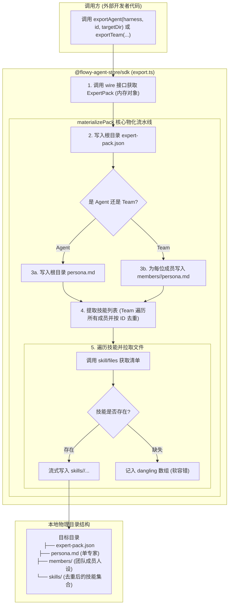

# SDK 导出 Agent / Team 及其 Skills（物化到目录）· 技术方案

> **状态**：✅ **已实施落地**（2026-09-24，代码与全量单测落地，零 wire 变更）  
> **核心原则**：SDK 纯客户端物化 —— **Wire 层零变更**，**`client` 保持纯净环境无关（无 `node:fs`）**，**`sdk` 提供一手导出与物化 API**，**团队技能按 ID 跨成员去重**，**未安装技能软容错（Dangling 收集）**。

---

## 1. 背景与核心痛点

### 1.1 业务背景
在完成底层专家定义导出协议（`ExpertPack`）后，外部开发者期望通过 TypeScript SDK 能够一行代码导出专家（Agent）、专家团（Team）及其所依赖的全部技能（Skills）到本地物理目录，以便直接运行在外部的智能体 Runtime 中。

### 1.2 现状与两大痛点
1. **开发者缺乏一手的目录物化工具**  
   虽然服务端已提供 `agent/export`、`team/export`、`skill/files` 等原子协议接口，但开发者若想在本地得到完整的可运行资产目录，必须自行手写十多行文件遍历、目录创建、Base64 解码与技能拉取代码，开发体验割裂。
2. **多 Agent 团队的技能与人设结构复杂**  
   对于包含多个成员的专家团（Team）：
   - 团队顶层自身没有单独的 Persona 正文，每位成员各有其独立的 Persona；
   - 团队顶层没有集中声明技能，技能分散在各个成员的 `members[].skills` 中，不同成员经常引用同名或相同 ID 的公共技能（如代码执行工具、浏览器工具）。手写物化极易产生冲突覆盖或遗漏。

### 1.3 核心设计结论

| 维度 | 设计决定 | 说明 |
|---|---|---|
| **协议层（Wire）** | **零变更** | 复用既有 `agent/export`、`team/export`、`skill/files`，不变更协议指纹 |
| **代码落点** | **仅收敛于 `@flowy-agent-store/sdk`** | `packages/client` 严格保持纯净（支持浏览器与裸 Node），**绝不引入 `node:fs`** |
| **公开 API** | `exportAgent` / `exportTeam` / `materializePack` | 导出定义与落盘物化双重能力 |
| **团队技能处理** | **跨成员按 ID 严格去重** | 收集全部成员的技能依赖并全局去重，统一物化至根级 `skills/` |
| **未安装技能** | **软容错收集（Dangling）** | 声明了但本地未安装的技能不中断整体流程，收集并返回警告列表 |

---

## 2. 方案全景与架构设计

### 2.1 端到端物化流程图



### 2.2 目标与非目标

#### 核心目标
1. **开箱即用的交付物**：调用者传入目标路径即可全自动落盘成标准化结构目录。
2. **多平台纯净性维护**：SDK 具备文件操作能力，而轻量客户端（Client）维持零 Node 核心模块依赖。
3. **团队拓扑清晰化**：团队各成员的人设分目录独立存放，多技能跨成员自动合并去重。

#### 明确的非目标
- **不在网络传输中内联技能文件**：技能依然保持引用式拉取，防止服务端单次序列化数十兆冗余数据。
- **不做破坏性事务回滚**：若磁盘写入中途因磁盘已满等物理故障中断，交由调用方决定清理，不在 SDK 内封装复杂的事务文件锁。

---

## 3. 详细设计

### 3.1 模块一：公开接口定义

SDK 位于 `web/packages/sdk/src/export.ts`，导出以下核心方法与依赖接口：

```ts
import type { ExpertPack } from "@flowy-agent-store/protocol";

/**
 * 最小依赖契约，Harness 实例天然兼容
 */
export interface ExportDeps {
  agents: { export(agentId: string): Promise<ExpertPack> };
  teams: { export(teamId: string, teamVersion?: string): Promise<ExpertPack> };
  skills: {
    files(skillId: string): Promise<{ files: { path: string }[] }>;
    readFile(skillId: string, path: string): Promise<Uint8Array>;
  };
}

export interface MaterializeOptions {
  /** 写入的目标根目录 */
  targetDir: string;
  /** 遇到悬空/未安装技能时的回调 */
  onDanglingSkill?: (skillId: string, error: unknown) => void;
}

export interface ExportResult {
  pack: ExpertPack;
  targetDir: string;
  /** 声明了但宿主未安装的技能 ID 列表 */
  danglingSkills: string[];
}

/** 导出单 Agent 及其技能到目录 */
export async function exportAgent(
  deps: ExportDeps,
  agentId: string,
  options: MaterializeOptions
): Promise<ExportResult>;

/** 导出 Team 及其成员与全部技能到目录 */
export async function exportTeam(
  deps: ExportDeps,
  teamId: string,
  options: MaterializeOptions
): Promise<ExportResult>;

/** 将任意已有的内存 ExpertPack 对象物化到本地目录 */
export async function materializePack(
  deps: ExportDeps,
  pack: ExpertPack,
  options: MaterializeOptions
): Promise<ExportResult>;
```

---

### 3.2 模块二：物化规范与文件结构

物化生成的目标目录严格遵循以下规范排布：

#### 单 Agent 目录结构
```text
<targetDir>/
  ├── expert-pack.json          # 完整的 ExpertPack 协议 JSON (含 pack_format)
  ├── persona.md                # 专家自身完整的 instructions 正文
  └── skills/
      └── web-search/           # 技能名称命名的子目录
          ├── SKILL.md
          └── scripts/
```

#### Team 目录结构
```text
<targetDir>/
  ├── expert-pack.json          # 完整的团队定义 (含成员名单与 Leader 标记)
  ├── members/                  # 各成员的人设正文
  │   ├── dev-lead/
  │   │   └── persona.md
  │   └── test-engineer/
  │       └── persona.md
  └── skills/                   # 全局按 ID 去重后的技能集合
      ├── code-eval/
      └── git-tools/
```

---

### 3.3 模块三：关键边界与容错处理

1. **团队技能提取与去重**  
   团队根级定义中的 `pack.skills` 为空数组。物化逻辑自动深度扫描 `pack.team.members`，汇总每个成员的 `skills` 列表，使用 `Map<skillId, skillRef>` 严格去重后再进行批量下载。
2. **未安装技能（Dangling）软容错**  
   在实际场景中，专家包声明的某些技能可能未在本地宿主中安装：
   - 当调用 `skills.files(skillId)` 报错（如 `NotFound`）时，系统**坚决不中断整个导出任务**；
   - 捕获该异常并将该 `skillId` 记入结果的 `danglingSkills` 列表中，若配置了 `onDanglingSkill` 回调则触发通知；
   - 保证核心代码与已安装的技能依然能够顺利物化落地。
3. **路径穿越防护**  
   服务端下发的 `file.path` 为技能目录内的 POSIX 相对路径，物化时对其进行严格的根路径规范化解析（`path.resolve`），杜绝恶意构造的 `../` 突破目标目录。

---

## 4. 核心决策与权衡

| 编号 | 决策点 | 选定方案 | 放弃的替代方案与理由 |
|---|---|---|---|
| **D1** | **代码分包归属** | **放置在 `packages/sdk`** | ❌ 放置在 `packages/client`：引入 `node:fs` 依赖，破坏客户端跨平台和浏览器直接使用的纯净性。 |
| **D2** | **技能传输形式** | **保持引用，SDK 侧逐个拉取物化** | ❌ 服务端序列化时内联二进制：破坏了 `ExpertPack` 纯元数据契约，导致接口传输数百兆冗余数据。 |
| **D3** | **缺失技能容错** | **收集到 `danglingSkills`，主流程成功** | ❌ 缺一不可强制报错：用户往往只需要专家的核心人设，某一个辅助工具缺失不应彻底阻断整个资产迁移。 |

---

## 5. 验收标准与测试矩阵

| 编号 | 验证场景 | 断言标准与验收口径 |
|---|---|---|
| **S1** | **单 Agent 完整导出** | `expert-pack.json` 与 `persona.md` 正确写入，技能文件逐字节与 `skill/file` 内容一致。 |
| **S2** | **Team 技能全局去重** | 团队中多位成员声明同一技能时，目标 `skills/` 目录下仅物化一份，无文件覆写冲突。 |
| **S3** | **Team 成员人设分存** | 团队成员按 ID 正确生成 `members/<id>/persona.md`，内容与各自声明严格吻合。 |
| **S4** | **Dangling 技能软容错** | 构造包含不存在技能的专家包，导出顺利完成，`danglingSkills` 列表中正确收录缺失的技能 ID。 |
| **S5** | **零 Wire 指纹影响** | `bun run check:fingerprint` 保持常绿，协议方法计数与接口定义无任何变更。 |

---

## 附录：原始技术底稿与历史归档 (Historical & Technical Reference Archive)

> **归档说明**：以下完整保留重构前的原始技术底稿、历次讨论与历史记录全文，供历史追溯、协议字段详细对照与技术审计。

---

# SDK 导出 agent / team 与其 skills（写到目录）· 技术方案

> 状态：🔧 **实施中**（代码已落地，读数回写见 §8）。
> 触发：用户要求「SDK 支持导出 agent、team 和 team 的 skills」——现状是单 agent 专家可用
> `agents.export` 导出，多 agent 的团（如 `frontend-backend-experts`）与**技能字节**没有
> SDK 级的一手交付物，只能手抄 doc `32` §6.5 的 11 行配方。
> 关联：`docs/agent-store/32-expert-pack-export.zh.md`（父方案；§6.5 曾拍板**不做**本助手，
> 本文是对其的推翻，理由链见 §2.2）、`docs/agent-store/24-external-agent-skill-and-mcp-access.zh.md`
> （§4 技能读面）、`web/packages/sdk`、`web/packages/client/src/{agents,teams,skills}.ts`、
> `web/scripts/sdk-live-expert-export.ts`（真机验收脚本）。
> 用途：界定 SDK 侧「导出定义 + 取回技能字节 + **把 pack 与技能文件写成一个目录**」的 API 形状、
> 错误语义与验收口径，作为动工前的范围登记；实施读数与偏差按本仓惯例回写 §8。
> 用词约定：本文的「写到目录 / 落成目录」（英文 materialize）指把**内存里的 pack 对象连同它引用的
> 技能字节写成一个真实目录**；它不改变 pack 数据本身，只是给出落盘形态。函数名 `materializePack`
> 沿用该英文词，含义以此为准。

---

## 1. 结论先行

| 项 | 决定 |
|---|---|
| wire | **零变更**：`agent/export` · `team/export` · `skill/files` · `skill/file` 四个方法均已存在 ⇒ **不 bump 指纹**、方法计数 `48 / 73` 不动、`check:fingerprint` / `check:release-sync` 不受影响 |
| 落点 | **只在 `web/packages/sdk`** 新增一个文件 `src/export.ts` + 单测；**`web/packages/client` 一个字不动**（它必须保持环境无关，不能引 `node:fs`，见 doc `32` §6.5 末尾的归属结论） |
| 公开面 | 三个导出：`exportAgent` / `exportTeam` / `materializePack`（外加 `ExportDeps` / `ExportResult` 两个类型） |
| 技能 | **仍是引用不内联**（doc `32` §2 第 4 条理由维持）：pack 里只有 `{name, id}`，字节经 `skill/files` + `skill/file` 取回落盘 |
| 文档 | 推翻 doc `32` §6.5「砍掉 SDK 目录写入助手」的拍板 ⇒ **必须回写** doc `32` §6.5/§9、`web/packages/sdk/README.md`、站点仓 `examples-sdk.md` / `changelog`（清单见 §9） |
| 发版 | `@flowy-agent-store/sdk` 新增公开导出 = 新 API ⇒ `0.1.0-beta.7 → beta.8`，按 doc `25` release runbook 走（§10） |

一句话：**把 doc `32` §6.5 那 11 行从「文档配方」提升为 `web/packages/sdk` 的三个带 semver 的函数**，
服务端与 wire 完全不动。

---

## 2. 背景与既有事实

### 2.1 证据表

| 事实 | 位置 |
|---|---|
| `agent/export` / `team/export` 两个 WS-only 方法已落地（无 HTTP 路由） | `web/packages/client/src/agents.ts:38`、`teams.ts:32`；doc `32` §6.1 订正 |
| 团导出 = 递归展开 + **整包失败**（成员缺一即失败并点名），leader 在首位 | doc `32` §6.4；`web/scripts/sdk-live-expert-export.ts` EX-006/EX-007 |
| **团包顶层 `skills` 恒为空数组**；技能全部挂在 `team.members[].skills` 上 | `crates/backend/nomifun-app/src/app_server_expert_export.rs:390`（`skills: Vec::new()`） |
| 团**没有自己的 persona**（顶层 `persona.instructions` 来自 team payload，可能为空串）；成员各带正文 | 同文件 `:375-383` |
| 技能是**引用**：`{name, id}`，`id === name`（`skill/list` 的 id 即技能名）；字节走 `skill/files` / `skill/file` | `web/packages/protocol/src/protocol.ts:1517`；doc `24` §4 |
| 悬空引用（声明了但本机没装）是**如实上报**的宿主事实，`skill/files` 会对它们报错 | doc `32` §6.5 EX-008；live 脚本 `dangling[]` 处理 |
| `skill/files` 受能力位 `skill_files` 约束，未接线 ⇒ `unsupported_operation` | `web/packages/client/src/skills.ts:31-36` |
| 导出确定性：无时间戳、列表有序，同快照两次导出逐字节相同；`provenance.content_digest` 可做缓存键 | doc `32` §4.4 |
| `client` 刻意环境无关（base64 解码兼容裸 Node），不得引入 `node:fs` | `web/packages/client/src/skills.ts:68-73`；doc `32` §6.5 末尾 |
| 现成端到端证明脚本（导专家、取技能、写成目录、逐字节断言） | `web/scripts/sdk-live-expert-export.ts` |

### 2.2 与 doc `32` §6.5 的关系（本次推翻什么、为什么）

doc `32` §6.5 在 2026-09-24 拍板**砍掉** `materializeExpert(harness, …)`，给了五条理由。本次用户明确要求
「SDK 支持导出 agent、team 和 team 的 skills」，逐条对账：

| §6.5 当时的理由 | 本次处置 |
|---|---|
| 1. 不覆盖新场景，wire 已覆盖同机与远端 | **部分失效**：wire 确实覆盖*取数*，但「pack → 目录 + 技能字节」这段每个消费者都要重写，用户现在就要 SDK 一手交付 |
| 2. 11 行公开原语拼成，不值得 semver 承诺 | **用户裁定推翻**——文档自己留了门：「出现第二个消费者 = 提升为 API 的证据」（§6.5 第 5 条之后的边界说明） |
| 3. 布局是我们发明的、没有消费者 | **仍成立一半**：布局保持 doc `32` §6.5 已文档化的约定，本文只给 team 形态补一节（§5），且仍标注「文档化约定，不是 API 契约」 |
| 4. 不影响「引用不内联」 | **维持**：技能字节依旧不进 pack |
| 5. 仓库有 `sdk-live-*.ts` 中间形态 | **保留并升级角色**：live 脚本从「配方的证明」改为「新 API 的端到端证明」（§8） |

**净结果**：§6.5 从「不做 SDK 助手」改为「SDK 提供三个函数，11 行配方降级为其底层原理的说明」，
并在该节留一条推翻记录（镜像该文档已有的「自我推翻」写法）。

---

## 3. 边界（非目标）

1. **不改 wire**：不新增方法、不改 DTO ⇒ 无指纹 bump、无跨仓方法计数变化。
2. **不动 `web/packages/client`**：环境无关是它的硬约束（§2.1）。
3. **不把技能字节内联进 pack**：不造第二真相源，不让一次导出序列化整个市场（doc `32` §2 第 4 条原封不动）。
4. **不新增服务端写盘方法**：写盘永远发生在调用方进程（doc `32` §2 第 7 条原封不动）。
5. **不导出凭据**：pack 里只有 `{id, name, enabled}`，本方案不碰连接器面。
6. **不实现团队编排**：doc `32` §5 R1–R11 仍是外部 runtime 的责任清单，导出定义 ≠ 导出执行语义。
7. **不做事务性写盘回滚**：中途失败留下的半成品目录交由调用方清理（投机性复杂度，§6）。

---

## 4. API 形状

新文件 `web/packages/sdk/src/export.ts`，由 `index.ts` re-export。**两个薄入口镜像两个 wire 方法**
（协议词汇里不存在 `expert`，不造第三个词——沿用 doc `32` §6.1 的拆分逻辑），一个共享核心。

```ts
import type { ExpertPack } from "@flowy-agent-store/protocol";

/**
 * 只收窄到真正用到的三个面：单测传假实现即可，依赖也由此显式化。
 * `Harness` 天然结构兼容（它就是 AppServerClient + server/close）。
 */
export interface ExportDeps {
  agents: { export(agentId: string): Promise<ExpertPack> };
  teams: { export(teamId: string, teamVersion?: string): Promise<ExpertPack> };
  skills: {
    files(skillId: string): Promise<{ files: { path: string }[] }>;
    readFile(skillId: string, path: string): Promise<Uint8Array>;
  };
}

export interface ExportResult {
  /** 内存里也拿得到：不落盘的消费方不需要二次调用。 */
  pack: ExpertPack;
  dir: string;
  /** 实际写入了文件的技能名（去重后）。 */
  writtenSkills: string[];
  /**
   * 声明了但本机取不到的技能（`skill/files` 报错）。**如实上报，不静默跳过**——
   * 包报的是「声明」，能否解析是宿主事实（doc `32` §6.5 EX-008）。
   */
  danglingSkills: { id: string; error: string }[];
}

/** 单 agent 专家：`agent/export` → 把 pack 与技能文件写成目录。 */
export function exportAgent(
  deps: ExportDeps,
  agentId: string,
  dir: string,
): Promise<ExportResult>;

/** 专家团：`team/export`（整包失败语义留在服务端）→ 把 pack 与技能文件写成目录。 */
export function exportTeam(
  deps: ExportDeps,
  teamId: string,
  dir: string,
  teamVersion?: string,
): Promise<ExportResult>;

/** 已有 pack 的消费方直接写成目录（live 脚本与两个入口共用的核心）。 */
export function materializePack(
  deps: ExportDeps,
  pack: ExpertPack,
  dir: string,
): Promise<ExportResult>;
```

设计取舍：

| 决定 | 理由 |
|---|---|
| 参数收 `ExportDeps` 而非整个 `Harness` | 单测不必 spawn 真进程；依赖面显式，改动不会悄悄扩权到 `store` / `conversations` |
| 返回 `{pack, dir, writtenSkills, danglingSkills}` 而非纯目录 | 不落盘的调用方也能用；悬空技能是**结果的一部分**，不能只进日志 |
| 不提供「技能字节的内存大对象」形态 | 投机（§3 第 3 条）；`ExportResult.pack` + `skills.*` 已够拼出，真有第二个需求再加字段 |
| 函数在 SDK 包、不在 client 包 | doc `32` §6.5 已定归属：写盘能力归 `web/packages/sdk`（它已拥有 `spawn.ts`） |

---

## 5. 目录布局（写出了什么）

`kind === "agent"` 时与 doc `32` §6.5 已文档化的布局**逐字一致**；team 形态是本文新增的一节：

```text
<dir>/
  expert-pack.json          # 线上 pack 逐字节（含 pack_format、provenance、成员展开）
  persona.md                # 仅 kind === "agent" 时写出 = pack.persona.instructions
  members/<member.id>/      # 仅 kind === "team" 时；成员 id 即 agent/list 的 id
    persona.md              # = 该成员 pack 的 persona.instructions（团长仍是 members 首位）
  skills/<name>/…           # 由 pack.skills（agent）+ pack.team.members[].skills（team）去重后补齐
```

两条布局决定：

1. **团不写顶层 `persona.md`**。团没有自己的 persona（§2.1），写出一个空文件是噪音；团自身的
   `persona.instructions`（若 payload 带）仍逐字留在 `expert-pack.json` 里，没有信息丢失。
2. **`skills/` 平铺在顶层，不按成员分目录**。成员共用技能是常态（同一 `name/id`），按 id 去重后
   写一份即可——技能目录的归属是「包」不是「成员」，与运行期 `preset_enabled_skills` 的合并语义一致。

---

## 6. 错误与语义决策表

| 情形 | 行为 | 理由 |
|---|---|---|
| wire 导出失败（`agent_not_installed` / `agent_disabled` / `preset_disabled` / `policy_denied` / `version_mismatch` / `response_too_large` / `not_found`） | **原样抛出**，且**先 `export` 成功、后 `mkdir`** | 顺序保证失败不留半成品目录；服务端「整包失败」的姿态不被 SDK 稀释 |
| `skill/files` 失败（悬空声明，或能力位 `skill_files` 未接线 ⇒ `unsupported_operation`） | 记入 `danglingSkills`，**继续**写其余技能 | doc `32` §6.5 EX-008：默认不静默跳过；`files()` 拒绝是「声明解析不了」的统一入口（含能力位缺失） |
| `files()` 成功后 `skill/file` 读失败 | **抛出** | 那是宿主 I/O 错误而非悬空声明；吞掉会造出「列了文件却缺内容」的残目录 |
| 同一技能被多个成员声明 | 按 `id` 去重，只写一份 | `id === name`；写两份是同一字节的复制，只会制造 diff 噪音 |
| 写盘中途失败 | 抛出，**不回滚** | 半成品目录是可识别状态（缺 `expert-pack.json` 或不完整）；回滚逻辑是投机性复杂度（§3 第 7 条） |
| 同一 pack 写两次 | 文件集与字节相同 | 跟随导出的确定性（§2.1），是 §8 的断言之一 |

---

## 7. 实现草案

`materializePack` 是唯一有逻辑的函数，其余两个是薄壳：

```ts
import { mkdir, writeFile } from "node:fs/promises";
import { dirname, join } from "node:path";

export async function materializePack(
  deps: ExportDeps,
  pack: ExpertPack,
  dir: string,
): Promise<ExportResult> {
  await mkdir(dir, { recursive: true });
  await writeFile(join(dir, "expert-pack.json"), JSON.stringify(pack, null, 2));
  if (pack.kind === "agent") {
    await writeFile(join(dir, "persona.md"), pack.persona.instructions);
  }
  for (const member of pack.team?.members ?? []) {
    const target = join(dir, "members", member.id, "persona.md");
    await mkdir(dirname(target), { recursive: true });
    await writeFile(target, member.persona.instructions);
  }

  // 团顶层 skills 恒空（adapter `skills: Vec::new()`），技能全在成员身上；
  // agent 形态 members 为空 —— 一个表达式覆盖两种 kind。
  const refs = [...pack.skills, ...(pack.team?.members ?? []).flatMap((m) => m.skills)];
  const seen = new Set<string>();
  const writtenSkills: string[] = [];
  const danglingSkills: { id: string; error: string }[] = [];

  for (const ref of refs) {
    if (seen.has(ref.id)) continue;
    seen.add(ref.id);
    let files: { path: string }[];
    try {
      files = (await deps.skills.files(ref.id)).files;
    } catch (error) {
      danglingSkills.push({ id: ref.id, error: String(error) });
      continue;
    }
    for (const file of files) {
      // file.path 是技能目录内的 POSIX 相对路径，服务端已做穿越校验（doc 24 §4.4）
      const target = join(dir, "skills", ref.name, file.path);
      await mkdir(dirname(target), { recursive: true });
      await writeFile(target, await deps.skills.readFile(ref.id, file.path));
    }
    writtenSkills.push(ref.name);
  }
  return { pack, dir, writtenSkills, danglingSkills };
}

export async function exportAgent(deps: ExportDeps, agentId: string, dir: string) {
  const pack = await deps.agents.export(agentId);   // 先取数，成功才落盘（§6）
  return materializePack(deps, pack, dir);
}

export async function exportTeam(
  deps: ExportDeps,
  teamId: string,
  dir: string,
  teamVersion?: string,
) {
  const pack = await deps.teams.export(teamId, teamVersion);
  return materializePack(deps, pack, dir);
}
```

配套改动：

- `web/packages/sdk/src/index.ts`：re-export 三个函数与两个类型（**只加不改**，既有导出集合不动）。
- `web/packages/sdk/package.json`：版本 `0.1.0-beta.7 → beta.8`（§10）。
- 无 `node:path`/`node:fs` 顾虑的说明：SDK 包本就依赖 `node:fs`（`bin.ts` 的 `existsSync`）、
  `node:path`（`join`/`delimiter`），`tsdown.config.ts` 的 target 是 Node ≥22 —— 与 client 的
  环境无关约束无关。

---

## 8. 测试与验收

按 Verification Ladder：SDK 是 TS ⇒ `cd web && bun run typecheck && bun run test` 是最低线。

### 8.1 单测（新增 `web/packages/sdk/src/export.test.ts`，vitest，与 `readiness.test.ts` 同风格）

假 `ExportDeps`（内存技能字典，不需要真进程）：

| # | 用例 | 断言 |
|---|---|---|
| 1 | agent 写目录 | `expert-pack.json` 逐字节 = `JSON.stringify(pack, null, 2)`；`persona.md` = `persona.instructions`；`skills/<name>/SKILL.md` 字节相等 |
| 2 | team 写目录 | `members/<id>/persona.md` 每个成员都有、团长在 `members` 首位对应关系保持；**不出现**顶层 `persona.md` |
| 3 | 技能收集 | 团顶层 `skills` 空 + 成员 skills 被收集；两成员共用同一技能 ⇒ `skills/` 只写一份、`writtenSkills` 无重复 |
| 4 | 悬空引用 | `files()` reject ⇒ 该技能进 `danglingSkills`（含 id 与错误串），其余技能照常写入 |
| 5 | 读失败 | `files()` 成功、`readFile()` reject ⇒ **抛出**，不吞 |
| 6 | 导出失败不留痕 | `agents.export` reject ⇒ `dir` 未被创建（先取数后落盘的顺序被钉住） |
| 7 | 确定性 | 同一 pack 写两次 ⇒ 文件清单与每个文件字节相同 |

### 8.2 live 端到端（改 `web/scripts/sdk-live-expert-export.ts`）

- EX-004 / EX-005 现在是手写循环 ⇒ **改调 `exportAgent` / `materializePack`，原断言一字不改**——
  判据不变，证明升级为「API 的端到端证明」（§2.2 处置 5）。
- 新增一节（建议编 EX-010）：对 `software-company` 团调 `exportTeam` ⇒ 断言 `members/*/persona.md`
  齐全、顶层 `skills/` 汇总了成员声明、`danglingSkills` 与既有 `DANGLING` 观测一致。
- 跑法不变：`AGENT_STORE_BIN=.../target/debug/agent-store.exe bun scripts/sdk-live-expert-export.ts` ⇒ **EXIT 0**。

### 8.3 门禁

| 门禁 | 预期 |
|---|---|
| `cd web && bun run typecheck && bun run test` | 绿（新增用例进 `bun run test`） |
| `bun run check:fingerprint` | 绿且**零落点变化**（没碰任何 `fp-n` 常量） |
| `bun run check:release-sync` | 绿（方法计数 `48 / 73`、`web/packages/protocol/package.json` 版本均不动） |
| `bun run check:agent-vocabulary` | 绿（写方案类文字时避免退休词：`orchestrat*`、`subagent`、`fleet` 等——doc `32` §9.1 记过这个坑） |

---

## 9. 文档与跨仓回写清单

| 文档 | 改什么 |
|---|---|
| `docs/agent-store/32-expert-pack-export.zh.md` §6.5 | 「砍掉 `materializeExpert`」→「SDK 提供 `exportAgent` / `exportTeam` / `materializePack`」+ 一段推翻记录（对照 §2.2 的五条理由逐条落笔）；11 行配方降级为其底层原理 |
| 同上 §9 | 「无新 SDK 公开面」那一行验收口径改为「SDK 新增三个导出，**client** 导出集合仍不含目录写入符号、不含 `node:fs`」 |
| `web/packages/sdk/README.md` | 新增「导出专家 / 专家团并写到目录」一节（含 dangling 处理与 team 布局） |
| 站点仓 `C:\workspace\agent-store-site` `content/docs/{zh-CN,en-US}/examples-sdk.md` §9.1 | 配方旁补「SDK 也提供现成函数」；**中英结构一致** |
| 站点仓 `changelog.md`（中英）§4 未发布台账 | 新增 beta.8 条目（SDK 新增导出与目录写入面，无 wire 变更） |
| `docs/agent-store/README.md` | 本轮记录加一行 |

**明确不改**：`05`（协议正文）、`APP_SERVER_PROTOCOL_VERSION`、方法计数、`07-typescript-sdk.md`
的方法表（没有新 wire 方法；只在包形状口径处提一句 SDK 新增导出函数即可）。

---

## 10. 发版

1. 本仓 `bun run release:check` + 站点半边 `bun run release:check:site`（需同级 `agent-store-site`
   checkout，或设 `AGENT_STORE_SITE_DIR`）——完整有序清单见 doc `25`。
2. npm 只发 `@flowy-agent-store/sdk`（`0.1.0-beta.8`）；`client` / `protocol` / 运行时四包版本不动，
   但同一批次发布时按 runbook 保持四包版本锁步的既有规则执行。
3. `prepack` 走 `tsdown`，产物集合 = `dist`（新增符号进 `dist/index.d.mts`）。

---

## 11. 开放问题（动工前需要拍板）

1. **团的 `members/<id>/persona.md` 布局**（§5）：这是本文**新增**的唯一布局约定。若你希望 team 形态
   也严格冻结在 doc `32` §6.5 原布局（无 `members/`），替代方案是只写 `expert-pack.json` + `skills/`
   ——成员正文仍在 pack JSON 里，只是不单独成文件。
2. **悬空技能是否要升级为硬失败选项**：当前默认「上报但继续」（doc `32` §6.5 的既定姿态）。若存在
   「缺技能就不要产出目录」的消费方，加一个 `strictSkills?: boolean` 即可——但默认不开（不加
   未被要求的开关，`web/AGENTS.md` §2）。
