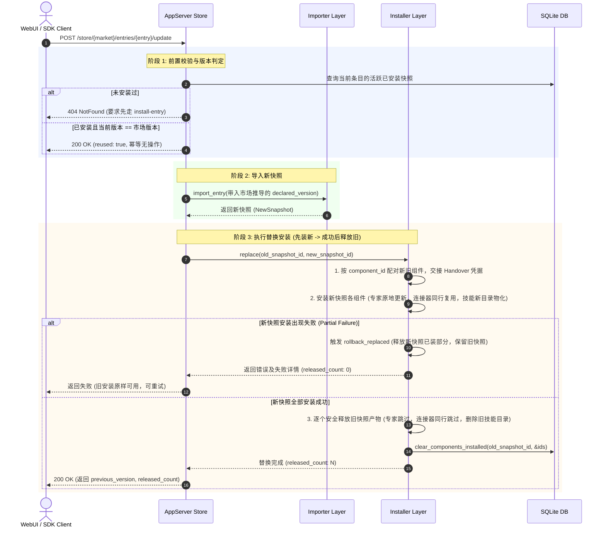

# 商店条目的更新（update）能力 · 技术方案

> **状态**：✅ **已实施落地**（2026-09-28，协议指纹 `fp-12`，方法数 `53 / 78`）  
> **核心原则**：原子安全更新 —— **先装新、成功后再释放旧、部分失败则回滚新快照**；专家保 preset_id 原地升级，连接器共享行保护，安装记录严格按快照隔离。

---

## 1. 背景与核心痛点

### 1.1 业务背景
用户在 Agent Store 中安装了专家（Agent/Team）、技能（Skill）、连接器（Connector）后，当市场发布新版本时，需要能够安全地将已安装条目平滑升级到新版本，而不丢失上下文引用、不破坏运行配置、不残留垃圾产物。

### 1.2 现状与四大痛点
在引入本方案前，系统在升级链路上存在以下严重缺陷：

1. **协议层缺乏“更新”动词，升级等同于“卸载再安装”**  
   协议上不存在 `store/update-entry` 接口，客户端若要升级只能先调 `uninstall` 释放旧版本，再调 `install` 安装新版本。一旦后半段失败（如下载中断、校验冲突），用户不仅没装上新版，原本可用的旧版本也已丢失，陷入“两头空”状态。
2. **版本源数据失真，技能与连接器无法正常升级**  
   专家条目能正确通过 manifest 识别版本，但技能与连接器在导入时未传递版本参数，被硬编码钉死在 `1.0.0`；且技能市场的清单文件（`marketplace.json`）此前根本未被读取，导致目录中技能与连接器要么永远误报“有新版本”，要么版本永远为 `1.0.0` 无法触发升级。
3. **专家升级破坏外部引用并产生同名冗余**  
   专家本质是一条 Preset。旧逻辑在更换快照时会重新生成一个全新的 UUID 作为 `preset_id`，导致会话绑定、排列权重等依赖失效；且由于创建逻辑不按名字去重，直接装新版会残留多条同名的重复预设。
4. **数据库安装状态未按快照隔离（致命缺陷）**  
   数据库中清理安装记录的接口仅根据 `component_id`（形如 `wb-<plugin>-<slug>`）操作，未加 `snapshot_id` 过滤。然而跨快照的同名组件其 `component_id` 是完全相同的，导致释放旧快照时会连带清空刚装好的新快照记录，使条目在安装后离奇变为“未安装”。

### 1.3 核心能力对比表

| 维度 | 现状行为 | 本方案方案 |
|---|---|---|
| **更新动词** | 无专用动词，只能手动拼卸载+重装 | 新增 `store/update-entry`，服务端保障三段式顺序与失败容灾 |
| **版本识别** | 技能/连接器快照硬编码为 1.0.0 | 补齐技能索引读取，导入请求传入显式版本，精确展示更新状态 |
| **专家更新** | 换快照重建 Preset（丢失 ID，留重复预设） | 原地更新现有 Preset 内容，**严格保持 preset_id 不变** |
| **技能更新** | 目录混乱或串版本 | 按新快照物化独立目录，成功后删除旧快照目录 |
| **连接器更新** | 同名更新复用同一行，盲删旧行会误删新行 | 按 `mcp_server_id` 判断共享关系，共享时仅解绑不删行；配置变更如实报告停用 |
| **失败处理** | 旧安装被删，系统处于破坏状态 | 失败坚决保留旧安装；若新快照部分已装则触发回滚，保持旧版可用并支持重试 |
| **数据库记录** | 全局按 component_id 清除（误伤新快照） | 所有写入/清除严格收窄为 `(snapshot_id, component_id)` |

---

## 2. 方案全景与核心架构

### 2.1 端到端更新流程图



### 2.2 目标与非目标

#### 核心目标
1. **原子顺序执行**：严格遵循“先导入 → 装新版 → 成功后释放旧版”顺序，保障任何异常环节不丢失旧安装。
2. **上下文引用稳定性**：专家升级不改动 `preset_id`，保持会话绑定与历史记录有效。
3. **精准版本感知**：技能与连接器获得真实市场版本，消除假性更新提示与无谓冲突。
4. **共享资源防护**：连接器升级共享同一数据库配置行时，避免误删正在接管的配置。

#### 明确的非目标（边界收敛）
- **后台自动更新已安装条目**：本方案仅提供手动或被动调用的更新动词，不负责后台定时轮询自动更新（后台自动更新策略收敛至 `37-market-download-policy` 方案）。
- **不做批量更新接口**：不提供 `store/update-all` 协议动词，批量失败回滚语义复杂，由客户端通过循环调用完成。
- **不通过摘要伪造版本号**：内容有变但市场未提升版本时，坚决拒绝伪造版本，防止版本失序和快照无限膨胀。
- **不删除旧快照的历史元数据**：遵循快照不可变原则，旧快照在 DB 中仅标记 `installed = 0`，保留溯源审计历史。

---

## 3. 详细设计

### 3.1 模块一：版本源修正与导入对齐

#### 1. 修复技能与连接器的版本源
在 `nomifun-importer` 的导入请求中加入可选的声明版本，使调用方能够将市场真实的条目版本传递给导入器：

```rust
// nomifun-importer/src/import.rs
pub struct ImportRequest {
    // ...
    /// 市场声明的条目版本；None 时回退至清单自带版本
    pub declared_version: Option<String>,
}
```

#### 2. 补齐技能市场索引读取
在 `nomifun-app` 的 `MarketIndex::read` 中，除连接器的 `connectors.json` 外，同步读取官方技能市场的 `.codebuddy-skill/marketplace.json`。通过 `entry_facts` 提取正确的条目版本，注入导入流程，使技能条目的快照版本与目录显示版本彻底摆脱 `1.0.0` 占位符。

---

### 3.2 模块二：三段式安全更新引擎

更新操作的核心由 `InstallProvider::replace(old_snapshot, new_snapshot)` 承载，分为三步：

#### 第一步：组件配对与上下文交接（Handover）
- **配对规则**：通过 `component_id`（格式为 `wb-<plugin>-<slug>`）在跨快照间保持一致的特性，将新旧快照中的同名组件一一配对；若组件 ID 变动则按 `(kind, name)` 兜底匹配。
- **上下文交接**：提取旧组件记录的 `preset_id` 或 `mcp_server_id` 作为 `Handover` 上下文，传递给新组件的安装过程。

#### 第二步：新快照先行安装
- 遍历新快照组件，利用 Handover 优先进行**原地复用与内容更新**。
- 若新组件在安装过程中发生任何错误，立即进入**回滚流程**。

#### 第三步：旧产物释放与失败回滚
- **成功分支**：新快照所有组件均安装成功后，对旧快照标记为 `installed = 1` 的组件执行释放。
- **部分失败回滚分支（关键防御）**：
  若新快照部分组件失败，不能仅简单保留旧快照，必须调用 `rollback_replaced` 清除新快照已经装上的部分组件与安装记录。否则该半成品快照会被判定为最新版本，导致条目被卡在无法重试的错误状态。

---

### 3.3 模块三：不同产物类型的差异化升级策略

| 条目类型 | 新组件安装策略 | 旧组件释放策略 | 特殊边界与防护说明 |
|---|---|---|---|
| **专家 (Agent/Team)** | 读取 Handover 中的 `preset_id`，调用 `PresetService::update` **原地更新**内容，标记 `reused` | **不执行删除**（因为新旧版本共用同一个 Preset 实体） | 严格保持 preset_id 不变，避免产生同名预设；注意用户手动修改的 instructions 会被新版本覆盖 |
| **连接器 (Connector)** | 调用 `upsert_server`，同名连接器复用同一 `mcp_servers` 行 | 比较 `mcp_server_id`：<br/>• **若与新组件相同**：仅清数据库关联记录，**绝不调用删除**<br/>• **若不同**：正常调用 remove 删除旧行 | 若配置（URL/Headers）发生变更，系统按安全规范自动置为 `enabled = false`，接口如实向客户端上报 |
| **技能 (Skill)** | 在新快照独立路径物化目录：<br/>`<skills>/agent-store/<new_snap>/<slug>/` | 删除旧快照物化目录：<br/>`<skills>/agent-store/<old_snap>/<slug>/` | 系统解析优先取最新快照，先装后删实现无缝切换，不留任何空窗期 |

---

### 3.4 模块四：数据库隔离缺陷修复（前置承重墙）

#### 缺陷定位
在 `plugin_snapshot_components` 表的操作中，组件安装标记的管理原来仅使用 `WHERE component_id = ?`，缺少快照维度限定。

#### 修复收窄
全面将组件安装态写入函数升级为带快照作用域的联合条件：
- `clear_components_installed(snapshot_id, &[component_id])`
- `set_components_disabled(snapshot_id, &[component_id], disabled)`
- `mark_components_installed(snapshot_id, &[component_id])`

这样新旧快照在交替切换时，写入与清除完全互不干扰，消除了安装记录被误删的系统隐患。

---

### 3.5 模块五：协议接口与客户端封装

#### 1. 协议定义（HTTP / WS）
- **路径**：`POST /api/app-server/store/{marketplace_id}/entries/{entry_name}/update`
- **WS 动词**：`"store/update-entry"`
- **返回结构**：复用并拓展 `AppServerStoreInstallResult`，增加升级专属字段：

```rust
pub struct AppServerStoreInstallResult {
    pub marketplace_id: String,
    pub entry_name: String,
    pub snapshot_id: String,
    pub version: String,
    pub reused: bool,                       // true = 已经在目标版本，无操作
    pub installed_count: usize,
    pub warnings: Vec<String>,
    pub errors: Vec<String>,
    pub outcomes: Vec<ComponentOutcome>,
    
    // 升级操作拓展字段 (普通安装时缺省)
    pub previous_snapshot_id: Option<String>,
    pub previous_version: Option<String>,
    pub released_count: usize,             // 被成功释放的旧组件数量
}
```

#### 2. SDK 接口定义
```ts
// 扩展 Client 与 Store 子客户端
const outcome = await client.store.update(item);
// outcome 包含 fromVersion, toVersion, releasedCount 等
```

#### 3. WebUI 呈现
- 在条目详情与抽屉中，当检测到 `installed && update_available && !blocked_reason` 时，将原本提示用户“先卸载再安装”的纯文本说明替换为**“立即更新”交互按钮**。
- 支持展示更新前后的版本变化标签（`旧版本 → 新版本`），并在更新失败时明确呈现具体原因。

---

## 4. 核心决策与权衡

| 编号 | 决策主题 | 选定方案 | 放弃的替代方案与理由 |
|---|---|---|---|
| **D1** | **专家升级模式** | **原地更新 Preset 内容，保持 preset_id** | ❌ 重新创建 Preset：会导致会话绑定与历史引用断裂，并残留多条同名预设。 |
| **D2** | **版本覆盖传递** | **在导入请求中随入显式版本覆盖** | ❌ 导入器内部自行读市场索引：破坏架构分层，导致市场结构知识泄漏进底层导入器。 |
| **D3** | **协议动词形态** | **新增独立 `store/update-entry` 动词** | ❌ 客户端串联 uninstall+install：存在数据丢失与中间崩溃不可恢复的高风险；<br/>❌ 给 install 加 mode 参数：破坏既有 install“已装即 no-op”的幂等语义。 |
| **D4** | **返回 DTO 选型** | **拓展现有安装结果结构体** | ❌ 新建完全平行的 UpdateResult：90% 字段重复，增加客户端适配与维护成本。 |
| **D5** | **执行顺序机制** | **先装新版，验证成功后释放旧版；部分失败则回滚新快照** | ❌ 先删旧版再装新版：在删除旧版后若新版安装失败，系统陷入不可恢复的空状态。 |
| **D6** | **未抬版本的同名更新** | **版本相同时直接作为幂等成功（reused: true）返回** | ❌ 使用 content_digest 充当临时版本号：破坏语义化版本的可读性与排序逻辑。 |
| **D7** | **连接器停用状态** | **尊重底层安全停用规则，但如实向客户端上报** | ❌ 升级后强制自动重新启用：破坏了配置变动必须重新探测验证的安全底线。 |
| **D8** | **安装状态更新收窄** | **数据库 SQL 全面收窄为 (snapshot_id, component_id)** | ❌ 改动 component_id 命名规范（带入版本号）：破坏全仓既有标准格式并引发大面积不兼容。 |

---

## 5. 验收标准与测试矩阵

| 编号 | 验证场景 | 断言标准与验收口径 |
|---|---|---|
| **S1** | **版本正确覆盖** | 技能与连接器条目经导入后，快照 `declared_version` 严格等于市场声明版本，彻底告别 `1.0.0` 占位符。 |
| **S2** | **专家 ID 保持** | 升级专家条目后，系统内同名预设仍仅存在一条，且 `preset_id` 在升级前后完全一致。 |
| **S3** | **快照状态隔离** | 两份快照包含相同组件时，释放旧快照后，新快照的 `installed` 标志依然为 `1`。 |
| **S4** | **连接器共享保护** | 升级同名连接器，新旧组件共享相同 `mcp_server_id` 时，旧快照释放不会删除该连接器配置行。 |
| **S5** | **技能目录切换** | 升级技能后，新快照目录物化完整，旧快照文件目录被彻底清理，无残留孤儿文件。 |
| **S6** | **失败原子回滚** | 模拟新版本组件安装异常，验证新快照已装组件被自动清理回滚，旧版本安装完好保留且支持后续重试。 |
| **S7** | **幂等与无版本变动** | 对同一版本连续调用两次 `update_entry`，第二次返回 `reused = true`，不触发重复文件写入或状态翻转。 |
| **S8** | **协议与客户端对齐** | 协议指纹版本为 `fp-12`，方法计数为 `53 / 78`，前后端单测全量通过。 |

---

## 附录：原始技术底稿与历史归档 (Historical & Technical Reference Archive)

> **归档说明**：以下完整保留重构前的原始技术底稿、历次讨论与历史记录全文，供历史追溯、协议字段详细对照与技术审计。

---

# 商店条目的更新（update）能力 · 技术方案

> 状态：**已实施（2026-09-28）**——§9 的 8 步全部落地，`fp-11` → `fp-12`，方法计数
> `52 / 77` → `53 / 78`；实施期与本文有 4 处差异与 1 处新增，逐条记在 **§12**。
> 决策 D1–D8 见 §4，均有取值、替代方案与代价。
> §9 是实施步骤与每步的验收口径；§10 登记实施期必须回头改的既有文档与门禁。
> 前置：`05-flowy-agent-store-app-server-protocol.md`（协议正文，`store/*`）、
> `07-typescript-sdk.md`（SDK 方法面）、`18-marketplace-spec.zh.md`（§9.1 安装五动词、§9.2 自动更新边界、
> §11 D9 connector 条目不可更新）、`02-codebuddy-workbuddy-import-spec.md`（§4 身份、§9 幂等、§10.1 凭据声明）、
> `17-plugin-spec.zh.md`（§5 版本/溯源/幂等）、`21-open-decisions.zh.md`（**D16** 摘除假「更新」控件）、
> `16-sdk-webui-site-priority-plan.zh.md` §7 决策 4（指纹与跨仓同步）、`web/AGENTS.md` §5。
> 用途：说明三件事——**(1)** 「更新」在专家 / 技能 / 连接器三种条目上分别是什么意思、产物归谁；
> **(2)** wire、SDK、WebUI 各要加什么，顺序与失败语义如何定义；**(3)** 本方案必须先修哪个既有缺陷，
> 否则 update 建不起来。
> 依据复核：本文所有行号引用按 `feat/connector-user-credentials` `ed4478e6f` 逐条核对；
> §3.2 的市场事实取自本机真机镜像（`%LOCALAPPDATA%\Flowy\Nomi\agent-store-markets\`）。

---

## 1. 结论先行

| 目标 | 现状 | 本方案 |
|---|---|---|
| 用户能升级一个已装条目 | ❌ wire 上**没有**更新动词（`store/update-entry` 不存在）；唯一路径是「卸载再安装」，中途失败即**什么都没装** | 新增 `store/update-entry`：**先装新的、成功后才释放旧的**，失败保留旧安装 |
| 目录能正确显示「有新版」 | ⚠️ 专家正确；**技能与连接器永远为真**（快照 1.0.0 vs 索引版本），升级后仍是假 | 版本覆盖进导入请求（D2），让 `update_available` 表示真实差异 |
| 专家的升级不破坏引用 | ❌ 换快照即换 Preset id；`PresetService::create` 不按名字去重，不卸载直接装新版会留**两条同名预设** | **原地升级、保 preset id**（D1），新增 `PresetRegistrar::update_agent_store_preset` |
| 技能升级不串版本 | ✅ 已是每快照一个目录、解析取最新快照 | 沿用；update 只需「先物化新的、再删旧目录」 |
| 连接器升级 | ❌ 除版本源外还有两处：新旧组件行共用**同一个** `mcp_servers` 行（盲删会删掉新装的）；`upsert_server` 在配置变化时**把服务器置为停用** | 释放前按 `mcp_server_id` 判共享；停用状态如实上报，不改既有保护语义（D5/D7） |
| SDK / WebUI 能用 | ❌ `updateHint()` 只能返回 `"uninstall_reinstall"`；UI 是一句说明 + 状态标签（`21` D16） | `store.update()` + `.store` 子客户端；UI 换成真按钮（带 旧→新 与失败原因） |
| 指纹 | `fp-11` | `fp-12`（新增方法，方法计数 `53 / 78`） |
| 释放旧安装 | ❌ 「清安装记录」只按 `component_id`、不带快照条件，而 `component_id` 跨快照相同 ⇒ 会把**刚装好的新快照**的记录一起清掉（今天在 `install/uninstall` 上已可达） | 清记录按 `(snapshot_id, component_id)`（D8，必须先修） |

**一句话**：把「升级」从「客户端自己拼两次调用」提升为一个**按顺序执行、失败可保留旧安装**的 host 侧动作，
并先把「条目版本」这条数据修好——否则新动词只会忠实地重新装回同一个 `1.0.0`。

---

## 2. 边界（非目标）

- **不做自动升级**（**2026-09-29 由 doc `37` 显式推翻，本条不再成立**）。本方案交付时后台扫掠
  （`18` §9.2）只刷新索引、**绝不**改已安装快照，升级始终是用户的显式动作；doc `37`
  把扫掠的职责扩为「刷新索引 **+** 自动升级从该市场安装的条目」，并给了三条收口：粒度是**市场级**
  （复用本方案的 `auto_update` 开关）、类型白名单缺省 `["agent","team","skill"]`
  （**连接器默认排除**，理由正是本方案 §3.4 的「配置变了即停用」）、用户手动停用 /
  `blocked_reason` / 只导入未安装三种情况硬跳过；`entry_auto_update_kinds = []` 即回到本条描述的旧行为。
  `update_policy` 这个字段名仍然没有被引入——策略落在 `[marketplace]` 与市场行上（`37` §3.3）。
- **不做批量更新动词**。不新增 `store/update-all`：批量的部分失败语义（哪些成功、能否回滚）
  没有便宜的定义；客户端循环 `checkUpdates()` + `update()` 即可（§5.6）。
- **不做版本回退语义**。「当前版本 < 已装版本」时 `entry_live_version` 仍是权威值，
  update 会把条目**降到**市场声明的版本（与 `install_entry` 现有版本判定一致）。
  是否允许回退不是本方案引入的概念——它已经存在，这里只保持不矛盾。
- **不做内容摘要当版本**（D6）。身份必须由市场声明，不用 `content_digest` 兜底生成版本号。
- **不改 OAuth / 凭据的存储**。连接器升级不迁移凭据：键控是 `<principal>:NAME`（宿主级，非快照级），
  跨版本天然存活；新版若改了字段集合，`connector/credential` 按新快照的 `effective_declaration`
  重新推导（`effective_declaration` 契约见 `34` §6.5）。
- **不删旧快照的 DB 历史行**。快照不可变（`02` §9）；update 只释放**运行时产物**并清安装记录。
- **不做事务**。update 是「导入 → 安装 → 释放」三段顺序动作，不是单个 DB 事务；
  中途失败的收敛点是「旧安装仍在」（§5.2）。

---

## 3. 设计依据（既有事实，附证据位置）

### 3.1 「更新」在同一条链上是三件不同的事

| 层 | 触发 | 语义 | 证据 |
|---|---|---|---|
| ① 市场索引 | `market/refresh`（UI 文案「检查更新」）或官方源后台扫掠 | 重新探测目录，更新条目清单与条目版本 | `18` §9.2；`app_server_marketplace.rs:1261`（`is_auto_update_eligible`） |
| ② 目录投影 | `store/list` | `update_available = 快照版本 ≠ 条目当前版本`，只给**标志** | `app_server_store.rs:259`、`:274` |
| ③ 安装 | `store/install-entry` | 已装 → no-op；未装且同版本 → 装该快照；未装且版本不同 → 重新导入再装 | `app_server_store.rs:399`–`:445` |

②③不可能互相矛盾，因为版本推导收敛在一个 helper（`entry_live_version`，`app_server_store.rs:132`）：
**条目自带 manifest 版本 → 市场索引 `version` → 条目 `version` → `1.0.0`**。

**本方案只改 ③，并新增一个位于 ③ 之上的 ④「升级」动作。** ① 不动，② 的公式不动。

### 3.2 版本源是坏的：技能与连接器都被钉在 `1.0.0`

`store/list` 的版本走 `entry_live_version`，但**导入请求不带版本**，导入器的版本来自
`ParsedManifest::version()`（`manifest.rs:374`–`:384`）：

| 条目形态 | 导入器写入的 `declared_version` | 目录显示的版本 | 后果 |
|---|---|---|---|
| 专家 / plugin（有 `.codebuddy-plugin/plugin.json`） | manifest 的 `version` | 同左 | ✅ 正常 |
| **连接器**（`mcp.json`） | **`"1.0.0"` 硬编码**（`manifest.rs:381`） | 索引 `connectors.json` 的 `version` | ❌ 索引没声明版本时两边都是 1.0.0（看似正常）；**声明了就永远显示「有新版」且改了内容必撞 digest 冲突**（`18` §11 D9） |
| **技能**（官方技能市场的 `skills/<slug>/`） | **`"1.0.0"` 硬编码**（`manifest.rs:382`） | 索引 `marketplace.json` 的 `version` | ❌ **`update_available` 永远为真**；卸载再安装拿回的仍是 1.0.0 |

技能这一格的推导链（四步，均为代码事实）：

1. 官方技能市场的条目是 `skills/<slug>/`，目录里只有 `SKILL.md`（+ `_skillhub_meta.json`），
   **没有** `.codebuddy-plugin/plugin.json`、**没有** `.codebuddy-skill/marketplace.json`
   （真机镜像实测：`…\agent-store-markets\workbuddy-skills\live\skills\tencent-docs\`）。
2. 导入时按目录形态选来源：三个标记文件都不在 → `SKILL.md` 命中 → `SourceKind::WorkBuddySkillMarket`
   （`app_server_marketplace.rs:1140`–`:1167`）。
3. `manifest_rel_path()` 对技能市场是 `.codebuddy-skill/marketplace.json`（`models.rs:66`）；
   条目目录里没有它 → 落到 `SingleSkill(dir)` 分支（`manifest.rs:435`–`:452`）。
4. `ParsedManifest::SingleSkill(_).version()` = **`"1.0.0"`**（`manifest.rs:382`），
   写入 `declared_version`（`import.rs:232`）。

而目录侧的版本来自索引行。**实施期发现这一格比本文原先写的更坏**（见 §12 差异 ②）：
技能条目的 `index_info` 只在 `kind == "connector"` 时才填（`app_server_store.rs:219`），
**技能市场索引从来没有被读过**——`entry.version` 在目录市场里恒为 `None`
（`probe_skill_market` 产出的 `ScannedEntry` 根本没有版本字段，`scan_to_entries` 填
`version: None`），只有 URL 市场走 `probe_url_entries` 才带上行版本。所以技能的
「目录显示版本」与「快照版本」**都是 `1.0.0`**，`update_available` 恒为假、永远升不了。
修法因此是**两半**：把技能索引也读出来（`MarketIndex::read` 读
`.codebuddy-connector/connectors.json` 与 `.codebuddy-skill/marketplace.json` 两张表），
再让导入请求带上这个版本（D2 的 `declared_version`）。

**结论**：`18` §11 D9 的「skills 自带 manifest 版本，不受影响」**不成立**，D9 的适用面要扩到技能。
在本方案动工前，任何 update 实现对这两类条目都是空转。

### 3.3 三种 kind 的产物所有权不同

| kind | 运行时产物 | 释放语义 | 证据 |
|---|---|---|---|
| 专家 agent/team | 一条用户 Preset，名 `agent-store: <组件名>`，`preset_id` 记在**该快照的组件行** | `delete_preset(记录的 id)` | `app_server_installer.rs:523`、`:911` |
| 技能 skill | 目录 `<user_skills>/agent-store/<snapshot_id>/<slug>/` | `remove_materialized(snapshot_id, slug)` | `app_server_installer.rs:895` |
| 连接器 connector | `mcp_servers` **一行**，按名字 upsert | `mcp.remove(记录的 mcp_server_id)`（**绝不按名字删**） | `app_server_installer.rs:920`、trait 注释 `:40`–`:45` |

两处必须写进实现细节的事实：

- **Preset id 不稳定**：`PresetService::create` 在 `preset_id` 缺席时**新铸 UUID**，且**不按名字去重**
  （`nomifun-preset/src/service.rs:209`–`:214`）。安装期的复用只认「**同一快照的组件行**记录的 id」
  （`app_server_installer.rs:490`–`:499`）——换快照 = 组件行是新的 = 没有可复用的 id = 新铸一条同名预设。
- **连接器新旧同行**：`upsert_server` 命中同名时**原地更新并返回同一个 id**
  （`nomifun-mcp/src/service.rs:395`–`:421`）。所以「释放旧组件」若照常执行 `mcp.remove(旧 id)`，
  删掉的正是新快照刚接手的**那一行**。

### 3.4 连接器 upsert 会把服务器置为停用

`upsert_server` 在**配置发生变化**时写 `enabled = false`、`tools = None`、`last_test_status = "disconnected"`
（`nomifun-mcp/src/service.rs:402`–`:417`）。升级一个连接器通常就是换 URL / headers / command ⇒
**升级后它默认是停用的**。

这是**既有的、正确的**保护（配置变了就必须重测，不能让新 endpoint 自动接手凭据），
本方案不改它——但必须**如实上报**，否则用户会看到「升级成功」而连接器静默失效（D7）。

---

## 4. 决策

### D1 · 专家的升级**保 preset id**，原地 `PresetService::update`

**取值：A（原地升级）** ⭐

- 新增 `PresetRegistrar::update_agent_store_preset(preset_id, name, description, instructions, agent_id, model)`
  → 生产实现走 `PresetService::update`（`UpdatePresetRequest` 全字段可选、语义是「合并」，
  `nomifun-api-types/src/preset.rs:247`）。
- `install` 的 preset 分支改为：**该快照组件行记了 preset_id 且仍存在 → 原地更新内容**；
  没记 / 已不存在 → 仍走 `create`（保持现有行为，含"用户手删了就重建"）。
- 这也顺带修掉「不卸载直接装新快照会留两条同名预设」——因为新快照的 preset 分支不再无条件 create。

**替代 B（换快照换 id，即现状）**：实现最简单（什么都不用加，卸载再装即可）。
代价是**静默断引用**——Preset id 是会话绑定、排序状态、以及任何按 id 记录的外部引用的锚点；
用户看到的是「升级了一个专家」，实际是「消失了一个、多了一个」。
**不采用。**

**代价（A）**：`PresetService::update` 会拒绝非 `User` 来源的 Preset（`service.rs:223`）——agent-store
创建的预设正是 `User` 来源，成立；若将来 agent-store 预设改由 extension 承载，这条要重写。
另外原地升级会**保留用户对预设的本地改动**吗？不会：update 用快照内容整体覆盖 name / description /
instructions / agent / model，其它字段（included_skills、tags 等）保持不动。这需要在 §5.3 写清，
并在验收里钉住（升级后用户手改过的 `instructions` 会被市场内容覆盖——这是"升级"的应有之义，
但要在文档里说明，不能让用户以为本地改动会被保留）。

### D2 · 版本覆盖只由 `nomifun-app` 的市场层推导，随导入请求传入

**取值：A（`ImportRequest` 加可选版本，调用方传）** ⭐

- `ImportRequest` 增 `pub declared_version: Option<String>`（`import.rs:40`）；
  `import.rs:232` 改为 `declared_version: request.declared_version.clone().unwrap_or_else(|| parsed.version().to_owned())`。
- `app_server_marketplace::import_entry` 用**已有的** `entry_live_version(...)` 算出版本后传入
  （它已经持有 `row` / `entry` / 索引，`app_server_marketplace.rs:1100`–`:1186`）。
- **第二半（实施期补上，见 §12 差异 ②）**：技能侧的市场索引此前根本没被读
  （`index_info` 只给 connector 填）。所以先有 `MarketIndex::read`（connectors.json +
  skill marketplace.json 两张表，`entry_facts` 按 kind 取），`entry_live_version`
  才真的能对技能给出非占位版本——否则这里传进导入请求的仍是 `1.0.0`。

**为什么 A 就够了**：`market/entry-import` 与 `store/install-entry` 都从 `import_entry` 这一个漏斗进入
（`ImportRequest::from_marketplace*` 只在这一个函数里被调用），所以两条 wire 路径同时变正确。
版本推导也因此仍只有**一个真源**（`entry_live_version`），`store/list` 与实际导入不可能再说两套。

**替代 B（导入器自己读市场索引）**：能让「手工 `import` 一个市场条目目录」也版本正确。
代价是把 `18` 的市场布局知识（`.codebuddy-connector/connectors.json`、`.codebuddy-skill/marketplace.json`
的行结构）搬进一个只认 `SourceKind` 的导入器，并且要在导入器里再实现一遍
「manifest → 索引 → 条目」的优先级。**不采用**；需要时以 B 为后续项登记。

### D3 · 新增 wire 动词 `store/update-entry`

**取值：A（新动词）** ⭐

- `POST /api/app-server/store/{marketplace_id}/entries/{entry_name}/update`
  （与新目录 `lib.rs:1394`–`:1398` 的既有两条同族）；WS arm `"store/update-entry"`（同 `:7552`）。

**替代 B（客户端拼 `uninstall` + `install`）**：零 wire 改动、零指纹 bump。
代价是**不可恢复**：`install/uninstall` 先删产物再清记录（`app_server_installer.rs:735`–`:765`），
若随后的导入被 blocked / digest 冲突挡住，用户白丢一份**本来能用**的安装，
中间态是「什么都没装」，而客户端无力回滚。**不采用。**

**替代 C（给 `store/install-entry` 加 `mode: "update"`）**：同样要 bump 指纹，但会让「安装」这个
已被钉住为**已装即 no-op** 的动词（`app_server_store.rs:399`–`:417`，`21` D16 的整个立论）
重新变成"看情况可能是升级"。**不采用。**

### D4 · 返回形状：扩展现有结果类型，不新增平行 DTO

**取值：A（给 `AppServerStoreInstallResult` 加三个可选字段）** ⭐

在 `AppServerStoreInstallResult`（`nomifun-api-types/src/app_server.rs:1284`）上加：

```rust
/// 升级前的快照与版本；`install-entry` 恒缺席。
#[serde(default, skip_serializing_if = "Option::is_none")]
pub previous_snapshot_id: Option<String>,
#[serde(default, skip_serializing_if = "Option::is_none")]
pub previous_version: Option<String>,
/// 旧快照中被真正释放的组件数；`install-entry` 恒为 0。
#[serde(default, skip_serializing_if = "is_zero")]
pub released_count: usize,
```

理由：两个动词的**其余九个字段语义完全一致**（`reused` / `installed_count` / `outcomes` / `errors`），
SDK 侧因此可以复用同一个 `StoreOperationOutcome`；新开一个 DTO 会复制九个字段而不增加表达力。
`skip_serializing_if` 让 `install-entry` 的字节形状不变（旧客户端读到的仍是同一份）。

**替代 B（新 DTO `AppServerStoreUpdateResult`）**：类型上更"干净"，代价是 SDK 两套结果类型、
以及"两者字段永远要保持同步"的新维护面。**不采用。**

### D5 · 顺序：**先导入 → 先装新 → 再释放旧**；失败保留旧安装

**取值：A** ⭐

```text
1. 取现有快照；没有 → 拒绝（让调用方走 store/install-entry）
2. live == 已装版本 → no-op，reused: true，installed_count: 0（幂等，不是错误）
3. 导入 live 版本（D2 的版本覆盖）→ 新 snapshot
4. install/run 新快照（逐组件）
5. 新装成功（errors 为空） → 释放旧快照中 installed=1 的组件
6. 任一步失败 → 旧安装原样保留，errors[] 如实上报，released_count: 0
   —— 并且**把新快照已经装上的那部分回滚掉**（§12 差异 ①）：不这么做，新快照会成为
    provenance 匹配项、`store/list` 改口说"已在新版本"，下一次 update 直接 no-op，
   失败就再也重试不了。
```

**连接器的一处例外（必须实现）**：第 5 步释放旧组件时，先比 `mcp_server_id`：
新旧**相同** → 只清旧组件行的安装记录、**不删行**（否则删掉新快照刚接手的那一行，§3.3）；
不同 → 照常 `mcp.remove(旧 id)`。

**替代 B（先释放旧的再装新的）**：与 `install/uninstall` 的现行顺序一致，但把失败窗口放在
「旧的已经没了、新的还没验证」之间——这正是要避免的中间态。**不采用。**

### D6 · 「内容变了但版本没抬」继续拒绝，但错误必须点名要抬版本

**取值：A** ⭐

同身份（`plugin_id` + `declared_version`）+ 不同 `content_digest` ⇒ 导入器返回
`IdempotencyDecision::Conflict`（`import.rs:325`–`:337`），update 如实把它变成
`ok: false` + `errors: ["digest 冲突：…"]`。**保留这个拒绝**：不可变快照是 `02` §9 的承重设计。

但**错误信息与 UI 文案必须给出可执行的补救**：「市场未抬版本，条目内容改了也发布不出去，
请市场侧抬版本或换条目名」——现在的消息只说了"不得覆盖"，不知道下一步做什么。
WebUI 在 update 失败时优先展示这句（§5.6）。

**替代 B（用 `content_digest` 兜底当版本）**：能让"改了内容没抬版本"也能装上。
代价是**身份失去市场含义**：目录里的 `version` 会变成摘要（用户看不懂、也没法排序），
且每次改一个字节都产生一个新快照（历史膨胀）。**不采用**；如实拒绝 + 点名补救更好。

### D7 · 连接器的「配置变了即停用」沿用既有语义，但升级结果要如实上报

**取值：A** ⭐

不改 `upsert_server` 的 `enabled = false` 行为（§3.4），但：

- update 的结果里带上该连接器组件的 `outcomes`（已经是既有字段），WebUI 在成功提示里
  **附一句「连接器配置已变化，已标记为需重连/重测」**；
- 文档（`26-connector-schema-and-grant-policy.zh.md` 的升格边界）补一句：升级连接器 = 一次配置变更。

**替代 B（升级后自动重新启用）**：UI 更顺，代价是把「配置变了必须重测」的保护在
**用户点了一次升级**这个动作上整体拿掉——而升级恰恰是最可能换 endpoint / 凭据引用来源的动作。
**不采用。**

### D8 · 「清安装记录」必须按快照，否则会把刚装好的新快照一起清掉

**这是一个必须先修的前置缺陷，不是可选项。**

`clear_components_installed(&[component_id])` 的 SQL **只按 `component_id`**、**不带快照条件**
（`nomifun-db/src/repository/sqlite_plugin_snapshot.rs:261`–`:279`，同一形态的还有
`set_components_disabled`，`:245`–`:259`）。而 `component_id` 跨快照相同（§5.3.1 第 1 条）。

所以 D5 的第 5 步若照现有 API 释放旧快照，会把**新快照那一行**的 `installed` 一并归 0
（还会顺手清掉它的 `preset_id` / `runtime_ref`）——结果是：产物都装好了，安装记录却没了，
用户既看不到"已安装"，也无法再卸载（`install/uninstall` 找不到 `installed=1` 的行）。

**取值：A（把快照条件加进去）** ⭐

- `plugin_snapshot_components` 的 repo 增 `clear_component_installed(snapshot_id, component_id)`
  （disable/enable 同理加 `set_component_disabled(snapshot_id, component_id, disabled)`），
  现有 `install/uninstall` / `disable` / `enable` 一并改用带快照的版本——**同一个缺陷在今天的
  `install/uninstall` 上已经可达**（两份快照同时装着时，卸载其中一份会清掉另一份的记录）。
- 无新迁移：只是 WHERE 收窄（`059` 的 `UNIQUE(snapshot_id, component_id)` 已经是这个形状）。

**替代 B（把顺序改成"先清旧记录、再装新的"）**：绕开冲突，但正是 D5 明确不要的失败窗口。**不采用。**

**替代 C（让 `component_id` 带上版本）**：`wb-<plugin>-<slug>@<version>` 这类改法会让 id 跨快照天然不冲突。
代价是 `component_id` 是**公开形态**（`02` §9 `:192` 记录、导入器有用例
`component_id_is_documented_shape`（`import.rs:2102`）钉住 `wb-<plugin_id>-<slug>`），
改它是一次协议面变更，且会连带影响 `install/outcomes` 报给客户端的所有组件 id。**不采用**——
收窄一条 WHERE 更小。

---

## 5. 设计

### 5.1 版本覆盖（D2）

```rust
// nomifun-importer/src/import.rs
pub struct ImportRequest {
    …
    /// 市场声明的条目版本（`18` §4.2）。`None` = 用清单解析出的版本（历史行为）。
    pub declared_version: Option<String>,
}
```

- `from_marketplace` / `from_marketplace_revision` 加一个参数（或改成 builder），
  `manual` 恒为 `None`。
- `import.rs:232`：`declared_version = request.declared_version.clone().unwrap_or_else(|| parsed.version().to_owned())`。
- `Builder::new(...)` 的版本参数同理用覆盖值（`import.rs:237`），让组件里记的版本与快照一致。
- `import_entry` 把已算出的 `entry_live_version(...)` 传进来；**它现在是唯一真源**。

**既有安装记录的后果（必须写进发布说明）**：修复上线后，所有已装的技能 / 连接器条目
第一次会被显示为「有新版本可用」——因为它们的快照版本是 `1.0.0`，而条目是索引里的真实版本。
这是修复**暴露**出来的真实差异，不是新缺陷；升级一次即收敛。

### 5.2 新动词

```rust
// nomifun-app-server/src/lib.rs（HTTP + WS 同族）
POST /api/app-server/store/{marketplace_id}/entries/{entry_name}/update   -> store_update_entry_impl
"store/update-entry" { marketplace_id, entry_name }                       -> 同上
```

`AppServerStoreProvider` 增：

```rust
async fn update_entry(&self, marketplace_id: &str, entry_name: &str)
    -> Result<AppServerStoreInstallResult, AppError>;
```

实现落在 `app_server_store.rs`（与 `install_entry` 相邻，共用 `entry_live_version` 与
`find_snapshot_by_provenance`）：

- 无快照 → `AppError::NotFound`，消息点名 `store/install-entry`（不静默安装，§2）。
- 已装且版本相同 → no-op（幂等）。
- 已装且版本不同 → 导入（D2）→ `install/run` 新快照 → 成功后逐旧组件释放（D5 的连接器例外）。

### 5.3 逐 kind 替换

| kind | 第 4 步（装新） | 第 5 步（释放旧） |
|---|---|---|
| 专家 | preset 分支：旧组件行的 `preset_id` 仍在 → **原地 update**（D1）；否则 create | 若已原地升级 → **不再 delete**（同一个 id）；若走的是 create（旧 id 不存在了）→ 无旧可删 |
| 技能 | `materialize_skills` 落到新快照目录 | `remove_materialized(旧 snapshot, slug)`；解析取最新快照（`skill_service.rs:2052`），先装后删不产生空窗 |
| 连接器 | `add_server` 同名 upsert（同一 id） | `mcp_server_id` 相同 → 只清安装记录；不同 → `mcp.remove(旧 id)` |

「先装新再释放旧」在**专家**这一格的落地需要一个新的 installer 入口，而不是复用 `install/uninstall`：
`install/run` 只认 snapshot，不知道"这是在替换另一份安装"。建议新增一个内部方法
`InstallerService::replace_snapshot(old_snapshot_id, new_snapshot_id)`，由 update 调用；
它内部按组件走上面的表，返回 `released_count`。**不**把 replace 语义暴露成 wire 动词。

#### 5.3.1 组件配对（`replace_snapshot` 必须先算这个）

新快照的组件行是**新的**，上面没有旧快照的 `preset_id` / `mcp_server_id`——所以「原地升级」的信息
必须由 replace 显式交接，不能指望 `install/run` 自己发现：

1. **配对**：按 `component_id` 配对。它由 `component_id(plugin_id, slug) = wb-<plugin_id>-<slug>`
   （`nomifun-importer/src/models.rs:159`）生成，**不含快照**，所以同一市场条目的两份快照里
   同名组件的 id 是**相同**的——这正是配对可以按 id 做的原因。回落判据是 `(kind, name)`，
   用于 id 变了的情况（例如条目目录名变了，`plugin_id` 随之变）。
   注意 `plugin_snapshot_components` 的唯一键是 `UNIQUE(snapshot_id, component_id)`
   （迁移 `059`，`:54`）：同一个 `component_id` **在不同快照里各有自己的一行**。
   `02` §9 `:654` 已经把这个事实写下来了（「同插件不同版本导入会产生同 `component_id` 的目录条目…
   `component_id` 未注册为全局 UUIDv7 业务列，按本地唯一处理」），但**当时的结论是
   「展示层按最新快照优先去重」，没有覆盖写入面**——D8 就是这条边界的补丁。
2. **交接**：配对上的那一对里，把旧行的 `preset_id` / `mcp_server_id` 作为 handover 传给新组件的注册
   ——专家用它走 `update_agent_store_preset`（D1），连接器用它判"是否同一行"（D5 的例外）。
3. **没配对上的旧组件**：按普通 `release_component` 释放（该 kind 在新版里被删掉了）。
4. **没配对上的新组件**：按普通新装处理（新版新增的组件）。
5. 三类配对结果都要出现在 `outcomes` 里，`action` 只用既有的八值闭集
   （`created | reused | enabled | disabled | marked | removed | skipped | failed`，`05:831`），
   **不新造 action**：原地升级的专家用 `reused`（它复用了同一条 preset）并另在
   `released_count` / `previous_*` 上表达"这是一次升级"。

### 5.4 wire 形状

```text
POST /api/app-server/store/{marketplace_id}/entries/{entry_name}/update
→ AppServerStoreInstallResult {
    marketplace_id, entry_name,
    snapshot_id,          # 新快照
    version,              # 新版本（== 条目当前版本）
    reused,               # true = 已在 live 版本，什么都没做
    installed_count, warnings, errors[], outcomes[],
    previous_snapshot_id, # 升级前（install-entry 恒缺席）
    previous_version,
    released_count,       # 旧快照被释放的组件数
  }
```

### 5.5 客户端与 SDK

- `web/packages/protocol/src/protocol.ts`：`AppServerStoreInstallResult` 加三个可选字段；
  `APP_SERVER_PROTOCOL_VERSION` → `fp-12`。
- `web/packages/client/src/http-transport.ts`：路由表加
  `"store/update-entry": { verb: "POST", path: "/store/{marketplace_id}/entries/{entry_name}/update", … }`。
- `web/packages/client/src/client.ts`：`updateStoreEntry(marketplaceId, entryName)`。
- `web/packages/client/src/store.ts`：
  - `updateHint(item)` 从 `"uninstall_reinstall"` 改为 `"update"`（无 `snapshot_id` 时仍 `"unknown"`）；
  - 新增 `update(item, options?)` → `StoreOperationOutcome`（外加 `fromVersion` / `toVersion` / `releasedCount`）；
  - 前置校验：`item.installed` 为假 → `StoreError("not_installed")`（与 `requireSnapshot` 同族）；
  - `install()` 的 no-op 语义与文案**一个字不改**。
- `web/packages/sdk`：`.store` 子客户端加 `update()`；`readiness.test.ts` / `mock-server.ts` /
  `smoke.ts` 的指纹与路由表同步（`check:fingerprint` 会点名漏改处）。

### 5.6 WebUI

- `web/src/components/CatalogView.tsx:1475`–`:1487`：把 `role="note"`/状态标签 + `storeUpdateNote`
  换成真按钮（`installed && update_available && !blocked_reason` 时出现）：busy 态、成功 toast
  （`旧版本 → 新版本`）、失败时展示 `errors[]`，并把 D6 的「抬版本」补救句放在首位。
- i18n（中英各一条）：新增 `catalog.storeUpdateNow` / `storeUpdateDone`（带 `from`/`to`）/
  `storeUpdateBlockedVersion`（D6 的补救句）；**删除** `storeUpdateNote`（`zh-CN.ts:291`），
  它描述的「先卸载再安装」在本次上线后不再成立。
- **市场级批量**：不改 wire，客户端循环 `checkUpdates()` + `update()`；
  逐个结果就地更新列表（不做全屏 busy）。

---

## 6. 指纹与跨仓落点

新方法 ⇒ `fp-11` → **`fp-12`**，按 `web/AGENTS.md` §5 的清单执行：

| 落点 | 改动 |
|---|---|
| `nomifun-app-server/src/lib.rs` | `PROTOCOL_VERSION` + 头部说明段（新增一段 fp-12 的变更理由） |
| `web/packages/protocol/src/protocol.ts` | `APP_SERVER_PROTOCOL_VERSION` |
| `web/packages/client/src/http-transport.ts` | `PROTOCOL_VERSION` + 路由表 +1 |
| `web/scripts/mock-server.ts`、`web/scripts/smoke.ts`（2 处） | 指纹 |
| `web/packages/sdk/src/readiness.test.ts`（2 处） | 指纹 |
| `scripts/probe-agent-store-runtime.mjs` | 指纹 |
| `web/packages/client/src/http-transport.test.ts` | `DOCUMENTED_ROUTE_SPLIT` `52 / 77` → **`53 / 78`** |
| 站点仓 `content/docs/{zh-CN,en-US}/typescript-sdk.md` | 常量示例 + 方法计数（`check:release-sync` 两边比对） |

---

## 7. 数据与存储影响

- **无新迁移**。不新增表、不新增列：新快照复用 `plugin_snapshots` / `plugin_snapshot_components`，
  旧快照的行原样保留（不可变）。
- 一次成功的升级会新增：1 个 `plugin_snapshots` 行 + N 个组件行；旧的 N 个组件行 `installed` 归 0。
  **历史只增长**，这是 `02` §9 的既定代价（`store/uninstall` 也不删行）。
- 既有安装记录在修复上线后会显示一次「有新版」（§5.1），不需要数据迁移。

---

## 8. 安全与不变量

1. **不新增凭据出宿主的面**。update 不读、不回传任何凭据值；连接器升级后凭据按名键控保持不变（§2）。
2. **不以名字删任何产物**。释放只认组件行记录的 `runtime_ref`（`app_server_installer.rs:876`–`:882`
   的既有口径），连接器那一处新增的判据是 **id 相等则跳过**，不是"按名字找"。
3. **不静默安装**。未安装的条目调 update → 拒绝（§5.2）。
4. **不静默升级**。`store/install-entry` 对已装条目仍是 no-op（`21` D16 的立论不变）。
5. **不隐藏失败**。三段动作的每一段失败都在 `errors[]` / `outcomes[]` 里；`released_count` 为 0
   即"旧安装未被动过"，这是一条可断言的事实而不是推测。

---

## 9. 实施步骤与验收

> **8 步均已落地（2026-09-28）**，逐条读数见 §12。下表保留为设计时的验收口径。

| 步 | 内容 | 验证 |
|---|---|---|
| 1 | **版本覆盖**（D2）：`ImportRequest.declared_version` + `import_entry` 传值 + builder 同步 | `cargo test -p nomifun-importer`：新增用例钉住「技能市场条目（`SKILL.md`，无 manifest）按传入版本落库，不再钉 1.0.0」「`manual` 导入仍用清单版本」「同身份同 digest 仍 Reuse、不同 digest 仍 Conflict」 |
| 2 | **保 preset id 的原地升级**（D1）：`PresetRegistrar::update_agent_store_preset` + installer 的 preset 分支 | `cargo test -p nomifun-app`：新增用例——新快照的 preset 组件行指向旧快照记录的 id 时走 update（**id 不变**）、指向不存在 id 时 create、两条同名预设不再产生 |
| 3 | **清安装记录按快照**（D8）：repo 增 `clear_component_installed(snapshot_id, component_id)` / `set_component_disabled(snapshot_id, …)`，现有 `install/uninstall` / `disable` / `enable` 一并改用 | `cargo test -p nomifun-app`：两份快照装着同一个 `component_id` 时，卸载其一只清它自己那行（**另一份仍是 `installed=1`**）——这条用例今天就该是红的 |
| 4 | **`replace_snapshot`**（D5）：按 `component_id` 配对 + 逐 kind 释放 + 连接器 `mcp_server_id` 判共享 | `cargo test -p nomifun-app`：技能旧目录删净、连接器同行**不删**（新行仍可解析）、不同 id 才删、新组件多/少各一例 |
| 5 | **新动词**：provider 方法 + HTTP/WS arm + 路由表 + DTO 三字段 + `fp-12` | `cargo test -p nomifun-app-server`（dispatch 与路由表用例）+ `bun run check:fingerprint` + `cd web && bun run typecheck && bun run test`（`DOCUMENTED_ROUTE_SPLIT` `53 / 78`） |
| 6 | **客户端**：路由 + `updateStoreEntry` + `store.update()` + `updateHint()` 改造 | `web/packages/client/src/store.test.ts`：`checkUpdates()` 仍要求 `installed && update_available`；`update()` 对未安装抛 `not_installed`；`reused` 时 `ok: true` 且不再调 replace |
| 7 | **SDK + 文档**：`.store.update()`、`05` §4.7、`07` 清单、`18` §9.1 改写 + D9 扩面、站点两语言 | `bun run check:release-sync`；站点 `bun run check:docs-sync` 0 drift |
| 8 | **WebUI**：按钮 + i18n + 批量循环 | `bun run typecheck`；手测：装 1.0.0 → 改市场内容抬到 1.0.1 → 刷新 → 按钮出现 → 升级 → 版本变化、专家 preset id 不变、连接器凭据仍可用 |

**活体验收脚本**（新增 `web/scripts/verify-store-update-live.ts`，沿用 `34` §9.1 那套
「临时目录市场 + 真宿主」的做法）：一个**覆盖三种 kind** 的目录市场，条目初始 `1.0.0`；
装齐 → 改内容并把版本抬到 `1.0.1` → `market/refresh` →
断言①三个条目 `update_available: true`；②`update()` 后 `version == 1.0.1`、`previous_version == 1.0.0`；
③专家：`preset_id` 不变、**同名预设只有一条**；④技能：新快照目录在、旧快照目录已删；
⑤连接器：`mcp_servers` 行 id 不变、凭据（`connector/credential get`）仍报已配置；
⑥再调一次 `update()` → `reused: true`、无副作用；⑦未安装的条目调 update → 拒绝；
⑧（D6）再改内容不抬版本 → `ok: false` 且错误里含「抬版本」；
⑨（D8）升级后用**新快照**调 `install/status`：组件仍报 `installed`，且 `snapshot_id`/`preset_id` 是新的。

---

## 10. 需要回头改的既有文档

| 文档 | 改什么 |
|---|---|
| `05` §4.7 Store（`:1025`–`:1034` 的 `store/list` 规则段） | 「wire 上没有更新动词、唯一升级路径是卸载再安装」这句作废，改为指向新动词与 §5.2 的顺序 |
| `07-typescript-sdk.md` §1（非目标段，`:35`–`:40`） | 「不发明更新动词 / `install()` 绝不偷偷升级」两条**仍然成立**，但要补上新动词是**显式**升级，与前两条不冲突 |
| `18` §9.1（`:295`–`:306`） | 同上改写；补「update 是先装新后释放旧」与「失败保留旧安装」 |
| `18` §11 **D9** | 结论扩面：**技能条目同样被钉在 1.0.0**（§3.2 的四步推导 + 真机索引读数），修法从"待决"改为"本方案 D2 已采纳 A" |
| `21` **D16** 落地记录 | 补一行：假控件已换成真动词（本方案），原「先卸载再安装」文案随之删除 |
| `26` §4.5 / §250 的升格边界 | 补一句：升级连接器 = 一次配置变更，服务端会把该 server 标为 `disconnected` 且停用（D7） |
| `README.md` 索引 | 新增本文件行；顺延编号（当前到 `36`） |
| 站点仓 `changelog` / `upgrade` | 破坏性变更（指纹 + 方法计数）按 `25-release-runbook.zh.md` 的 S 清单处理 |

---

## 11. 后续（本次不做，登记）

1. **`18` D9 的 B 方案**（导入器自读市场索引，D2 的替代项）：只有"手工导入一个市场条目目录"
   这个场景需要它。
2. **`store/update-all`**：批量的部分失败语义未定义，暂由客户端循环。
3. **版本回退的 UI**：当前 update 会把条目降到市场声明版本；是否在 UI 上区分"升级/回退"未定。
4. **旧快照的 GC**：历史行只增不减（§7）。是否需要「保留最近 N 个」是可独立立项的容量问题。
5. **OAuth 态的跨版本延续**：`oauth_tokens` 按 `server_url` 全宿主唯一（`06`）；升级若换了 URL，
   凭据不会自动迁移——与 `34` §2 的登记同源，不在本方案内。

---

## 12. 实施记录（2026-09-28）

### 12.1 落地的代码与测试

| 文档 §9 的步 | 落地位置 | 读数 |
| --- | --- | --- |
| 1 版本覆盖 | `nomifun-importer/src/import.rs`（`ImportRequest::declared_version` + `with_declared_version`）、`nomifun-app/src/app_server_marketplace.rs`（`import_entry` 传 `entry_facts(..).version`） | `cargo test -p nomifun-importer` **25 passed**（含新增 `market_entry_version_overrides_the_manifest_placeholder`、`market_entry_content_change_needs_a_raised_version`） |
| 2 保 preset id | `PresetRegistrar::update_agent_store_preset` + `AppServerPresetRegistrar` 实现 + `install_with_handover` 的 preset 分支（`handover.preset_id(..)` → 原地 update，action `reused`） | `importer_store_update_entry_upgrades_all_three_kinds`：升级后 preset id **不变**、同名预设**只有一条**、`enabled` 保持 |
| 3 D8 收窄 | `nomifun-db/src/repository/{plugin_snapshot.rs,sqlite_plugin_snapshot.rs}`：`mark_components_installed` / `set_components_disabled` / `clear_components_installed` 三处全部加 `snapshot_id` 条件（`ComponentRuntimeRef` 新增 `snapshot_id` 字段） | `cargo test -p nomifun-db --lib plugin_snapshot` **8 passed**（含新增 `install_state_writes_are_snapshot_scoped`，它在改前就是红的） |
| 4 替换 | `InstallProvider::replace` + `AppServerInstallProvider::install_with_handover` / `rollback_replaced` + `Handover` / `shared_artifact_key`（`app_server_installer.rs`） | `importer_store_update_entry_upgrades_all_three_kinds`（三种 kind 各断言一次；`released_count == 1`；旧快照 `installed=0`、新快照 `installed=1`；连接器行 id 不变） |
| 5 新动词 | `StoreProvider::update_entry`（`app_server_store.rs`）+ `store_update_entry_impl` / `store_update_entry_route` / WS arm（`nomifun-app-server/src/lib.rs`）+ `AppServerStoreInstallResult` 三个新字段 | `check:fingerprint` ✓ `fp-12`（本仓 7 文件 10 处 + 站点 2 处）；`nomifun-app-server` 的能力门用例新增 `store/update-entry` |
| 6 客户端 | `http-transport.ts` 路由 + `client.updateStoreEntry` + `store.update()` / `updateHint()`（`uninstall_reinstall` → `update`）+ `StoreOperationOutcome` 的 `errors` / `warnings` / `fromVersion` / `toVersion` / `releasedCount` | `cd web && bun run typecheck` ✓、`bun run test` **555 passed**（含 4 条新的 `update` 用例）；路由表计数守卫 `52 / 77` → `53 / 78` |
| 7 文档 | 本仓 `05`（指纹头 + §4.7 路由/规则）、`07` §1、`18` §9.1/§9.2/§11 D9/D10、`21` D16、`26` §8、本文件与 `README.md` 索引 | 站点两语言 + changelog 另见 §12.3 |
| 8 WebUI | `web/src/components/CatalogView.tsx` 的 `runStoreUpdate` + 抽屉真按钮；i18n 中英各 5 个新键、删 `storeUpdateNote` | `bun run typecheck` ✓；卡片上的 `role="note"` 徽标保留（非控件，点了无事发生） |

**活体验收脚本尚未新增**（本文件 §9 列的 `verify-store-update-live.ts`）。三种 kind 的端到端
已在 `nomifun-app/tests/importer_e2e.rs` 的 `importer_store_update_entry_upgrades_all_three_kinds`
里覆盖（真宿主 + 真 SQLite + 三个临时目录市场），因此它属于"可加可不加"的补充，
不是这条链路的证据缺口。

### 12.2 与本文设计期的差异（4 处）

① **部分失败时回滚新快照**（D5 第 6 步，本文原只写"旧的原样保留"）。只保留旧的不够：
`find_snapshot_by_provenance` 取的是**最新**导入（`ORDER BY imported_at DESC`），
半装的新快照会成为匹配项，`store/list` 于是改口说"已在新版本、无更新"，下一次
`update` 直接 no-op——失败状态再也退不回来。因此 `rollback_replaced` 把新快照**已经装上**
的组件释放并清记录，让条目落回旧版本（可以重试的状态）。回滚同样按
`shared_artifact_key` 判共享：专家那条**原地升级**的 Preset 与旧快照共用一个 id，
回滚只清新记录的安装位、**不删 Preset**。代价：那种情形下 Preset 的内容已经是新版本的内容
（id 与启用态完好），版本号仍指向旧的——这是"内容先动、版本未动"的一格，如实记在这里。

② **技能的市场索引此前根本没被读**（§3.2 / D2 的第二半）。本文假设"技能目录已显示索引版本"，
实测不成立：`index_info` 只给 connector 填，`probe_skill_market` 的 `ScannedEntry` 里
**没有版本字段**。所以新增 `MarketIndex::read`（connectors.json 的 `id → version` +
skill marketplace.json 的 `name → version`），`entry_facts` 按 kind 取。
副作用是**技能条目在目录里的显示版本**也一并修正（此前恒为 `1.0.0`）。

③ **D8 的收窄范围比本文写的大一处**：除 `clear_components_installed` /
`set_components_disabled` 外，**`mark_components_installed` 有同一缺陷**——它同样只按
`component_id` 更新，于是"装新快照"这一步会把**旧快照的组件行**一并标记成 `installed=1`。
三处一起收窄，`ComponentRuntimeRef` 因此多一个 `snapshot_id` 字段。
实现形态是列表 + 快照 id（`clear_components_installed(snapshot_id, &ids)`），
不是本文写的单数形态：批量仍在**一个事务**里，收窄 WHERE 就够。

④ **D6 的真实可达性**（本文写"update 如实把 digest 冲突变成 `ok:false`"）。实测更简单：
走 `store/update-entry` 时"内容变了但版本没抬"是 **no-op**（`existing.version == live`
在第 2 步就返回 `reused: true` + 警告），协议上根本没有"新版本"可升，因此**碰不到**导入器。
digest 冲突只在**直接** `market/entry-import`（WebUI 的"仅导入"）时出现，那里照旧拒绝。
两条路都不动已安装快照，所以结论不变；`ok:false` + `errors[]` 那条路现在由 ④ 的导入面承担。

### 12.3 站点仓

`content/docs/{zh-CN,en-US}/typescript-sdk.md` 两处已改：指纹 `fp-11` → `fp-12`、
方法计数 `52` → `53 / 78`（站点那两句正被另一条线的"文风规范化"改写中，两页都带未提交改动，
因此**只改工作区、未提交**——`bun run check:fingerprint` 已按 `fp-12` 变绿）。
`changelog` §4 的未发布台账与 `upgrade` 页**未改**：站点仓当前有另一会话未提交的 6 个文件
（含这两页），台账要与版本号一起动，等那批落地后再按 `25-release-runbook.zh.md` 的 S 清单补。

`check:release-sync` 的站点计数 pattern 已改为**并集**
（`个(?:协议)?方法` / `(?:(?:public HTTP endpoints )?map|Covers) … (?:protocol )?methods`）：
站点文风规范化把句子改了形，旧 pattern 一处都匹配不上——那种"门禁其实什么都没查"比没有门禁更糟，
所以加分支而不是替换。改后该门禁只剩一条**既有**红：
`web/packages/sdk/package.json` 是 `0.1.0-beta.8` 而 `web/packages/protocol/package.json`
仍是 `0.1.0-beta.7`（另一条线抬高 sdk 未同步 protocol，与本次改动无关）。

**活体脚本**（可选）：§9 列的 `verify-store-update-live.ts` 未新增——三种 kind 的端到端已由
`nomifun-app/tests/importer_e2e.rs` 的 `importer_store_update_entry_upgrades_all_three_kinds`
覆盖（真宿主 + 真 SQLite + 三个临时目录市场）。
