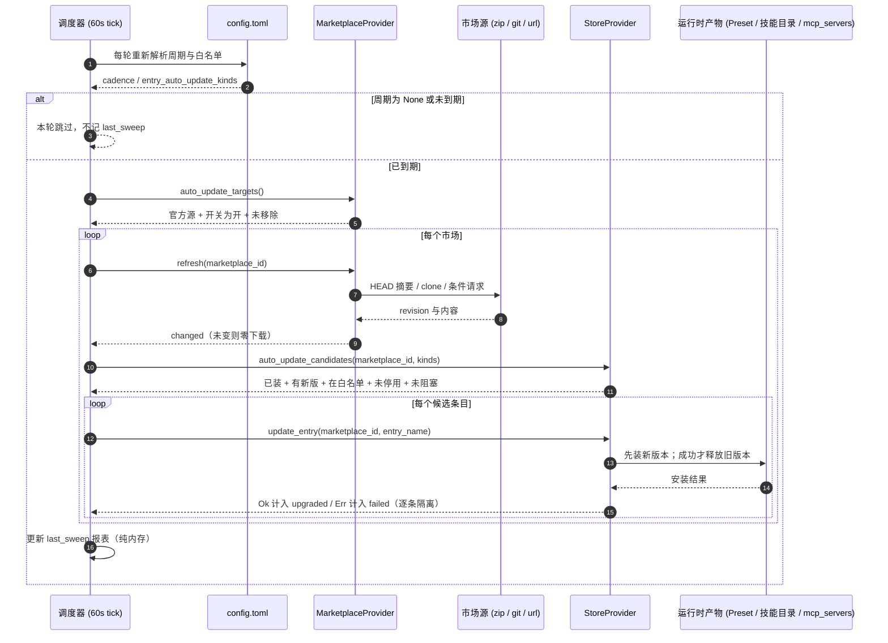

# 市场源的下载与更新策略 · 技术方案

> **状态**：✅ **已实施（2026-09-29）**——§6 的 10 步已按顺序落地，`fp-12` → `fp-13`，
> 方法计数 `53 / 78` → `55 / 80`；实施期的读数、与本文的差异与**尚未做**的部分逐条记在
> **附录 C**。  
> **核心原则**：三通道独立 —— **启动下载在配置/环境变量**、**运行期策略走 API 并持久化**、**自动升级随宿主扫掠**。

---

## 1. 背景与核心痛点

### 1.1 业务背景
用户期望在 `~/.agent-store/config.toml` 中配置市场源时，能够控制启动时是否自动下载市场归档；同时希望市场源以及安装的条目（专家、专家团、技能、连接器）能够通过 SDK 和 WebUI 灵活控制**下载、更新、自动下载、自动更新**。

### 1.2 现状与四大痛点
当前系统的实现存在以下核心痛点：

1. **启动强刷大归档，缺乏按源细粒度控制**  
   目前只有在配置文件完全缺失或声明为空时才会仅注册不下载（lazy）。一旦声明了市场源，启动时宿主会无条件拉取完整的市场归档（三个官方源累计约 324 MiB），占用大量带宽且拖慢启动。
2. **SDK 与外部进程无法控制配置路径**  
   配置文件路径写死在 `~/.agent-store/config.toml`，SDK 启动子进程（spawn）时无法通过命令行参数注入配置文件路径或下载行为。
3. **运行期无法热改自动更新策略**  
   扫掠调度周期（cadence）仅在服务启动时读取一次，且现有的配置 API（`config/set`）没有开放市场策略的写权限，导致 WebUI 或 SDK 无法在运行期调整自动更新间隔。
4. **市场索引刷新与条目升级脱节**  
   后台自动更新仅定期刷新市场索引（`refresh`），已安装的专家/技能/连接器完全不会随之升级；若要升级必须由用户逐个手动点击。

### 1.3 核心能力矩阵（2层 × 4动作）

系统将能力划分为两层（市场归档层、条目层），现状与目标对比如下：

| 层级 | 动作 | 现状行为 | 本方案目标 | 归属通道 |
|---|---|---|---|---|
| **市场归档**<br/>(Zip/Git/URL) | **手动下载** | `market/refresh`（支持 HEAD 摘要短路） | 保持不变 | API 显式调用 |
| | **手动更新** | 与下载复用同一方法 | 保持不变 | API 显式调用 |
| | **启动自动下载** | 只要配置声明即全量下载，无细粒度开关 | 新增 `download_on_start` 逐源配置 + 环境变量覆盖 | **启动通道** |
| | **后台自动更新** | 仅按固定周期刷新索引，运行期无法修改周期 | 新增 `market/settings` 读写接口，支持热生效与配置回写 | **运行期通道** |
| **安装条目**<br/>(Agent/Skill/Connector) | **手动下载(安装)** | `store/install-entry` | 保持不变 | API 显式调用 |
| | **手动更新** | `store/update-entry` | 保持不变 | API 显式调用 |
| | **启动自动下载** | 不支持（**非目标**：防止静默装入多余扩展） | 保持非目标 | — |
| | **后台自动更新** | 不支持 | 复用市场 `auto_update` 开关，结合类型白名单自动升级 | **后台扫掠通道** |

---

## 2. 方案全景与设计原则

### 2.1 整体架构（三通道独立模型）

本方案的核心思想是将控制权彻底解耦为**三条互不干扰的独立通道**：

```mermaid
flowchart TD
    subgraph Channel1 ["通道 1: 启动下载控制 (一次性决策)"]
        Env["环境变量 (AGENT_STORE_MARKET_DOWNLOAD / CONFIG)"]
        FileCfg["config.toml ([default_marketplaces.*])"]
        Env -->|最高优先级| Plan["解析启动下载计划"]
        FileCfg -->|按源配置 download_on_start| Plan
        Plan -->|eager / lazy| Reg["注册市场源 (按需下载 或 仅注册占位)"]
    end

    subgraph Channel2 ["通道 2: 运行期策略控制 (热生效 API)"]
        Client["WebUI / SDK Client"]
        Client -->|GET /market-settings| ReadAPI["读取当前生效策略 + 上次扫掠读数"]
        Client -->|POST /market-settings| WriteAPI["更新策略"]
        WriteAPI -->|toml_edit 保留注释回写| FileCfg
    end

    subgraph Channel3 ["通道 3: 后台扫掠与自动升级 (周期引擎)"]
        Ticker["轻量 Ticker (每 60 秒触发)"] --> ReadFile["读取 config.toml 最新配置"]
        ReadFile --> CheckCadence{"距上次扫掠是否达到 cadence?"}
        CheckCadence -->|未到期 / 关闭| Idle["跳过本次检查"]
        CheckCadence -->|已到期| LockSweep{"已有扫掠在执行?"}
        LockSweep -->|是 (并发互斥)| Idle
        LockSweep -->|否| DoSweep["执行一轮扫掠 (sweep_once)"]
        
        DoSweep --> RefreshM["1. 官方市场 HEAD 探测 -> 刷新索引"]
        RefreshM --> FilterE["2. 遍历已装条目 -> 过滤白名单/停用/阻塞"]
        FilterE --> UpgradeE["3. 调用 update_entry 逐条升级 (错误隔离)"]
        UpgradeE --> SaveReport["4. 更新内存中的 last_sweep 报表"]
    end
```

### 2.2 目标与非目标

#### 核心目标
1. **源级启动按需控制**：每个声明的市场源均可配置启动时是否自动拉取归档。
2. **外部运行环境穿透**：SDK 与外部工具可通过环境变量直接覆盖启动下载策略及指定配置文件。
3. **运行期热配置**：提供标准 API 读写扫掠周期和自动升级条目类型白名单，修改立即持久化并热生效。
4. **受控的条目自动升级**：官方市场开启更新时，其已安装的专家、团队、技能自动随之更新；连接器默认排除以避免意外掉线。

#### 明确的非目标（边界收敛）
- **不做条目级“自动安装”**：条目首次安装必然产生本地物化和配置挂载，失败成本高，绝不自动下载未安装条目。
- **不做数据库条目级策略表**：本方案基于市场级 `auto_update` 进行控制，**实现零数据库迁移**；不建立每条条目的独立策略表。
- **不做协议级批量升级动词**：不提供类似 `store/update-all` 的接口，批量升级仅存在于后台扫掠调度内部。
- **不改变“配置声明即替换内置兜底”的语义**：一旦在配置文件中声明了市场源，系统便以声明列表为准，不再隐式混入内置的三大官方源。
- **不对第三方市场开放自动轮询**：第三方市场源出于安全与流量边界考虑，宿主后台不进行自动轮询，由调用方自行按需刷新。
- **WebUI 不提供“启动不下载”开关**：首屏是否下载由部署配置/环境变量决定；WebUI 面向运行中状态，仅提供交互式手动刷新与自动更新策略配置。

---

## 3. 详细设计

### 3.1 模块一：启动下载策略（Startup Channel）

#### 核心决策
- **D1：源级配置字段 `download_on_start`**  
  在 `[default_marketplaces.<id>]` 下新增布尔字段，默认为 `true`（保持既有“写在配置即启动下载”的兼容语义）。
- **D7：SDK / 容器环境通过环境变量覆盖**  
  解决 SDK 无法传递命令行参数的问题，提供最高优先级的环境变量。

#### 配置结构 (`config.toml`)
```toml
# ~/.agent-store/config.toml

[default_marketplaces.experts]
source_kind = "zip"
source = "https://www.modelscope.cn/models/me9rez/flowy-marketplace/resolve/master/experts.zip"
download_on_start = false   # 新增字段：缺省为 true；设为 false 则仅注册空条目与元数据，不下载归档
```

#### 优先级判定流水线
系统启动时调用 `default_marketplace_plan()` 计算每个源的初始化策略，判定顺序如下：

```text
1. 检查环境变量 AGENT_STORE_MARKET_DOWNLOAD：
   - "none"  => 完全不注册任何市场源（首屏彻底静默）
   - "lazy"  => 强制所有市场源仅注册、不拉取归档 (fetch = false)
   - "eager" => 强制所有市场源立即拉取归档 (fetch = true)
   
2. 若环境变量未设置，读取 config.toml 中配置的各个市场源：
   - 存在 download_on_start 字段 => 采用字段值
   - 字段缺省 => 默认为 true（拉取归档）

3. 若配置文件缺失或未声明任何源：
   - 回落到系统内置三源，默认 lazy（不立即拉取，按需加载）
```

> **配置文件路径注入**：新增支持环境变量 `AGENT_STORE_CONFIG=/path/to/custom_config.toml`，使 SDK 和外部宿主能够直接指定配置文件，打破路径写死限制。

---

### 3.2 模块二：运行期策略控制（Runtime Settings Channel）

#### 核心决策
- **D2：新增独立 API `market/settings`（读）与 `market/settings-set`（写）**  
  避开易变且缺乏强类型包装的 `config/*` 泛用接口，为市场策略提供标准强类型端点。
- **D3：配置文件为唯一真源，写操作直接持久化（写穿）**  
  修改策略时不修改易丢失的内存态，而是使用 `toml_edit` 针对性更新 `config.toml`，保留文件中的所有注释与其他配置项；调度循环每次轮询直接读取文件，修改即刻生效。

#### API 契约与路由定义

| 端点名称 | HTTP Method | HTTP 路径 | 功能说明 |
|---|---|---|---|
| `market/settings` | `GET` | `/api/app-server/market-settings` | 获取当前生效策略及上次扫掠报告 |
| `market/settings-set` | `POST` | `/api/app-server/market-settings` | 更新策略并持久化回写至配置文件 |

> **注**：路径选择 `/api/app-server/market-settings` 而非 `/markets/settings`，避免被动态参数路由 `/markets/{marketplace_id}` 吞噬。

#### 数据结构（DTO）

```rust
// nomifun-api-types / protocol.ts

/// 读取返回对象
pub struct AppServerMarketSettings {
    /// 自动更新扫掠周期（小时）。None 表示关闭后台自动更新
    pub auto_update_interval_hours: Option<u64>,
    /// 允许自动升级的条目类型白名单（例如 ["agent", "team", "skill"]）
    pub entry_auto_update_kinds: Vec<String>,
    /// 宿主当前是否启用了扫掠引擎（桌面宿主配置缺失时可能为 false）
    pub sweep_enabled: bool,
    /// 最近一次后台扫掠的执行报告（纯内存态，仅用于回读展示）
    pub last_sweep: Option<AppServerMarketSweepReport>,
}

/// 写入补丁对象
pub struct AppServerMarketSettingsPatch {
    /// 缺省 = 不修改；0 = 关闭自动更新；>0 = 设定更新周期（小时）
    pub auto_update_interval_hours: Option<u64>,
    /// 缺省 = 不修改；[] = 显式清空（仅刷新市场索引，不升级任何已安装条目）
    pub entry_auto_update_kinds: Option<Vec<String>>,
}

/// 扫掠执行报告
pub struct AppServerMarketSweepReport {
    pub at: u64,                                // 执行时间戳 (毫秒)
    pub refreshed: u32,                         // 成功刷新索引的市场数量
    pub upgraded: u32,                          // 成功升级的条目数量
    pub failed: Vec<AppServerSweepFailure>,     // 升级失败的条目列表
}

pub struct AppServerSweepFailure {
    pub id: String,
    pub error: String,
}
```

#### 配置存储结构
```toml
# ~/.agent-store/config.toml

[marketplace]
auto_update_interval_hours = 6                          # 扫掠周期（小时）
entry_auto_update_kinds = ["agent", "team", "skill"]   # 允许自动升级的条目类型
```

#### SDK 与 WebUI 交互封装
- **WebUI**：在「设置 → 市场源」面板中增加宿主级设置卡片，包含更新周期选择器、条目类型多选框及上次扫掠状态面板。
- **SDK**：
  ```ts
  // 启动选项新增
  const server = await spawnAppServer({
    marketDownload: "lazy",            // 映射为 AGENT_STORE_MARKET_DOWNLOAD
    configPath: "./custom-config.toml" // 映射为 AGENT_STORE_CONFIG
  });

  // Client 新增方法
  const settings = await client.getMarketSettings();
  await client.setMarketSettings({
    auto_update_interval_hours: 12,
    entry_auto_update_kinds: ["agent", "skill"]
  });
  ```

---

### 3.3 模块三：后台自动扫掠与升级引擎（Background Sweep Channel）

#### 核心决策
- **D4：升级粒度以市场为单位，复用 `plugin_marketplaces.auto_update`**  
  市场开启 `auto_update` 的语义升级为：**“定期刷新该市场索引 + 自动升级来自该市场的条目”**。充分复用现有数据库字段与 UI 开关，无需数据库迁移。
- **D5：条目类型白名单过滤，连接器（connector）默认排除**  
  默认仅允许 `["agent", "team", "skill"]` 自动升级。连接器若发生配置变动，系统会强制将其置为未启用（`enabled = false`）以保证安全；为了防止后台无人值守时静默打断用户正在使用的服务，连接器必须由用户显式在白名单中勾选后方可自动升级。
- **D6：硬跳过保护条件**  
  哪怕条目符合白名单且有新版本，遇以下情况坚决跳过升级：
  1. 用户手动停用（快照组件 `disabled = 1`）：防止升级覆盖用户的禁用决定。
  2. 存在阻塞原因（`blocked_reason.is_some()`）：存在兼容性或依赖冲突。
  3. 未真正安装（`installed = false`，仅导入过元数据）。
- **D8：扫掠执行结果回读**  
  最近一次扫掠的耗时、刷新数、升级数和失败项存入内存 `LAST_SWEEP` 静态结构，通过 `market/settings` 被动回读展示，不引入额外的 WebSocket 推送通知。

#### 调度器重构设计
旧版调度器使用固定的 `tokio::time::interval(cadence)`，无法在运行期动态变更周期。新架构采用**固定轻量轮询 + 到期时间计算**：

```text
后台循环 (每 60 秒触发一次)：
  1. 读取并重新解析 config.toml
  2. 获取 auto_update_interval_hours
     - 若为 None 或 0 => 本次不执行
     - 若 (当前时间 - last_sweep_at) < interval => 本次不执行
  3. 检查并发互斥锁 (防止上一轮重任务尚未完成导致重入)
  4. 执行 sweep_once(state, config):
     a. 获取所有符合自动更新条件的市场 (官方源 + auto_update=true + 未删除)
     b. 对每个市场调用 refresh() (利用 HEAD ETag 摘要短路，无变动时不消耗带宽)
     c. 若 entry_auto_update_kinds 为空 => 仅刷新索引，流程结束
     d. 查询该市场下已安装且有更新的条目列表：
        - 检查是否在 kinds 白名单中 (默认排除 connector)
        - 检查条目是否为手动停用状态 (disabled == 1)
        - 检查条目是否有 blocked_reason
        - 符合条件者，调用 store.update_entry() 执行升级
        - 捕获单条异常，记录到 failed 列表，绝不中断后续条目升级
  5. 记录执行时间戳并更新内存中的 last_sweep 报表
```

一轮扫掠的两段式交互（谁在读文件、谁在决定准入、谁在动已安装的东西）：



---

## 4. 关键决策与兼容性

### 4.1 决策与权衡矩阵（D1–D9）

| 编号 | 决策点 | 选定方案 | 放弃的替代方案与理由 |
|---|---|---|---|
| **D1** | 启动下载的粒度 | **per-source `download_on_start`（缺省 `true`）** | ❌ 宿主级兜底 `default_download`：多一层优先级，而「写进配置就是明确要求」会被间接值盖住；❌ 直接把默认翻成 `lazy`：对全部现存配置的静默行为变更 |
| **D2** | 运行期策略的 wire 面 | **新增 `market/settings` + `market/settings-set`** | ❌ 扩 `config/set` 白名单：那是仓库明文标注「最易变、curated client 刻意不给 typed 方法」的一族，SDK 要裸 `transport.request` 才能用 |
| **D3** | 策略真源与生效方式 | **配置文件为唯一真源；写面写穿；调度器每轮重读** | ❌ 内存态 + 重启生效：与文件长期分叉，且「读回的就是文件」不再成立 |
| **D4** | 自动升级的粒度 | **市场级（复用 `plugin_marketplaces.auto_update`）** | ❌ 条目级策略表：需要新表 + 迁移，且要额外定义「策略行与安装态解耦」的一致性；市场级零迁移 |
| **D5** | 可自动升级的条目类型 | **白名单缺省 `["agent","team","skill"]`，连接器显式 opt-in** | ❌ 四类默认全开：连接器升级会因配置变化被置为停用（`36` §3.4），无人值守等于静默掉线 |
| **D6** | 用户显式决定的优先级 | **手动停用 / `blocked_reason` / 只导入未安装三条硬跳过** | ❌ 一并升级：会替用户撤销「停用」这一决定，并让「源上判定不可装」的条目被硬装 |
| **D7** | SDK 的控制通道 | **环境变量（`AGENT_STORE_MARKET_DOWNLOAD` / `AGENT_STORE_CONFIG`）** | ❌ CLI 参数：`apps/agent-store` 的 clap 不认后端 flag，子进程会在打印 readiness 前退出（该结论仓库已有注释）；❌ 只靠配置文件：SDK 够不到默认路径那份文件 |
| **D8** | 扫掠结果的可观测 | **`market/settings` 回读 `last_sweep`（纯内存）** | ❌ 新增 `ServerNotification`：多一个指纹面，而按需再 `store/list` 一次即可 |
| **D9** | 破坏性行为的登记 | **不加第二道总开关，改在 changelog / upgrade / `18` §9.2 / `36` §2 显式登记** | ❌ `[marketplace] entry_auto_update`（默认关）当第二道门：与 D4 的「打开即生效」矛盾，且 `auto_update`（每市场、默认关）+ cadence（宿主级、默认关）已是两道显式动作；保留为**可回退点**（真机若见误升级，加这道门成本很低） |

### 4.2 破坏性变更登记（D9）
- **影响场景**：既有用户如果已经在配置文件中配置了 `auto_update_interval_hours`，并且在市场列表中开启了官方市场的 `auto_update` 开关，在升级本版本后，其已安装的专家与技能会在后台**开始被自动升级**（以往旧版本仅刷新市场索引，不碰已安装组件）。
- **应对方案**：
  1. 在版本升级说明与变更日志中重点突出此行为升级；
  2. 如果用户希望维持“仅刷新索引、不自动升级条目”的旧行为，只需在配置中将白名单置空：
     ```toml
     [marketplace]
     entry_auto_update_kinds = []
     ```

### 4.3 第三方市场源限制说明
- 依据平台既定安全规范，第三方自定义市场源即便设置了 `auto_update`，宿主后台也不会对其进行自动化轮询拉取。
- SDK 使用者若接入第三方源，应由 SDK 宿主端按需显式调用 `refreshMarketplace()` 和 `updateStoreEntry()` 进行控制。
- **SDK 场景的额外事实**：`--port 0` spawn 的宿主通常活不过一个 cadence（小时级），所以「自动更新」在
  SDK 侧应由**调用方自己轮询**：`refreshMarketplace()` 看 `changed` → `checkUpdates()` →
  `updateStoreEntry()`。宿主扫掠是给长命宿主（WebUI 那个）用的。

---

## 5. 验收标准与测试用例

| 编号 | 验证场景 | 断言与验收口径 |
|---|---|---|
| **S1** | **启动策略纯函数分支** | 验证 `default_marketplace_plan`：<br/>• 无配置时：默认使用内置源且 `fetch = false`<br/>• 声明 `download_on_start = false`：仅注册，`fetch = false`<br/>• 声明但缺省字段：`fetch = true`<br/>• 环境变量 `lazy`：覆盖配置强制全为 `fetch = false`<br/>• 环境变量 `none`：返回空列表 |
| **S2** | **真机零流量启动** | 全新目录配置 `download_on_start = false` 启动宿主：`market/list` 能查到该源，但 `entry_count = 0`，启动网络日志中完全无归档下载流量。 |
| **S3** | **配置持久化与回读** | 调用 `market/settings-set` 写入 `auto_update_interval_hours = 6`：接口正确回显，且 `config.toml` 文件被更新，原有注释和空行完好保留；宿主重启后配置依然生效。 |
| **S4** | **空白名单纯刷新语义** | 配置 `entry_auto_update_kinds = []`：后台扫掠仅触发市场索引 `refresh`，不产生任何条目升级操作。 |
| **S5** | **条目自动升级执行** | 构造旧版本专家场景，触发扫掠后：市场索引更新且该专家版本成功提升，`last_sweep.upgraded` 计数加 1。 |
| **S6** | **连接器保护验证** | 默认白名单下，有更新的连接器**不会**被自动升级；当白名单显式加入 `"connector"` 后，升级触发并进入停用保护逻辑。 |
| **S7** | **硬跳过条件验证** | 被手动停用的条目、存在 `blocked_reason` 的条目、未安装条目，在扫掠过程中均被安全过滤，不触发升级调用。 |
| **S8** | **协议与类型检查** | `bun run check:fingerprint` 及前后端全量单测通过，两端 DTO 与协议版本严格对齐。 |

---

## 6. 实施步骤

```text
第 1 步 (配置层):   修改 agent_store.rs，支持 download_on_start 与 entry_auto_update_kinds 解析及 toml_edit 回写
第 2 步 (启动流):   重构 default_marketplace_plan，引入环境变量 AGENT_STORE_MARKET_DOWNLOAD / AGENT_STORE_CONFIG
第 3 步 (协议层):   在 nomifun-api-types 及 TS 协议包中声明 AppServerMarketSettings 等 DTO
第 4 步 (API 实现): 实现 market/settings 与 market/settings-set 读写端点，注册 HTTP 路由及 WS 处理
第 5 步 (协议升级): 协议指纹自增 (fp-12 -> fp-13)，方法数对齐 (55/80)
第 6 步 (扫掠重构): 改造后台更新调度器为 60s 轮询机制，实现 sweep_once 过滤与逐条升级流水线
第 7 步 (SDK 封装): 更新 SDK spawn 参数映射，客户端添加 getMarketSettings / setMarketSettings 强类型方法
第 8 步 (WebUI 呈现): 在设置页市场源面板新增自动更新配置区域与执行读数展示，完善双语国际化文案
第 9 步 (全链路验证): 执行 S1~S8 自动化测试与真机验证
第 10 步 (文档同步): 更新各模块参考文档、发布日志与用户升级指南
```

---

## 附录

### 附录 A：核心改动文件索引

| 模块 | 关键文件 | 改动要点 |
|---|---|---|
| **配置解析** | `crates/backend/nomifun-app-server/src/agent_store.rs` | 字段拓展、`toml_edit` 最小化装饰保留写入 |
| **启动调度** | `crates/backend/nomifun-app-server/src/lib.rs` | 计划生成、60s 调度循环、设置 API 路由与处理器 |
| **条目过滤** | `crates/backend/nomifun-app/src/app_server_store.rs` | 扫掠条目候选集提取、过滤保护谓词判断 |
| **协议定义** | `crates/backend/nomifun-api-types/src/app_server.rs`<br/>`web/packages/protocol/src/protocol.ts` | 设置 DTO、补丁 DTO、报表 DTO |
| **SDK 客户端** | `web/packages/client/src/client.ts`<br/>`web/packages/sdk/src/spawn.ts` | 环境变量注入、强类型调用方法封装 |
| **前端交互** | `web/src/components/catalog/MarketSourcesPanel.tsx`<br/>`web/src/i18n/{zh-CN,en-US}.ts` | 设置面板卡片、双语文本对照 |

### 附录 B：协议指纹与发版台账
- **协议指纹版本**：`fp-12` → `fp-13`
- **方法路由数量**：`53 / 78` → `55 / 80`（新增 `market/settings` 与 `market/settings-set`）
- **同步要求**：发布前须通过 `bun run check:fingerprint` 及 `bun run check:release-sync` 校验。

---

## 附录 C：实施记录（2026-09-29）

### C.1 自检读数

| 检查 | 读数 |
|---|---|
| `cargo test -p nomifun-app-server` | **186 passed / 0 failed**（含新增 3 条：设置读写回环、扫掠升级段隔离、到期判定） |
| `cargo test -p nomifun-app --lib` | **381 passed / 1 ignored**（含新增 2 条纯函数单测：行级准入四条拒绝、全停用判定） |
| `cd web && bun run typecheck` | exit 0 |
| `cd web && bun run test` | **555 passed / 1 skipped** |
| `bun scripts/smoke.ts`（mock 端到端） | **smoke passed**（含握手携带 `fp-13`） |
| `bun run check:fingerprint` | 绿：`fp-13` 一致于本仓 7 文件 10 处 + 站点 2 文件 |
| `bun run check:release-sync` | 绿：`0.1.0-beta.8` 四包 + 8 pin + 站点 `release.json` 同值；`55 / 80` 两语言同值 |
| `bun run check:market` | 绿：self-test 17/17 |
| `cargo fmt --check -p nomifun-app-server -p nomifun-app -p nomifun-api-types` | 无输出（已格式化） |

**活体读数**（`cargo build -p agent-store` 的 debug 二进制 + 经 SDK 的 `launchHarness` 驱动；
脚本是一次性夹具，未入库）：

| 场景 | 读数 |
|---|---|
| 握手 | `protocol_version = "fp-13"` |
| **S2** 声明一条官方 zip 源且 `download_on_start = false` | 该行已注册、`entry_count = 0`、`resolved_revision` 为空，**且数据目录下没有落任何归档**（`agent-store-markets/connectors/live` 不存在） |
| **S1/`none`** `AGENT_STORE_MARKET_DOWNLOAD=none` | `market/list` 0 行、`store/list` 0 条目（连注册都不做） |
| **S3** `market/settings` 缺省 | 周期 `null`、白名单 `["agent","team","skill"]`、`sweep_enabled = true`、`last_sweep = null` |
| **S3** `market/settings-set` 写 `{6, ["connector","AGENT"]}` | 回读 `6` 与 `["agent","connector"]`（规范化序）；`config.toml` 里文件头注释与同键注释**逐字存活**、两个键各出现一次；未知类型被拒后**文件字节不变**；**重启后两值仍在** |
| **S4 + 真扫掠** | 60s tick 真的跑了一轮：`last_sweep = { at: 1790672169401, refreshed: 1, upgraded: 0, failed: [] }`——刷新走 `HEAD` 短路，`entry_auto_update_kinds = []` 时**零升级** |

### C.2 与本文的差异（逐条）

1. **两个方法不落在 `MarketplaceProvider` trait 上**，而是与 `config/get`·`config/set` 同族，
   实现在 `nomifun-app-server/src/lib.rs`（`market_settings_view` /
   `execute_market_settings_set`）。理由：策略的载体是**配置文件路径**，而该路径属路由状态
   （`agent_store_config_path`），不在市场 provider 手里；为此给 trait 加一个「顺便知道文件在哪」
   的字段，比把两个读一个 TOML 的处理器放在同族位置更贵。
2. **准入规则抽成两个纯函数**（`app_server_store.rs` 的 `auto_update_eligible_from_row` 与
   `all_components_disabled`），而不是写在 `auto_update_candidates` 的循环里。理由：这些子句
   正是用户能观测到的「为什么它没升级」，抽出来才能逐条钉住；「空组件列表 ≠ 全部停用」这一条
   也因此有了自己的断言。
3. **升级段单独抽出**（`lib.rs` 的 `sweep_upgrade_entries`），并让「候选集列举失败」进入
   `failed` 而不是被 `unwrap_or_default` 吞掉——市场枚举与 refresh 计数留在
   `sweep_official_markets` 里。
4. **「关闭」的编码用 `0` 而不是双层 `Option`**：`cadence()` 本来就把 `0` 当关闭，
   多一层空值语义只会多一个 serde 陷阱；读面因此把 `0`/缺省统一回成 `null`。
5. **调度器不需要并发互斥锁**（本文 §3.3 时序图里画了「已有扫掠在执行?」这一支）：循环体
   `await` 整轮扫掠，第二个扫掠在同一任务里不可能并发启动。用户手动 `store/update-entry`
   与扫掠的窗口内竞态是有界的（版本相同即 no-op），已在代码注释里登记，不加锁。
6. **`AGENT_STORE_CONFIG` 落成后端 `Cli::agent_store_config` 的一个 `env` 属性**（一行），
   而不是新增流程：`apps/agent-store` 的 `is_none()` 分支天然让环境变量优先于默认路径。
7. **启动策略的 `lazy` 与「官方源仍可被扫掠」不冲突但也不叠加**：懒注册的行被刻意钉成
   `auto_update = 0`（`30` §11.2 第 1 点，本次未改），所以「声明了但没下载」的市场不会在
   第一个 tick 被扫掠顺带下回来——这正是 S2 活体读数里「零归档」的成因。

### C.3 尚未做（如实登记）

- **条目自动升级的活体读数未做**：要观测一次真实升级，需要一个「装了旧版 → 市场出新版」的
  官方市场夹具，而官方 zip 归档由发布侧产出、本地无法构造；S5/S6/S7 目前由
  `sweep_upgrade_entries`（假 store，含失败隔离）与两个纯函数单测（kind 白名单 / 手动停用 /
  `blocked_reason` / 未安装）覆盖。**已完成的替代读数**是 S4 那一轮真扫掠（`refreshed = 1`、
  `upgraded = 0`、零失败），它证明调度器、到期判定与读数链路在真机上成立。
- **`bun scripts/smoke.ts --real`**（对真宿主的 `--real` 模式）未跑；默认（mock）模式已通过。
- **未发版**：npm 四包与站点上线按 `25` runbook 在发版时执行；站点仓的两处指纹/计数已在本次改好
  （未提交），`changelog` / `upgrade` 的用户可见条目留给发版那一轮。
