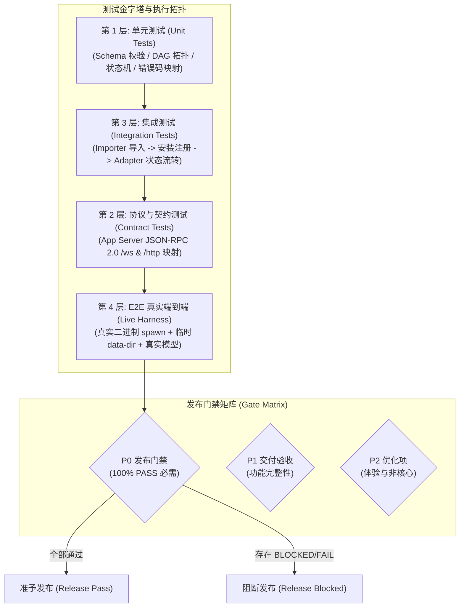

# Agent Store V1 自动化质量保障与测试用例总索引规范（QA Architecture & Test Index）

> 状态：规范总索引（全仓公共测试口径，分级用例正文归属各领域文档）  
> 适用范围：全局测试流水线、CI 门禁、真机冒烟点火脚本与发布准入审计  
> 关联设计：[`02-codebuddy-workbuddy-import-spec.md`](file:///c:/workspace/allo/docs/agent-store/02-codebuddy-workbuddy-import-spec.md)、[`05-flowy-agent-store-app-server-protocol.md`](file:///c:/workspace/allo/docs/agent-store/05-flowy-agent-store-app-server-protocol.md)、[`06-connector-oauth-security.md`](file:///c:/workspace/allo/docs/agent-store/06-connector-oauth-security.md)、[`09-release-readiness.md`](file:///c:/workspace/allo/docs/agent-store/09-release-readiness.md)、[`13-p0-execution-plan.md`](file:///c:/workspace/allo/docs/agent-store/13-p0-execution-plan.md)、[`19-webui-codex-alignment.zh.md`](file:///c:/workspace/allo/docs/agent-store/19-webui-codex-alignment.zh.md)  
> 核心原则：**不以假 Mock 代替真实端到端状态；环境与证据严格归档但绝不泄漏真实凭据；所有 P0 用例必须达到 100% 物理通过方可放行发布。**

---

## 1. 背景与质量保障目标

在复杂的“本地优先自动化平台”中，测试面临多进程、跨网络通信协议、多外部 Provider 模型响应不确定性等挑战。早期分散在各处的零碎单测无法证明复杂智能体协作或崩溃自愈的有效性。

本方案确立全仓统一的测试架构体系：
1. **单一事实源（Single Source of Truth）**：确立本索引为全仓环境元数据、证据归档格式与验收等级的唯一公共标准，消除口径漂移。
2. **多层金字塔架构**：自底向上的“静态规范校验 $\to$ 进程单元测试 $\to$ 协议契约测试 $\to$ 真机点火 Harness 集成测试”。
3. **严格凭据安全红线**：测试过程中严格执行脱敏审计，禁止在测试快照、断言日志或报错信息中留下任何明文 API Key 或 OAuth 令牌。

---

## 2. 方案全景与测试拓扑

整个测试验证流水线由 4 层防线构成，覆盖资产、协议、运行时与前端视图：



---

## 3. 核心质量保障规范

### 3.1 测试环境与元数据记录标准

所有正式集成测试报告与 CI 产物必须完整记录以下环境元数据：
- `app_server_version` / `protocol_fingerprint`（例如 `fp-12`）；
- `allo_runtime_version` / `importer_digest`（来源快照的树摘要 SHA-256）；
- 宿主操作系统类型、架构与关键配置摘要；
- 测试工作区唯一隔离 UUID（`workspace_id`）。

### 3.2 证据脱敏与归档规范

1. **凭据安全脱敏红线**：
   - 绝不记录任何真实的 API Key、Bearer Token、OAuth Refresh Token 或明文密码。
   - 凭据仅允许以元数据形式存证：
     ```json
     {
       "credential_present": true,
       "credential_id": "opaque-uuidv7",
       "auth_mode": "token"
     }
     ```
   - 任何涉及凭据展示的地方统一强制填充 `[REDACTED]`。
2. **测试证据束要素**：
   - 每次集成测试必须留存：输入参数摘要、服务端回执 Receipt、相关的全局单调递增 `sequence` 序列号、终态状态值及脱敏后的结构化运行日志。

### 3.3 验收等级与状态机判定

- **P0（阻断发布）**：主链路运行、版本不可变冻结、崩溃自愈、安全凭据隔离与数据持久化一致性。任何一项失败或阻塞，绝对禁止发布。
- **P1（必须交付）**：V1 完整功能集、WebUI 关键任务闭环、双向同步游标追平。
- **P2（可延期项）**：非关键界面的视觉与边缘场景体验优化。
- **判定结果枚举**：`PASS`（通过）、`FAIL`（失败）、`BLOCKED`（阻断，必须说明阻塞原因与替代证据，不能当作 PASS）、`NOT_RUN`（未执行）。

---

## 4. 全局测试用例归属矩阵

为避免多处维护导致用例描述漂移，全仓用例严格执行**单一正文归属制**：

| 用例族编号 | 领域覆盖面 | 唯一正文归属文档 | 验证关键目标 |
| :--- | :--- | :--- | :--- |
| **`TC-IMP-*` / `TC-INS-*`** | 资产导入与安装注册 | [`02-codebuddy-workbuddy-import-spec.md`](file:///c:/workspace/allo/docs/agent-store/02-codebuddy-workbuddy-import-spec.md) §13 | 验证插件包解压、容错解析、不可变快照摘要生成与物理产物安装/卸载。 |
| **`TC-RT-*` / `TC-TEAM-*`** | 单 Agent 与 Team 运行时 | [`13-p0-execution-plan.md`](file:///c:/workspace/allo/docs/agent-store/13-p0-execution-plan.md) §10 | 验证真实模型调度、版本冻结、取消 CAS、崩溃强杀自愈与 DAG 依赖调度。 |
| **`TC-API-*` / `TC-SDK-*`** | App Server 协议与 SDK | [`05-flowy-agent-store-app-server-protocol.md`](file:///c:/workspace/allo/docs/agent-store/05-flowy-agent-store-app-server-protocol.md) §14 | 验证握手协商、Opaque ID 隔离、幂等重放控制与 SDK 子进程托管。 |
| **`TC-CONN-*` / `TC-OAUTH-*`** | 连接器与安全沙箱 | [`06-connector-oauth-security.md`](file:///c:/workspace/allo/docs/agent-store/06-connector-oauth-security.md) §11 | 验证标准 OAuth PKCE 流程、401 静默刷新、Token 内存注入与 STDIO 沙箱。 |
| **`TC-WEB-*` / `TC-CATALOG-*`** | WebUI 交互与目录发现 | [`19-webui-codex-alignment.zh.md`](file:///c:/workspace/allo/docs/agent-store/19-webui-codex-alignment.zh.md) §9 | 验证命令面板、行内审批卡、产物变更管理与前端展示脱敏。 |

---

## 附录：原始技术底稿与历史归档 (Historical & Technical Reference Archive)

> **归档说明**：以下完整保留重构前的原始技术底稿、历次讨论与历史记录全文，供历史追溯、协议字段详细对照与技术审计。

---

# Agent Store V1 测试验收用例（总索引）

> 状态：**TC 总索引**（附 §1/§2 公共口径）；逐条用例正文已归各归属文档，本文件不再复制正文
> 日期：2026-08-26（2026-09-11 结构收敛：正文归编号文档）
> 前置：`16-sdk-webui-site-priority-plan.zh.md` §6 / §7、`10-public-contracts.md` 及本目录中的 Agent Store 规格文档
> 说明：本文件是 V1 测试用例的**总索引与公共口径**。§1/§2 定义全仓共用的测试环境、证据要求与验收等级；**`TC-*` 逐条正文的唯一位置见 §3 归属总表**，本文件不再复制用例正文。新增或修改用例：先改归属文档正文，再同步 §3 的编号归属。

## 1. 测试环境与证据要求

### 1.1 环境

测试必须记录：

```text
App Server 版本
allo Runtime 版本
Protocol version
SDK 版本
Import source digest
Definition version
Connector/Mock Server 版本
workspace 标识
操作系统和关键配置摘要
```

真实凭据只记录：

```text
credential_present: true
credential_id: <opaque id>
```

禁止记录真实值；任何示例统一使用 `[REDACTED]`。

### 1.2 证据

每个通过用例至少保存：

```text
测试输入摘要
请求/响应摘要
相关 event_id/sequence
Run/Task/Attempt/Artifact 公共 ID
最终状态
日志或截图路径（脱敏）
```

外部系统副作用用测试账号、隔离 workspace 或 mock Connector；不得用生产数据验收。

## 2. 验收等级

```text
P0 阻断发布：主链路、安全、数据一致性
P1 必须交付：V1 功能完整性
P2 可延期：体验优化和非核心适配
```

结果：

```text
PASS
FAIL
BLOCKED
NOT_RUN
```

`BLOCKED` 必须写明阻塞原因和替代证据，不能当作 PASS。

## 3. 用例归属总表（正文唯一位置）

| TC 组 | 唯一正文（归属文档） |
|---|---|
| `TC-IMP-001`~`017`、`TC-INS-001`~`008` | `02-codebuddy-workbuddy-import-spec.md` §13（验收用例 TC-IMP / TC-INS） |
| `TC-RT-001`~`010`、`TC-TEAM-001`~`009` | `13-p0-execution-plan.md` §10（Runtime 验收用例 TC-RT / TC-TEAM） |
| `TC-API-001`~`004`、`TC-SDK-001`~`003` | `05-flowy-agent-store-app-server-protocol.md` §14（验收用例正文 TC-API / TC-SDK） |
| `TC-CONN-001/002`、`TC-OAUTH-001`~`004`、`TC-CLI-001`、`TC-STDIO-001` | `06-connector-oauth-security.md` §11（验收用例正文 TC-OAUTH / TC-CONN / TC-CLI / TC-STDIO） |
| `TC-WEB-001`~`004`、`TC-SEC-001`~`003`、`TC-CATALOG-001`~`005` | `19-webui-codex-alignment.zh.md` §9（验收用例 TC-WEB / TC-SEC / TC-CATALOG） |

配套章节：

| 内容 | 唯一位置 |
|---|---|
| 测试环境与证据要求、验收等级（§1/§2 公共口径） | 本文件 §1/§2（`13-p0-execution-plan.md` §11 只保留指针） |
| P0 发布门禁用例清单 | `13-p0-execution-plan.md` §12；发布准入判定见 `09-release-readiness.md` |
| 回归触发与测试报告要求 | `13-p0-execution-plan.md` §13 |
