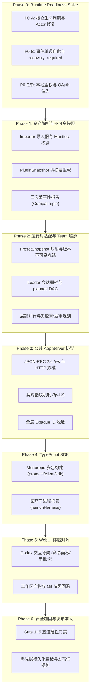

# Agent Store V1 研发工程规划与实施方案（Development Plan & Engineering Milestones）

> 状态：工程规范（Phase 0/1/2 核心已关闭，阶段总纲与最新工程计划持续对齐）  
> 适用范围：全模块研发团队、迭代排期、依赖管理与门禁评审  
> 关联设计：[`00-architecture-decision.md`](file:///c:/workspace/allo/docs/agent-store/00-architecture-decision.md)、[`04-flowy-agent-store-runtime-adapter.md`](file:///c:/workspace/allo/docs/agent-store/04-flowy-agent-store-runtime-adapter.md)、[`05-flowy-agent-store-app-server-protocol.md`](file:///c:/workspace/allo/docs/agent-store/05-flowy-agent-store-app-server-protocol.md)、[`09-release-readiness.md`](file:///c:/workspace/allo/docs/agent-store/09-release-readiness.md)、[`13-p0-execution-plan.md`](file:///c:/workspace/allo/docs/agent-store/13-p0-execution-plan.md)、[`16-sdk-webui-site-priority-plan.zh.md`](file:///c:/workspace/allo/docs/agent-store/16-sdk-webui-site-priority-plan.zh.md)  
> 核心原则：**先验证单 Agent 再实现 Team；先固定公共契约再编写 SDK/UI；Event Log 为唯一运行时事实来源；任何未通过 Runtime 门禁的能力严禁标记为可运行。**

---

## 1. 方案背景与工程研发目标

Agent Store V1 的目标是打造一套兼具高鲁棒性、可审计性与本地优先安全边界的智能体底座。为杜绝“先搭界面、底层空心”或“需求蔓延导致架构漂移”等工程通病，制定分阶段、门禁式研发实施方案。

### 1.1 核心闭环架构
研发主线聚焦一条清晰的垂直穿透数据流：
$$\text{外部资产包 (CodeBuddy/WorkBuddy)} \xrightarrow{\text{Importer}} \text{不可变快照 (PluginSnapshot)} \xrightarrow{\text{Adapter}} \text{Allo 执行内核} \xrightarrow{\text{Protocol}} \text{App Server} \xrightarrow{\text{SDK}} \text{WebUI 终端}$$

---

## 2. 方案全景与阶段推进拓扑

研发流程由 7 个有序阶段紧密衔接，每一阶段均具备不可绕过的硬性准出条件：



---

## 3. 分阶段实施与关键准出方案

### 3.1 Phase 0：运行时准备度点火（Runtime Readiness Gate，已关闭）
- **核心目标**：排除底层执行引擎最核心的不可行性风险，验证单 Agent 运行、持久化与崩溃自愈。
- **关键任务**：
  - **P0-A**：打通 `AgentDefinition -> Preset -> Snapshot -> ExecutionParticipant` 链路；修复 Actor ID 校验引发的 500 异常；实测 `planning → running → completed` 真实生命周期。
  - **P0-B**：验证单调递增 `sequence`；模拟硬杀重启，无法证明安全时收敛为 `recovery_required`，杜绝伪装成功。
  - **P0-C/D**：验证本地回环 `LocalPrincipal`；打通 OAuth 运行时 Token 注入与 401 刷新重试。
- **准出要求**：TC-RT-001 ~ 010 全绿，证据包完成脱敏审计。

### 3.2 Phase 1：资产导入与元数据管理（已落地）
- **核心目标**：实现对外部插件、技能与连接器的健壮解析与物理隔离。
- **关键任务**：
  - 解析来源目录清单，校验文件路径与防穿越；
  - 构造不可变 `PluginSnapshot` 并计算树 SHA-256 摘要；
  - 导出标准化 Agent、Team、Skill、Connector 元数据，评估三态兼容性。
- **准出要求**：`software-company` 导入生成 5 专家与 1 团队；不支持组件记录原因但不静默丢弃；敏感配置改写为 `secret:<KEY>`。

### 3.3 Phase 2：Runtime Adapter 与协同编排（已落地）
- **核心目标**：实现多智能体团队（AgentTeam）的高可靠调度。
- **关键任务**：
  - 服务端创建 Leader Conversation，绑定 `execution_template_id`；
  - Leader 首轮调用 `nomi_delegate(strategy="planned")` 生成 DAG；
  - 实现依赖拓扑调度与局部并发（`max_parallel` 约束）；
  - 失败时触发局部重试（Attempt 递进）或生成新 Plan Revision。
- **准出要求**：DAG 调度顺序严格保真；旧 Attempt 迟到事件不覆盖新状态。

### 3.4 Phase 3：统一公共 App Server 协议层（已确立）
- **核心目标**：对外建立唯一稳定的标准化交互面。
- **关键任务**：
  - 落地 WebSocket 双向通道与 HTTP 辅助通道，双端语义严格统一；
  - 引入 `fp-<n>` 单调契约指纹（当前 `fp-12`）；
  - 抹除内部数据库物理 ID，全字段暴露 Opaque UUIDv7；
  - 落地请求级幂等控制（`idempotency_key`）。
- **准出要求**：契约测试 100% 通过；相同幂等 Key 不重复创建任务。

### 3.5 Phase 4 & 5：客户端 SDK 与 WebUI 交互对齐（已闭环）
- **核心目标**：构建开箱即用的开发者 SDK 与工业级操作界面。
- **关键任务**：
  - SDK 解决 Node 管道背压卡死，按平台打包预编译运行时，支持自动重连与游标追平；
  - WebUI 对齐 Codex 交互骨架：交付统一命令面板、行内审批卡、中途引导（`run/steer`）、计划待办树与产物变更比对。
- **准出要求**：所有交互必须具备真实数据流支持，杜绝假开关。

### 3.6 Phase 6：安全加固与准入放行（推进中）
- **核心目标**：全面满足交付与发布合规性。
- **关键任务**：
  - 严格执行 Gate 1 至 Gate 5 门禁审计；
  - 校验全量日志与响应，验证零明文凭据残留；
  - 演练不可逆回滚方案。

---

## 4. 关键架构决策与停止条件

### 4.1 核心停止条件矩阵（Stop Conditions）

| 风险场景 | 触发的停止条件 | 降级与恢复策略 |
| :--- | :--- | :--- |
| **Agent 桥接未打通** | 无法生成合法执行快照 | **立即停止扩展 Team/SDK/Web**，回退集中精力修复 Runtime Adapter。 |
| **未完成任务状态丢失** | 进程崩溃重启后状态丢失或伪装完成 | **停止长任务对外承诺**，优先修复持久化状态机与 `recovery_required`。 |
| **外部副作用重复** | 失败重试未提供外部幂等键 | **禁止自动重试**，转为人工介入审批确认。 |
| **连接器只登录无法调用** | OAuth Token 注入或 Probe 探测失败 | **状态强制标记为 Partial**，严禁显示为 Connected。 |
| **公共协议字段漂移** | SDK 与协议字段不一致 | **严禁单边妥协**，必须同步修改契约规范与测试断言。 |

---

## 5. 完成定义（Definition of Done）

V1 版本正式交付必须同时满足以下十项基准：
1. [x] 架构与公共契约与代码库源码事实保持 100% 绝对一致；
2. [x] Runtime Readiness Gate 实测通过（TC-RT-001 ~ 010 全绿）；
3. [x] `software-company` 导入与最小 TeamRun 真实可执行；
4. [x] Event Log、Projection 与崩溃自愈流程通过实测验证；
5. [x] App Server、SDK 与 WebUI 契约测试全部通过；
6. [x] OAuth 注入、静默刷新与 Probe 探针验证通过；
7. [x] 所有 P0 级用例达到 100% PASS，无阻断项；
8. [x] 全链路扫描无明文凭据泄露，工作区目录沙箱逃逸测试通过；
9. [x] 插件与市场资源版权审核与合规声明齐备；
10. [x] 9 份发布证据包完整归档，回滚与灾难恢复路径演练通过。

---

## 附录：原始技术底稿与历史归档 (Historical & Technical Reference Archive)

> **归档说明**：以下完整保留重构前的原始技术底稿、历次讨论与历史记录全文，供历史追溯、协议字段详细对照与技术审计。

---

# Agent Store V1 开发计划

> 状态：开发路线冻结（Phase 0）；排期待 Spike 校准；当前发布阻断
> 更新：2026-09-09 —— 本文为早期总纲（历史参照，正文不再更新）；执行顺序以 `15-store-chain-and-protocol-vnext-plan.zh.md` 为准，阶段基线以 `16-sdk-webui-site-priority-plan.zh.md` §6 / §7 为准，P0 细则以 `13-p0-execution-plan.md` 为准
> 日期：2026-08-26
> 依据：`技术方案.md`、`00-architecture-decision.md` 至 `10-public-contracts.md`
> 测试主表：`agent-store-v1-test-cases.md`
> 说明：本计划使用两周迭代作为验收节奏，不承诺总工期；实际排期必须根据 Phase 0 实测结果校准

## 1. 目标

完成 Agent Store V1 的核心端到端闭环：

```text
Importer → Catalog → AgentDefinition/Preset → ResolvedPresetSnapshot → allo Run
→ Event Log/Recovery → App Server → TypeScript SDK → Flowy/Web
```

并在此基础上完成：

```text
固定成员 AgentTeam
+ Leader Planning Context 驱动的 planned DAG
+ 局部并行
+ retry/replan
+ Connector/OAuth 安全闭环
```

## 2. 开发原则

1. 先验证单 Agent，再实现 Team；
2. 先固定公共契约，再实现 SDK/Web；
3. Event Log 是运行事实来源，Projection 是派生状态；
4. Importer 不依赖 allo 内部对象；
5. 任何未通过 Runtime Gate 的能力不能标记为可运行；
6. 每项开发任务必须关联测试编号；
7. 每轮实现完成后更新测试证据，不把“代码存在”当作完成。

## 3. 阶段总览

| 阶段 | 目标 | 关键出口 |
|---|---|---|
| Phase 0 | 关闭 Runtime Readiness Gate | 单 Agent、事件事实源、重启状态标记、认证和 OAuth Spike 有证据 |
| Phase 1 | Importer/Catalog | `software-company` 正确导入并可查询 |
| Phase 2 | Runtime Adapter/Team | 单 Agent 和最小 TeamRun 可执行 |
| Phase 3 | App Server | 公共 Protocol 可稳定调用且状态查询一致 |
| Phase 4 | TypeScript SDK | Node/Browser typed client 可用 |
| Phase 5 | Flowy/Web | UI 完成目录到 Run 的纵向闭环 |
| Phase 6 | 安全与发布 | P0 测试、来源审核和回滚全部通过 |

阶段不是机械串行：Phase 1 可在 Phase 0 的接口 Spike 稳定后并行推进；Phase 3 之前只能使用已冻结 Schema，不得自行定义新语义。

## 4. Phase 0：Runtime Readiness Spike

### 目标

证明最小闭环真实可运行，关闭最关键架构不确定性。

### 工作包

#### P0-A：Preset 到 Runtime Agent 的执行桥接

- 读取并确认 allo Runtime Agent/Participant/Conversation 的实际创建入口；
- 将 `AgentDefinition` 解析为现有 Preset，并生成不可变 `ResolvedPresetSnapshot`；
- 将 Snapshot 写入 `ExecutionParticipant.preset_id/preset_revision/preset_snapshot`；
- 当前 App Server Spike 仅允许 `builtin-office` Preset，且 resolve 结果必须为 `agent_type=nomi`；
- 启动单 Agent Run；
- 规范化 started、completed、failed、cancelled 事件和结果；
- 分开记录 Preset 版本/digest 与 Runtime Agent/Driver 身份、请求、事件序列和错误。

测试：`TC-RT-001`、`TC-RT-002`、`TC-RT-010`

#### P0-B：事实源、状态持久化和重启标记

- 定义 Event Log、Run/Step/Attempt Projection 的存储结构；
- 实现 sequence 服务端分配；
- 模拟进程重启和迟到事件；
- 实现启动状态检查与 `recovery_required` 标记；
- App Server 不公开恢复策略配置；复用 allo 内部投影 CAS、Attempt fencing、receipt 和安全恢复机制，无法证明安全时保持 `recovery_required`。

- 测试：`TC-RT-005`、`TC-RT-006`、`TC-RT-010`

#### P0-C：本地 App Server AuthContext

- 实现 stdio/localhost WebSocket 的 LocalPrincipal；
- 将 AuthContext 绑定到协议连接；
- 未认证请求返回稳定错误；
- Renderer 不可自行声明 principal。

测试：`TC-API-001`、`TC-SEC-001`

#### P0-D：Connector OAuth 注入

- 建立 CredentialBinding 到安全存储的引用解析；
- 实现请求时 Token 注入；
- 校验 issuer/resource；
- 实现 Probe；
- 实现 401 刷新和一次重试；
- 刷新失败进入 `reauthorization_required`。

测试：`TC-OAUTH-001` 至 `TC-OAUTH-004`、`TC-CONN-002`

### 出口条件

```text
[x] 单 Agent Run 真实完成或明确记录阻塞原因（2026-09-04 A1 通过，见 `13-p0-execution-plan.md` §14）
[ ] Event Log/Projection/Recovery 通过测试
[ ] LocalPrincipal/AuthContext 通过
[ ] OAuth 注入/Probe/刷新通过，或 Connector 明确标记 partial
[ ] 证据包已脱敏
```

若 P0-A 或 P0-B 失败，停止扩展 Team/Web 功能，先修正 Runtime Adapter 或事实模型。

## 5. Phase 1：Importer 与 Catalog

### 工作包

- 实现来源目录定位和 Manifest 解析；
- 实现路径、符号链接和 digest 校验；
- 实现不可变 PluginSnapshot；
- 解析 5 个 Agent 和 1 个 AgentTeamDefinition；
- 解析 Skill、Connector、Command、Hook、LSP、CredentialSchema；
- 实现三维兼容性状态和原因码；
- 实现依赖、来源、版权和版本查询；
- 明确部分失败、blocked 和 failed 的区别。

### 出口条件

```text
software-company → 5 AgentDefinition + 1 AgentTeamDefinition
Importer 不创建 allo AgentExecutionTemplate
凭据值不进入 Snapshot
不支持组件不静默丢弃
```

测试：`TC-IMP-001`、`TC-IMP-002`、`TC-IMP-004`、`TC-IMP-005`、`TC-IMP-006`、`TC-IMP-008`、`TC-IMP-009`。

## 6. Phase 2：Runtime Adapter 与 AgentTeam

### 工作包

- 实现 AgentDefinition 到 Preset/ResolvedPresetSnapshot 的映射；
- 实现 TeamRun 创建时的 Execution Snapshot；
- 创建 AgentExecutionTemplate 和固定 Participant Pool；
- 分别解析 Leader 和成员 Preset，构造 Planning Context（Leader 规划指令 + 脱敏成员能力摘要 + Team 策略）；
- 调用内部 `planned` Planner；TeamRun 不依赖 `nomi_delegate`，也不创建独立 Leader Conversation；
- 实现 PlanRevision、Step、Attempt 物化；
- 实现依赖调度和局部并行；
- 实现 retry、replan 和历史计划保留；
- 接入 Event Log、Projection、Artifact 和重启状态检查。

### 出口条件

```text
software-company TeamRun 可创建
成员只能来自固定 TeamDefinition
Planner 可根据 Planning Context 生成合法 planned DAG
ready Step 按依赖调度
并发不超过有效 max_parallel
失败可 retry/replan
旧 Attempt 不覆盖新状态
```

测试：`TC-TEAM-001` 至 `TC-TEAM-008`，以及对应 `TC-RT-*`。

## 7. Phase 3：App Server Protocol

### 工作包

- 固化 `10-public-contracts.md` 到 Protocol Schema；
- 实现 initialize/initialized 和 AuthContext；
- 实现 Catalog、Thread、Run、Event、Artifact、Approval API；
- 实现 stdio JSONL 和 WebSocket；
- 实现状态查询与尽力而为事件通知；cursor 追平列入 V2；
- 实现 Command、Intent、幂等键和 request fingerprint；
- 实现 cancel、pause、resume、retry、replan；
- 实现 Server Request 和 Approval 关联；
- 屏蔽 allo 内部 ID 和内部错误。

### 出口条件

```text
Protocol Schema 可生成公共类型
相同幂等请求不重复创建 Run
Run 状态查询一致；通知丢失不影响最终一致
Approval 可关联并幂等响应
公共错误不泄露内部信息
```

测试：`TC-API-001` 至 `TC-API-004`。

## 8. Phase 4：TypeScript SDK

### 工作包

- 从 Protocol Schema 生成 `@flowy-agent-store/protocol`；
- 实现 `@flowy-agent-store/client`；
- 实现 Node StdioTransport；
- 实现 Browser/WebSocketTransport；
- 实现 Catalog、Run、Event、Artifact、Approval、Connector Client；
- 实现 AuthContext 初始化；
- 实现重连、幂等辅助；
- 实现 React wrapper。

### 出口条件

```text
Node/Browser initialize 通过
Catalog、Agent Run、Team Run typed 调用通过
断线重连后状态一致且不重复展示
SDK 不接触真实 OAuth Token
```

测试：`TC-SDK-001` 至 `TC-SDK-003`（测试主表现有范围；004~010 待 Phase 4 开工时补用例定义）。

## 9. Phase 5：Flowy/Web 纵向闭环

### 工作包

- Catalog 和兼容性状态页面；
- Agent/Team Detail；
- Run Launch；
- Plan/DAG、Timeline、Artifact、Approval；
- Connector/OAuth 状态页；
- Flowy 主进程的 stdio/OAuth/凭据边界；
- Renderer 只通过 SDK/App Server；
- 断线重连的状态一致性。

### 出口条件

```text
导入 → Catalog → 启动 Agent/Team Run → 查看计划和事件 → 获取 Artifact
```

测试：`TC-WEB-001` 至 `TC-WEB-004`（测试主表现有范围；005~010 待 Phase 5 开工时补用例定义）。

## 10. Phase 6：安全加固与发布

### 工作包

- 完成 Tool Policy、Approval 和审计；
- 完成 CLI/STDIO 子进程限制；
- 完成 Artifact 路径边界；
- 完成凭据、日志、Prompt、事件和 Renderer 泄露扫描；
- 完成来源版权和分发审核；
- 完成版本、digest 和证据包；
- 完成回滚和恢复演练；
- 生成 `ready`、`ready-with-known-limitations` 或 `blocked` 结论。

### 出口条件

以 `09-release-readiness.md` 为准。任一 P0 用例失败，发布结论为 `blocked`。

## 11. 任务拆分规则

每个开发任务必须包含：

```text
REQ 编号
涉及文件/模块
依赖的公共契约
关联 TC 编号
失败场景
验证命令或测试入口
```

单个任务应尽量限制为一个清晰的可验收单元。跨模块任务拆为：

```text
Schema/类型
→ 单元测试
→ 最小实现
→ Contract Test
→ 集成测试
```

## 12. 风险与停止条件

| 风险 | 停止条件 | 处理方式 |
|---|---|---|
| Agent 桥接未打通 | 无法创建可执行 Snapshot | 停止 Team/SDK/Web，回到 Runtime Adapter |
| 未完成 Run 状态不可判 | 状态/终态丢失 | 停止长任务对外承诺，先补状态持久化 |
| 重试产生重复副作用 | 无外部幂等键或确认 | 禁止自动重试，转人工确认 |
| OAuth 只能登录不能调用 | 注入或 Probe 失败 | 状态标记 partial，不得显示 connected |
| 协议字段漂移 | SDK 与 Schema 不一致 | 只改 `10-public-contracts.md` 和 Schema |
| 来源版权不明 | 无法证明分发授权 | 允许本地 PoC，阻断公开分发 |

## 13. 完成定义

V1 只有同时满足以下条件才能标记完成：

```text
[ ] 架构和公共契约仍与当前源码事实一致
[ ] Runtime Readiness Gate 通过
[ ] software-company 导入和最小 TeamRun 通过
[ ] Event Log/Projection/Recovery 通过
[ ] App Server/SDK/Web Contract Test 通过
[ ] OAuth 注入/刷新/Probe 通过
[ ] P0 测试全部 PASS
[ ] 无凭据泄露和任意路径/命令执行问题
[ ] 来源版权和分发状态已确认
[ ] 发布证据包和回滚路径已验证
```
