# 账号每日签到触发时机与多账号隔离架构踩坑经验总结

本文档记录了 Flowy 客户端在实现**账号每日签到（`/api/media/credits/checkin`）全自动触发与多账号隔离机制**中的踩坑排查、根因分析、架构设计与工程化经验，供后续迭代与排查参考。

---

## 一、背景与问题现状

Flowy 提供了每日签到获取云端积分（Credits）的能力，前端统一通过 `CreditsContext` 管理积分余额 `balance`、签到状态与自动刷新。

在早期实现中，签到存在以下典型问题：
1. **同设备切号漏签**：账号 A 签到后，同设备登出并切换到账号 B 登录，账号 B 会被误判为“今日已签到”而跳过签到，导致白白损失当日积分。
2. **鉴权异步脱节**：冷启动时 `CloudAuthContext` 初始为 `checking`，当鉴权完成后未及时触发以新身份签到。
3. **长时间挂机跨天漏签**：客户端通宵保持打开状态，缺乏午夜定时唤醒器，导致过零点后必须等待下一次偶发的 10 分钟轮询或用户手动切屏。
4. **休眠/断网唤醒盲区**：离线或合盖休眠跨天唤醒后，缺乏 `online` 事件监听去重试签到。
5. **手动刷新与消费未兜底**：点击刷新或发起 AI 生成消费时，若今日因偶发异常未签到，直接拉取旧余额而未做签到兜底。

---

## 二、核心踩坑与原因深度剖析

```mermaid
flowchart TD
    subgraph Bug1 ["踩坑 1: 多账号共享全局 Storage Key"]
        A1["账号 A 签到成功"] --> A2["写入 localStorage('nomifun:credits:lastCheckInDayKey', 20260923)"]
        A2 --> A3["登出并登录账号 B"]
        A3 --> A4["账号 B 读取全局 Key: 20260923 <= 20260923"]
        A4 --> A5["❌ 误判为已签到，直接跳过签到！"]
    end

    subgraph Bug2 ["踩坑 2: 跨天零点定时器缺失"]
        B1["应用从 23:50 持续运行至 00:10"] --> B2["无午夜 00:00:01 调度"]
        B2 --> B3["若窗口后台运行 (document.hidden)，轮询也被跳过"]
        B3 --> B4["❌ 用户在次日早晨查看仍显示昨日余额"]
    end

    subgraph Bug3 ["踩坑 3: 桌面端休眠与切屏事件单一"]
        C1["仅监听 window.focus"] --> C2["某些 WebView 或多桌面切换不触发 focus"]
        C2 --> C3["断网重连无 online 监听，失败后不再重试"]
        C3 --> C4["❌ 签到状态一直卡在未刷新"]
    end
```



### 1. 坑点一：全局 Storage Key 导致多账号交叉污染
- **根因**：原代码使用固定的 `DAYKEY_STORAGE = 'nomifun:credits:lastCheckInDayKey'` 记录最后签到日期。
- **后果**：同一台机器上的所有用户共用了一个日期记录。用户 A 今日签到后，用户 B 在同一天登录会被误判已签到，直接短路。
- **解法**：
  - 将 key 改为账号隔离格式：`nomifun:credits:lastCheckInDayKey:${accountId}`。
  - 当账号 A 首次签到成功并写入专属 key 时，主动清理旧的全局 key，防止遗留数据继续污染其他账号。
  - 登出时重置内存中的 `lastCheckInDayKey` 为 0。

### 2. 坑点二：无午夜定时调度，过零点无法主动唤醒
- **根因**：原机制仅依赖 10 分钟 `setInterval` 轮询和切屏 `focus`。当窗口后台放置且电脑开机过夜时，`setInterval` 检测到 `document.hidden` 会跳过。
- **后果**：跨过午夜零点后，应用无法在第一时间为用户领取当天的每日积分。
- **解法**：
  - 实现 `getMsUntilNextMidnight()`，精准计算当前到次日 `00:00:01`（包含 1 秒缓冲，避免时钟微秒抖动）的毫秒差。
  - 使用 `setTimeout` 调度午夜定时器，到达零点后立即执行 `triggerBalance('midnight')`，并递归开启下一个午夜调度。

### 3. 坑点三：桌面端切屏与断网唤醒监听不完整
- **根因**：仅监听 `window.addEventListener('focus')`。在 macOS/Windows 多桌面切换或 WebView 标签切回时，`focus` 不一定触发，而 `document.visibilitychange` 更加稳定；同时离线重连时缺乏 `online` 监听。
- **解法**：
  - 结合 `focus` + `visibilitychange` 双重监听，切回前台（`!document.hidden`）即刻校验。
  - 新增 `window.addEventListener('online')`（5 秒节流），一旦网络恢复，今日未签到的账号立即自动重试。

---

## 三、全自动静默触发架构与时机矩阵

### 1. 触发时机场景矩阵

| 场景代码 | 触发源 | 节流阈值 | 触发行为 |
| :--- | :--- | :--- | :--- |
| `mount` | 应用启动 / 鉴权建立 / 账号切换 | 0 ms | 立即评估当天是否已签到，未签到则执行签到，已签到则拉取最新余额 |
| `midnight` | 跨天午夜 00:00:01 定时器 | 0 ms | 精准跨天自动静默签到 |
| `online` | `window.addEventListener('online')` | 5,000 ms | 网络恢复时自动重试未完成的签到 |
| `focus` | `window.focus` + `document.visibilitychange` | 15,000 ms | 用户切回前台时静默校验 |
| `polling` | 10 分钟定期轮询 | 10 分钟 | 长时间前台使用时的定期同步（后台时自动跳过） |
| `fallback` | 手动点击刷新 / 积分变动消费事件 | 5,000 ms (手动冷却) | 若今日未签到，优先触发签到更新余额 |

### 2. 单写锁与并发防竞态设计

```typescript
// 1. 正在签到时直接短路，避免重复发包
if (!isAuthenticated || isCheckingInRef.current) return false;

// 2. 本地 DayKey 预检，避免高频请求云端
const todayKey = getTodayKey();
if (todayKey <= lastCheckInDayKeyRef.current) return false;

// 3. 锁定写状态
isCheckingInRef.current = true;
setIsCheckingIn(true);
```

- 当 `checkIn()` 成功并返回非 `alreadyCheckedIn` 时，响应体内自带最新 `balance`，直接作为权威余额更新，无需二次发起 `getCredits` 请求。
- 当 `checkIn()` 返回 `alreadyCheckedIn`（如在其他设备已签到），则自动回退调用 `fetchBalance()` 拉取权威余额。

---

## 四、测试与工程化实践

### 1. 无 DOM / Bun Test 运行环境适配
在 Node / Bun Test 环境下执行单元测试时，`window` 和 `localStorage` 默认未注入，直接调用会导致 `ReferenceError: localStorage is not defined`。

**经验做法**：
1. 上下文中封装安全解析器：
```typescript
function getStorage(): Storage | null {
  try {
    if (typeof window !== 'undefined' && window.localStorage) return window.localStorage;
    if (typeof globalThis !== 'undefined' && (globalThis as { localStorage?: Storage }).localStorage) {
      return (globalThis as { localStorage: Storage }).localStorage;
    }
    return null;
  } catch {
    return null;
  }
}
```
2. 单元测试中实现内存存储 `MemoryStorage` 并在 `beforeEach` 中注入 `globalThis.localStorage`。

### 2. 单元测试全覆盖清单
在 [`CreditsContext.test.ts`](file:///d:/workSpace/git_clone_test/allo/ui/src/renderer/hooks/context/CreditsContext.test.ts) 中覆盖：
- `getTodayKey`: 单双位月日补零与整型 `YYYYMMDD` 生成准确性。
- `getMsUntilNextMidnight`: 午夜跨天毫秒数计算与至少 1000ms 兜底保护。
- `getDayKeyStorageKey`: 账号专属 Key 与缺省全局 Key 格式校验。
- `loadDayKey` / `saveDayKey`: 多账号隔离存储独立性、写入账号 Key 时全局 Key 清理机制。

---

## 五、维护与后续注意事项

1. **时区一致性**：签到接口调用时必须传递客户端当前 IANA 时区（`getCurrentCronTimeZone()`），云端根据此时区划定归属自然日并返回服务端权威 `dayKey`。
2. **纯静默原则**：每日签到属于系统自动化后台能力，无需弹出 Modal 或阻塞通知，避免打扰正常创作流程；余额变化通过侧边栏和相关组件响应式更新即可。
