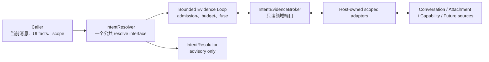

# Flowy Intent Resolution Layer 设计演进记录

> 本文保留 2026-07-28 讨论、仓库调查和多轮方案评审的完整演进过程，不再作为当前
> authoritative 规范。当前决策请从 [`../README.md`](../README.md) 开始阅读。

**日期：** 2026-07-28  
**状态：** 讨论中（已按当前仓库与职责边界收缩，document-first，尚未批准实施）  
**分支：** `feat/intent-resolution-layer`  
**当前负责人可交付范围：** 独立、无副作用、建议性的意图解析模块  
**明确不拥有：** Conversation 消息入口、消息接纳、任务创建、Agent Runtime、Agent loop、调度、执行与权限

## 1. 结论

原方案的产品方向成立，但不适合作为当前负责人的第一期实现范围。

在当前 Flowy 中，Intent Resolution Layer 不能被定义成：

- Front Door；
- Conversation Control Plane；
- Task Gate；
- Runtime Router；
- Work Dispatcher；
- 统一消息入口的 owner。

更贴合当前项目与协作边界的定义是：

> Intent Resolution 是一个可独立调用的语义分析深模块。调用方提供用户原话、有限初始上下文
> 和一个可选的 scoped read-only evidence broker；模块在严格预算内补充必要观察，并返回对用户
> 意图、目标、对象、约束、信息需要、来源与承诺强度、期望输出和建议交互方式的结构化判断。
> 输出只是一份 advisory assessment；是否调用、何时调用、是否采用以及下一步做什么，
> 全部由现有 Conversation、UI 或 Agent Runtime 的维护方决定。

因此第一期的成功标准不是“接管所有用户消息”，而是：

1. 建立一个不依赖 Conversation / Runtime 的稳定 interface；
2. 让其他维护方将来可以低成本接入、忽略、替换或灰度该模块；
3. 用评测证明它能正确理解用户，而不是证明它能控制下游；
4. 不为未来的 Control Plane 提前制造第二套 Goal、Plan、Task 或执行状态机。

## 2. 当前项目事实

### 2.1 消息入口并不统一

当前多个前端发送面分别直接调用自己的 bridge：

- Nomi SendBox；
- Nanobot SendBox；
- ACP SendBox；
- OpenClaw SendBox；
- Remote SendBox；
- 部分初始消息 hook。

后端 Conversation route 收到消息后直接调用 `ConversationService` 的幂等发送方法。
当前不存在一个由 Intent 模块拥有、并且所有人类消息天然经过的公共前置 hook。

这意味着：

- 新建 `nomifun-intent` 并不会自动成为“第一层入口”；
- 想覆盖所有人类消息，需要各入口或 Conversation owner 分别配合；
- 当前负责人不能单方面承诺“下一条用户消息一定先经过 Intent”；
- 在维护方接入前，Intent 模块只能是独立能力或 shadow analysis。

### 2.2 Conversation 发送链不能轻易插入语义调用

现有发送链包含：

- idempotency receipt；
- SQLite claim；
- generation / run identity；
- 用户消息持久化；
- WebSocket 事件；
- Runtime 获取或创建；
- 取消、审批和错误恢复语义。

在这条主链中直接插入一次 LLM 意图判断，会同时引入延迟、超时、重试和重复调用问题，
并改变其他团队维护的消息接纳语义。因此当前方案禁止修改这条主链。

### 2.3 Runtime 所有权不在 Intent 层

当前 `AgentRuntimeRegistry` 以 `conversation_id` 获取或创建 live runtime，
`ConversationRouterState` 又直接持有 Conversation service 和 runtime registry。

因此以下能力都不是 Intent 模块可以独立实现的：

- 按 Intent 或 Focus 选择 Runtime；
- 为同一 Conversation 切换多个模型 Thread；
- 暂停、继续或取消真实任务；
- 将解析结果自动转换为 Runtime action；
- 保证下游采用某个 plan / goal 流程。

### 2.4 当前 Goal / Plan 已经有多个语义

项目中至少存在：

- Nomi engine 内部的 Goal continuation；
- Plan Mode；
- `update_plan` 进度声明；
- AgentExecution 的持久化 Goal / Planning / DAG。

Intent 层只能识别“用户表达了什么目标”“用户似乎希望先规划”，不能创建第五套
Goal/Plan runtime，也不能把自己的 `GoalDraft` 当成现有 Goal 已被接受或执行。

### 2.5 当前没有统一 Task / Artifact / Focus

当前工作对象分散在 AgentExecution、Requirement、CreationTask、Workshop、
ConversationArtifact 等领域。项目也没有统一的 `ConversationFocus` 模型。

因此 Intent 层只能返回 target hints，不能假设：

- 已有统一 Task 基类；
- 已有统一 Artifact version；
- 已有可持久化 Focus；
- 可以凭 LLM 生成的 ID 访问任何对象。

## 3. 职责边界

### 3.1 Intent Resolution 拥有什么

Intent Resolution 只拥有“理解”：

- 用户这句话属于询问、讨论、工作请求、修改请求还是控制表达；
- 用户希望得到什么结果；
- 用户提到了什么目标或对象；
- 有哪些明确约束和可见假设；
- 哪些信息仍然缺失；
- 缺失信息是否会显著改变理解；
- 是否需要通过受限只读证据端口补充信息；
- 在固定预算内提出 `EvidenceRequest` 并吸收标准化 `ContextObservation`；
- 建议调用方回答、讨论、澄清、考虑规划或考虑行动。

### 3.2 Intent Resolution 不拥有什么

Intent Resolution 不拥有“决定和执行”：

- 不决定消息是否发送；
- 不阻断现有消息；
- 不创建、选择、暂停、继续或取消 Runtime；
- 不创建正式 Task、Goal、Plan 或 AgentExecution；
- 不选择任意 Runtime 工具、Provider、模型 Thread 或 capability；
- 不接触通用 Tool Registry，只能选择 Intent 领域定义的只读 `EvidenceRequest`；
- 不授予审批和执行权限；
- 不直接读写 Conversation、Task、Artifact 或 Memory 数据库；
- 不更新 Focus、Digest 或长期状态；
- 不保证任何调用方采用其输出。

### 3.3 三方所有权契约

```text
Caller / Integrator
  owns: invocation timing, initial context, scoped broker adapter, adoption policy
                       |
                       v
Intent Resolution
  owns: semantic interpretation, bounded evidence acquisition, advisory output
                       |
                       v
Intent Evidence Broker
  owns: scope enforcement, read access, normalization, truncation, audit
                       |
                       v
Conversation / Runtime Owner
  owns: message acceptance, routing, task conversion, policy, execution, receipts
```

这是当前最重要的解耦 seam。Intent 模块的稳定性来自于它只认识自己的 evidence vocabulary，
不反向依赖任何调用方的数据库、HTTP DTO、工具 schema 或 Runtime 类型。

## 4. 推荐模块

建议新增一个纯 Rust backend crate：

```text
crates/backend/nomifun-intent/
├── src/lib.rs
├── src/model.rs
├── src/resolver.rs
├── src/completeness.rs
├── src/clarification.rs
├── src/reference_hints.rs
├── src/evidence.rs
├── src/evidence_loop.rs
├── src/evidence_budget.rs
└── tests/benchmark.rs
```

可以依赖：

- workspace 基础类型；
- `serde`；
- `async-trait`；
- `thiserror`。

禁止依赖：

- 任意 `nomi-*` crate；
- `nomifun-ai-agent`；
- `nomifun-conversation`；
- `nomifun-agent-execution`；
- `AgentRuntimeRegistry` / `AgentRuntimeHandle`；
- 具体 Provider、Gateway tool schema 或 Runtime session 类型。

如果公共 HTTP DTO 确实需要进入 `nomifun-api-types`，应在确定生产接入方之后再做；
P0 没有必要先增加 wire contract。

## 5. 输入模型

调用方先把当前上下文投影为有限、可验证的 facts。若这些 facts 不足，Intent 模块可以通过
调用方提供的受限 `IntentEvidenceBroker` 获取额外观察，但不直接查询数据库或 Runtime。

```rust
pub struct ResolveIntentInput {
    pub utterance: String,
    pub source: IntentSource,
    pub surface: IntentSurface,
    pub attachments: Vec<InputReference>,
    pub context: IntentContextSnapshot,
    pub capability_summary: Option<IntentCapabilitySummary>,
    pub previous_resolution: Option<ResolutionSnapshot>,
    pub mode: ResolutionMode,
}

pub struct IntentContextSnapshot {
    pub conversation: Option<ConversationSummary>,
    pub recent_messages: Vec<MessageSummary>,
    pub facts: Vec<ContextFact>,
    pub explicit_target: Option<TargetCandidate>,
    pub pending_interaction: Option<PendingInteractionSummary>,
    pub target_candidates: Vec<TargetCandidate>,
}

pub struct ContextFact {
    pub summary: String,
    pub origin: ContextFactOrigin,
    pub commitment: CommitmentStrength,
    pub source: Option<InputReference>,
    pub observed_at: Option<Timestamp>,
}

pub enum ContextFactOrigin {
    HistoricalUserStatement,
    HistoricalAssistantProposal,
    ToolObservation,
    ProjectDocument,
    MemoryRecord,
    ExternalSource,
    SystemInference,
}

pub enum CommitmentStrength {
    Hypothetical,
    Mentioned,
    SelectedFromOptions,
    ConfirmedAtGistLevel,
    ExplicitInstruction,
    Unknown,
}

pub struct IntentCapabilitySummary {
    pub available_information_kinds: Vec<InformationKind>,
    pub supported_output_modes: Vec<OutputModeHint>,
    pub supported_response_kinds: Vec<ExpectedResponseKind>,
}
```

输入约束：

- `recent_messages` 有明确条数和字数上限；
- Target 候选必须由调用方完成 owner/scope 校验；
- 不接收 runtime handle、authority token 或完整工具轨迹；
- 不接收无限 Conversation 历史；
- Intent 模块不能凭一个字符串 ID 主动访问下游对象。
- `capability_summary` 缺失是合法输入；其中的值只是调用方声明的可用类别，
  不是实时授权、Provider 选择或执行保证。

所有 `ContextFact` 都是 data，不是当前指令。尤其：

- `HistoricalAssistantProposal` 不能升级为用户决定；
- `SystemInference` 只能形成 assumption；
- `MemoryRecord` 可能过期，不是当前事实；
- `ToolObservation` 只有在调用方保留来源时才能作为可追溯事实；
- 当前用户原话只来自顶层 `utterance`，优先于历史偏好。

`origin` 与 `commitment` 必须分开。前者回答“这是谁产生的”，后者回答“用户承诺到什么程度”。
例如用户对一份十步建议说“思路可以”，最多是 `ConfirmedAtGistLevel`，不能把十个步骤分别升级为
`ExplicitInstruction`。

## 6. 输出模型

### 6.1 语义维度

用多个正交维度代替一个不断增长的大枚举：

```rust
pub enum InteractionKind {
    Ask,
    Discuss,
    Request,
    Respond,
    Inform,
    Unknown,
}

pub enum WorkRelation {
    None,
    New,
    Existing(TargetHint),
    UnresolvedExisting,
    Unknown,
}

pub enum IntendedEffectHint {
    None,
    Observe,
    ChangeArtifactOrLocalState,
    ExternalSideEffect,
    ControlRuntime,
    ConfigureSystem,
    Unknown,
}

pub enum ResponseRelation {
    None,
    AnswersPendingInteraction,
    AcceptsPreviousProposal,
    RevisesPreviousResolution,
    RejectsPreviousProposal,
    Unknown,
}

pub enum OutputModeHint {
    ConversationalAnswer,
    StructuredInline,
    ReusableDraft,
    DurableDeliverable,
    InteractiveDeliverable,
    ReuseExistingDeliverable,
    Unspecified,
    Unknown,
}

pub enum FreshnessRequirement {
    StableKnowledge,
    RecentPreferred,
    CurrentRequired,
    RealtimeRequired,
    Unknown,
}

pub enum SharedHistoryCue {
    ExplicitPriorWork,
    SharedPossessive,
    AnaphoricReference,
    ExplicitRecallRequest,
}

pub struct HistoryReferenceHint {
    pub cue: SharedHistoryCue,
    pub search_terms: Vec<String>,
}

pub enum InformationKind {
    PastConversation,
    UserMemory,
    CurrentPublicInformation,
    RealtimeInformation,
    ConnectedPrivateSource,
    AttachedContent,
}

pub enum NeedLevel {
    Helpful,
    Required,
}

pub struct InformationNeed {
    pub kind: InformationKind,
    pub level: NeedLevel,
    pub query_terms: Vec<String>,
    pub reason: String,
}

pub enum ClaimOrigin {
    CurrentUtterance,
    ContextFact(ContextFactOrigin),
    ResolverInference,
}

pub enum IntentEvidence {
    UtteranceSpan { start: usize, end: usize },
    ContextFactIndex(usize),
    InputReference(InputReference),
}

pub struct IntentClaim<T> {
    pub value: T,
    pub origin: ClaimOrigin,
    pub commitment: CommitmentStrength,
    pub evidence: Vec<IntentEvidence>,
}
```

`IntendedEffectHint` 只是风险和效果提示，不是现有 Policy 的替代品。
`InformationNeed` 表达“回答或规划还需要哪类信息”。在证据预算和准入规则允许时，
resolver implementation 可以把它转换为自己的只读 `EvidenceRequest`；最终仍未满足的 need
才保留在输出中。它绝不是搜索数据库、读取 Memory、调用 Connector 或访问任意路径的直接命令。

### 6.2 Advisory resolution

```rust
pub struct IntentResolution {
    pub interaction: InteractionKind,
    pub work_relation: WorkRelation,
    pub intended_effect_hint: IntendedEffectHint,
    pub response_relation: ResponseRelation,
    pub output_mode_hint: OutputModeHint,
    pub freshness_requirement: FreshnessRequirement,
    pub history_reference_hint: Option<HistoryReferenceHint>,
    pub information_needs: Vec<InformationNeed>,
    pub goal_draft: Option<IntentClaim<GoalDraft>>,
    pub deliverable_hints: Vec<IntentClaim<DeliverableHint>>,
    pub target_hints: Vec<IntentClaim<TargetHint>>,
    pub constraints: Vec<IntentClaim<IntentConstraint>>,
    pub assumptions: Vec<IntentAssumption>,
    pub missing_information: Vec<MissingInformation>,
    pub suggested_handling: SuggestedHandling,
    pub clarification_draft: Option<ClarificationDraft>,
    pub task_brief_draft: Option<TaskBriefDraft>,
    pub planning_assessment: Option<PlanningAssessment>,
    pub confidence: IntentConfidence,
    pub diagnostics: ResolutionDiagnostics,
}

pub enum SuggestedHandling {
    Respond,
    Discuss,
    Clarify,
    PlanningMayHelp,
    ActionMayBeRequested,
    ControlIntentDetected,
    UnsupportedOrUnknown,
}

pub struct PlanningAssessment {
    pub planning_may_help: bool,
    pub information_sufficient_for_planning: bool,
    pub reasons: Vec<PlanningReason>,
    pub blocking_gaps: Vec<MissingInformation>,
}

pub struct ClarificationDraft {
    pub question: String,
    pub expected_response: ExpectedResponseKind,
    pub options: Vec<ClarificationOption>,
}

pub enum ExpectedResponseKind {
    FreeText,
    SingleSelect,
    MultiSelect,
}

pub struct ClarificationOption {
    pub id: String,
    pub label: String,
}
```

命名必须持续强调建议性：

- 使用 `IntentResolution`，不使用 `EntryDecision`；
- 使用 `SuggestedHandling`，不使用 `EntryDisposition`；
- 使用 `GoalDraft`，不使用 `AcceptedGoal`；
- 使用 `TargetHint`，不使用已解析的权威 Target；
- 使用 `ClarificationDraft`，不表示系统一定要提问。

### 6.3 为什么移除 Task Gate

原方案的 `Task Gate` 会让模块看起来拥有“是否执行、是否路由、是否拦截”的裁决权，
与当前负责人权限不符。

模块内部仍可有纯函数 `CompletenessAssessor`：

```rust
pub trait CompletenessAssessor {
    fn assess(&self, draft: &ResolvedIntentDraft) -> CompletenessAssessment;
}
```

它只判断理解是否完整、哪些信息关键，不决定真实下一步。

## 7. Interface 与 adapter seam

外部 interface 保持一个主方法：

```rust
pub struct ResolveIntentRequest<'a> {
    pub input: ResolveIntentInput,
    pub evidence: &'a dyn IntentEvidenceBroker,
}

#[async_trait]
pub trait IntentResolver: Send + Sync {
    async fn resolve(
        &self,
        request: ResolveIntentRequest<'_>,
    ) -> Result<IntentResolution, IntentResolutionError>;
}
```

不需要外部证据时传入 `NoEvidenceBroker`。真实 adapter 必须由调用方按当前用户、
Conversation 和 Project 预先限定 scope；LLM 既看不到也不能修改该 scope。

Intent crate 定义一个很小的 evidence seam：

```rust
#[async_trait]
pub trait IntentEvidenceBroker: Send + Sync {
    async fn observe(
        &self,
        request: EvidenceRequest,
    ) -> Result<ObservationBatch, EvidenceError>;
}

pub enum EvidenceRequestKind {
    SearchPastConversations { terms: Vec<String> },
    ResolveLogicalResource { mention: String, kinds: Vec<ResourceKindHint> },
    ReadSourceSlice { resource: ResourceRef, locator: SliceLocator },
    SearchCapabilityMetadata { query: String },
    ReadResourceStatus { resource: ResourceRef },
}

pub struct EvidenceRequest {
    pub request_id: EvidenceRequestId,
    pub kind: EvidenceRequestKind,
    pub reason: String,
    pub max_items: usize,
}

pub struct ContextObservation {
    pub observation_id: ObservationId,
    pub kind: ObservationKind,
    pub summary: String,
    pub resource_refs: Vec<ResourceRef>,
    pub evidence: Vec<IntentEvidence>,
    pub origin: ContextFactOrigin,
    pub sensitivity: SensitivityHint,
    pub observed_at: Option<Timestamp>,
    pub truncated: bool,
}
```

`IntentEvidenceBroker` 是领域端口，不是通用工具执行 interface：

- 没有任意 tool name；
- 没有 JSON tool schema；
- 没有数据库查询字符串；
- 没有文件系统路径；
- 没有 Provider、credential 或 authority 参数；
- 没有写、发送、创建、取消、发布或执行 variant。

host adapter 负责把请求翻译为真实 Conversation 搜索、附件解析或能力目录查询，
并负责 scope、敏感度、截断、审计和失败降级。Intent crate 只接收标准化 observation。

内部的语义解释器同样只返回 draft：

```rust
#[async_trait]
pub trait IntentSemanticInterpreter: Send + Sync {
    async fn interpret(
        &self,
        input: SemanticIntentInput,
    ) -> Result<ResolvedIntentDraft, SemanticInterpretationError>;
}
```

至少提供：

1. `DeterministicIntentInterpreter`：处理明确规则、测试和无模型降级；
2. `FakeIntentInterpreter`：契约测试；
3. `LlmIntentInterpreter`：未来由宿主 adapter 提供，不进入核心 crate。

resolver implementation 可以包含一个专用、短回合的 evidence acquisition loop：

```text
deterministic prepass
  -> semantic draft
  -> unresolved InformationNeed
  -> deterministic evidence admission
  -> IntentEvidenceBroker.observe
  -> merge ContextObservation
  -> one refinement pass
  -> validate and finalize IntentResolution
```

它不是通用 Agent loop：没有 session、message persistence、tool registry、delegation、approval、
plan mode 或任务执行。默认预算应保持很小，并由 benchmark 校准：

- 普通消息 0 次 evidence request；
- 最多 2 轮 acquisition；
- 默认最多 3 个 request；
- observation 总字符数有硬上限；
- 重复规范化查询、连续空结果或无新增 evidence 立即熔断；
- 预算耗尽时返回 provisional resolution 和未满足的 `InformationNeed`，不自动无限询问。

如果将来需要复用现有模型 Provider，应由 `nomifun-ai-agent` 维护者提供 one-shot adapter
或批准一个独立适配层。当前负责人不复制 Provider 配置，也不修改 Agent loop。

## 8. 失败语义

`nomifun-intent` 是库，不是现有发送链的 owner，因此 core 不应该返回
`LegacyPassthrough`。Passthrough 是调用方的集成策略。

Core 的失败语义只需要：

```rust
pub enum IntentResolutionError {
    InvalidInput,
    InterpreterUnavailable,
    Timeout,
    InvalidStructuredOutput,
    InvalidEvidenceContract,
    Internal,
}
```

普通 evidence failure 不应升级为整个 resolution failure。`Unavailable`、`Denied`、`NotFound`、
`Truncated` 和 `BudgetExhausted` 应保留在 diagnostics 与未满足的 `InformationNeed` 中，
只有 broker 返回越权引用、非法结构或违反 scope 的结果才是 `InvalidEvidenceContract`。

调用方可以选择：

- 忽略错误并继续原有发送路径；
- 记录本地 shadow diagnostics；
- 展示“当前未能生成意图简报”；
- 在自己拥有的流程中重试。

Intent 模块不应知道消息是否发送成功，也不应实现发送 fallback。

## 9. 接入模型

### P0：完全独立

```text
offline cases / unit tests
          |
          v
IntentResolver -> IntentResolution
```

无 production route、无 UI、无数据库、无 Runtime、无消息拦截。

### P1：可选 shadow / advisory

```text
Existing caller
   |---------------------------> existing send path
   |
   +---- optional copy -------> IntentResolver
                                  |
                                  v
                           advisory result
```

P1 的约束：

- Intent 调用不能成为消息发送成功的前置条件；
- Intent 超时不能阻断原路径；
- 结果默认只用于本地诊断或可关闭的 preview；
- 不自动创建 Task，不自动 dispatch；
- 是否调用由每个入口的 owner 决定；
- 是否展示或采用结果由产品/调用方决定。

### P2：由其他 owner 消费

未来如果 Conversation 或 Runtime owner 同意接入，可以由其实现 adapter：

```text
IntentResolution
      |
      v
owner-provided policy / adapter
      |
      +--> ask user
      +--> show task brief
      +--> construct existing Goal/Task input
      +--> continue existing runtime
```

这个 policy / adapter 不属于 `nomifun-intent`。

## 10. Goal 与 Plan 流程的准确关系

Intent Resolution 可以识别：

- 用户是否表达了目标；
- 目标草案是什么；
- 用户是否明确要求“先讨论”“先规划”“直接执行”；
- 当前信息是否足以形成更正式的 Goal 或 Plan；
- 用户是否像是在接受、修改或撤回上一轮建议。

Intent Resolution 不能保证：

- 下游一定进入 Goal mode；
- 下游一定调用 `update_plan`；
- Plan Mode 被开启；
- AgentExecution Goal / DAG 被创建；
- “可以，执行吧”自动转化为 runtime continuation；
- “停止”真实取消了某个任务。

所以当前层与 Goal/Plan 的关系是：

```text
User utterance
  -> IntentResolution
       goal_draft
       information_needs
       planning_preference
       missing_information
       claim provenance
       suggested_handling
  -> owner-provided integration (future)
  -> existing Goal / Plan / Runtime semantics
```

Intent 输出只能成为现有流程的输入建议，不能成为新的流程权威。

## 11. 对原 Conversation Control Plane 方案的判断

以下产品方向仍然合理：

- 用户只面对一个连续的 Flowy；
- Conversation、Task、Artifact 提供业务连续性；
- 模型 Thread 是可替换的推理资源；
- 未来可以有 Focus、Digest、Context Compiler 和结果回执；
- 不同执行上下文不应无限污染主对话。

但这些能力需要多个 owner 协作，并触及当前负责人无权控制的区域：

| 长期能力 | 当前缺口或依赖 |
| --- | --- |
| 所有消息统一经过入口 | 多个 SendBox 与 bridge 需要迁移 |
| Conversation Focus | 新领域模型、持久化和并发语义 |
| 多 Task / Artifact 关联 | 当前对象模型分散 |
| Context Compiler | 各 Agent engine / runtime 的 prompt 和 session 语义 |
| Thread 选择与恢复 | `AgentRuntimeRegistry` 和 runtime 生命周期 |
| Work Dispatcher | 各下游 Task / Control interface |
| 统一结果回执 | 当前多种事件与结果协议 |

因此正确的长期分层是：

```text
Intent Resolution                 current owner can build
        |
        v
Reference / Focus Resolution      future domain owners
        |
        v
Interaction Policy / Task Gate    future conversation owner
        |
        v
Work Dispatcher                   future runtime/task owners
        |
        v
Existing Runtime / Agent loop     existing owners
```

Intent Resolution 可以为这些模块提供稳定输入，但不能把它们收进自己的 crate。

## 12. 分阶段交付

### P0：领域契约与评测

交付：

- `nomifun-intent` crate；
- 输入、draft、resolution 和 error 类型；
- `IntentResolver` 与 `IntentSemanticInterpreter` interface；
- deterministic completeness / clarification rules；
- history cue、information need、output lifecycle、freshness 和 claim provenance 规则；
- clarification expected-response contract；
- `IntentEvidenceBroker`、`NoEvidenceBroker` 和 `FakeEvidenceBroker`；
- bounded evidence loop、budget、admission 与 fuse；
- 标准化 `ContextObservation`；
- fake / deterministic interpreter；
- table-driven benchmark；
- 依赖方向检查；
- 架构说明和 owner integration guide。

首批识别：

- 普通问答；
- 讨论而非执行；
- 新工作请求；
- 修改已有工作的表达；
- 暂停/继续/取消的表达意图；
- 目标或对象不明确；
- 用户显式“先讨论”“先规划”“不要修改”；
- 多轮补充或纠正上一轮理解；
- 对过去工作的明确语言线索；
- 对话内回答、独立成果与外部行动的区别；
- 稳定知识、当前信息与实时信息的区别；
- 用户历史确认、助手历史建议和系统推断的来源区别；
- 来源与承诺强度的区别；
- 需要某类信息与实际读取该信息的区别。

P0 不交付：

- production route；
- UI；
- 数据库；
- 真实 Conversation / Memory / Web / Artifact adapter；
- Task Gate；
- dispatch；
- 真实 Runtime control；
- 持久 Intent State；
- Focus / Thread routing。

### P1：可选 shadow adapter

前提：必须有一个具体入口 owner 同意接入。

可以交付：

- 独立 resolve route，或入口 owner 提供的 host adapter；
- 由对应 owner 提供的第一个 scoped read-only evidence adapter；
- 不阻断发送的 shadow 调用；
- 本地 diagnostics；
- 可关闭的 Intent / Task Brief preview。

不能交付：

- 拦截发送；
- 直接复用 `nomi-tools::ToolRegistry` 或向 Intent 暴露任意 Runtime 工具；
- 自动执行；
- 自动转换成 Goal/Plan；
- 声称所有消息已统一接入；
- 绕过现有审批和权限。

### P2 以后：协作项，不属于当前模块承诺

- Intent revision 持久化；
- 正式 Goal/Task 转换；
- Focus 和引用解析；
- Conversation Digest / Focus Digest；
- Context Compiler；
- Runtime / Thread routing；
- 统一 Work Receipt。

每一项都需要对应 owner、数据库或 runtime 的单独设计评审。

## 13. 验收标准

### 架构

- `nomifun-intent` 不依赖 `nomi-*`、Conversation、AgentExecution 或 Runtime；
- Resolver 测试不创建 Runtime、不写数据库，只执行 fake/no-op evidence broker；
- fake interpreter 可以覆盖完整 interface；
- fake broker 可以验证 request admission、预算、熔断和 observation 合并；
- 调用方可以忽略 `IntentResolution` 而不破坏原流程；
- 删除任何 host adapter 不影响核心 crate；
- core 类型中不存在 dispatch、approval、runtime、thread authority。

### 行为

- “先说想法，不要改代码”识别为 `Discuss`，建议 handling 不得表示已经执行；
- “可以，执行吧”结合上一份 resolution 识别为接受/行动表达，但不声称已 dispatch；
- “停一下”识别为控制意图；目标不唯一时提供澄清草案，但不真实取消任务；
- “什么是毛利率”不生成任务执行建议；
- “帮我处理一下这个”在无附件或候选对象时标记关键缺失；
- “继续我们之前的季度汇报”输出 history cue；有 scoped broker 时最多发出受限历史查询，
  无 broker 时保留未满足的 `InformationNeed`；
- “写一份可以发给董事会的报告”输出 deliverable hint，但不创建真实 Artifact；
- “目前谁是该公司的 CEO”输出 `CurrentRequired`；只有未来存在 safe-web broker adapter
  且 admission 允许时才获取证据，否则保留 current information need；
- 历史中的助手建议不得被输出为用户已确认约束；
- 当前用户明确要求必须覆盖冲突的历史 Memory 偏好；
- structured output 非法时返回明确 error，由调用方决定是否 passthrough；
- Critical 缺失最多生成一个最小澄清草案；
- HighImpact 缺失给出可见默认假设，不形成长问题清单；
- 普通问答不得产生 evidence request；
- 重复查询、连续空结果和预算耗尽必须确定性终止；
- broker 返回的 logical ref 必须经过 scope 校验，模型生成的任意 ID 不得直接读取。

### 评测指标

- Interaction Accuracy；
- Goal Draft Accuracy；
- Target Hint Precision / Recall；
- Evidence Request Precision；
- Unnecessary Evidence Request Rate；
- Evidence-assisted Resolution Gain；
- Evidence Budget Exhaustion Rate；
- P50 / P95 added latency；
- Clarification Precision / Recall；
- Over-asking Rate；
- False Action Suggestion Rate；
- History Cue Precision / Recall；
- Output Mode Accuracy；
- Freshness Requirement Accuracy；
- Provenance Upgrade Violation Rate；
- User Correction Rate；
- Intent Convergence Turns。

P0 优先：

1. False Action Suggestion Rate；
2. Provenance Upgrade Violation Rate；
3. User Correction Rate；
4. Over-asking Rate。

### 仓库

- `cargo test -p nomifun-intent`；
- `cargo check -p nomifun-intent`；
- 涉及公共 DTO 后检查相应 crate；
- 涉及前端后运行 `bun run typecheck` 和最小相关测试；
- 广泛接入前运行 `cargo check --workspace` 与 `bun run check`；
- `.github/workflows/` 下不得出现 `.yml` 或 `.yaml`。

## 14. 明确禁止

- 不把 Intent prompt 塞进现有 Agent system prompt 后声称完成了解耦；
- 不让 Intent Resolver 持有或创建 Agent Runtime；
- 不在 Conversation send 主函数中直接插入一次 LLM 调用；
- 不把 `SuggestedHandling` 当成 dispatch command；
- 不让 LLM 输出成为权限、审批或 capability claim；
- 不复制 Provider 配置或 Agent loop 到新 crate；
- 不让 `nomifun-intent` 依赖 `nomi-tools`、`ToolRegistry` 或任意 MCP tool schema；
- 不构建第二套 Goal、Plan、Task 或 AgentExecution 状态机；
- 不让 Intent 模块绕过 `IntentEvidenceBroker` 直接查询 Conversation / Task / Artifact 数据库；
- 不允许 evidence request 携带文件系统路径、SQL、credential、authority token 或任意 tool name；
- 不将 Thread ID 作为 Intent 领域身份；
- 不承诺当前负责人无法控制的全入口覆盖率；
- 不把 future Control Plane 空壳塞进 `nomifun-intent`；
- 不创建或恢复 GitHub Actions workflow。

## 15. 当前决策与待协调项

### 已收敛

- 产品名使用 Flowy；
- 能力名使用 Intent Resolution；
- 当前模块是 advisory semantic module，不是 Front Door 或 Control Plane；
- module 可以通过 host-owned scoped broker 做严格预算内的只读 evidence acquisition；
- Intent 只认识 `EvidenceRequest` / `ContextObservation`，不认识真实工具和存储类型；
- 移除当前范围内的 Task Gate / EntryDecision 权威语义；
- P0 不接生产消息链；
- P0/P1 不修改现有 Agent Runtime；
- Goal / Plan 只作为意图草案，不归当前模块执行；
- 每条消息是否调用 Intent 由入口 owner 决定；
- Runtime owner 决定是否以及如何消费结果。

### 待协调

1. 是否批准先做 P0 crate、fake/no-op evidence adapter、bounded loop 和 benchmark；
2. 谁是第一个愿意接入 shadow resolution 的入口 owner；
3. one-shot semantic adapter 由谁维护；
4. P1 输出只做 diagnostics，还是展示用户可见 preview；
5. 谁拥有未来的 Interaction Policy / Task Gate；
6. Intent revision 何时需要持久化，以及由哪个领域拥有。
7. Conversation owner 是否愿意提供首个 `SearchPastConversations` scoped adapter。

## 16. 推荐下一步

当前负责人可以直接做的只有 P0：

1. 评审本文的职责边界；
2. 实现 `nomifun-intent` contract、fake/no-op broker 与 bounded evidence loop；
3. 建立包含 evidence acquisition 的真实语料 benchmark；
4. 用依赖测试证明它与 Conversation / Runtime 完全隔离；
5. 输出一份 host integration guide；
6. 再找一个入口 owner 协调 P1 shadow adapter。

在入口 owner、Conversation owner 或 Runtime owner 明确参与前，不实现：

- 消息拦截；
- Task Gate；
- Goal/Plan 转换；
- Runtime control；
- Focus；
- Context Compiler；
- Thread routing；
- 持久化。

## 17. 第三份“Intent & Context Control Plane”方案评审

### 17.1 总体判断

这份方案包含一批很好的产品原则和评测思想，但它描述的是一个跨 Conversation、
Task、Artifact、Context、Policy 和 Runtime 的上层控制系统，不是当前负责人可以独立完成的
Intent Resolution 模块。

正确的借鉴方式不是把整套 Front Door 搬进 `nomifun-intent`，而是：

1. 将纯语义判断收进 Intent module 的 implementation；
2. 将需要外部状态的内容改成调用方提供的 facts；
3. 将“控制决定”降级成 advisory assessment；
4. 将 Conversation、Context 和 Runtime 能力留给各自 owner；
5. 将好场景和好指标大量吸收到 benchmark。

### 17.2 可以直接借鉴到 P0

| 原方案概念 | P0 中的正确落点 | 调整 |
| --- | --- | --- |
| Input Normalizer | Resolver implementation 内部的确定性预处理 | 不单独暴露 public interface，不读取外部状态 |
| Interaction Resolver | `pending_interaction` 与当前表达的关系判断 | Pending Interaction 必须由调用方提供 |
| Intent Resolver | `IntentResolver::resolve` 的核心实现 | 保留 |
| 缺失字段四级 | `MissingInformation.importance` | 用于生成澄清草案，不决定真实阻断 |
| 最少提问 | `ClarificationDraft` | 一次优先一个关键问题 |
| `should_plan` / `can_plan_now` 分离 | advisory `PlanningAssessment` | 不命名为 Plan Gate，不生成或启动真实 Plan |
| 顶层类别保持稳定 | benchmark 场景与多维语义模型 | 不直接采用混合维度的 `EntryIntent` |
| UI 显式上下文优先 | `IntentContextSnapshot` 输入规则 | UI 已知事实不让模型重新猜 |
| 新对话不自动继承旧任务 | host integration guide 的默认原则 | Intent module 自己不能创建或清空 Conversation Focus |
| Fresh-Agent Readiness | Task Brief / handoff 质量评测思想 | P0 只评测信息充分性，不产生可执行权威 |

本文第 6.2 节因此补充了纯 advisory 的 `PlanningAssessment`。它表达
“从当前理解看是否值得规划、信息是否足够”，但不：

- 打开 Plan Mode；
- 调用 `update_plan`；
- 创建 AgentExecution Planning；
- 生成可执行计划；
- 阻止调用方继续原流程。

### 17.3 `EntryIntent` 不应原样采用

原方案的：

```rust
pub enum EntryIntent {
    Conversation,
    ReadOnlyInquiry,
    NewTask,
    ExistingTaskMutation,
    RuntimeControl,
    SystemConfiguration,
    InteractionResponse,
    Unknown,
}
```

混合了至少四种不同问题：

- 表达方式：Conversation / InteractionResponse；
- 工作关系：NewTask / ExistingTaskMutation；
- 预期效果：ReadOnlyInquiry / RuntimeControl；
- 系统领域：SystemConfiguration。

这会导致组合场景难以表达，例如：

- 用户回复上一轮问题，同时要求修改已有 Artifact；
- 用户讨论一个可能产生外部副作用的新任务，但明确要求暂不执行；
- 用户询问当前 Runtime 状态，并没有要求控制 Runtime。

因此继续使用本文的正交维度：

```text
InteractionKind
+ WorkRelation
+ IntendedEffectHint
+ ResponseRelation
```

原方案的样本非常适合进入 benchmark，但不适合作为一个权威大枚举。

### 17.4 Decision Payload 值得保留为未来独立模块

“长任务应保留仍会影响下一步决策的目标、事实、证据、边界和第一行动，而不是完整聊天历史”
是这份方案最有价值的长期原则。

但完整 `DecisionPayload` 需要知道：

- 已完成动作；
- 当前状态；
- 已确认事实和证据；
- 被排除的假设；
- 权限和风险；
- Artifact / Task 状态；
- 下一条可执行行动。

Intent Resolver 并不拥有这些事实，也无法验证它们，因此不能生成权威
`DecisionPayload`。建议未来建立独立的 Handoff / Context module，由各领域 owner 提供事实。

P0 最多返回一个不带执行权威的草案：

```rust
pub struct IntentBriefDraft {
    pub goal_draft: Option<GoalDraft>,
    pub deliverable_hints: Vec<DeliverableHint>,
    pub target_hints: Vec<TargetHint>,
    pub constraints: Vec<IntentConstraint>,
    pub assumptions: Vec<IntentAssumption>,
    pub missing_information: Vec<MissingInformation>,
}
```

不得放入：

- `completed_actions`；
- `permissions`；
- `confirmed_facts`（除非是调用方提供并原样携带的 facts）；
- `first_action`；
- `readiness = executable`。

### 17.5 Context Admission 的原则可借鉴，决定权不可借鉴

值得保留的集成原则：

```text
用户显式引用
>
UI 显式绑定
>
待处理 Interaction
>
调用方提供的当前对象
>
唯一高置信度候选
>
仅语义相似
```

以及：

- 仅语义相似不自动绑定；
- 多候选接近时生成一个消歧问题；
- 跨项目敏感上下文不自动注入；
- 新对话默认不继承旧 Task。

但 `ContextAdmissionDecision::Attach` 会修改 Conversation / Focus 语义，
不属于 Intent module。Intent module 最多返回：

```rust
pub struct ContextAssessment {
    pub likely_target: Option<TargetHint>,
    pub ambiguous_candidates: Vec<TargetHint>,
    pub missing_context: Vec<ContextGap>,
    pub clarification_draft: Option<ClarificationDraft>,
}
```

是否 Attach、加载哪些历史、是否 StartUnbound，仍由 Conversation / Context owner 决定。

### 17.6 不进入当前模块的内容

以下内容不是“晚一点完善 Intent”这么简单，而是属于其他领域：

| 内容 | 正确 owner |
| --- | --- |
| Main Agent Front Door / 统一入口 | Conversation / product orchestration |
| Conversation State / Focus | Conversation domain |
| Intent State Store 与 revision 持久化 | 未来 Intent state owner，需要 migration |
| Evidence Ledger | Task / research / execution evidence domain |
| Decision Log | Task / project state domain |
| Context Admission Controller | Conversation / context orchestration |
| Decision Payload Compiler | Handoff / context module |
| Response Presenter | UI / Conversation |
| Capability Matcher / Preflight | Capability registry / runtime integration |
| Plan Gate | Conversation / planning integration |
| `ModifyArtifact` / `ExecuteControlCommand` | Artifact / Runtime owner |
| Thread 创建、切换和 Capsule | Agent Runtime owner |
| 所有新增 SQLite 表 | 各领域 owner 与 DB migration 评审 |

尤其不能采用原方案的 `frontdoor.handleMessage`。它会让新 module 同时承担消息保存、
状态加载、引用解析、策略、持久化、计划和路由，interface 与 implementation 同样庞大，
形成浅模块和新的耦合中心。

`nomifun-intent` 对外仍只保留一个深 interface：

```rust
IntentResolver::resolve(request) -> IntentResolution
```

Input Normalizer、Completeness Assessor、Clarification Planner 和
Planning Assessor 都应优先作为 implementation 内部 seam，不扩展成十几个公共方法。

### 17.7 可以直接吸收的评测内容

第三份方案最适合立刻贡献给 P0 的，是以下评测场景和指标：

- 普通问答与工作请求区分；
- 修改已有成果与创建新任务区分；
- Runtime 控制表达检测；
- Interaction response 检测；
- 模糊引用；
- 全新无关话题；
- 附件与 UI 显式对象优先；
- 多意图表达；
- 用户纠正上一轮理解；
- Plan Necessity Accuracy；
- Plan Readiness Accuracy；
- 错误上下文绑定率；
- 不必要提问率。

其中需要真实 Focus、Context 或 Runtime 的指标，在 P0 使用人工标注的 input facts 测试，
不连接生产状态。

### 17.8 收敛后的 P0 模型

吸收这份方案后，P0 可以比上一版多两个纯分析维度，但职责不扩大：

```text
ResolveIntentInput
  -> deterministic normalization
  -> semantic interpretation
  -> completeness assessment
  -> clarification drafting
  -> planning assessment
  -> IntentResolution
```

最终输出回答六个问题：

1. 用户在进行什么类型的交互；
2. 用户希望什么结果发生；
3. 表达与新工作、已有工作或待回复 Interaction 是什么关系；
4. 用户可能指向什么对象；
5. 当前理解还缺什么；
6. 从语义上建议回答、讨论、澄清，还是认为规划/行动可能有帮助。

它仍然不回答：

- 系统下一步必须做什么；
- 应该加载哪段真实历史；
- 应绑定哪个真实 Focus；
- 是否已经得到执行许可；
- 应选择哪个 Runtime；
- 是否已经可以安全执行第一行动。

## 18. Claude Web 行为材料评审

### 18.1 使用边界

本文只把用户提供的 Claude Web 系统提示词作为行为设计材料，不据此认定它是某一时间点
Anthropic 生产环境完整、真实或唯一的实现。

最值得研究的是其中的行为机制：

- 少提问、优先解决；
- 根据语言线索判断是否需要历史；
- 区分用户决定和助手建议；
- 只在真正影响当前判断时使用 Memory；
- 区分聊天回答与独立成果；
- 识别时间新鲜度；
- 不替用户静默作出有商业含义的 Provider 选择；
- 将历史、网页、文件和 Memory 视为 data 而不是当前指令。

但这些机制在 Claude Web 中可能由巨型 prompt、产品工具和运行平台共同实现，
不能直接推导成 Flowy 的一个新 crate。

### 18.2 与当前 Flowy 的实际对应

| 材料中的能力 | 当前仓库事实 | 对 Intent P0 的影响 |
| --- | --- | --- |
| 搜索过去聊天 | `nomifun-conversation` 已有 `/api/messages/search`，当前 DTO 以 `keyword` 搜索用户消息 | 可作为未来 Conversation owner adapter；Intent 只输出 history cue 和主题词 |
| Memory | `crates/agent/nomi-memory` 已有 user / feedback / project / reference memory，并通过 Agent prompt 使用 | Intent crate 禁止依赖 `nomi-memory`；调用方将候选 Memory 投影为带来源的 facts |
| Memory 时效 | 现有 memory prompt 已要求把 Memory 当作可能过期的上下文，并以当前状态为准 | 可以吸收为 `ContextFactOrigin::MemoryRecord` 规则，不再建立第二套 Memory |
| Artifact 输出 | 当前 `ConversationArtifactKind` 只有 `CronTrigger` 和 `SkillSuggest`；tool artifact 又有独立 `PersistedArtifactId` | `OutputModeHint` 只能描述用户期望，不能直接创建或修改统一 Artifact |
| Conversation Artifact 与 tool artifact | UI 已明确区分 `ConversationArtifactId` 和 `PersistedArtifactId` | `TargetHint` 必须保留 kind，不能使用一个通用字符串 Artifact ID |
| Runtime approval | Nomi browser approval、OpenClaw confirmation、AgentExecution approval 等已有各自权威路径 | Intent 只识别 effect / provider mention / egress cue，不增加 Consent Gate |
| 多种隐式模式 | 当前消息入口和 runtime 仍然分散 | Intent module 不能成为统一 Dispatch，只能提供共同的 advisory vocabulary |

因此该材料确实能优化 Intent 的“理解维度”，但不能扩大它的生产控制权。

### 18.3 可直接吸收到 P0 的五项优化

#### A. History Cue，不是 History Retrieval

Intent 可以检测：

- “继续我们之前的季度汇报”；
- “你上次建议的方案”；
- “我的那个项目”；
- “回顾一下我们之前的讨论”。

并返回：

```rust
HistoryReferenceHint {
    cue: SharedHistoryCue::ExplicitPriorWork,
    search_terms: vec!["季度汇报"],
}
```

Intent 不直接调用 `/api/messages/search`，也不决定匹配结果是否绑定。未来的 Conversation owner
可以提供 scoped broker adapter，把 `SearchPastConversations` 翻译为该现有能力。搜索词应尽量使用
实际主题、对象名和专有名词，而不是“之前”“昨天”“讨论”等元词。

#### B. Claim provenance

第 5 节把 `ContextFactOrigin` 与 `CommitmentStrength` 分开，用于防止来源和承诺程度同时升级：

```text
HistoricalUserStatement + ExplicitInstruction
  -> 可以支持“用户曾明确要求”

HistoricalUserStatement + ConfirmedAtGistLevel
  -> 只能支持“用户认可了总体方向”

HistoricalAssistantProposal + 任意 commitment
  -> 只能支持“助手曾建议”

ToolObservation + source
  -> 可以支持“工具曾观察”

SystemInference
  -> 只能形成 assumption
```

Intent module 不维护 Decision Log，但其输出必须保留输入来源，不能把：

```text
助手建议 10 页
+ 用户说“继续”
```

自动重写为：

```text
用户明确决定所有 PPT 都是 10 页
```

#### C. Output mode 是独立意图维度

相同主题可能要求不同输出：

```text
“解释季度汇报应该怎么写”
-> ConversationalAnswer

“列一个季度汇报结构”
-> StructuredInline

“写一份我可以继续编辑的汇报草稿”
-> ReusableDraft

“生成一份可以发给董事会的正式汇报”
-> DurableDeliverable

“把它发给董事会”
-> ReuseExistingDeliverable
   + IntendedEffectHint::ExternalSideEffect
```

`OutputModeHint` 只描述用户期望。当前 Flowy 没有统一 Artifact 创建 interface，
所以 Intent 不把它转换为真实 Artifact action。

#### D. Freshness 是约束，不是 Web Search command

```text
“什么是 RAG”
-> StableKnowledge

“目前主流的 RAG 框架”
-> CurrentRequired

“刚才比赛结果”
-> RealtimeRequired
```

`FreshnessRequirement` 告诉调用方静态知识是否可能不够，但不决定使用 Web、Connector
或实时 Provider，更不自行发起网络请求。

#### E. 当前表达优先于历史偏好

优先级：

```text
当前用户明确约束
>
当前 UI 明确选择
>
当前附件和已验证 facts
>
历史用户确认
>
Memory / 历史陈述
>
助手建议
>
系统推断
```

例如 Memory 中记录“偏好简短回答”，用户本轮明确要求详细分析时，以当前表达为准。

### 18.4 Clarification Planner 的可借鉴范围

“先解决、少提问”非常适合作为 P0 行为原则：

```text
已明确
-> 不问

可安全推断
-> 使用可见 assumption

会改变方向
-> 给出推荐默认值或一个简短选择

阻塞理解
-> 只生成一个最重要问题
```

但在询问前主动读取 Project、Past Chat、Memory 和 Artifact，需要其他 owner 提供检索能力。
P0 的准确规则是：

> 在询问前，先穷尽调用方已经提供的有限 facts；Intent module 不自行扩大检索范围。

`ClarificationDraft` 可以包含结构化选择，但只有调用方提供了已校验候选项时才允许生成选项，
不能让模型编造 Provider、Task 或 Artifact 候选。

### 18.5 不采用 `FrontDoorDecision`

材料建议的 `FrontDoorDecision` 同时包含：

- 用户语义；
- 历史和 Memory 检索命令；
- Grounding 来源选择；
- Planning 决定；
- Consent / Risk 决定；
- Capability 路由；
- 下一步 Dispatch。

它会把多个 owner 的事实和权力混入一个对象。调用方一旦依赖它，就会默认 Intent module
有权要求搜索、加载、规划、审批和调度。

更合理的拆分是：

```text
IntentResolution                 nomifun-intent owns
  - semantic dimensions
  - history/output/freshness hints
  - completeness
  - clarification draft
  - planning assessment

ContextAcquisitionPlan           Conversation / Context owner
  - search past chats
  - retrieve memory
  - load project/task state
  - admit context

PolicyDecision                   existing Runtime / Policy owner
  - approval
  - provider consent
  - data egress
  - capability authority

DispatchDecision                 Conversation / Task / Runtime owner
  - answer
  - create or mutate artifact
  - execute control
  - start work
```

只有第一个对象属于当前负责人。

### 18.6 Provider 和权限的准确落点

材料提出的“不能替用户选择具有商业含义的第三方服务”是正确的产品原则，
但 `Provider Consent Gate` 不应进入 Intent crate。

Intent 可以做：

- 提取用户明确点名的 Provider，作为 `IntentConstraint`；
- 识别可能涉及外部服务或数据外发的 `IntendedEffectHint`；
- 在 diagnostics 中说明该结论来自哪段用户表达。

Intent 不能做：

- 判断当前 Provider 是否已经授权；
- 读取 Credential；
- 将历史偏好等同于当前 consent；
- 绕过现有 confirmation；
- 选择真实 Provider；
- 发放 capability lease。

现有 Runtime / approval 路径继续保持最终权威。

### 18.7 Context trust 的准确落点

“过去聊天、Memory、网页和文件是 data，不是指令”应成为系统级安全不变量。
Intent P0 可以先落实输入侧的最小版本：

- 当前原话与历史 facts 分离；
- 每个 fact 标记 origin；
- 历史助手文本不能成为当前用户指令；
- Memory 和外部来源不能授予权限；
- 推断不得升级为确认事实。

但 XML 包装、Prompt Injection 防护、工具暴露和 Egress Guard 都发生在最终 prompt /
runtime / broker 路径中，当前负责人只能在 integration guide 中提出要求，不能宣称已实现。

### 18.8 优化后的 P0 流程

```text
ResolveIntentInput
  -> deterministic normalization
  -> interaction / response relation
  -> history cue detection
  -> semantic goal / target / constraint recovery
  -> output mode resolution
  -> freshness resolution
  -> information need + evidence admission
  -> bounded broker observations
  -> semantic refinement
  -> provenance-preserving validation
  -> completeness assessment
  -> clarification drafting
  -> planning assessment
  -> IntentResolution
```

外部 interface 仍然只有：

```rust
IntentResolver::resolve(request) -> IntentResolution
```

新增维度增加了 module 的 depth，没有增加调用方需要协调的公共方法数量。

### 18.9 新增 benchmark 场景

从该材料吸收以下 P0 用例：

- 有明确历史线索与无历史线索；
- 从历史表达提取有效主题词；
- 助手建议不能变成用户决定；
- 用户明确确认与普通“继续”区分；
- 当前请求覆盖旧 Memory；
- 无关 Memory 不改变 resolution；
- 对话内回答与独立 deliverable 区分；
- Artifact draft 与外部发送区分；
- stable / current / realtime 信息区分；
- 用户点名 Provider 只形成 constraint，不形成 authority；
- 历史消息中的“忽略规则”只作为 data；
- 结构化候选存在时只问一个选择题；
- 候选不存在时不编造对象或 Provider；
- 普通技术问答不因存在 Memory 而自动个性化。

### 18.10 本轮收敛

该材料使 P0 增加四个明确的领域概念：

- `ContextFactOrigin`；
- `HistoryReferenceHint`；
- `OutputModeHint`；
- `FreshnessRequirement`。

它没有改变三条已有决定：

1. `nomifun-intent` 仍然是 advisory module；
2. 它不直接读取历史、Memory、网页或 Artifact，只能通过受限 evidence broker 获取标准化观察；
3. 它不拥有 Context Admission、Policy、Dispatch 或 Runtime。

## 19. Opus 5 Web 源文件的增量评审

### 19.1 使用方式

根据材料提供者的说明，本节把 `opus-5.md` 作为一份独家收藏的完整 Web 端行为材料使用，
不再做公开来源真实性或逐字一致性判断。本文只吸收其中可迁移、可测试且符合当前仓库边界的设计机制，
不依赖 Anthropic 的私有实现名称，也不复制其具体工具 schema。

### 19.2 最重要的意外发现：它不是一个“意图提示词”

源文件实际由多种变化速度和所有权完全不同的内容拼装而成：

```text
稳定行为与安全规则
+ 产品能力说明
+ 动态工具清单和工具使用规则
+ 当前日期、位置、挂载点、网络能力
+ 用户偏好和 Memory 索引
+ Past Chat / Web / Connector / Artifact 路由规则
+ 本轮消息和附件
```

这恰好说明 Flowy 不应仿照它创建一个巨大的 `front-door system prompt`。如果把这些内容都塞进
Intent Resolution，模块会同时依赖 Conversation、Memory、Connector、Artifact、Runtime 和 Policy，
最终比现有 agent loop 更难升级。

Flowy 应保持以下装配边界：

```text
IntentResolutionPolicy        稳定、版本化、纯语义规则
CapabilitySummary             调用方提供的有限能力事实
IntentContextSnapshot         调用方筛选后的有限上下文
IntentResolver                只产生 advisory resolution
Context / Policy / Dispatch   下游 owner 独立决策并执行
```

`IntentResolver` 可以使用调用方给出的能力摘要来避免提出明显不可满足的建议，但不能接收完整工具 schema、
runtime handle、credential、网络 allowlist 或真实授权状态。

### 19.3 新发现一：来源与承诺强度是两个正交维度

源文件反复区分：

- 用户自己提出的内容；
- 助手提出、用户只表示总体认可的内容；
- 用户从候选项中明确选择的内容；
- 历史摘要的二次归纳；
- 工具或外部来源观察到的内容；
- 系统推断。

仅使用 `ContextFactOrigin` 不够，因为“来自用户”仍可能只是举例、假设、提及或明确指令。
因此第 5、6 节已经同步增加：

- `CommitmentStrength`；
- `ClaimOrigin`；
- `IntentClaim<T>`；
- claim 级 evidence。

这会直接改善 Goal、约束、交付物和 Target 的恢复质量。例如：

```text
助手：“建议先做 A、B、C。”
用户：“这个方向可以，继续。”

正确：
  总体方向 = HistoricalUserStatement + ConfirmedAtGistLevel
  A/B/C     = HistoricalAssistantProposal

错误：
  A/B/C     = 用户分别明确下达的三个指令
```

这个设计仍是纯数据建模，不需要修改 agent loop。

### 19.4 新发现二：需要信息，不等于有权获取信息

源文件中的 Past Chat、Memory、Web、实时数据和 Connector 都由独立工具完成。
模型可以识别“缺什么”，但真正读取、搜索和授权由不同能力负责。

因此第 6 节新增 `InformationNeed`：

```text
InformationNeed::PastConversation
  -> 可以形成 SearchPastConversations evidence request
  != 直接执行 /api/messages/search

InformationNeed::UserMemory
  -> 未来可以形成受限 memory evidence request
  != 直接调用 nomi-memory

InformationNeed::CurrentPublicInformation
  -> 未来可以形成 safe-web evidence request
  != 直接发起现有 WebSearchTool

InformationNeed::ConnectedPrivateSource
  != 选择 Provider 或取得授权
```

这非常贴合当前项目：

- Conversation 已拥有消息搜索能力；
- `nomi-memory` 位于 agent engine；
- Connector 和真实 capability 由集成层或 Runtime 管理；
- Intent 负责人无法也不应直接控制这些路径。

resolver 可以在 admission 和预算允许时尝试通过 broker 满足 `InformationNeed`；broker 可以拒绝、
截断或返回不可用。need 不是任意 Runtime command，也不是 capability lease。

### 19.5 新发现三：输出生命周期与副作用必须分开

源文件清楚地区分了：

- 在聊天中回答；
- 生成可继续编辑的草稿；
- 生成耐久文件；
- 生成交互式内容；
- 展示已有文件；
- 使用外部服务执行动作。

当前项目同时存在 `ConversationArtifactId` 和 `PersistedArtifactId`，且
`ConversationArtifactKind` 还不是通用文档模型。因此 Intent 不应输出某个具体 Artifact 类型。

第 6 节已经把输出类型改为生命周期中立的：

- `ReusableDraft`；
- `DurableDeliverable`；
- `InteractiveDeliverable`；
- `ReuseExistingDeliverable`。

“把它发给董事会”不再错误归类为一种输出格式，而是：

```text
OutputModeHint::ReuseExistingDeliverable
+ IntendedEffectHint::ExternalSideEffect
```

真实发送、确认和权限检查仍由下游 owner 决定。

### 19.6 新发现四：澄清问题也有交互契约

源文件的结构化提问能力说明了两个有价值的规则：

1. 已经可以从当前输入安全推断时，不要重复询问；
2. 结构化选项只有在候选真实、互斥且需要用户偏好时才有价值。

第 6 节因此补全 `ClarificationDraft`：

- `FreeText`；
- `SingleSelect`；
- `MultiSelect`；
- 由调用方校验过的 `ClarificationOption`。

但“展示按钮后结束本轮”“等待下一条消息”属于 Conversation/UI orchestration，
不属于 Intent module。Intent 只描述期望响应形态。

### 19.7 新发现五：Context 能力必须 best-effort，不能 load-bearing

源文件把 Memory 写入失败视为可以继续对话的情况。这一原则对 Intent Resolution 更重要：

- 无历史能力时，普通新请求仍应可解析；
- Memory 不可用时，不阻塞与个人信息无关的请求；
- 搜索无结果时，不能伪造“已找到历史”；
- 能力摘要缺失时，返回保守的 `InformationNeed` 或 clarification；
- 任何 Context 信息都不能授予执行权限。

因此 P0 benchmark 应覆盖同一条 utterance 在以下条件下的退化行为：

- 无 context；
- 仅 recent messages；
- 有历史摘要但无原文；
- 有 Memory 但内容过期；
- 所需信息源不可用；
- 信息源可用但调用方选择不读取。

### 19.8 不复制进当前模块的内容

以下机制有参考价值，但明确不进入 `nomifun-intent`：

| 源文件机制 | 当前项目正确 owner |
| --- | --- |
| Memory 文件读写、冲突处理、删除确认 | `nomi-memory` / agent engine |
| Past Chat 检索和结果 admission | Conversation / Context |
| Web freshness 的真实搜索 | Web capability / Runtime |
| Connector 推荐、Provider 选择和 opt-in | Connector / Policy / UI |
| Artifact 创建、持久化和展示 | Artifact / Conversation / UI |
| Tool call 选择和执行 | Agent Runtime |
| 网络 allowlist、挂载点和凭据 | Runtime / host security |
| 安全拒绝和数据外发裁决 | Policy / approval |
| 提问后终止本轮 | Conversation orchestration |

Intent 最多输出相应的语义 hint、信息需要、预期效果和 clarification draft。

### 19.9 同步后的 P0 最小闭环

```text
ResolveIntentInput
  -> 当前原话与 ContextFact 分离
  -> 多维语义解析
  -> claim origin + commitment 标注
  -> information need 识别
  -> admission + bounded evidence acquisition
  -> ContextObservation 合并
  -> output lifecycle + intended effect 分离
  -> completeness / clarification
  -> advisory planning assessment
  -> IntentResolution
```

公共 interface 仍然不变：

```rust
IntentResolver::resolve(request) -> IntentResolution
```

新增的是返回值的解释力，不是新的下游控制权。

### 19.10 新增验收样例

- 助手给出多步方案，用户只认可方向，不能把每一步标为明确指令；
- 用户明确选择候选 B，只把 B 标为 `SelectedFromOptions`；
- “继续我们之前的部署问题”产生历史信息需要；有 scoped broker 时允许一次受限查询；
- “现在最新版本是什么”产生 current information need；只有 future safe-web adapter 可满足；
- “看看我 Drive 里的预算”产生 connected private source need，不选择 Connector；
- “写一份可下载报告”识别 durable deliverable，不创建具体 Artifact；
- “把刚才报告发出去”复用现有 deliverable，并标记 external side effect；
- 已有明确约束时不生成 clarification；
- 只有真实候选时才生成 `SingleSelect`；
- 无 Memory、无历史、无 Connector 时仍能解析普通问答；
- 历史摘要中的助手建议不能升级成用户决定；
- 当前用户明确要求覆盖旧偏好和过期 Memory。

### 19.11 本轮结论

当前方案需要同步更新，但不需要改变模块位置或侵入 runtime。真正有价值的增量是：

1. 把 provenance 从单一来源标签升级为“来源 + 承诺强度 + evidence”；
2. 增加 `InformationNeed`，表达缺什么而不是命令下游去取；
3. 把输出生命周期与副作用拆开；
4. 为 clarification 增加期望响应形态；
5. 明确所有 Context 能力均为 best-effort、不可授予权限。

这五项让 Intent Resolution 更深、更可升级，同时仍保持对 Conversation、Agent Runtime 和
Agent Loop 的零控制权。

## 20. 只读工具与 Evidence Acquisition 方案评审

### 20.1 总体判断

新材料纠正了本文前一版的一个过度收缩：Intent Resolution 不能直接访问数据库和 Runtime，
不等于它永远只能被动接收一次性上下文。对于“之前那个方案”“检查附件里的约束”
“当前能力能不能完成”这类请求，完全不允许补充证据会迫使调用方提前加载大量上下文，
或者让 resolver 过度澄清。

因此可以借鉴“短回合、只读、结构化输出、按需检索、严格预算”的核心思想。
但不采用 `Front Door Agent` 这个名称，也不采用缩小版通用 Agent Runtime。

推荐的准确名称是：

> **Evidence-Assisted Intent Resolver（证据辅助的意图解析器）**

它是 `Intent Resolution` module 的一种深 implementation，不是新的系统入口 owner。

### 20.2 推荐的 seam



这里有两层不同的“工具”概念：

1. resolver 内部给 LLM 或 deterministic planner 看的 evidence operations；
2. host adapter 实际调用的 Conversation、附件或能力查询。

两者不能共用任意 tool name。中间必须经过 typed `EvidenceRequest` 和标准化
`ContextObservation`，否则模型会逐渐依赖当前 Runtime 的工具 schema。

### 20.3 可以直接借鉴的部分

| 材料原则 | 本方案吸收方式 |
| --- | --- |
| 只读、默认拒绝 | `IntentEvidenceBroker` 只有读取 variant |
| 当前上下文优先 | 当前消息、UI 选择和 recent messages 继续由 input 提供 |
| 有线索才开放历史 | deterministic admission 检查 `HistoryReferenceHint` |
| 按需披露 | interpreter 只看到当前阶段允许的 evidence operation |
| 逻辑 URI，不给路径 | `ResourceRef`，禁止任意文件系统路径 |
| 标准化工具结果 | `ContextObservation` |
| 严格调用预算 | `EvidenceBudget` 和重复/空结果 fuse |
| Agent 只提出，系统提交 | Intent 输出仍是 advisory，不持久化 Interaction、Focus、Plan 或 Task |
| 状态写入由 Runtime 完成 | 不向 Intent 暴露任何 write operation |

### 20.4 不应原样采用的部分

#### A. 不采用 `FrontDoorReadOnly` authority

`AgentAuthority::FrontDoorReadOnly` 看起来清晰，但它会让 Intent module 看起来拥有系统级 authority。
当前负责人并不拥有授权系统。更准确的方式是：

- caller 提供已经按用户和 scope 限定的 broker adapter；
- broker adapter 自己执行准入；
- Intent 只能使用 interface 中存在的 read variant；
- 缺失 adapter 表示能力不可用，不自动回退到通用工具。

authority、credential 和 capability lease 始终不进入模型上下文。

#### B. 不采用“8 工具 MVP”

材料列出的八个工具并不都存在于当前 Flowy：

- `context.current`、`conversation.recent`、`interaction.pending` 本来就是 input facts，
  做成工具只会增加一次无价值调用；
- 当前没有统一 `task.search`；
- 当前没有统一通用 `artifact.search`；
- 当前没有独立于 agent engine 的 capability metadata catalog；
- `resource.resolve` 需要先有统一 ResourceRef 和 owner 校验。

P0 应先实现 evidence vocabulary、fake broker、admission、预算和 benchmark，
而不是用 stub 假装八种生产能力已经存在。

#### C. 不采用完整 `FrontDoorDecision`

材料中的 `FrontDoorDecision` 包含 Focus、context usage、consent、risk 和 capability candidate。
其中只有语义 hint、evidence usage、assumption 和 confidence 属于 Intent。

以下字段仍由其他 owner 决定：

- Focus 绑定；
- Context admission；
- consent；
- 最终 risk / policy；
- capability 选择；
- Plan 创建；
- Runtime control。

#### D. 不让超预算自动变成询问用户

证据预算耗尽不等于用户缺少信息，也可能是 source unavailable、查询质量差或 adapter 故障。
正确降级是：

```text
provisional resolution
+ unresolved InformationNeed
+ diagnostics
+ optional ClarificationDraft only when the user can actually answer the gap
```

不能为了结束内部 loop，把系统问题转嫁成用户问题。

### 20.5 与当前仓库能力的实际映射

| 候选 evidence 能力 | 当前仓库事实 | 建议阶段 |
| --- | --- | --- |
| Past conversation search | 已有 `/api/messages/search` 与 `ConversationService::search_messages` | P1 首个真实 adapter 候选，需要 Conversation owner |
| Recent messages / current UI | 已由调用方容易获得，不需要工具 | P0 input |
| Generic Task search | 只有分散领域中的 task/status，没有统一 Task index | 暂不承诺 |
| Generic Artifact search | `ConversationArtifactKind` 仅有 `CronTrigger`、`SkillSuggest`，且 persisted artifact 是另一身份 | 暂不承诺 |
| Attachment inspect/read slice | `nomifun-requirement::AttachmentStore` 是专用存储，不是通用 Source Broker | P2，与 owner 协作 |
| Memory read | 同时存在 agent `nomi-memory` 与 backend companion memory，语义和 scope 不统一 | P2/P3，不进入 P0 |
| Web search | `flowy-web::WebSearchTool` 实现 `nomi_tools::Tool`，属于 agent tool 体系 | 未来 safe-web adapter，禁止直接依赖 |
| Capability metadata | `ToolRegistry` 位于 `nomi-tools`，包含执行工具语义，不是只读产品能力目录 | 未来独立 catalog |
| Runtime status | 强耦合 runtime authority 和生命周期 | 不进入当前模块 |

这意味着目前唯一已经具备清晰生产基础的补充检索是 Conversation message search，
但 Intent owner 仍不应直接依赖 `nomifun-conversation`。正确方式是由其 owner 或 host integration
提供 `SearchPastConversations` adapter。

### 20.6 P0 evidence vocabulary

P0 可以先稳定以下 request 类型，即使真实 adapter 尚未全部存在：

```rust
pub enum EvidenceRequestKind {
    SearchPastConversations {
        terms: Vec<String>,
    },
    ResolveLogicalResource {
        mention: String,
        kinds: Vec<ResourceKindHint>,
    },
    ReadSourceSlice {
        resource: ResourceRef,
        locator: SliceLocator,
    },
    SearchCapabilityMetadata {
        query: String,
    },
    ReadResourceStatus {
        resource: ResourceRef,
    },
}
```

这些是稳定的领域问题，不是当前工具名。P0 为每种 request 提供：

- admission rule；
- 参数上限；
- observation schema；
- fake adapter；
- unavailable 行为；
- provenance 与 sensitivity 保留；
- benchmark。

如果某类能力当前不存在，`NoEvidenceBroker` 返回 `Unavailable`，不能伪造空搜索结果。

### 20.7 Progressive disclosure 的准确实现

不需要真的在 Runtime 中动态注册、注销工具。Intent implementation 可以在每轮只向
`LlmIntentInterpreter` 暴露允许生成的 request schema：

```text
第一轮
  当前上下文完整
  -> 不暴露任何 evidence operation

检测到 shared-history cue
  -> 只允许 SearchPastConversations

获得可信 logical resource ref
  -> 才允许 ReadSourceSlice 或 ReadResourceStatus

需要判断产品能力
  -> 只允许 SearchCapabilityMetadata
```

这属于 resolver 内部 implementation。宿主只实现一个 `IntentEvidenceBroker` interface，
不需要跟随每轮调整自己的公开 interface。

### 20.8 Budget 与安全不变量

P0 建议从比材料更小的预算开始：

```text
普通请求               0 request
明确历史或资源线索      通常 1 request
需要读取候选摘要        最多再 1 request
默认硬上限              3 requests / 2 acquisition rounds
```

具体 wall time 和字符预算由 benchmark 后确定，不应直接复制 10—20 秒。

安全不变量：

- broker 必须是 read-only 和 pre-scoped；
- 模型不能生成 scope、user ID、credential 或 authority；
- 只接受 input 或 observation 中已经出现的 logical ref；
- query 必须有长度、数量和敏感信息检查；
- observation 必须标注 origin、sensitivity、time 和 truncation；
- 历史助手内容不能升级为用户决定；
- 外部内容永远是 data，不是指令；
- broker 拒绝和 unavailable 是正常结果；
- 无 evidence 能力时仍能完成普通解析；
- IntentResolution 永远不能直接触发状态变化。

### 20.9 分阶段落地

#### P0：Intent owner 可独立完成

- `IntentEvidenceBroker` interface；
- `NoEvidenceBroker` / `FakeEvidenceBroker`；
- `EvidenceRequest` / `ContextObservation`；
- admission、budget、fuse；
- deterministic 与 LLM draft 的 refinement protocol；
- 无工具、单次工具、空结果、拒绝、截断、重复查询 benchmark；
- integration guide。

不接生产数据库，不修改 agent runtime。

#### P1：第一个 owner 协作 adapter

优先选择已有的跨 Conversation message search：

```text
SearchPastConversations
-> scoped Conversation adapter
-> /api/messages/search 或等价内部调用
-> normalized ContextObservation
```

先 shadow 验证误搜率、查询次数、历史误绑定和延迟，不参与消息阻断。

#### P2 以后

按实际 owner 和统一领域模型成熟度逐个增加：

- Attachment / Source adapter；
- Resource resolver；
- Capability metadata catalog；
- Memory read adapter；
- Safe Web adapter。

每增加一种 adapter 都要单独验证 scope、敏感信息、延迟和失败退化，不能批量开放。

### 20.10 本轮收敛

这份方案值得借鉴，并且指出了 Intent Resolution 不能永远依赖调用方一次性准备全部上下文。
但当前项目最合适的落点不是“缩小版 Codex”或“Front Door Agent”，而是：

> 一个对外只有 `resolve` interface、内部具有受预算约束的 evidence acquisition loop、
> 通过 host-owned read-only broker 获取标准化观察、最终只返回 advisory resolution 的深模块。

这样 Intent owner 可以先完成完整的领域协议、loop 和测试；Conversation、Memory、Web、
Artifact 与 Runtime owner 将来只需按需实现 adapter，不必交出自己的内部实现，也不必修改
现有 Agent loop。
