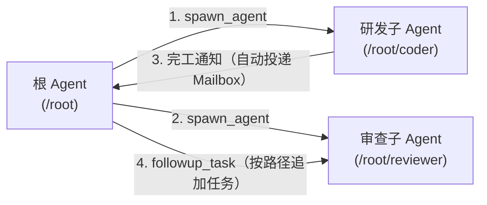
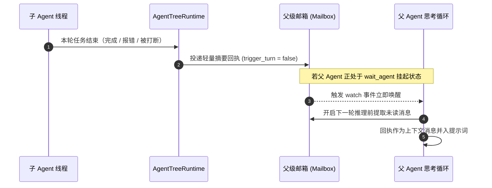
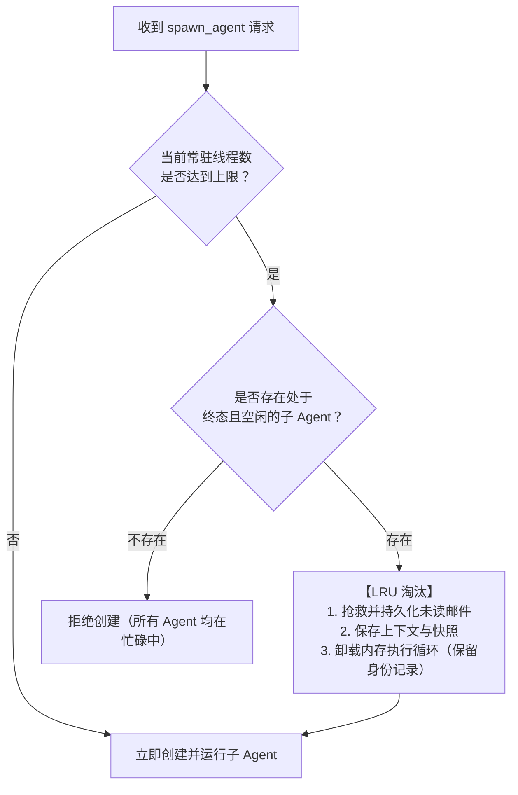
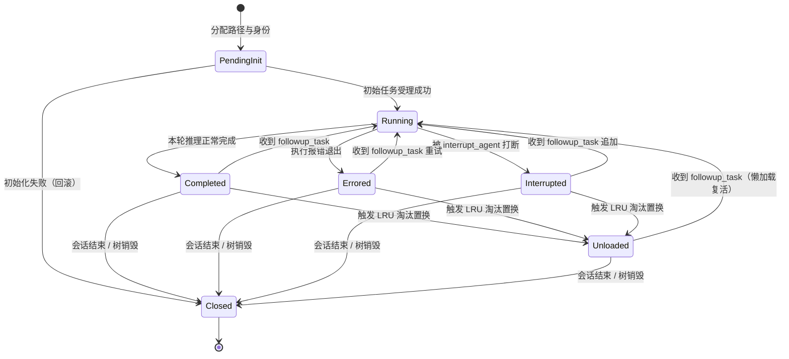
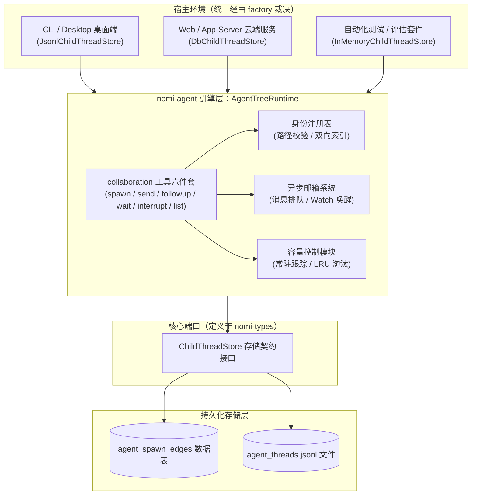

# nomi 多 Agent V2（collaboration 协作形态）· 架构设计与技术方案

> **状态**：📋 计划中（技术方案与设计阶段）  
> **核心定位**：在现有工作流机制之外，为模型引入自主协作能力（类似 OpenAI Codex V2 的 `collaboration` 模式），支持动态派生、树状寻址、邮箱通知与常驻淘汰。  
> **核心原则**：
> 1. **单树单运行时**：整棵协作 Agent 树共享一个 `AgentTreeRuntime` 协调运行时。
> 2. **身份与运行时分离**：身份持久化存储；执行循环可安全卸载、按需复活。
> 3. **权限单向收窄**：子 Agent 严格继承父级环境与沙箱配置，权限只减不增。
> 4. **双轨独立并存**：V2 自主协作与 V1 / `AgentExecution` 宿主工作流互不干扰，词表与持久化完全解耦。
>
> *(写作约定：`scripts/check-agent-vocabulary.mjs` 已随本方案退役（降为弃用桩、不再扫描源码），本文保留 `⟨S⟩` 与 `⟨O⟩` 占位符仅为沿用既有排版约定，不再受门禁约束。)*

---

## 1. 方案综述与核心概念

### 1.1 什么是多 Agent V2？

在现有的 nomi 架构中，复杂的任务协作主要依赖**执行域（Host-driven）**：由宿主系统规划 DAG、控制重试与审批，模型只能被动填入目标或执行具体节点。

**多 Agent V2** 赋予了模型**自主组队与协同工作**的能力：
- **自主派生**：主 Agent 可根据当前任务复杂度，动态创建专职子 Agent（如“代码审查员”、“测试生成员”）。
- **稳定寻址**：每个子 Agent 拥有类似文件系统的结构化路径（如 `/root/code_reviewer`），父子与兄弟间可通过路径精准通信。
- **异步通知**：子 Agent 完工后通过邮件箱自动投递轻量回执，父 Agent 无需轮询。
- **智能容量**：常驻内存有限时，系统自动置换空闲的子 Agent，待有新任务时自动懒加载复活。



---

### 1.2 协作六件套（模型交互界面）

V2 在 `collaboration` 命名空间下向模型提供 6 个开箱即用的轻量协作工具：

| 工具名称 | 作用 | 典型使用场景 |
| --- | --- | --- |
| `spawn_agent` | 派生子 Agent | 创建专职子 Agent 并指派初始任务，返回可寻址路径（如 `/root/helper`）。 |
| `send_message` | 发送单向消息 | 向指定子 Agent 投递背景材料或上下文，**不触发**对方开始思考轮次。 |
| `followup_task` | 追加工作任务 | 向指定子 Agent 派发新任务，**立即触发**对方开启新一轮推理执行。 |
| `wait_agent` | 等待外部通知 | 父 Agent 挂起当前轮次，等待子 Agent 完工回执、用户介入或超时唤醒。 |
| `interrupt_agent`| 中断运行状态 | 软中断正在执行的子 Agent，保留其上下文与历史，后续仍可追加任务。 |
| `list_agents` | 查询协作名录 | 查看指定路径前缀下的所有子 Agent 及其状态（包括活跃与已卸载的）。 |

---

### 1.3 核心能力演进矩阵

| 能力维度 | 参考模型（Codex V2） | nomi 现状 | nomi V2 目标 |
| --- | --- | --- | --- |
| **发起派生** | 模型自主调用 `spawn_agent` | 仅能交由宿主填 `goal` 或由 runner 一次性扇出 | ✅ 模型通过六件套自主按需派生 |
| **身份与寻址** | 树状 `AgentPath`（如 `/root/a/b`） | 内嵌域无身份；执行域仅有一次性 `conversation_id` | ✅ `AgentPath` 结构化路径 + UUIDv7 稳定身份 |
| **点对点通信** | `send_message` / `followup_task` 二分 | 无法寻址通信，只能依赖宿主写回或全局重试 | ✅ 精准路径寻址，支持单向同步与任务触发二分 |
| **完工回收** | 邮箱通知 + `wait_agent` 阻塞等待 | 内嵌域同步阻塞；执行域依赖宿主写入会话 | ✅ 异步事件推送至父邮箱，支持事件驱动唤醒 |
| **并发容量控制** | LRU 机制：淘汰空闲 Agent，满额才拒绝 | 内嵌域固定信号量；执行域上限 64 且直接拒绝 | ✅ 常驻 LRU 机制：优先淘汰终态空闲者，支持无缝复活 |
| **嵌套深度防御** | 无深度硬限制，仅受容量约束 | 硬上限 4，但会话域工具存在绕过隐患 | ✅ 保留深度硬上限 4，并严格封堵所有派生旁路 |

---

## 2. 现状痛点与重构动机

当前 nomi 的多 Agent 机制分布在执行域、会话域与引擎内嵌域，存在以下核心痛点：

### 2.1 痛点详解

1. **P1：模型自主权被刻意倒置**  
   既有契约强制规定“模型只能提交目标，成员分工、并发规划与审批流全由宿主决定”。这适合确定性审批流，但扼杀了模型面对复杂动态任务时灵活分工的潜力。
2. **P2：子运行缺乏持久身份，无法寻址追问**  
   - *引擎内嵌域*：创建的子引擎为一次性进程，会话持久化关闭（`session.enabled = false`），完工即销毁，无法针对结果继续沟通。  
   - *执行域*：尝试会话被定义为不可变审计记录，无法对已执行完毕的子任务追加新轮次。
3. **P3：容量策略粗暴，且深度控制存在旁路**  
   - 内嵌运行仅靠固定信号量限流，无法让已完成的旧 Agent 腾出资源给新 Agent。  
   - 当任务深度达到硬上限（`MAX_AGENT_DELEGATION_DEPTH = 4`）时，系统仅在排除列表中移除了 `nomi_delegate`，但会话域原有的创建与发送工具仍然暴露，模型依然可以绕过深度限制继续派生。
4. **P4：门禁退役后，原有机械不变量失去守护**  
   `check:agent-vocabulary` 门禁已随同一变更集退役（脚本降为弃用桩，不再扫描源码）。它原先逐字守护的四组不变量——执行域模型面恰好 3 个工具、执行域恰好 9 张表、事件事实恰好 8 个、五个共享硬上限数值——**不再有任何机械检查**。V2 方案必须把等价断言下沉为**就近的 crate 内测试**，否则“执行域语言冻结”只剩口头约定；V2 新增的 `collaboration` 六件套也必须在同一处补上并列断言。

---

## 3. 核心机制设计

### 3.1 树状身份体系（Identity）

每个子 Agent 在创建时都会被赋予全局唯一的稳定身份，由以下要素构成：

```rust
// 核心标识数据结构设计（定义于 nomi-types）
pub struct AgentThreadId(pub Uuid);       // UUIDv7 唯一标识，生命周期内不可变
pub struct AgentPath(String);             // 树状路径，如 "/root/analyzer/tester"
pub struct AgentNickname(String);         // 展示用别名（可选）

pub enum SpawnEdgeStatus {
    Open,    // 正常活跃/可寻址
    Closed,  // 已永久关闭（级联清理或父级终结）
}
```

- **路径规则**：子路径从父路径直接派生（`AgentPath::join(task_name)`），支持绝对路径（`/root/...`）与相对路径（`../sibling`）寻址。重名直接拦截，禁止隐式覆盖。
- **所有权安全**：子 Agent 不对外暴露独立的客户端连接入口，外部所有交互必须经由根 Agent 或父子树路由，确保权限上下文统一。

---

### 3.2 邮件箱与事件驱动唤醒（Mailbox & Notification）

为了避免传统的低效轮询，V2 采用**邮箱队列 + 事件唤醒**机制：



- **消息投递语义**：`send_message` 只写入邮箱不触发思考，适合传递背景上下文；`followup_task` 会立即唤醒子 Agent 并开启新的推理轮次。
- **优雅挂起**：父 Agent 调用 `wait_agent` 时进入低消耗挂起状态，在收到子级完工通知、用户人工干预或超时（默认 30 秒，范围 10~3600 秒）时被唤醒。

---

### 3.3 常驻容量与 LRU 淘汰机制（Residency & Eviction）

每个协作会话设置常驻内存上限（默认 4：1 个根 Agent + 最多 3 个子 Agent 线程）。



- **不可淘汰对象**：正在运行推理（`Running`）、初始初始化中（`PendingInit`）或邮箱中有待处理触发任务的子 Agent 严禁淘汰。
- **无缝复活（Lazy Loading）**：被淘汰移出内存的子 Agent 身份仍保存在持久层（状态置为 `Unloaded`）。当收到针对它的 `followup_task` 时，系统自动从持久化记录中重新载入上下文并恢复执行。

---

### 3.4 状态机与生命周期流转

子 Agent 在整个协作树中的生命周期由严密的状态机进行约束：



| 状态名称 | 含义 | 是否占常驻配额 | 是否允许被淘汰 | 允许的后继动作 |
| --- | --- | --- | --- | --- |
| `PendingInit` | 身份已建立，正在受理初始输入 | 是 | 否 | 推进至 `Running`，或失败回滚为 `Closed` |
| `Running` | 正在执行推理或工具调用 | 是 | 否 | 转入 `Completed` / `Errored` / `Interrupted` |
| `Completed` | 任务正常执行结束，空闲待命 | 是 | **是** | 接收新任务转为 `Running`，或被淘汰置为 `Unloaded` |
| `Errored` | 执行遇到错误中断退出 | 是 | **是** | 接收新任务转为 `Running`，或被淘汰置为 `Unloaded` |
| `Interrupted` | 被父级主动打断 | 是 | **是** | 接收新任务转为 `Running`，或被淘汰置为 `Unloaded` |
| `Unloaded` | 运行时已释放，身份保留在库 | 否 | — | 收到 `followup_task` 时自动懒加载复活转为 `Running` |
| `Closed` | 级联注销或所属树已关闭 | 否 | — | 终态，不可逆（保留历史供审计） |

---

## 4. 系统架构与宿主适配

### 4.1 端到端系统架构



---

### 4.2 存储抽象与三宿主适配

存储契约定义在最轻量的共享层 `nomi-types`，使得引擎与上层服务解耦：

```rust
#[async_trait::async_trait]
pub trait ChildThreadStore: Send + Sync {
    /// 插入或更新子线程边记录
    async fn upsert_edge(&self, thread: &StoredAgentThread) -> Result<(), StoreError>;
    /// 更新边运行状态
    async fn set_edge_status(&self, child: AgentThreadId, status: SpawnEdgeStatus) -> Result<(), StoreError>;
    /// 查询单个线程信息
    async fn get_thread(&self, id: AgentThreadId) -> Result<Option<StoredAgentThread>, StoreError>;
    /// 查询指定父级下的直接子节点
    async fn list_children(&self, parent: AgentThreadId, status: Option<SpawnEdgeStatus>) -> Result<Vec<StoredAgentThread>, StoreError>;
    /// 递归查询指定根节点下的所有后代节点
    async fn list_descendants(&self, root: AgentThreadId, status: Option<SpawnEdgeStatus>) -> Result<Vec<StoredAgentThread>, StoreError>;
}
```

针对不同运行形态提供三种实现：
1. **服务端环境（Web / App-Server）**：采用 `DbChildThreadStore`，基于数据库存储。
2. **桌面与 CLI 本地环境**：采用 `JsonlChildThreadStore`，在会话目录下以追加方式维护 `agent_threads.jsonl`，保持独立性无需依赖关系型数据库。
3. **测试与 Eval 环境**：采用纯内存实现的 `InMemoryChildThreadStore`。

---

### 4.3 数据库表设计（`agent_spawn_edges`）

数据库采用**单表存储**结构，每个子节点自然对应树中的一条边：

```sql
CREATE TABLE agent_spawn_edges (
  parent_thread_id TEXT NOT NULL,
  child_thread_id  TEXT NOT NULL PRIMARY KEY,
  tree_id          TEXT NOT NULL,
  agent_path       TEXT NOT NULL,
  agent_role       TEXT,
  agent_nickname   TEXT,
  depth            INTEGER NOT NULL,
  status           TEXT NOT NULL CHECK (status IN ('open', 'closed')),
  conversation_id  TEXT,
  created_at       TEXT NOT NULL,
  updated_at       TEXT NOT NULL
);

-- 索引规划：加速子节点查询与路径唯一性校验
CREATE INDEX idx_agent_spawn_edges_parent_status ON agent_spawn_edges(parent_thread_id, status);
CREATE UNIQUE INDEX idx_agent_spawn_edges_tree_path ON agent_spawn_edges(tree_id, agent_path);
```

> **设计取舍**：因为协作拓扑是严格树状的，每个子线程有且仅有一个父线程，因此 `child_thread_id` 主键直接将线程身份属性与父子边属性合二为一，避免双表 Join 带来的额外开销。

---

### 4.4 架构边界与 P3 深度漏洞闭环

1. **与执行域（`AgentExecution`）的边界隔离**：  
   - V2 协作线程属于模型自发协同，**不写入**任何 `agent_execution*` 既有业务表。
   - 保持既有 8 个事件事实与执行域硬上限不变，完全避免污染执行域的数据与审计逻辑。
2. **彻底闭合 P3 深度绕过旁路**：  
   - 在任务深度触达上限（`MAX_AGENT_DELEGATION_DEPTH = 4`）时，系统不仅排除 `nomi_delegate`，同时将**所有派生工具**整体列入排除清单：
     `gateway_excluded_tools = ["nomi_delegate", "nomi_create_conversation", "nomi_send_to_conversation"]`
   - 在网关资格判定层补充防御性逻辑：执行尝试会话无论具备何种策略，一律不授予会话域的派生能力，从根本上闭合绕过路径。

---

## 5. 实施路线与质量验收

### 5.1 分阶段实施路线


- **Phase 0（前置独立 PR）**：  
  ① 运行期复现并验证 P3 旁路；② 把退役门禁原先守护的四组不变量迁移为**就近的 crate 内断言**（执行域模型面 3 个工具、执行域 9 张表、事件事实 8 个、五个共享硬上限），让 `cargo test` 而非已退役脚本继续守护执行域词表；③ 为 V2 的 `collaboration` 六件套补一条并列断言（恰好 6 个工具）。
- **Phase 1**：  
  在 `nomi-types` 定义身份三件套数据结构与 `ChildThreadStore` 特征，提供纯内存实现及单元测试。
- **Phase 2**：  
  在 `nomi-agent` 内实现 `AgentTreeRuntime`（含注册表、邮箱队列、容量追踪），此时暂不对模型暴露外部工具。
- **Phase 3**：  
  注册 `collaboration` 命名空间及六件套工具，实现会话级版本锁定机制（默认关闭：`features.multi_agent_v2 = false`），并在 crate 内测试补上“该域恰好 6 个工具”的并列断言。
- **Phase 4**：  
  完成数据库表迁移及 `DbChildThreadStore` / `JsonlChildThreadStore` 落地，打通重启后的拓扑冷加载机制。
- **Phase 5**：  
  完成 LRU 淘汰与唤醒机制，全面闭合 P3 深度漏洞，完成端到端集成测试验证。

---

### 5.2 核心验收测试用例

| 用例编号 | 验收项 | 验证方式 | 预期结果 |
| --- | --- | --- | --- |
| **TC-01** | 不变量守卫迁移 | 运行 `cargo test -p nomifun-gateway` 与 `cargo test -p nomifun-common` | 执行域 3 工具面、9 张表、8 个事件事实与五个硬上限全部由 crate 内断言守护；已退役脚本仅输出弃用提示、不再扫描源码。 |
| **TC-02** | 协作工具集锁定 | 检查网关暴露的模型工具清单 | `collaboration` 命名空间下恰好提供 6 个标准工具。 |
| **TC-03** | 树状路径解析 | 纯函数测试相对与绝对路径拼接 | 正确解析父子路径，拦截非法字符与同名冲突。 |
| **TC-04** | 模型派生与寻址 | 桌面环境调用 `spawn_agent` | 成功返回分配的路径，并能通过 `list_agents` 检索到。 |
| **TC-05** | 消息二分机制 | 分别调用 `send_message` 与 `followup_task` | 前者仅入队不触发推理，后者立即启动新轮次推理。 |
| **TC-06** | 自动完成回执 | 子 Agent 运行至终态 | 父级邮箱自动收到回执摘要，并在下一轮对话中呈现。 |
| **TC-07** | 惰性加载唤醒 | 对已卸载的 Agent 派发 `followup_task` | 系统自动将其状态置为 `Running` 并重载上下文执行。 |
| **TC-08** | 跨淘汰邮件保护 | 在发生 LRU 淘汰前后传递未读消息 | 消息顺序完整无丢包，唤醒后按序呈现给子 Agent。 |
| **TC-09** | 等待与超时挂起 | 调用 `wait_agent` 等待通知 | 收到回执即时唤醒；若超时则返回规范超时提示与标记。 |
| **TC-10** | LRU 容量淘汰 | 连续派生超过最大容量（4）的子 Agent | 优先淘汰最旧的空闲终态 Agent；无空闲候选时拒绝请求。 |
| **TC-11** | 拓扑冷启动恢复 | 宿主重启后恢复会话树状拓扑 | 子 Agent 路径与层级关系正确载入，且不可被外部直连。 |
| **TC-12** | P3 深度漏洞闭环 | 构造深度达到 4 的会话环境 | 模型能力清单中彻底剔除所有派生工具（含会话域工具）。 |
| **TC-13** | 执行域零回归 | 运行既有 `nomifun-agent-execution` 套件 | 9 张业务表、8 个事件事实保持原样，现有测试 100% 通过。 |

---

### 5.3 验证梯子（Verification Ladder）

在开发与提交流程中，遵循由浅入深的验证梯子：

```bash
# 1. 验证基础类型与纯函数契约
cargo test -p nomi-types

# 2. 验证引擎核心（运行时、邮箱、容量控制与协作工具）
cargo test -p nomi-agent

# 3. 验证数据库迁移与数据访问仓储
cargo test -p nomifun-db

# 4. 验证执行域无回归影响
cargo test -p nomifun-agent-execution

# 5. 全工作区编译检查
cargo check --workspace

# 6. 验证不变量守卫（门禁已退役，断言下沉到 crate 内测试）
cargo test -p nomifun-gateway    # 执行域模型面恰好 3 个工具
cargo test -p nomifun-common     # 事件事实恰好 8 个 + 五个共享硬上限
```

---

## 附录

### 附录 A：技术决策与权衡矩阵（D1 ~ D12）

| 决策项 | 决策主题 | 选定方案 | 权衡取舍与放弃理由 |
| --- | --- | --- | --- |
| **D1** | 与既有执行域的关系 | **独立并存**，特性开关控制，每会话单向锁定 | 放弃“直接替换”。一次性替换破坏性过大且无法灰度回退；独立并存可实现平滑迁移。 |
| **D2** | 多宿主支持策略 | **三宿主均支持**，通过 `ChildThreadStore` 接口适配 | 放弃“仅支持 DB 宿主”。若嵌入式（CLI/桌面）无法使用，将失去方案的一致性。 |
| **D3** | 门禁处置 | **退役该门禁**，把不变量下沉为 crate 内断言 | 放弃“继续演进该脚本”：它靠「路径 + 正则」扫描，与 V2 引入的多域词表天然冲突，维护成本高于收益（退役前已积累 26 处逾期违规且长期未接入 CI）；也放弃“改名规避”——规避会让不变量彻底失去守护。 |
| **D4** | 树状拓扑存储模型 | **独立新增 `agent_spawn_edges` 表** | 放弃“复用 execution 关联表”。既有表语义为单一映射，承载树形递归会导致语义混乱。 |
| **D5** | 存储表结构形态 | **单表模型**（一行对应一个子节点） | 放弃“拆分为线程表+关系表”。由于每个子节点至多一个父节点，单表更高效且逻辑严密。 |
| **D6** | 存储接口层级归属 | 定义在最底层的 **`nomi-types`** | 放弃“定义在 backend 业务包”。避免造成引擎模块反向依赖业务模块的架构污染。 |
| **D7** | 事件事实清单设计 | **完全不新增事件事实**，保持 8 个不变 | 放弃“新增事件事实”。新增事实需同步 Rust 枚举、SQL CHECK 与生成的 TS 绑定三方一致，成本高、收益仅为审计便利，通过边表审计足矣。 |
| **D8** | 容量耗尽置换策略 | **优先淘汰空闲终态 Agent**，无可淘对象才拒绝 | 放弃“直接报错拒绝”。频繁的小任务流极易撞墙，终态对象占用开销极低应支持换出。 |
| **D9** | 版本生命周期策略 | **会话初始化时单向锁定**，中途不可切换 | 放弃“动态切换版本”。中途变更工具集会破坏提示词前缀缓存并造成历史混淆。 |
| **D10** | 嵌入式离线存储 | 采用会话目录下的 **JSONL 追加文件** | 放弃“在 CLI 引入 SQLite”。不破坏轻量级引擎架构，纯文件足以保证冷恢复。 |
| **D11** | `wait_agent` 唤醒语义 | **仅监听邮箱与状态事件**，不搬运大段文本 | 放弃“同步搬运执行结果”。避免诱导模型长时间同步阻塞，强化事件驱动通知逻辑。 |
| **D12** | 递归深度漏洞修复 | **双保险封堵**：全量工具排除 + 网关资格硬判定 | 放弃“仅修改一处”。采取防御性冗余设计，彻底根除深层嵌套下的派生穿透风险。 |

---

### 附录 B：源码证据与行号索引

以下索引记录了本方案设计时引用的技术依据与具体代码落点：

#### 1. 参考体系（OpenAI Codex `rust-v0.162.1` / commit `092d3acd`）
- **工具集与命名空间声明**：`codex-rs/core/src/tools/handlers/multi_agents_spec.rs:14, 70-164, 303-313`
- **派生入参及回执构造**：`codex-rs/core/src/tools/handlers/multi_agents_v2/spawn.rs:45, 266-317`
- **等待与事件监听语义**：`codex-rs/core/src/tools/handlers/multi_agents_v2/wait.rs:96-111, 202-219`
- **常驻容量与 LRU 淘汰实现**：`codex-rs/core/src/agent/control/residency.rs:21-30, 104-160, 205-238, 298-309`
- **身份模型与路径规范**：`codex-rs/protocol/src/thread_id.rs:15-32`、`codex-rs/protocol/src/agent_path.rs:15-181`
- **父子边数据表迁移**：`codex-rs/state/migrations/0021_thread_spawn_edges.sql:1-8`
- **子线程访问边界保护**：`codex-rs/app-server/src/request_processors/thread_input.rs:8-21`

#### 2. 当前代码库现状（nomi `origin/main` / commit `bb9d372a9`）
- **网关能力分发判据**：`crates/backend/nomifun-ai-agent/src/factory/nomi.rs:382-388, 1639-1682`
- **执行域现有模型工具面**：`crates/backend/nomifun-gateway/src/caps_agent_execution.rs:1354-1382`
- **会话域派生调用入口**：`crates/backend/nomifun-gateway/src/caps_conversation.rs:310-389, 427-529`
- **内嵌子运行一次性限制**：`crates/agent/nomi-agent/src/local_agent_invocation.rs:88-90, 163-208, 827-863`
- **尝试会话只读审计保护**：`crates/backend/nomifun-conversation/src/service.rs:4099-4114`
- **深度受限时的排除名单**：`crates/backend/nomifun-agent-execution/src/attempt_runner.rs:459-460, 614-628`
- **能力租约排除语义机制**：`crates/backend/nomifun-api-types/src/mcp_bridge.rs:439-475, 630-652`
- **词汇门禁机械断言规范（已退役，脚本降为弃用桩）**：`scripts/check-agent-vocabulary.mjs`（退役前为 14-43、214-331、333-358 行的四组不变量，现迁移为 crate 内断言）
- **CI 门禁合流政策说明**：`.github/workflows/README.md:97-107`

---

### 附录 C：门禁历史债务清单（已不适用，保留为历史记录）

> **状态更新**：`check:agent-vocabulary` 已在同一变更集中**退役**（脚本降为弃用桩、不再扫描源码），因此下列 26 处条目**不再作为 Phase 0 的前置条件**——退役后它们不再是门禁意义上的“违规”。本节按技术方案规范保留原文，用于追溯退役前的债务规模与当时的清理方案；若日后需要恢复同类机械断言，可据此重建。
>
> **以下为退役前的原文**：为确保 Phase 0 能够顺利将 `check:agent-vocabulary` 门禁并入 CI，需对以下 26 处既有违规项进行合规化处理（以下采用占位符书写）：

| 目标文件（路径含占位符） | 违规处数 | 处理方案 |
| --- | --- | --- |
| `crates/agent/nomi-agent/src/isolated_⟨S⟩.rs` | 5 | 文件重命名为 `isolated_recon.rs`，对应类型更名为 `IsolatedReconTool` |
| `crates/agent/nomi-agent/src/bootstrap.rs:1040,1045,1049` | 3 | 同步更新类型引用与变量命名 |
| `crates/agent/nomi-agent/src/lib.rs:42` | 1 | 更新模块引入声明 |
| `crates/agent/nomi-agent/src/task_profile.rs:12` | 1 | 导出符号调整为 `is_isolated_recon_tool` |
| `crates/agent/nomi-coding/src/harness.rs:1053,1058` | 2 | 同步更新方法调用，注释规范化为 `isolated recon agents` |
| `crates/agent/nomi-coding/src/lib.rs:82` | 1 | 更新模块引入声明 |
| `crates/agent/nomi-coding/src/progress.rs:34,41,241` | 3 | 同步更新引用及相关注释 |
| `crates/agent/nomi-coding/src/verify.rs:27` | 1 | 函数符号跟随重命名 |
| `crates/backend/nomifun-app-server/src/lib.rs:148` | 1 | 注释中退役词 `⟨O⟩` 调整为 `coordination` |
| `crates/backend/nomifun-mcp/src/activation.rs:1,17,31` | 3 | 同步调整注释中表述 |
| `crates/backend/nomifun-mcp/src/service.rs:60` | 1 | 同步调整注释中表述 |
| `docs/architecture/agent-harness-modes-review.zh.md` | 4 | 调整第 913/924/942/943 行措辞，采用“并行代理”或具体工具名表达 |
