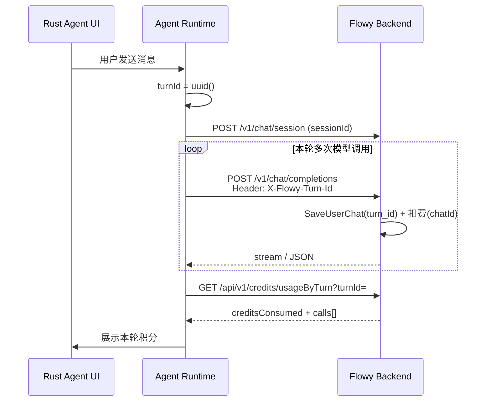

# 客户端对接：按轮次（turnId）展示积分消耗

> 面向 **Rust 桌面 Agent**（及同类客户端）：在「用户发送一次消息 / 一次 Agent Run」结束后，向服务端查询并展示本轮消耗的积分。  
> 服务端实现：`tb_user_chat.turn_id` + `GET /api/v1/credits/usageByTurn`；迁移脚本 `sql/0053/schema.sql`。

---

## 1. 背景与 ID 层级

一次用户发送可能触发 **多次** 模型 HTTP 调用（工具循环、多步推理等）。服务端计费原子仍是「单次模型调用」；客户端需要额外传入 **轮次 ID**，才能把多笔调用汇总成「本轮消耗」。

```
sessionId   // 会话（整段聊天），已有：POST /v1/chat/session
  └─ turnId // 轮次（用户点一次发送 / 一次 Agent Run）← 本次新增
       └─ chatId // 单次模型 API 调用（计费原子，服务端自动生成）
```

| 字段 | 谁生成 | 含义 | 不要用来做 |
|------|--------|------|------------|
| `sessionId` | 客户端 | 整段会话 | 按「一轮」汇总积分（粒度太粗） |
| **`turnId`** | **客户端** | **一轮用户发送** | — |
| `chatId` | 服务端 | 单次模型调用 / 扣费 ref | 客户端无法在调用前预知 |
| `taskId` | 视频/OCR 异步任务 | 与 chat 平行的另一套业务 | **不要**当对话轮次 ID |

---

## 2. 客户端必做改造（最小集）

### 2.1 生成 `turnId`

在用户点击发送、**Agent Run 开始之前**：

```rust
use uuid::Uuid;

let turn_id = Uuid::new_v4().to_string(); // 例如 "550e8400-e29b-41d4-a716-446655440000"
```

约束：

- 非空；去首尾空白后长度 **1～64**
- 推荐 UUID（v4）字符串
- **同一轮内所有模型请求必须使用同一个 `turnId`**
- 下一轮用户发送必须换新的 `turnId`（禁止复用上一轮）

### 2.2 每次模型代理请求带 Header

对以下走 Flowy 云端代理的请求，增加请求头：

```http
X-Flowy-Turn-Id: <turnId>
```

覆盖路径（与现有 Base URL 映射一致，生产示例）：

| 客户端请求 | 用途 |
|------------|------|
| `POST {LLM根}/chat/completions` | Chat Completions |
| `POST {LLM根}/responses` | Responses |
| `POST {LLM根}/embeddings` | Embeddings |
| `POST {LLM根}/rerank` | Rerank |
| `POST {LLM根}/images/generations` | 生图 |
| `POST {LLM根}/images/edits` | 图片编辑 |
| `POST {Anthropic根}/v1/messages` | Anthropic Messages |
| `POST {LLM根}/audio/transcriptions` | ASR（若本轮计入同一 turn） |

示例：

```http
POST /claw/v1/chat/completions HTTP/1.1
Host: server.flowyaipc.com
Authorization: Bearer <jwt-or-api-key>
Content-Type: application/json
X-Flowy-Turn-Id: 550e8400-e29b-41d4-a716-446655440000
token: <jwt-or-api-key>

{ "model": "AIPC-xxx", "messages": [...], "stream": true }
```

说明：

- Header **不会**写入 OpenAI/Anthropic 协议 body，无需改上游 payload。
- 未携带或非法/超长：请求仍成功，但该次调用 `turn_id` 落库为空，**无法**被 `usageByTurn` 汇总（兼容旧客户端）。
- 服务端转发上游时会剥离 `X-Flowy-Turn-Id`，不会泄露给模型供应商。

### 2.3 仍建议上报 `sessionId`（不变）

进入会话或切换会话时：

```http
POST /claw/v1/chat/session
Authorization: Bearer <token>
Content-Type: application/json

{ "sessionId": "sess_xxx" }
```

`sessionId` 与 `turnId` 正交：会话级归因 vs 轮次级积分。

### 2.4 Run 结束后查询本轮积分

```http
GET /claw/credits/usageByTurn?turnId=550e8400-e29b-41d4-a716-446655440000
Authorization: Bearer <C端JWT>
```

> 网关约定与现有业务 API 一致：客户端请求 `{业务根}/credits/usageByTurn`，映射到服务端 `/api/v1/credits/usageByTurn`（见 [image-video-generation-api.md](./image-video-generation-api.md) Base URL 说明）。  
> 当前该接口挂在 **JWT 鉴权**路由（与 `/credits/balance` 等一致）。若 Agent 模型调用只用 API Key，查询积分仍需登录后的 JWT。

**推荐时机**：Agent Run **完全结束**（成功 / 失败 / 用户取消）后再请求一次；以服务端返回为最终展示值。

可选：Run 进行中短轮询（如每 1～2s），用于「本轮已消耗 xxx」实时预览；注意末次调用落库与扣费有短暂延迟。

---

## 3. 查询接口契约

### 请求

| 项 | 值 |
|----|-----|
| Method | `GET` |
| Path（网关） | `{业务根}/credits/usageByTurn` → 服务端 `/api/v1/credits/usageByTurn` |
| Query | `turnId`（必填） |
| Auth | `Authorization: Bearer <JWT>` |

### 成功响应

```json
{
  "code": 200,
  "msg": "Success",
  "data": {
    "turnId": "550e8400-e29b-41d4-a716-446655440000",
    "sessionId": "sess_xxx",
    "callCount": 3,
    "creditsConsumed": 450,
    "calls": [
      {
        "chatId": 1001,
        "modelName": "qwen-long",
        "channelModelId": 10,
        "promptTokens": 1200,
        "completionTokens": 300,
        "cacheTokens": 50,
        "creditConsumed": 200,
        "callStatus": "SUCCESS",
        "createdAt": "2026-08-05T07:01:00Z"
      },
      {
        "chatId": 1002,
        "modelName": "qwen-long",
        "channelModelId": 10,
        "promptTokens": 1800,
        "completionTokens": 100,
        "cacheTokens": 0,
        "creditConsumed": 250,
        "callStatus": "SUCCESS",
        "createdAt": "2026-08-05T07:01:08Z"
      }
    ]
  }
}
```

| 字段 | 类型 | 说明 |
|------|------|------|
| `turnId` | string | 回显查询的轮次 ID |
| `sessionId` | string | 本轮调用中出现的会话 ID（取首个非空；可能为空） |
| `callCount` | number | `calls.length` |
| `creditsConsumed` | number | 本轮积分合计（**个人 + 团队席位**） |
| `calls[].chatId` | number | 单次调用主键 |
| `calls[].creditConsumed` | number | 该次调用积分（个人+席位） |
| `calls[].callStatus` | string | `SUCCESS` / `FAILED` 等 |
| `calls[].createdAt` | string | RFC3339 |

边界：

- 尚无落库记录：`callCount=0`，`creditsConsumed=0`，`calls=[]`（HTTP 仍 200）
- `turnId` 缺失/超长：`400`，`error.invalid_param`，`field=turnId`
- 只能查 **当前登录用户** 自己的 turn（无法查他人）

### 错误示例

```json
{
  "code": 400,
  "msg": "...",
  "errorKey": "error.invalid_param",
  "args": { "field": "turnId" }
}
```

（具体包装字段以现网 `AbortWithAppError` 响应为准。）

---

## 4. 推荐 Rust 集成示意

```rust
use reqwest::Client;
use serde::Deserialize;
use uuid::Uuid;

#[derive(Debug, Deserialize)]
#[serde(rename_all = "camelCase")]
struct ApiResp<T> {
    code: i32,
    data: T,
}

#[derive(Debug, Deserialize)]
#[serde(rename_all = "camelCase")]
struct TurnCreditUsage {
    turn_id: String,
    session_id: String,
    call_count: i32,
    credits_consumed: i64,
    calls: Vec<TurnCreditUsageCall>,
}

#[derive(Debug, Deserialize)]
#[serde(rename_all = "camelCase")]
struct TurnCreditUsageCall {
    chat_id: i64,
    model_name: String,
    credit_consumed: i64,
    call_status: String,
}

struct TurnContext {
    turn_id: String,
}

impl TurnContext {
    fn begin() -> Self {
        Self {
            turn_id: Uuid::new_v4().to_string(),
        }
    }

    fn apply_headers(&self, mut req: reqwest::RequestBuilder) -> reqwest::RequestBuilder {
        req = req.header("X-Flowy-Turn-Id", &self.turn_id);
        req
    }
}

async fn fetch_turn_credits(
    http: &Client,
    business_base: &str, // e.g. https://server.flowyaipc.com/claw
    jwt: &str,
    turn_id: &str,
) -> Result<TurnCreditUsage, Box<dyn std::error::Error>> {
    let url = format!("{business_base}/credits/usageByTurn");
    let resp = http
        .get(url)
        .query(&[("turnId", turn_id)])
        .header("Authorization", format!("Bearer {jwt}"))
        .send()
        .await?
        .error_for_status()?
        .json::<ApiResp<TurnCreditUsage>>()
        .await?;
    if resp.code != 200 {
        return Err(format!("api code {}", resp.code).into());
    }
    Ok(resp.data)
}

// 伪流程：
async fn on_user_send(/* ... */) {
    let turn = TurnContext::begin();
    // 1) 本轮所有 LLM 请求：turn.apply_headers(builder)...
    // 2) Agent Run 结束
    // 3) let usage = fetch_turn_credits(...).await?;
    // 4) UI 展示 usage.credits_consumed；可展开 usage.calls
}
```

路径注意：业务 API 为 `{host}/claw/...`（网关映射到服务端 `/api/v1/...`），LLM 为 `{host}/claw/v1/...`。以你们现有网关配置为准，与 [image-video-generation-api.md](./image-video-generation-api.md) 一致。

---

## 5. UI / 产品建议

1. 消息气泡旁展示：**本轮消耗 {creditsConsumed} 积分**
2. 可展开明细：每次 `modelName` + `creditConsumed`
3. Run 未结束：可显示「计算中…」或轮询预览值；结束后再拉一次定稿
4. `callCount=0` 且 Run 已结束：多为未带 Header、调用失败未落库、或仅本地模型（本地上报不走云端扣费）——按产品策略提示「暂无云端消耗」
5. **不要**用客户端本地 token 估算替代服务端积分（计价含 cache、席位拆分、ceil 规则等）

---

## 6. 时序图



---

## 7. 验收清单（给客户端）

- [ ] 用户每次发送生成新的 `turnId`
- [ ] 本轮所有云端模型请求带 `X-Flowy-Turn-Id`
- [ ] 未把 `turnId` 塞进 OpenAI body（只用 Header）
- [ ] Run 结束后调用 `GET .../credits/usageByTurn?turnId=`
- [ ] UI 展示 `data.creditsConsumed`（整数积分）
- [ ] 旧版本不带 Header 时：对话仍可用，仅无「按轮」汇总
- [ ] 已执行服务端迁移 `sql/0053/schema.sql`（否则写入 `turn_id` 会失败）

---

## 8. 服务端变更摘要（便于联调）

| 项 | 内容 |
|----|------|
| DB | `tb_user_chat.turn_id varchar(64)` + 索引 `(user_id, turn_id)` |
| 写入 | 模型代理从 `X-Flowy-Turn-Id` 读取并写入 `tb_user_chat` |
| 查询 | `GET /api/v1/credits/usageByTurn?turnId=` |
| 扣费 | **不变**：仍按 `chatId` 逐笔扣；本接口只 SUM |
| 积分口径 | 个人 `consume_model` + 席位 `team_seat_consume_model` |

联调前请确认目标环境已应用 `code/backend/sql/0053/schema.sql`。
