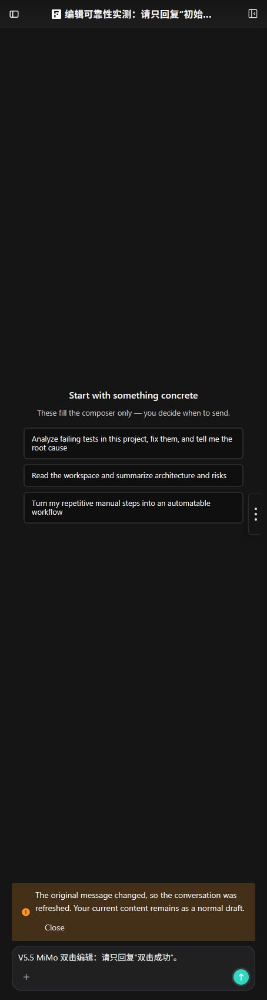

# PR #70 编辑重提交可靠性交接

本文记录 `fix/conversation-error-edit` 的交付证据；稳定状态机和接口契约见
[编辑重提交可靠性](../architecture/conversation-edit-resubmit-reliability.zh.md)。Composer
`beforeinput` 解码属于独立 `fix/composer-beforeinput` 分支，不在 PR #70 范围内。

## 已验证行为

- edit/retry/POST/observation/replay 复用同一个 UUIDv7 和冻结 payload。
- latest-user admission 使用无窗口 SQL，并按 `created_at DESC, message_id DESC` 决胜。
- terminal ledger、module-level admission、remount recovery、reset single-flight、snapshot purge 和
  commit-after-render consumer ack 均有定向行为测试。
- Send→Stop 只消费同一多击序列的第二击；React 按钮事件 seam 覆盖 `detail=0/1/2`。
- 用户输入在受控 setter 前同步推进 draft revision；deferred retry terminal 不会恢复旧正文覆盖新输入。
- stale target 会权威刷新、退出编辑并保留普通草稿，只显示 Composer 内本地化 Alert。

## 自动验证边界

本次收口验证结果：编辑恢复定向 UI `96 passed / 0 failed`，UI 全量
`2136 passed / 20 failed`，DB edit-resubmit 定向 `4 passed / 0 failed`，conversation service 定向
`5 passed / 1 failed`。Direct Vite production build、`cargo fmt --all -- --check`、
`cargo check --workspace`、i18n/theme/icons/CodeMirror/process/browser/help 检查和 `git diff --check`
均通过；`.github/workflows` 下不存在 YAML。

Direct TypeScript 只报告未改动的 reasoning-effort 和 videoCanvas 共 11 个错误；agent-vocabulary
只报告未改动的 `nomi-agent-eval/src/runner.rs` 注释。根 Bun workspace wrapper 仍返回
`Operation not permitted`，因此 UI typecheck/build 和质量脚本均以等价 direct 命令执行。

以下只作为独立基线记录，不转换成本功能失败：Windows knowledge-workspace runtime lock 的
`拒绝访问 (os error 5)`、根 Bun workspace 子进程的 `Operation not permitted`、未改动的
reasoning-effort/videoCanvas TypeScript 错误、agent-vocabulary 注释和历史 UI 结构测试。

## 人工验收证据

真实 Web 场景已确认 stale target 在当前挂载内完成刷新、移除 Editing badge、保留当前正文为普通草稿，
且没有悬空的全局错误 toast：

当前无鉴权 WebUI 会话 `019fea02-668a-7cc3-aacd-2a84aed09466` 使用
`mimo-v2.5-free` 再次确认：双击 Edit Submit 后只进入一个生成态，第二击未触发 Stop；成功终态清除
Editing badge 和已提交正文。随后主动单击 Stop 能立即停止生成；该 post-mutation failure 退出编辑态，
保留 `Write a long response with 100 numbered lines.` 为普通草稿。验收会话按约定保留，未自动删除。

## 交付检查

- 以 `git rev-parse HEAD`、`git merge-base HEAD origin/main` 和远端 refs 记录实时 base/head，不在本文写死
  易过期的最终 SHA 或提交数量。
- 截图已登记在 [Screenshot Manifest](../images/SCREENSHOTS.md)。
- PR 描述应链接上方截图，并列出未能在当前环境执行的 owner-only 场景；不得把自动测试描述为人工通过。
